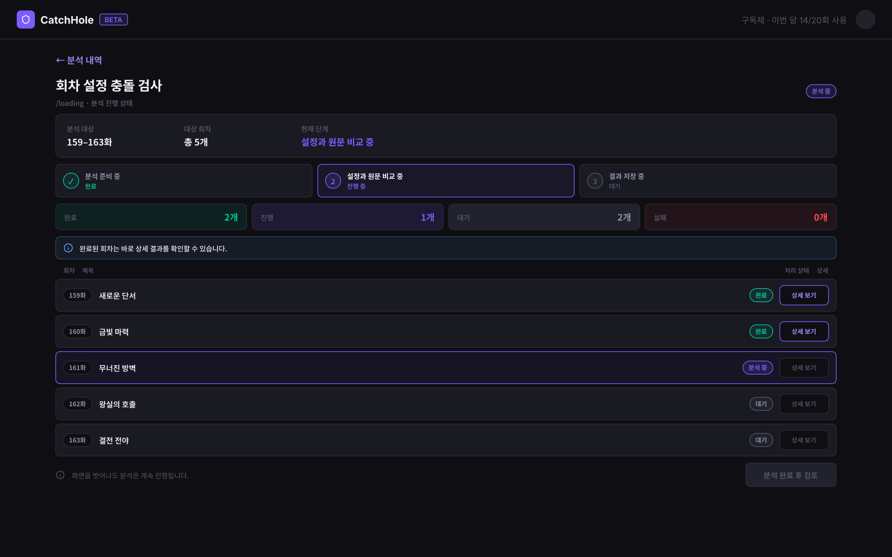
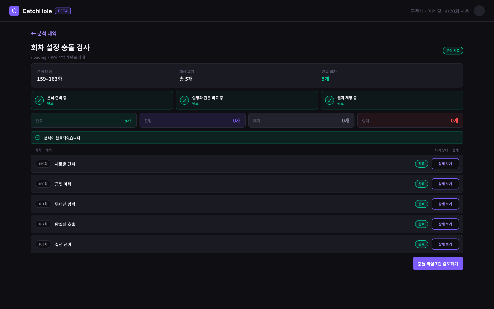
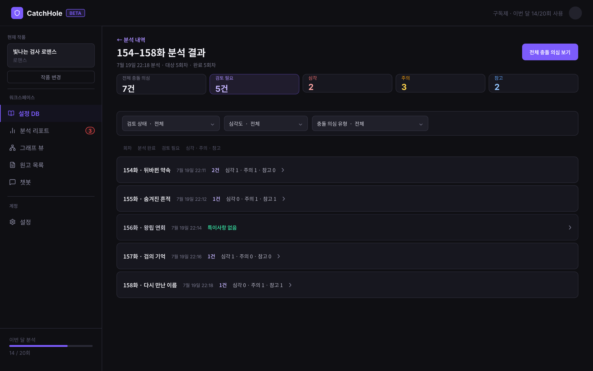
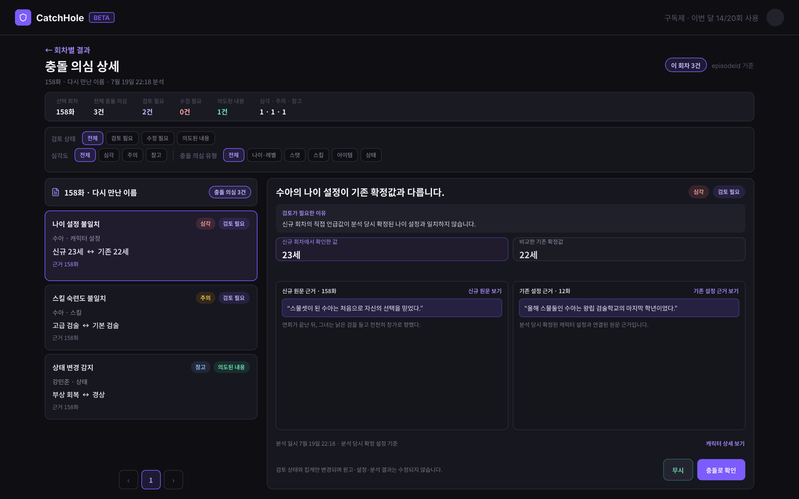

# 데이터 요구사항 — Analysis(분석)

[← 전체 인덱스](./README.md)

> 이 문서는 `SETTING_EXTRACTION`·`EPISODE_VALIDATION`을 함께 보여주는 업로드 배치별 분석 목록과 `EPISODE_VALIDATION`의 진행 상태·충돌 의심 결과 조회 흐름을 정의한다. 현재 Java BE에는 `AnalysisJob` 생성·목록·상세 조회와 작업 상태 전이 계약이 있고, Python Worker에는 설정 추출 흐름이 구현되어 있다. 회차별 검증 진행 상태와 충돌 의심 결과 저장·조회 API는 후속 구현이 필요하다.
>
> 충돌 의심 결과의 유형·심각도·원문 근거 방향은 [catchhole-backend-java #64](https://github.com/catchhole-soma/catchhole-backend-java/issues/64)를 참고하되, 아래 문서에서는 사용자 화면에 필요한 계약만 다룬다.

## MVP 분석 흐름

1. **최초 원고 분석**
   - 설정 후보 추출 → [설정 검토](./character.md#설정-검토-ssettingreview) → 설정 DB 등록
   - 비교할 기존 확정 설정이 없으므로 오류 리포트를 생성하지 않는다.
2. **기존 확정 설정이 있는 작품의 추가 회차 분석**
   - 설정 후보 추출 → 설정 검토 완료 → `EPISODE_VALIDATION` 작업 생성
   - [분석 진행 중](#분석-진행-중-s4loadingrunning) → [분석 완료](#분석-완료-s4loadingcompleted) → [충돌 의심 상세 리포트](#충돌-의심-상세-리포트-sepisodevalidationreport)
3. **실패한 분석 다시 시도**
   - 회차별 Job은 독립적으로 성공·실패하며, 한 회차 실패가 다른 회차 결과나 상태를 바꾸지 않는다.
   - 기존 실패 Job을 되살리지 않고 서버가 확인한 실패 회차만 새 Job으로 재시도한다.
4. **분석 작업 다시 확인**
   - 사이드 메뉴의 [분석 목록](#분석-목록-analysislist)에서 회차별 작업을 `UploadBatch` 단위로 집계해 확인한다.
   - 대기·진행 중 묶음을 선택하면 같은 `analysisJobIds`의 진행 화면으로 돌아가 폴링을 재개한다.
   - 모든 Job이 완료되면 결과 또는 설정 후보 검토를 열고, 실패가 있으면 실패 회차만 재시도한다.

> **MVP 공통 정책**
> - 하나의 업로드 묶음은 회차마다 하나씩 생성된 `analysisJobIds` 목록을 사용한다. `UploadBatch`는 출처·화면 문맥이고 실행 원자 단위는 단일 회차 Job이다.
> - 진행 상세는 Job별 `PENDING`/`RUNNING`/`SUCCEEDED`/`FAILED`를 사용하고, 분석 목록은 서버가 집계한 배치 상태의 `PARTIALLY_FAILED`를 그대로 사용한다. FE가 별도 부분 실패 enum이나 상태를 만들어 추측하지 않는다.
> - 성공한 회차의 결과와 `ANALYZED` 상태는 다른 회차가 실패해도 유지한다.
> - 전체 결과 화면은 현재 묶음의 모든 회차가 성공했을 때만 활성화하되, 개별 Job의 성공 이력은 지우지 않는다.
> - `분석 다시 시도`는 서버가 확인한 실패 회차만 새 Job으로 생성하고 기존 실패·성공 Job은 이력으로 유지한다.
> - 실제 진행률을 정확히 계산할 수 없으므로 가짜 퍼센트는 표시하거나 저장하지 않는다.
> - 분석 화면을 벗어나도 서버 작업은 취소되지 않는다.
> - 분석 목록은 성공 결과만 모아 놓은 화면이 아니라, 사용자가 실행한 `SETTING_EXTRACTION`·`EPISODE_VALIDATION` 작업의 진행·부분 실패·실패·검토 필요·완료 상태를 업로드 묶음별로 확인하는 진입점이다.
> - 충돌 의심 결과는 확정 오류가 아니다. 화면에서는 `오류`보다 `충돌 의심`, `검토 필요` 표현을 우선 사용한다.
> - 원고는 화면에서 직접 수정하지 않는다. 회차 파일 교체 후 사용자가 요청하는 재분석은 해당 회차의 `SETTING_EXTRACTION`으로 실행하며, 충돌 검수용 `EPISODE_VALIDATION`과 구분한다.
> - Job·Episode의 상세 실패 문자열은 개발·운영 진단 정보로 취급하며 사용자 화면에 원문을 표시하지 않는다. 화면은 실패 상태, 간단한 사용자용 안내와 재시도 액션을 제공한다.

## 목차

- [분석 목록 (AnalysisList)](#분석-목록-analysislist)
- [분석 진행 중 (S4LoadingRunning)](#분석-진행-중-s4loadingrunning)
- [분석 완료 (S4LoadingCompleted)](#분석-완료-s4loadingcompleted)
- [충돌 의심 상세 리포트 (SEpisodeValidationReport)](#충돌-의심-상세-리포트-sepisodevalidationreport)

---

<a id="분석-진행-s4loading"></a>

## 분석 진행 중 (S4LoadingRunning)

**URL**: `/loading?workId={workId}&analysisJobIds={commaSeparatedAnalysisJobIds}`



설정 검토를 마친 추가 회차의 `EPISODE_VALIDATION` 작업 진행 상태를 확인하는 화면이다. 업로드 내부의 설정 추출 진행 상태는 [회차 업로드의 분석 진행](./upload.md#5-분석-진행)을 사용하고, 이 화면은 확정 설정과 신규 회차를 비교하는 오류 탐지 단계에 사용한다. 분석 작업 생성 직후뿐 아니라 [분석 목록](#분석-목록-analysislist)에서 대기·진행 중 작업을 선택해 다시 진입할 수 있다.

> **화면 레이아웃·이동 정책**
> - 분석 진행 화면은 설정 대시보드의 하위 탭이 아닌 독립 작업 상세 화면으로 표시한다.
> - 좌측 대시보드 사이드바를 표시하지 않고 상단에 `← 분석 목록`을 제공한다.
> - `← 분석 목록`은 `/dashboard?workId={workId}&nav=analyses`로 이동하며, 화면을 벗어나도 서버 분석은 계속된다.
> - 같은 실행 묶음에 다시 진입하면 URL의 모든 `analysisJobIds`로 최신 상태를 조회하고 폴링을 재개한다.

> **회차별 분석 작업의 현재 단계 표시 정책**
> - `currentStep`은 해당 단일 회차 Job이 현재 어떤 처리를 수행하고 있는지 나타낸다.
> - Python의 공통 `AnalysisStep` 8종을 이 화면에 그대로 적용하지 않는다. `CHUNKING`, `PREPROCESSING`, `EMBEDDING`, `SETTING_EXTRACTION`은 설정 후보 추출 과정에서 사용하는 단계이며, 설정 검토 이후의 `EPISODE_VALIDATION`이 이 작업들을 다시 수행한다고 전제하지 않는다.
> - `EPISODE_VALIDATION` 구현 시 기존 enum 중 필요한 단계만 사용한다는 전제의 권장 표시값은 다음과 같다.
> - `LOADING` → `분석 준비 중`
> - `VALIDATION` → `설정과 원문 비교 중`
> - `PERSISTING` → `결과 저장 중`
> - `DONE` → `분석 완료`
> - 알 수 없는 값 또는 `null` → 상위 `status`가 `RUNNING`이면 `분석 진행 중`, `PENDING`이면 `분석 대기 중`

> **대상 회차별 처리 상태 표시 정책**
> - 각 회차 카드는 해당 회차 `AnalysisJob.status`, `currentStep`, 단일 `Episode.status`를 함께 사용한다.
> - Job `PENDING` → `대기`, `RUNNING` → `분석 중`, `SUCCEEDED` → `완료`, `FAILED` → `실패`
> - 일부 Job이 실패해도 다른 `PENDING`/`RUNNING` Job의 polling을 계속한다.
> - 실패 재시도 버튼은 현재 묶음의 활성 Job이 모두 종료된 뒤 활성화한다.

**1. 화면에 표시할 데이터**

- `← 분석 목록`
- 현재 작품명
- 분석 작업 요약
  - 분석 유형: `회차 설정 충돌 검사`
  - 대상 회차 시작·종료 번호와 총 회차 수
  - 작업 상태와 현재 사용자용 단계 문구
  - 완료·진행·대기·실패 회차 수
- 회차별 처리 목록
  - 회차 번호와 제목
  - 처리 상태
  - 현재 단계 또는 실패 상태
- 전체 작업이 아직 진행 중임을 알리는 안내
- 현재 Job이 모두 `SUCCEEDED`가 되기 전에는 비활성화된 `분석 결과 확인` 버튼

**2. 사용자 액션**

- 화면 진입 시 모든 작업 상세 조회
- Job 중 하나라도 `PENDING` 또는 `RUNNING`인 동안 2~3초 간격으로 상태 폴링
- 브라우저 탭이 비활성화되면 폴링을 중단하거나 주기를 늦추고, 탭 복귀 시 즉시 최신 상태 조회
- 실패한 회차의 상태와 사용자용 재시도 안내 확인
- 화면 이탈 → 분석은 계속 진행
- `분석 목록` 선택 → [분석 목록](#분석-목록-analysislist)으로 이동
- 같은 `analysisJobIds`로 다시 진입 → 최신 진행 상태 복원
- 모든 현재 Job이 `SUCCEEDED`이면 폴링을 중단하고, URL 이동 없이 같은 화면에 [분석 완료](#분석-완료-s4loadingcompleted) 상태를 표시한다. 현재 Episode 상태가 분석 완료 당시와 다르면 완료 상태를 되돌리지 않고 원고 변경 여부 확인과 필요 시 재분석 안내를 함께 표시한다.
- 활성 Job이 없고 하나 이상 `FAILED`이면 `분석 다시 시도` 선택
  - 기존 실패 작업은 실패 이력으로 유지
  - 각 실패 Job의 재시도 API로 서버가 확인한 실패 회차 Job만 생성
  - 추적 이력의 전체 `analysisJobIds`는 유지
  - 현재 polling 목록에서는 재시도 대상 실패 ID만 새 ID로 교체하고 기존 성공·복구 불가 `currentAnalysisJobIds`는 유지

**3. 화면 전환 식별자**

- 현재 작품: `workId`
- 현재 분석 작업들: `analysisJobIds`
- 분석 대상 묶음: `batchId`
- 준비된 분석 결과 묶음: `reportId`
- 분석 목록 이동: `/dashboard?workId={workId}&nav=analyses`
- 재시도 성공 후 이동 예시: `/loading?workId={workId}&analysisJobIds={newAnalysisJobIds}`

**4. 데이터 없음 / 실패 표시**

- 작업 상세 조회 중 로딩
- `PENDING`이고 `currentStep`이 없으면 `분석을 기다리고 있습니다.` 표시
- 분석 대상 회차가 0개이면 `분석할 회차를 찾지 못했습니다.` 표시와 원고 목록 이동 제공
- 작업 조회 404이면 `분석 작업을 찾을 수 없습니다.` 표시
- 상태 조회 일시 실패 시 마지막으로 성공한 화면 데이터를 유지하고 `상태를 새로 불러오지 못했습니다.`와 다시 시도 제공
- 활성 Job이 없고 하나 이상 `FAILED`일 때
  - `일부 회차 분석에 실패했습니다.` 표시
  - 실패가 발생한 회차와 간단한 사용자용 안내 표시
  - LLM 응답 검증 오류, 내부 식별자 등 상세 실패 원문은 표시하지 않음
  - 완료된 회차 상태와 결과는 유지하되 전체 `분석 결과 확인`은 아직 제공하지 않음
  - `분석 다시 시도`, `분석 목록으로 돌아가기`, `원고 목록으로 이동` 제공
- 회차가 완료되었지만 결과 저장이 아직 끝나지 않았으면 `결과를 정리하고 있습니다.` 표시 후 다음 폴링에서 갱신

**5. 화면 데이터 요구사항**

**5-1. BE → FE 제공 데이터 요구사항 — 분석 작업 기본 정보**

분석 작업 기본 정보는 현재 Java BE의 회차별 `AnalysisJobResponse` 목록을 재사용한다.

| 데이터 의미 | 현재 필드 | 화면 사용 |
| --- | --- | --- |
| 분석 작업 식별자 | `id` | 폴링 대상 식별 |
| 작품 식별자·제목 | `workId`, `workTitle` | 작품 표시와 소유권 범위 |
| 분석 대상 배치 | `batchId`, `target` | 대상 회차 범위 요약 |
| 작업 유형 | `jobType` | `EPISODE_VALIDATION` 확인 |
| 작업 상태 | `status` | `PENDING`/`RUNNING`/`SUCCEEDED`/`FAILED` 표시 |
| 현재 단계 | `currentStep` | 사용자용 단계 문구 변환 |
| 상세 실패 정보 | `errorMessage` | 현재 응답에는 포함되지만 개발·운영 진단용으로 취급하며 화면에 원문을 표시하지 않음 |
| 실행 시각 | `startedAt`, `completedAt`, `createdAt`, `updatedAt` | 진행·완료 시각 표시 |

각 Job의 현재 상세 조회 API:

```http
GET /api/v1/works/{workId}/analysis-jobs/{analysisJobId}
```

**5-2. BE → FE 제공 데이터 요구사항 — 회차별 진행 정보**

현재 작업 상세 응답의 `episodes`에는 해당 Job의 단일 회차 ID·번호·제목·`Episode.status`가 포함된다. FE는 여러 상세 응답을 회차 번호순으로 합치며 다른 Job의 상태를 복제하지 않는다. 검수 결과 식별자는 후속 리포트 계약에서 추가한다.

| 데이터 의미 | 형태·필수성 | 값 없음·조건 |
| --- | --- | --- |
| 대상 회차 전체 수 | Job 목록 길이·필수 | 생성 대상이 없으면 API가 Job을 만들지 않음 |
| 상태별 회차 수 | FE의 Job 상태 집계·필수 | 없는 상태는 `0` |
| 회차 식별자·번호·제목 | 각 응답 `episodes[0]`·필수 | 제목이 없으면 `null` |
| 회차별 분석 상태 | Job `status`와 Episode `status`·필수 | 작업 상태와 처리 단계를 구분 |
| 회차별 현재 단계 | Job `currentStep`·선택 | 시작 전·완료 후 `null` 가능 |
| 회차별 상세 실패 정보 | Job `errorMessage`·선택 | 실패가 아니면 `null`; 화면은 원문 대신 상태값과 사용자용 안내를 사용 |
| 전체 결과 식별자 | 단일 값·조건부 필수 | `SUCCEEDED`이면 필수, 그 외 상태에서는 `null` |

**5-3. FE → BE 전달 데이터 요구사항**

- 작업 상세·회차 목록 조회: `workId`, `analysisJobIds`
- 실패 작업 재시도: 각 기존 실패 `analysisJobId`
- FE는 작업 상태, 단계, 충돌 건수를 임의로 계산하거나 변경하지 않는다.
- 재시도 요청이 성공하면 새 `analysisJobIds` 목록을 응답받는다.

**6. BE와 협의할 범위·상태값**

- 현재 Python Worker가 `jobType=EPISODE_VALIDATION`을 실제 분기 처리하도록 구현할 범위
- 검증 작업의 `currentStep` 계약으로 공통 `AnalysisStep` 중 `LOADING`/`VALIDATION`/`PERSISTING`/`DONE`만 재사용할지, 검증 전용 단계 enum을 별도로 정의할지
- 동일 재시도 요청의 중복 생성 방지를 위한 idempotency 기준과 이전 작업·새 작업 연결 방식
- 원인별 사용자 안내가 필요할 때 상세 문자열이 아닌 안정적인 실패 식별값을 별도로 제공하는 계약

---

## 분석 완료 (S4LoadingCompleted)

**URL**: `/loading?workId={workId}&analysisJobIds={commaSeparatedAnalysisJobIds}`



분석 진행 화면과 별도 URL·API를 사용하는 화면이 아니라, 같은 `/loading` 컴포넌트가 폴링 응답에 따라 표시하는 완료 UI 상태다. 현재 `analysisJobIds`의 모든 Job과 대상 회차가 성공하고 결과가 준비되면 이 상태로 바꾸고 폴링을 중단한다. 자동으로 다른 화면으로 이동하지 않으며 실패 Job이 있으면 이 완료 상태로 전환하지 않는다.

**1. 화면에 표시할 데이터**

- `← 분석 목록`
- `분석이 완료되었습니다.` 완료 안내
- 분석 대상 회차 범위와 총 회차 수
- 완료 회차 수
- 전체 충돌 의심 건수
- 심각도별 집계
  - `HIGH` → `심각`
  - `MEDIUM` → `주의`
  - `LOW` → `참고`
- 충돌 의심이 1건 이상이면 `충돌 의심 N건 검토하기` 주요 버튼
- 충돌 의심이 0건이면 `이번 분석에서 충돌 의심 항목을 찾지 못했습니다.` 완료 메시지
- `분석 목록으로 돌아가기` 보조 버튼
- `원고 목록으로 이동` 보조 버튼

**2. 사용자 액션**

- `충돌 의심 N건 검토하기` → [충돌 의심 상세 리포트](#충돌-의심-상세-리포트-sepisodevalidationreport)의 전체 회차 모드로 이동
- `분석 목록으로 돌아가기` → [분석 목록](#분석-목록-analysislist)으로 이동
- `원고 목록으로 이동` → 현재 작품의 원고 목록으로 이동
- 브라우저 새로고침·재진입 → 완료 데이터 복원

**3. 화면 전환 식별자**

- 현재 작품: `workId`
- 완료된 작업들: `analysisJobIds`
- 전체 결과: `reportId`
- 충돌 의심 검토 이동: `/episode-validation-report?workId={workId}&reportId={reportId}`
- 분석 목록 이동: `/dashboard?workId={workId}&nav=analyses`
- 원고 목록 이동: 현재 작품의 원고 목록 URL과 `workId`

**4. 데이터 없음 / 실패 표시**

- 결과 집계 조회 중 로딩
- 충돌 의심 결과가 0건이면
  - `이번 분석에서 충돌 의심 항목을 찾지 못했습니다.`
  - 충돌 검토 버튼 대신 `분석 목록으로 돌아가기`를 주요 후속 액션으로 제공
- `SUCCEEDED`인데 `reportId`가 없으면 정상적인 준비 중 상태로 취급하지 않고 `분석 결과를 불러오지 못했습니다.` 표시와 상태 다시 조회 제공
- 결과 조회 실패 시 완료 작업 정보는 유지하고 다시 시도 제공
- 결과 생성 이후 대상 회차가 삭제되었으면 과거 분석 당시 회차 번호·제목을 표시하고 현재 삭제된 회차임을 안내

**5. 화면 데이터 요구사항**

**5-1. BE → FE 제공 데이터 요구사항**

| 데이터 의미 | 형태·필수성 | 값 없음·조건 |
| --- | --- | --- |
| 분석 작업 식별자 | 회차별 목록·필수 | 없음 |
| 작업 완료 상태·완료 시각 | Job별 값·필수 | 모든 Job 완료 전 이 화면을 표시하지 않음 |
| 전체 결과 식별자 | 단일 값·필수 | `SUCCEEDED` 응답에 반드시 포함 |
| 대상·완료 회차 수 | 0 이상의 정수·필수 | 완료 화면에서는 두 값이 같아야 함 |
| 전체 충돌 의심 건수 | 0 이상의 정수·필수 | 없으면 `0` |
| 심각도별 집계 | 단계별 정수·필수 | 없는 단계는 `0` |
| 분석 기준 표시 정보 | 단일 값·필수 | 설정 기준과 원고 버전 추적에 사용 |

완료 화면은 진행 화면과 같은 회차별 분석 작업 상세 응답들을 재사용하며, 충돌 의심 상세를 열 수 있는 `reportId`와 전체 집계만 추가로 사용한다.

**5-2. FE → BE 전달 데이터 요구사항**

- 완료 결과 조회: `workId`, `analysisJobIds`
- 충돌 의심 상세 조회: `workId`, `reportId`

**6. BE와 협의할 범위·상태값**

- 완료 화면의 전체 집계를 분석 완료 시 저장할지 조회 시 계산할지
- 분석 기준 표시를 위한 확정 설정 버전·원고 버전의 구체적인 응답 형식

---

> **MVP 이후 분석 결과 대시보드 고도화**
> - MVP에서는 별도의 `분석 묶음 회차별 결과` 중간 화면을 제공하지 않는다.
> - 완료 화면과 분석 목록에서 `reportId`의 [충돌 의심 상세 리포트](#충돌-의심-상세-리포트-sepisodevalidationreport)로 바로 이동한다.
> - 이후 전체 결과 대시보드를 추가할 때는 충돌 유형 분포, 캐릭터별 충돌 추세, 이전 분석 대비 변화처럼 여러 회차와 분석 이력을 종합해야 의미가 있는 정보를 제공한다.



---

<a id="분석-목록-analysislist"></a>

## 분석 목록 (AnalysisList)

**URL**: `/dashboard?workId={workId}&nav=analyses&analysisPage={1 이상의 정수}`

사이드 메뉴의 `분석 목록`에서 같은 작품의 분석을 `UploadBatch` 단위로 조회하는 화면이다. 한 번에 함께 올린 회차들의 Job과 설정 후보 검토 상태를 한 카드로 집계하며, `SETTING_EXTRACTION`과 `EPISODE_VALIDATION`이 같은 배치에 있으면 목적별 하위 요약은 유지하되 카드 액션은 배치 상태에 맞는 버튼 하나만 표시한다.

> **목록·보존 정책**
> - 서버 페이지네이션은 한 페이지 10개이며, 배치의 최근 분석 요청 시각 내림차순과 배치 ID 내림차순을 사용한다.
> - 배치 상태는 `IN_PROGRESS`·`PARTIALLY_FAILED`·`FAILED`·`REVIEW_REQUIRED`·`COMPLETED`로 표시한다.
> - 재시도 전 실패 Job은 이력으로 유지하되 목록의 현재 상태·개수·`currentAnalysisJobIds`는 회차별 최신 유효 Job을 기준으로 집계한다.
> - 완료·실패 분석 묶음을 덮어쓰거나 삭제하지 않으며, 사용자가 이력을 삭제하는 기능은 MVP에서 제공하지 않는다.
> - `UploadBatch`는 업로드 출처와 목록 카드 단위이고 실제 실행·재시도 단위는 회차별 `AnalysisJob`이다.

**1. 화면에 표시할 데이터**

- 분석 배치 목록
  - 대상 회차 시작·종료 번호와 서로 다른 회차 수
  - 배치 상태: 분석 중·일부 실패·분석 실패·후보 검토 필요·분석 완료
  - 분석 목적별 `SETTING_EXTRACTION`/`EPISODE_VALIDATION` 사용자용 명칭
  - 목적별 전체·대기·진행·성공·실패 Job 수
  - 설정 후보 전체 수, 검토 완료 수와 검토 대기 수
  - 최근 활동 시각
- 한 페이지 10개의 서버 페이지네이션

**2. 사용자 액션**

- 각 배치 카드는 현재 상태에 맞는 액션 버튼 하나만 표시
- `IN_PROGRESS` 배치의 `진행 보기` → 진행 중인 목적의 `currentAnalysisJobIds`로 업로드 분석 진행 화면을 열고 폴링 재개
- `PARTIALLY_FAILED` 또는 `FAILED` 배치의 `실패 확인` → 실패한 목적의 현재 작업으로 같은 화면을 열어 실패 회차 확인·재시도
- `REVIEW_REQUIRED` 배치의 `결과 보기` → `PENDING_REVIEW` 기본 필터로 [설정 검토](./character.md#설정-검토-ssettingreview)에 바로 이동
- `COMPLETED` 배치의 `결과 보기` → `ALL` 필터로 설정 검토 결과를 읽기 전용 조회
- `IN_PROGRESS` 배치가 있으면 화면 활성 상태에서 10초 간격으로 목록을 갱신하고, 모두 종료되면 자동 갱신 중단
- 이전·다음 페이지 이동

> **후속 계약**
> 현재 `REVIEW_REQUIRED`는 배치 전체의 `pendingCandidateCount`로만 결정되고,
> `jobGroups[].status`에는 후보 검토 상태가 포함되지 않는다. 따라서 두 분석 목적이
> 같은 배치에 함께 있으면 프론트만으로 검토 후 이어갈 정확한 `jobType`을 식별할 수 없다.
> Backend가 `reviewJobType` 또는 목적별 미검토 후보 수를 제공하도록 계약을 보강한 뒤,
> 분석 목록의 고정 우선순위를 해당 값 기반 선택으로 교체한다.

**3. 화면 전환 식별자**

- 현재 작품: `workId`
- 현재 목록 페이지: `analysisPage={1 이상의 정수}`. 값이 없으면 첫 페이지
- API 페이지: `page={0 이상의 정수}&size=10`
- 진행·실패 화면: `/episode-upload?workId={workId}&batchId={batchId}&analysisJobIds={currentAnalysisJobIds}&currentAnalysisJobIds={currentAnalysisJobIds}&jobType={jobType}`
- 검토 필요 결과: `/setting-review?workId={workId}&batchId={batchId}&jobType={jobType}`
- 검토 완료 결과: `/setting-review?workId={workId}&batchId={batchId}&jobType={jobType}&reviewStatus=ALL`

**4. 데이터 없음 / 실패 표시**

- 분석 배치 목록 조회 중 로딩
- 이력이 없으면 `아직 요청한 분석이 없습니다.`와 업로드 후 표시된다는 안내
- 목록 조회 실패 시 `분석 목록을 불러오지 못했습니다.`와 다시 불러오기 제공
- 이미 표시한 목록의 자동 갱신만 실패하면 기존 카드를 유지하고 최신 상태를 불러오지 못했다는 비차단 안내와 다시 불러오기를 제공
- 대상 회차 번호가 없으면 `대상 회차 정보 없음`, 시각이 없거나 해석할 수 없으면 `—`
- 목적별 현재 Job ID가 없으면 해당 진행·실패·결과 액션을 비활성화
- 과거 결과의 대상 회차가 현재 삭제되었어도 이력 자체는 유지한다.

**5. 화면 데이터 요구사항**

```http
GET /api/v1/works/{workId}/analysis-jobs/batches?page={page}&size=10
```

**5-1. BE → FE 제공 데이터 요구사항 — 배치 요약**

| 데이터 의미 | 현재 필드 | 화면 사용 |
| --- | --- | --- |
| 업로드 묶음 | `batchId`, `uploadType` | 카드 식별과 업로드 문맥 |
| 배치 집계 상태 | `status` | 진행·부분 실패·실패·검토 필요·완료 표시 |
| 대상 회차 범위·수 | `episodeStartNo`, `episodeEndNo`, `episodeCount` | 카드 대상 요약 |
| 후보 검토 집계 | `totalCandidateCount`, `reviewedCandidateCount`, `pendingCandidateCount` | 검토 진행과 `REVIEW_REQUIRED` 액션 |
| 분석 목적별 집계 | `jobGroups[]` | 목적별 상태·개수 요약과 진행·실패 시 이동 대상 선택 |
| 분석 요청·활동 시각 | `firstRequestedAt`, `lastRequestedAt`, `lastActivityAt` | 최근 활동 표시와 최근 분석 요청 기준 서버 정렬 |

`jobGroups[]`는 `jobType`, 목적별 집계 `status`, `totalJobCount`, `pendingJobCount`, `runningJobCount`, `succeededJobCount`, `failedJobCount`, `currentAnalysisJobIds`, `lastActivityAt`을 제공한다.

**5-2. BE → FE 제공 데이터 요구사항 — 서버 페이지**

응답은 공통 `PageResponse<AnalysisBatchSummaryResponse>`의 `content`, `page`, `size`, `totalElements`, `totalPages`, `hasNext`를 사용한다. FE가 전체 Job을 내려받아 임의로 10개씩 자르지 않는다.

**5-3. FE → BE 전달 데이터 요구사항**

- 배치 목록 조회: `workId`, 0부터 시작하는 `page`, `size=10`
- 진행·실패 재진입: 응답의 `batchId`, 선택한 목적의 `jobType`, `currentAnalysisJobIds`
- 설정 후보 결과: 응답의 `batchId`와 해당 `jobType`, 완료 결과이면 `reviewStatus=ALL`
- FE는 과거 실패 Job을 현재 Job으로 되살리거나 상태·후보 집계를 다시 계산하지 않는다.

**6. BE와 협의할 범위·상태값**

- 업로드 묶음과 별개의 분석 실행 이력이 필요해질 때 실행 ID를 추가하는 정책
- 분석 이력의 보존 기간과 작품 soft delete·hard delete 시 함께 처리하는 정책
- 대기·진행 중 배치의 목록 갱신 주기와 서버 부하 기준
- 완료된 `EPISODE_VALIDATION` 결과 식별자와 충돌 의심 상세 화면 연결 계약

---

<a id="회차-검사-결과-sepisodevalidationreport"></a>
<a id="오류-리포트-s5report"></a>
<a id="현재-회차별-분석-리포트-s5reportcurrent"></a>
<a id="분석-묶음-회차별-리포트-s5reportresult"></a>

## 충돌 의심 상세 리포트 (SEpisodeValidationReport)

**URL**: `/episode-validation-report?workId={workId}&reportId={reportId}`



한 번의 분석 묶음에서 발견한 충돌 의심 항목을 상세히 검토하는 화면이다. `episodeId`가 없으면 분석 묶음의 모든 대상 회차 결과를 표시하고, `episodeId`가 있으면 해당 회차만 필터링한다. 새로 완료된 작업과 분석 목록에서 다시 연 완료 작업 모두 `/loading`의 완료 상태를 거쳐 이 화면을 사용한다.

> **MVP 상세 화면 정책**
> - 별도의 전체 결과 중간 페이지를 만들지 않고, `episodeId`가 없는 이 화면을 MVP의 전체 분석 결과로 사용한다.
> - 좌측 대시보드 사이드바를 표시하지 않고 상단에 `← 분석 목록`을 제공한다.
> - 좌측에는 충돌 의심 항목 목록, 우측에는 선택 항목 상세를 표시한다.
> - 기본 정렬은 `episodeNo ASC` → 신규 원문 `startOffset ASC` → 생성 시각 ASC다.
> - 원문 근거는 `episodeNo`, `quote`, `startOffset`, `endOffset`을 사용한다. 문단 번호와 행 번호는 요구하지 않는다.
> - AI 수정 제안, 제안 복사, 공유, 되돌리기 기능은 MVP에서 제공하지 않는다.
> - `AMBIGUOUS_REFERENCE`는 설정 검토의 캐릭터 연결 흐름에서 처리하고 이 리포트 유형에서 제외한다.
> - `TIMELINE_CONFLICT`는 구조화된 사건·시간 기준이 마련된 뒤 MVP 이후 추가한다.
> - 성공한 결과의 사용자 요청 재분석과 `FIXED` 상태 전환은 MVP 이후 지원한다.

> **MVP 충돌 의심 유형**
>
> | 서버 값 | 사용자 표시명 | 예시 |
> | --- | --- | --- |
> | `AGE_INCONSISTENCY` | 나이 충돌 | 기존 나이와 신규 회차의 나이가 자연스러운 시간 경과로 설명되지 않음 |
> | `LEVEL_STAT_INCONSISTENCY` | 레벨·수치 충돌 | 레벨 또는 능력 수치가 근거 없이 급변함 |
> | `SKILL_CONFLICT` | 스킬 충돌 | 습득·상실 이력과 신규 사용 내용이 맞지 않음 |
> | `ITEM_CONFLICT` | 아이템 충돌 | 소유·소모·양도 이력과 신규 원문이 맞지 않음 |
> | `STATUS_CONFLICT` | 상태 충돌 | 부상·사망·중독 등 기존 상태와 신규 행동이 맞지 않음 |

> **검토 상태 표시 정책**
>
> | 서버 값 | 사용자 표시명 | 의미 |
> | --- | --- | --- |
> | `OPEN` | 검토 필요 | 아직 사용자가 판단하지 않음 |
> | `CONFIRMED` | 수정 필요 | 실제 충돌 가능성이 있어 원고 또는 설정 확인이 필요함 |
> | `DISMISSED` | 의도된 내용 | 작가가 의도한 내용이거나 충돌이 아니라고 판단함 |

**1. 화면에 표시할 데이터**

- `← 분석 목록`
- 분석 묶음 요약
  - 분석 일시
  - 대상 회차 범위와 회차 수
  - 완료 회차 수
  - 전체 충돌 의심 건수
  - 검토 상태별·심각도별 건수
  - 분석 당시 사용한 원고·확정 설정 기준
- 회차 필터
  - 전체 회차
  - 대상 회차별 번호·제목·검토 필요 건수
- 충돌 의심 항목 필터
  - 검토 상태
  - 심각도
  - 충돌 의심 유형
- 좌측 항목 목록 요약
  - 충돌 의심 유형과 표시명
  - 심각도
  - 검토 상태
  - 대상 캐릭터명 또는 설정 대상 표시명
  - 신규 값과 기존 기준값의 짧은 비교
  - 신규 근거 회차 번호
- 우측 선택 항목 상세
  - 충돌 의심 제목과 설명
  - 심각도와 검토 상태
  - 대상 캐릭터·설정 식별 정보
  - 신규 회차에서 확인한 값
  - 비교한 기존 확정값
  - 왜 확인이 필요한지 설명
  - 신규 원문 근거: 회차 번호·제목·quote와 하이라이트 위치
  - 기존 설정 근거: 회차 번호·제목·quote와 하이라이트 위치
  - 분석 기준과 분석 시각

**2. 사용자 액션**

- 회차·검토 상태·심각도·유형 필터 선택
- `분석 목록` 선택 → [분석 목록](#분석-목록-analysislist)으로 이동
- 좌측 충돌 의심 항목 선택 → 우측 상세 교체
- `충돌로 확인` 선택 → `OPEN` 항목을 `CONFIRMED`로 변경하고 `수정 필요` 상태로 표시
- `무시` 선택 → `OPEN` 항목을 `DISMISSED`로 변경하고 `의도된 내용` 상태로 표시
- 신규 원문 `원문 보기` → 해당 회차 원문과 quote 하이라이트 열기
- 기존 설정 근거 `근거 보기` → 해당 확정 설정의 원문 근거 열기
- 캐릭터 또는 설정 대상 선택 → 캐릭터 상세 또는 설정 DB 상세 열기
- `원고 수정하기` → 원고 목록의 해당 회차 파일 변경 흐름으로 이동
- 전체 회차 보기와 특정 회차 보기 전환
- 분석 목록에서 선택한 완료 결과도 동일하게 조회하고 검토 상태 변경

두 액션은 검토 상태와 집계만 변경하며 원고·확정 설정·분석 결과 내용은 바꾸지 않는다. 원고 직접 편집, AI 제안 복사, 공유, 되돌리기는 제공하지 않는다.

**3. 화면 전환 식별자**

- 현재 작품: `workId`
- 분석 결과 묶음: `reportId`
- 선택 회차: `episodeId` — 없으면 전체 대상 회차
- 선택 충돌 의심 항목: `findingId`
- 검토 상태: `reviewStatus={ALL|OPEN|CONFIRMED|DISMISSED}`
- 심각도: `severity={ALL|HIGH|MEDIUM|LOW}`
- 충돌 의심 유형: `findingType={ALL|AGE_INCONSISTENCY|LEVEL_STAT_INCONSISTENCY|SKILL_CONFLICT|ITEM_CONFLICT|STATUS_CONFLICT}`
- 페이지: `page={1 이상의 정수}&size=20`
- URL 예시: `/episode-validation-report?workId={workId}&reportId={reportId}&episodeId={episodeId}&findingId={findingId}&reviewStatus=OPEN&severity=HIGH&page=1&size=20`
- 신규 원문 보기: `episodeId`, 신규 근거의 `evidenceId` 또는 `chunkId`
- 기존 설정 근거 보기: 확정 설정 식별자와 기존 근거의 `evidenceId` 또는 `chunkId`
- 분석 목록 이동: `/dashboard?workId={workId}&nav=analyses`

**4. 데이터 없음 / 실패 표시**

- 상세 리포트 조회 중 로딩
- 충돌 의심 항목이 0개이면 `이번 분석에서 충돌 의심 항목을 찾지 못했습니다.` 표시
- 필터 결과가 0개이면 `조건에 맞는 항목이 없습니다.`와 필터 초기화 제공
- 선택한 `findingId`가 없거나 현재 필터에서 제외되면 목록의 첫 항목을 선택하고 URL 갱신
- `reportId`가 없거나 다른 작품 결과이면 `분석 결과를 찾을 수 없습니다.` 표시
- 모든 진입 경로에서 `분석 목록으로 돌아가기` 제공
- quote는 있으나 offset이 없으면 quote 전문만 표시하고 하이라이트 생략
- quote와 offset이 모두 없으면 `원문 근거 위치를 확인할 수 없습니다.` 표시
- 검토 상태 변경 실패 시 기존 상세와 선택 상태를 유지하고 다시 시도 제공
- 원문 근거 조회 실패 시 상세 데이터는 유지하고 해당 근거 영역에만 오류 표시

**5. 화면 데이터 요구사항**

**5-1. BE → FE 제공 데이터 요구사항 — 리포트 요약**

| 데이터 의미 | 형태·필수성 | 값 없음·조건 |
| --- | --- | --- |
| 결과 묶음 식별자 | 단일 값·필수 | 없음 |
| 분석 작업 식별자 | 단일 값·필수 | 없음 |
| 작품 식별자 | 단일 값·필수 | 없음 |
| 대상 회차 범위·회차 수 | 단일 요약·필수 | 대상이 없으면 `0` |
| 완료 회차 수 | 0 이상의 정수·필수 | 대상 회차 수와 같아야 리포트 제공 |
| 전체 충돌 의심 건수 | 0 이상의 정수·필수 | 없으면 `0` |
| 검토 상태별 건수 | 상태별 정수·필수 | 없는 상태는 `0` |
| 심각도별 건수 | 단계별 정수·필수 | 없는 단계는 `0` |
| 회차별 번호·제목·집계 | 회차별 요약·필수 | 항목이 없으면 건수 `0` |
| 분석 시작·완료 시각 | 시각·필수 | 없음 |
| 확정 설정 기준 | 식별 가능한 값·필수 | 없음 |
| 대상 원고 기준 | 회차별 식별 가능한 값·필수 | 없음 |

**5-2. BE → FE 제공 데이터 요구사항 — 좌측 목록 요약**

| 데이터 의미 | 형태·필수성 | 값 없음·조건 |
| --- | --- | --- |
| 충돌 의심 항목 식별자 | 목록 항목별 단일 값·필수 | 없음 |
| 충돌 의심 유형·한글 표시명 | 목록 항목별 값·필수 | 없음 |
| 심각도 | enum·필수 | `HIGH`/`MEDIUM`/`LOW` |
| 검토 상태 | enum·필수 | `OPEN`/`CONFIRMED`/`DISMISSED` |
| 대상 캐릭터 식별자·이름 | 목록 항목별 값·선택 | 캐릭터 대상이 아니면 `null` |
| 대상 설정 식별 정보·표시명 | 목록 항목별 값·필수 | 없음 |
| 신규 값 표시 요약 | 문자열·필수 | 구조화 값은 서버가 읽기 쉽게 변환 |
| 기존 기준값 표시 요약 | 문자열·선택 | 비교값이 없으면 `null` |
| 신규 근거 회차 식별자·번호 | 목록 항목별 값·필수 | 없음 |
| 신규 근거 시작 offset | 정수·선택 | 위치를 계산하지 못하면 `null` |

- 서버 필터와 페이지네이션 결과를 제공한다.
- 페이지 메타데이터로 `page`, `size`, `totalElements`, `totalPages`, `hasNext`를 제공한다.

**5-3. BE → FE 제공 데이터 요구사항 — 선택 항목 상세**

| 데이터 의미 | 형태·필수성 | 값 없음·조건 |
| --- | --- | --- |
| 충돌 의심 항목 식별자 | 단일 값·필수 | 없음 |
| 유형·심각도·검토 상태 | 단일 값·필수 | 없음 |
| 사용자용 제목·설명 | 문자열·필수 | 없음 |
| 대상 캐릭터·설정 식별 정보 | 구조화 값·필수 | 캐릭터가 없을 수 있음 |
| 신규 값 원본·표시값 | 구조화 값과 문자열·필수 | 없음 |
| 기존 기준값 원본·표시값 | 구조화 값과 문자열·선택 | 비교값이 없으면 `null` |
| 비교가 필요한 이유 | 문자열·필수 | 없음 |
| 신규 원문 근거 목록 | 목록·최소 1개 권장 | 없으면 빈 목록 |
| 기존 설정 원문 근거 목록 | 목록·선택 | 근거가 없으면 빈 목록 |
| 생성·검토·수정 시각 | 시각·필수 | 미검토 시 검토 시각 `null` |

원문 근거 항목은 다음 값을 사용한다.

| 데이터 의미 | 형태·필수성 | 값 없음·조건 |
| --- | --- | --- |
| 근거 식별자 또는 청크 식별자 | 단일 값·필수 | 없음 |
| 회차 식별자·번호·제목 | 단일 값·필수 | 제목은 `null` 가능 |
| 인용문 | 문자열·필수 | 없음 |
| 시작·종료 offset | 정수·선택 | 보정 실패 시 `null` |
| 근거 역할 | enum·필수 | `NEW_SOURCE`/`BASELINE_SOURCE` |

신설 조회 API 예시:

```http
GET /api/v1/works/{workId}/validation-reports/{reportId}
GET /api/v1/works/{workId}/validation-reports/{reportId}/findings
GET /api/v1/works/{workId}/validation-reports/{reportId}/findings/{findingId}
```

**5-4. FE → BE 전달 데이터 요구사항**

- 리포트 조회: `workId`, `reportId`
- 항목 목록 조회: `episodeId`, `reviewStatus`, `severity`, `findingType`, `page`, `size`
- 항목 상세 조회: `findingId`
- 검토 상태 변경: `findingId`, 목표 상태 `CONFIRMED` 또는 `DISMISSED`
- FE는 신규·기존 값과 원문 근거를 수정 요청에 포함하지 않는다.
- 검토 상태 변경 성공 시 서버가 반환한 최신 상태와 집계를 목록·상단 요약에 반영한다.

신설 상태 변경 API 예시:

```http
PATCH /api/v1/works/{workId}/validation-reports/{reportId}/findings/{findingId}/review-status
```

Request 예시:

```json
{
  "reviewStatus": "CONFIRMED"
}
```

**6. BE와 협의할 범위·상태값**

- [#64](https://github.com/catchhole-soma/catchhole-backend-java/issues/64)의 후보 유형 중 MVP 5종을 실제 계약 enum으로 확정할지
- 충돌 의심 항목의 `HIGH`/`MEDIUM`/`LOW` 판정 기준과 유형별 기본 심각도
- 사용자 검토 상태 전이 허용 범위
  - MVP에서 `OPEN → CONFIRMED`, `OPEN → DISMISSED`만 허용할지
  - `CONFIRMED`·`DISMISSED` 판단을 다시 바꾸는 기능을 허용할지
- 신규 원문 근거와 기존 설정 근거를 각각 어떤 기존 청크·후보·확정 설정 식별자로 연결할지
- 리포트·항목 조회와 상태 변경 API를 `analysis` 도메인 아래 둘지 별도 리포트 API로 분리할지
- Python Worker가 충돌 의심 결과를 내부 API로 전달할지 DB에 직접 저장할지
