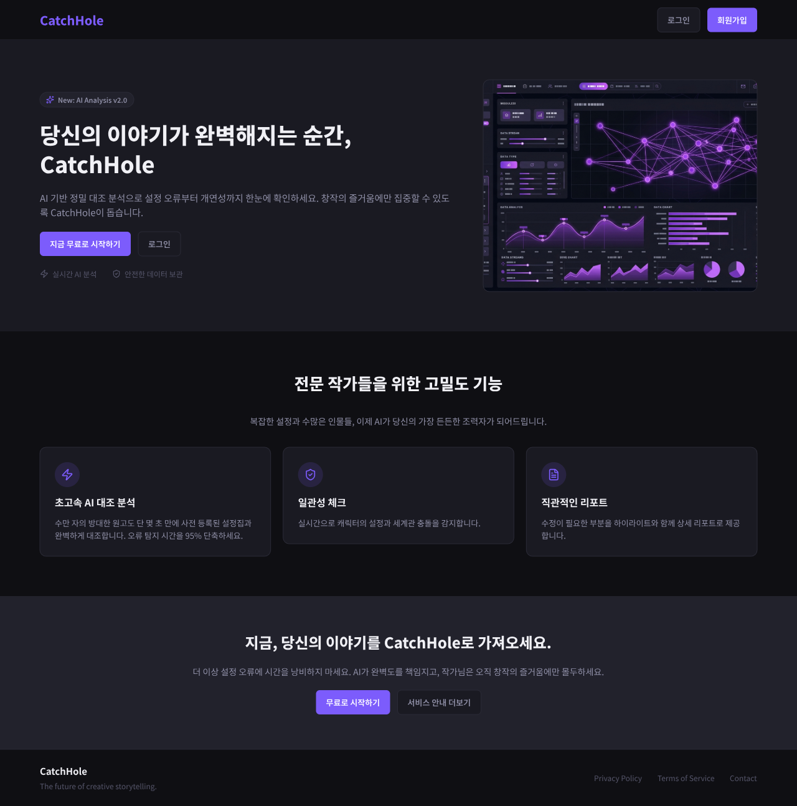
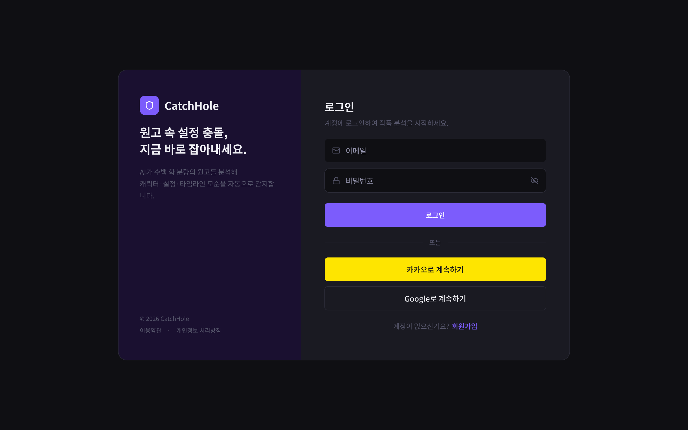
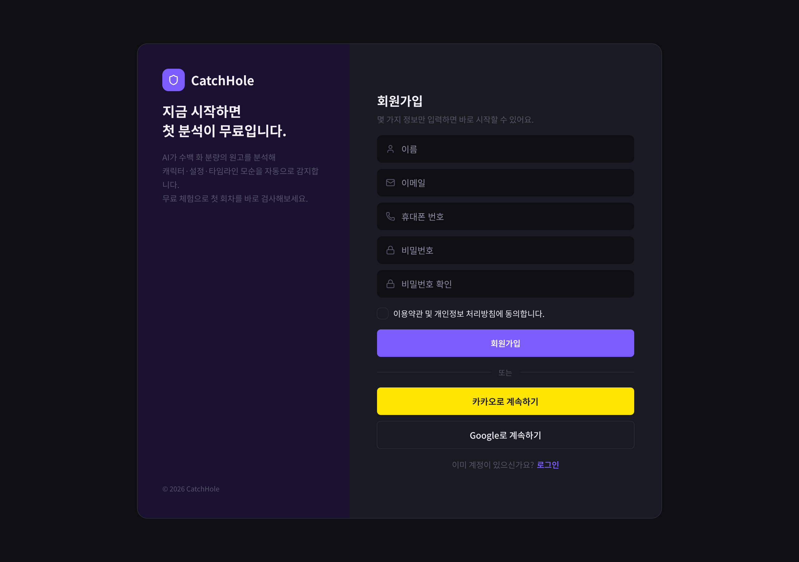
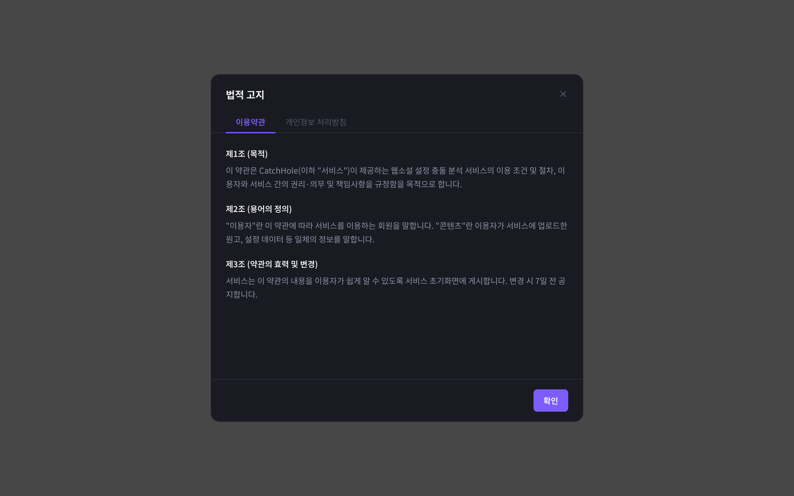

# 데이터 요구사항 — Auth(인증)

[← 전체 인덱스](./README.md)

## 목차

- [랜딩 (SLanding)](#랜딩-slanding)
- [로그인 (SLogin)](#로그인-slogin)
- [회원가입 (SSignup)](#회원가입-ssignup)
- [약관·개인정보 모달 (TermsModal)](#약관개인정보-모달-termsmodal)

---

## 랜딩 (SLanding)

**URL**: [`/landing`](https://catch-hole.vercel.app/landing)

**1. 화면에 표시할 데이터**
- 서비스 소개(Hero), 기능 카드, 신뢰 요소

**2. 사용자 액션**
- [로그인](#로그인-slogin) 이동 / [회원가입](#회원가입-ssignup) 이동

**3. 화면 전환 식별자**
- 없음

**4. 데이터 없음 / 실패 표시**
- 정적 화면 (해당 없음)

**5. BE에 요청할 데이터**
- 없음 (정적). 단, 소개 수치(예: 누적 검수 건수)를 동적으로 보여줄 경우 해당 통계

**6. BE와 협의할 범위·상태값**
- 랜딩 통계 수치를 동적으로 제공할지 여부

---

## 로그인 (SLogin)

**URL**: [`/login`](https://catch-hole.vercel.app/login)

**1. 화면에 표시할 데이터**
- 이메일·비밀번호 입력
- 소셜 로그인(카카오/구글) 버튼
- 회원가입 이동 링크, 약관 링크

**2. 사용자 액션**
- 로그인 제출 → [작품 목록](./work.md#작품-목록-s0workpicker)
- 소셜 로그인 (현재 mock)
- [회원가입](#회원가입-ssignup) 이동
- [약관·개인정보 모달](#약관개인정보-모달-termsmodal) 열기

**3. 화면 전환 식별자**
- 로그인 성공 시 accessToken 저장 (이후 화면 접근 권한). `?terms=`로 약관 모달

**4. 데이터 없음 / 실패 표시**
- 이메일 형식 오류, 로그인 실패(잘못된 자격), 네트워크 오류, 제출 중 로딩 ([에러·제출중 상태](../screens/w5lmQO.png))

**5. BE에 요청할 데이터**
- 로그인 API: 이메일·비밀번호 → accessToken
- 인증 실패 사유(아이디/비번 불일치 등)

**6. BE와 협의할 범위·상태값**
- 소셜 로그인(OAuth) 제공 범위·연동 방식
- 토큰 만료·갱신 정책
- 로그인 실패 응답 형식(에러 코드/메시지)

---

## 회원가입 (SSignup)

**URL**: [`/signup`](https://catch-hole.vercel.app/signup)

**1. 화면에 표시할 데이터**
- 필명·이메일·전화번호·비밀번호·비밀번호 확인 입력
- 약관 동의 체크, 약관 링크

**2. 사용자 액션**
- 가입 제출 → 자동 로그인 → [작품 목록](./work.md#작품-목록-s0workpicker)
- [약관·개인정보 모달](#약관개인정보-모달-termsmodal) 열기
- [로그인](#로그인-slogin) 이동

**3. 화면 전환 식별자**
- 가입 성공 시 자동 로그인(accessToken). `?terms=`로 약관 모달

**4. 데이터 없음 / 실패 표시**
- 필드 검증(이메일·전화 형식, 비밀번호 길이·일치), 이메일 중복, 네트워크 오류, 제출 중 로딩 ([에러·제출중 상태](../screens/ThXIG.png))

**5. BE에 요청할 데이터**
- 회원가입 API: 필명·이메일·전화번호·비밀번호
- 이메일(또는 전화) 중복 확인 결과

**6. BE와 협의할 범위·상태값**
- 중복 검증 방식(가입 시점 vs 실시간)
- 필수 약관 항목, 비밀번호 정책(길이·문자 구성)

---

## 약관·개인정보 모달 (TermsModal)

**URL**: [`/login?terms=terms`](https://catch-hole.vercel.app/login?terms=terms)

**1. 화면에 표시할 데이터**
- 이용약관 / 개인정보 처리방침 본문 (탭 전환)

**2. 사용자 액션**
- 탭 전환(약관 ↔ 개인정보), 닫기

**3. 화면 전환 식별자**
- `?terms=terms|privacy` (로그인·회원가입 화면 위에 표시)

**4. 데이터 없음 / 실패 표시**
- 본문 로드 실패

**5. BE에 요청할 데이터**
- 약관·개인정보 본문 (정적 포함 또는 서버 제공)

**6. BE와 협의할 범위·상태값**
- 약관 본문을 서버에서 받을지 정적 포함할지
- 약관 버전 관리 및 동의 이력 저장 여부
