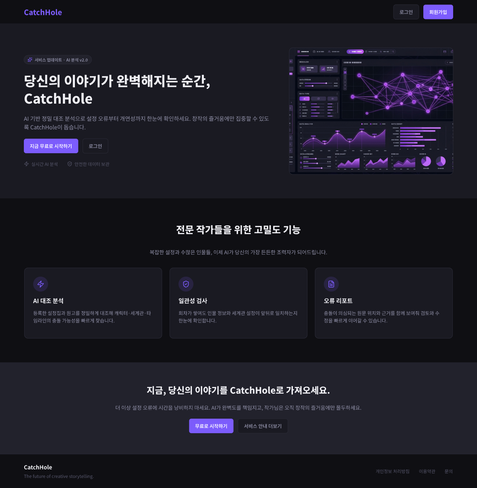
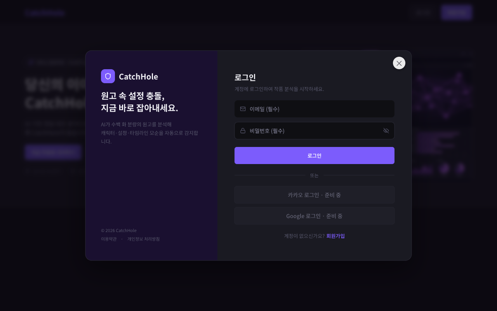
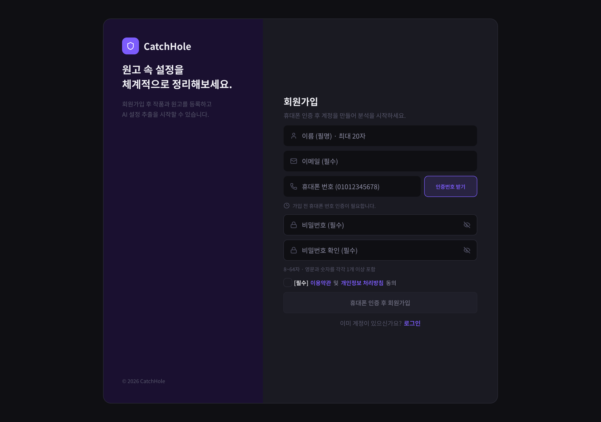
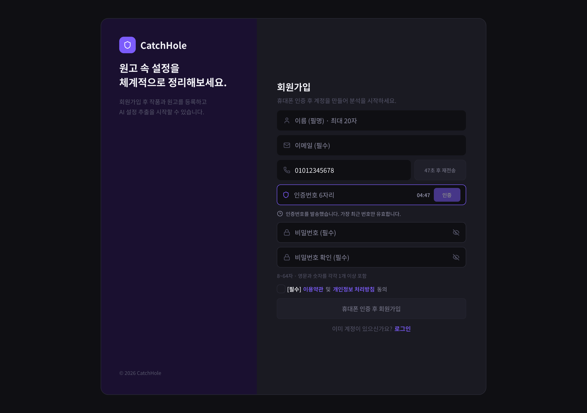
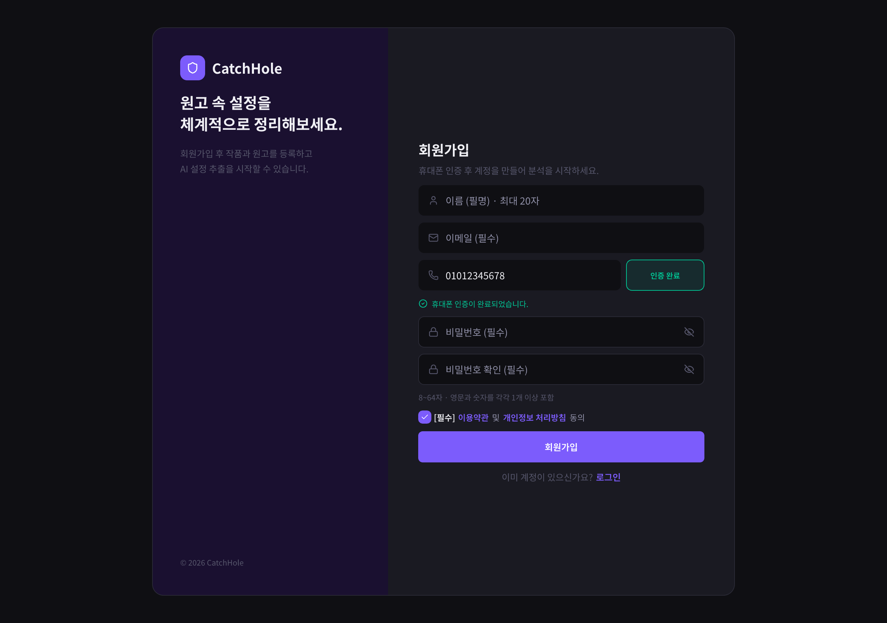
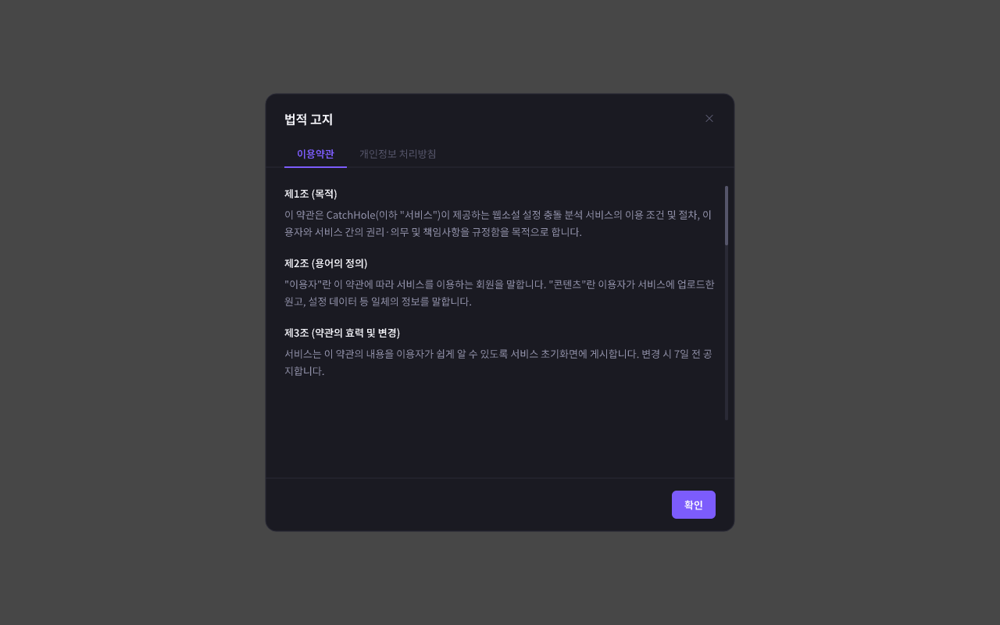
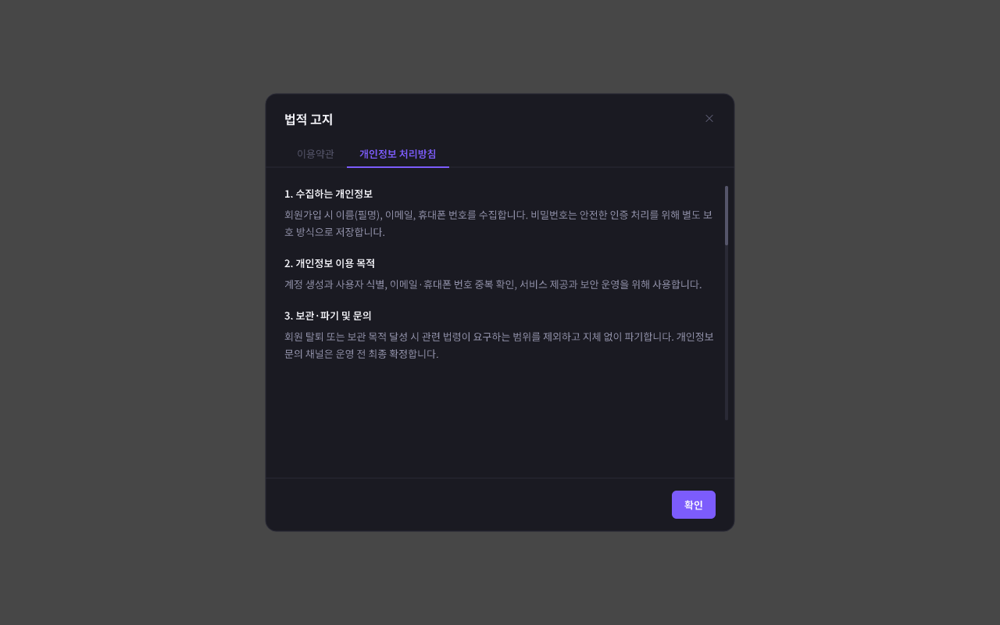

# 데이터 요구사항 — Auth(인증)

[← 전체 인덱스](./README.md)

## 목차

- [랜딩 (SLanding)](#랜딩-slanding)
- [로그인 (SLogin)](#로그인-slogin)
- [회원가입 (SSignup)](#회원가입-ssignup)
- [인증 사용자 AI 사용량](#인증-사용자-ai-사용량)
- [약관·개인정보 모달 (TermsModal)](#약관개인정보-모달-termsmodal)

### 보호 라우트 세션 확인

- access token이 있는 상태로 보호 화면에 진입하면 `GET /api/v1/auth/me`로 현재 세션을 확인한다.
- 401은 인증 만료로 처리해 토큰을 제거하고 로그인 화면으로 이동한다.
- 5xx나 네트워크 오류는 일시적 장애로 처리해 토큰을 유지하고, 보호 화면의 데이터를 노출하지 않은 채 오류 안내와 재시도를 제공한다.

### 인증 사용자 AI 사용량

- 보호 화면의 사이드바는 `GET /api/v1/ai-tokens/usage`를 조회해 `remainingPercent`만 `남은 사용량`으로 표시한다.
- API가 제공하는 `grantedTokens`, `usedTokens`, `reservedTokens`, `remainingTokens`는 운영·정산용 값이며 사용자 화면에는 노출하지 않는다.
- 처리 중 예약량이 있으면 3초, 없으면 30초 간격으로 다시 조회해 분석 진행에 따른 남은 비율을 갱신한다.
- 최초 조회 중에는 `사용량 확인 중...`, 실패 시에는 재조회 버튼과 `사용량을 불러오지 못했습니다.`를 표시한다.
- 분석 생성·재시도 요청에서 `AI_TOKEN_QUOTA_EXHAUSTED`를 받으면 전역 사용량 소진 모달을 연다.
- 소진 모달은 내부 token 수치 대신 감사·피드백 안내와 API의 `contactEmail`을 표시한다. 문의 정보 조회 실패 시 모달 안에서 다시 조회할 수 있다.
- 사용량 조회의 401은 기존 보호 라우트 세션 갱신·로그아웃 정책을 그대로 따른다.

---

## 랜딩 (SLanding)

**URL**: [`/landing`](https://www.catchhole.com/landing)

비로그인 사용자에게 CatchHole의 핵심 가치를 소개하고 로그인·회원가입으로 유도하는 진입 화면.

**1. 화면에 표시할 데이터**
- 상단 헤더: CatchHole 로고, 로그인·회원가입 버튼
- Hero: 서비스 업데이트 배지, 핵심 소개 문구와 설명, 무료 시작·로그인 버튼, 신뢰 요소, 서비스 분석 화면 예시
- 주요 기능 카드: AI 대조 분석, 일관성 검사, 오류 리포트
- 하단 가입 유도 영역
- Footer: 개인정보 처리방침, 이용약관, 문의 문구

**2. 사용자 액션**
- 로그인 버튼 → 랜딩 위에 [로그인](#로그인-slogin) 라우트 모달 열기
- 회원가입·무료 시작 버튼 → 랜딩 위에 [회원가입](#회원가입-ssignup) 라우트 모달 열기
- 서비스 안내 더보기 → 주요 기능 영역으로 스크롤
- 개인정보 처리방침 → [약관·개인정보 모달](#약관개인정보-모달-termsmodal)의 개인정보 탭 열기
- 이용약관 → [약관·개인정보 모달](#약관개인정보-모달-termsmodal)의 이용약관 탭 열기

**3. 화면 전환 식별자**
- 로그인 모달: `/login`
- 회원가입 모달: `/signup`
- 약관·개인정보 모달: `?terms=terms|privacy`

**4. 데이터 없음 / 실패 표시**
- FE 정적 화면이므로 별도의 로딩·빈 상태·실패 상태 없음

**5. 화면 데이터 요구사항**

**5-1. BE → FE 제공 데이터 요구사항**

현재 BE → FE 제공 데이터 없음. 화면 전체와 현재 노출 문구는 FE 정적 콘텐츠이며, 동적 통계 영역을 추가할 때 표시할 데이터의 의미를 다시 정의한다.

**5-2. FE → BE 전달 데이터 요구사항**
- 없음

**6. BE와 협의할 범위·상태값**
- Footer의 문의 항목은 현재 정적 문구만 표시 — 추후 문의 채널과 연결 방식 기획

---

## 로그인 (SLogin)

**URL**: [`/login`](https://www.catchhole.com/login)

가입한 사용자가 이메일과 비밀번호로 인증하고 작품 목록에 진입하는 라우트 모달. 데스크톱에서는 랜딩 위 중앙 모달로 표시하고, 모바일에서는 전체 화면으로 표시한다.

> **MVP 범위 메모**: 로그인은 이메일·비밀번호만 지원하고 화면에도 이 방식만 노출한다. 소셜 로그인은 OAuth 계약을 정한 뒤 별도 범위에서 추가한다. 회원 role(`USER`/`ADMIN`)은 FE 미사용(관리자 페이지 개발 시 재논의).

> **입력 정책**: 이메일은 필수이며 이메일 형식이어야 한다. 비밀번호는 필수이며, 길이·문자 조합 같은 비밀번호 생성 규칙은 [회원가입](#회원가입-ssignup)에서 검증하고 로그인에서는 빈 값 여부만 사전 검증한다.

**1. 화면에 표시할 데이터**
- 좌측 브랜딩 영역: CatchHole 로고, 서비스 소개, 이용약관·개인정보 처리방침
- 이메일·비밀번호 입력, 비밀번호 표시·숨김 버튼
- 로그인 버튼
- 회원가입 이동 링크

**2. 사용자 액션**
- 이메일·비밀번호 입력
- 비밀번호 표시·숨김
- 로그인 제출 → [작품 목록](./work.md#작품-목록-s0workpicker)
- 닫기·배경 선택·`Esc`·브라우저 뒤로가기 → 랜딩 복귀
- [회원가입](#회원가입-ssignup) 모달로 전환
- [약관·개인정보 모달](#약관개인정보-모달-termsmodal) 열기

**3. 화면 전환 식별자**
- 로그인 라우트 모달: `/login`
- 랜딩에서 연 경우 닫기 → 브라우저 뒤로가기, 직접 진입·인증 리다이렉트에서 닫기 → `/landing` 대체 이동
- 회원가입 전환: `/signup`으로 현재 히스토리 항목 대체
- 로그인 성공 시 `accessToken` 저장(이후 화면 접근 권한)
- 로그인 성공 → `/works`로 현재 히스토리 항목 대체
- 로그아웃 → `/landing`으로 현재 히스토리 항목 대체
- 약관·개인정보 모달: `?terms=terms|privacy`

**4. 데이터 없음 / 실패 표시**
- 이메일 미입력·이메일 형식 오류·비밀번호 미입력 ([입력 검증 오류](../screens/m3vaC0.png))
- 이메일 또는 비밀번호 불일치 ([인증 실패](../screens/w5lmQO.png))
- 네트워크 오류 ([네트워크 오류](../screens/l4QKr.png))
- 로그인 제출 중 로딩·중복 제출 방지 ([제출 중](../screens/bRQzK.png))

**5. 화면 데이터 요구사항**

**5-1. BE → FE 제공 데이터 요구사항**

**로그인 성공 후 인증 상태**

| 데이터 의미 | 형태·필수성 | 값 없음·조건 |
| --- | --- | --- |
| API 인증에 사용할 access token | 단일 값·로그인 성공 시 필수 | 로그인 실패 시 제공하지 않음 |
| 인증 갱신에 사용할 refresh token | HttpOnly 쿠키·로그인 성공 시 필수 | 로그인 실패 시 제공하지 않으며 FE가 본문 값으로 직접 읽지 않음 |

**로그인 실패**

| 데이터 의미 | 형태·필수성 | 값 없음·조건 |
| --- | --- | --- |
| 인증 실패 식별값 | 단일 상태값·자격 증명 불일치 시 필수 | `AUTH_INVALID_CREDENTIALS`; 이메일 미존재와 비밀번호 불일치를 구분하지 않음 |

**5-2. FE → BE 전달 데이터 요구사항**
- 이메일
- 비밀번호

**6. BE와 협의할 범위·상태값**
- 없음

---

## 회원가입 (SSignup)

**URL**: [`/signup`](https://www.catchhole.com/signup)

신규 사용자가 계정을 생성하고 자동 로그인 후 작품 목록에 진입하는 라우트 모달. 데스크톱에서는 랜딩 위 중앙 모달로 표시하고, 모바일에서는 긴 입력 폼을 스크롤할 수 있는 전체 화면으로 표시한다.

> **MVP 범위 메모**: 이메일·비밀번호 가입에 SOLAPI 휴대폰 번호 인증을 결합한다. 이는 PASS 같은 실명·CI/DI 본인인증이 아니라, 가입 시점에 해당 번호로 수신한 6자리 번호를 확인하는 소유 인증이다. 소셜 로그인·CAPTCHA·마케팅 수신 동의는 제외한다.

> **디자인 원본**: `design/catchhole.pen`의 `SSignup / 회원가입`, `SSignup / 인증번호 입력·재전송 대기`, `SSignup / 휴대폰 인증 완료` 프레임을 구현 상태의 기준으로 사용한다.

> **입력 정책**
> - 이름(필명): 필수, 최대 20자, 중복 허용. 화면에는 `이름 (필명)`, 문서와 전달 데이터에는 필명(`displayName`)으로 표기
> - 이메일: 필수, 이메일 형식, 중복 불가
> - 휴대폰 번호: 필수, 하이픈 없이 `010`으로 시작하는 11자리 숫자, 중복 불가. 인증이 끝난 번호를 수정하면 인증 완료 상태와 가입 토큰을 즉시 폐기
> - 인증번호: 숫자 6자리, 발송 후 5분 동안 유효, 5회 오입력 시 해당 인증 흐름 잠금
> - 재전송: 발송 후 60초 동안 버튼 비활성. 재전송 성공 시 이전 인증번호를 폐기하고 최신 번호만 유효
> - 비밀번호: 8자 이상 64자 이하, 영문·숫자 각 1개 이상, 특수문자 선택
> - 비밀번호 확인: 비밀번호와 일치
> - 이용약관·개인정보 처리방침: 하나의 체크박스로 묶어 필수 동의

**1. 화면에 표시할 데이터**
- 좌측 브랜딩 영역: CatchHole 로고, 서비스 소개
- 이름(필명)·이메일·휴대폰 번호·비밀번호·비밀번호 확인 입력
- 휴대폰 번호 입력 오른쪽 `인증번호 받기` 버튼. 발송 중에는 중복 요청을 막고, 발송 뒤에는 남은 재전송 대기 초를 표시
- 발송 성공 후에만 노출하는 6자리 인증번호 입력, `MM:SS` 형식 5분 타이머, `인증` 버튼
- 발송 완료·가장 최근 번호만 유효·인증 완료·만료 상태를 아이콘과 문구로 안내
- 인증 완료 상태는 성공 색상으로 표시하고, 인증 전에는 회원가입 버튼을 `휴대폰 인증 후 회원가입` 문구로 비활성
- 비밀번호·비밀번호 확인 표시·숨김 버튼
- 이용약관·개인정보 처리방침 통합 필수 동의 체크와 각 본문 링크
- 회원가입 버튼
- 로그인 이동 링크

**2. 사용자 액션**
- 가입 정보 입력
- 휴대폰 번호 입력 후 인증번호 발송 요청
- 60초 뒤 인증번호 재전송. 재전송하면 현재 OTP 입력을 비우고 새 5분 타이머 시작
- 6자리 인증번호 입력·확인
- 인증된 휴대폰 번호 수정 → 인증 ID·OTP·가입 토큰 폐기 후 발송 전 상태로 복귀
- 비밀번호·비밀번호 확인 표시/숨김
- 이용약관·개인정보 처리방침 본문 확인
- 통합 필수 동의 체크
- 휴대폰 인증과 필수 동의를 모두 완료한 뒤 가입 제출 → 자동 로그인 → [작품 목록](./work.md#작품-목록-s0workpicker)
- 닫기·배경 선택·`Esc`·브라우저 뒤로가기 → 랜딩 복귀
- [로그인](#로그인-slogin) 모달로 전환

**3. 화면 전환 식별자**
- 회원가입 라우트 모달: `/signup`
- 랜딩에서 연 경우 닫기 → 브라우저 뒤로가기, 직접 진입에서 닫기 → `/landing` 대체 이동
- 로그인 전환: `/login`으로 현재 히스토리 항목 대체
- 가입·자동 로그인 성공 시 `accessToken` 저장
- 가입·자동 로그인 성공 → `/works`로 현재 히스토리 항목 대체
- 약관·개인정보 모달: `?terms=terms|privacy`
- 휴대폰 인증 진행 복원: `sessionStorage.catchhole_phone_verification`
  - 저장 허용: `verificationId`, `phoneNumber`, `expiresAt`, `resendAt`
  - 저장 금지: 인증번호, `phoneVerificationToken`, 비밀번호
- `phoneVerificationToken`은 컴포넌트 메모리에만 보관한다. 새로고침·Auth 모달 이탈·번호 수정 시 사라지므로 다시 확인해야 한다.

**4. 데이터 없음 / 실패 표시**
- 필명 미입력·길이 초과
- 이메일 미입력·형식 오류·중복 ([입력·중복 오류](../screens/ThXIG.png))
- 휴대폰 번호 미입력·형식 오류·중복
- 잘못된 인증번호와 남은 흐름 유지
- 인증번호 5회 오입력 잠금과 새 번호 발송 안내
- 인증 흐름 만료 시 OTP 입력을 닫고 새 인증번호 발송 안내
- 재전송·발송량 제한과 잠시 후 재시도 안내
- Redis 또는 SMS 발송 서비스 장애와 휴대폰 인증 일시 사용 불가 안내
- 유효하지 않거나 이미 사용한 가입 토큰은 인증 상태를 폐기하고 재인증 안내
- 비밀번호 미입력·정책 불충족
- 비밀번호 확인 미입력·불일치
- 휴대폰 미인증 또는 필수 약관 미동의 시 회원가입 버튼 비활성
- 네트워크 오류와 입력값 유지 ([네트워크 오류](../screens/f7oz8.png))
- 제출·자동 로그인 중 로딩과 중복 제출 방지 ([제출 중](../screens/tfhIa.png))

**5. 화면 데이터 요구사항**

**5-1. BE → FE 제공 데이터 요구사항**

**가입·자동 로그인 성공 후 인증 상태**

| 데이터 의미 | 형태·필수성 | 값 없음·조건 |
| --- | --- | --- |
| API 인증에 사용할 access token | 단일 값·가입과 자동 로그인 성공 시 필수 | 가입 또는 자동 로그인 실패 시 제공하지 않음 |
| 인증 갱신에 사용할 refresh token | HttpOnly 쿠키·가입과 자동 로그인 성공 시 필수 | 가입 또는 자동 로그인 실패 시 제공하지 않으며 FE가 본문 값으로 직접 읽지 않음 |

**가입 정보 중복 실패**

| 데이터 의미 | 형태·필수성 | 값 없음·조건 |
| --- | --- | --- |
| 이메일 중복 식별값 | 단일 상태값·이메일 중복 시 필수 | `AUTH_EMAIL_DUPLICATED` |
| 휴대폰 번호 중복 식별값 | 단일 상태값·휴대폰 번호 중복 시 필수 | `AUTH_PHONE_NUMBER_DUPLICATED` |

**휴대폰 인증번호 발송 성공**

| 데이터 의미 | 형태·필수성 | 값 없음·조건 |
| --- | --- | --- |
| 인증 흐름 식별자 | UUID 문자열·발송 성공 시 필수 | `verificationId`; 재전송 성공 시 새 값으로 교체 |
| 인증번호 만료까지 남은 초 | 정수·발송 성공 시 필수 | `expiresInSeconds=300` |
| 재전송 가능까지 남은 초 | 정수·발송 성공 시 필수 | `resendAfterSeconds=60` |

**휴대폰 인증 확인 성공**

| 데이터 의미 | 형태·필수성 | 값 없음·조건 |
| --- | --- | --- |
| 1회용 회원가입 인증 토큰 | 문자열·인증 성공 시 필수 | `phoneVerificationToken`; 브라우저 저장소에 기록하지 않음 |
| 가입 토큰 만료까지 남은 초 | 정수·인증 성공 시 필수 | `expiresInSeconds=600` |

**휴대폰 인증 실패 상태**

| 오류 코드 | HTTP | 화면 처리 |
| --- | --- | --- |
| `AUTH_PHONE_VERIFICATION_CODE_INVALID` | 400 | 인증번호가 올바르지 않음을 표시하고 입력·타이머 유지 |
| `AUTH_PHONE_VERIFICATION_TOKEN_INVALID` | 400 | 인증 완료 상태를 폐기하고 재인증 안내 |
| `AUTH_PHONE_VERIFICATION_EXPIRED` | 410 | 진행 상태를 폐기하고 새 인증번호 발송 안내 |
| `AUTH_PHONE_VERIFICATION_RATE_LIMITED` | 429 | 발송 한도 초과 안내, 재전송 카운트다운이 있으면 유지 |
| `AUTH_PHONE_VERIFICATION_ATTEMPTS_EXCEEDED` | 429 | 5회 오입력 잠금과 새 인증번호 발송 안내 |
| `AUTH_PHONE_VERIFICATION_UNAVAILABLE` | 503 | 인증 서비스 일시 사용 불가 안내, 가입 정보 유지 |

**5-2. FE → BE 전달 데이터 요구사항**
- 인증번호 발송: 휴대폰 번호(`phoneNumber`)
- 인증번호 확인: URL의 `verificationId`, 본문의 6자리 `code`
- 회원가입: 필명(`displayName`), 이메일, 비밀번호, `phoneVerificationToken`

회원가입 요청에 휴대폰 번호를 다시 보내지 않는다. Backend가 `phoneVerificationToken`에 연결된 번호를 사용해 인증 번호 위조를 차단한다. 비밀번호 확인과 약관 동의 여부는 FE에서만 검증하고 MVP에서는 BE에 전달하지 않는다.

**6. BE와 협의할 범위·상태값**
- TTL과 재전송 간격은 Backend 응답 초를 기준으로 표시하며 FE 상수로 계약을 재정의하지 않는다.
- 429 응답의 `Retry-After`는 서버 제한 해제 시각의 기준이다. 화면에 서버 대기 초 표시가 추가되면 해당 헤더를 사용한다.

---

## 약관·개인정보 모달 (TermsModal)

**URL 상태**: 호출 화면(`/landing`, `/login`, `/signup`) + `?terms=terms|privacy`

비로그인 사용자가 서비스 이용약관과 개인정보 처리방침을 확인하는 공통 모달. Auth 라우트 모달에서 열면 그 위에 한 단계 더 쌓인다.

> **MVP 범위 메모**: 본문은 FE 정적 콘텐츠로 제공한다. 현재 Pencil과 FE에 작성된 본문은 화면 확인용 예시이며, 배포 전 별도로 작성·검토한 최종 이용약관과 개인정보 처리방침으로 교체한다. 약관 버전 관리와 사용자별 동의 이력 저장은 MVP 범위에서 제외한다.

**1. 화면에 표시할 데이터**
- 모달 제목: `법적 고지`
- 이용약관·개인정보 처리방침 탭
- 현재 선택된 탭의 활성 상태
- 선택한 탭의 약관 본문
- 닫기 버튼과 확인 버튼

**2. 사용자 액션**
- 이용약관·개인정보 처리방침 탭 전환
- 긴 약관 본문 스크롤
- 닫기 버튼 또는 확인 버튼 선택 → 모달을 닫고 기존 화면으로 복귀
- 모달 바깥 영역 선택 → 모달을 닫고 기존 화면으로 복귀
- `Esc`·브라우저 뒤로가기 → 약관 모달만 닫고 기존 랜딩 또는 Auth 모달 유지

**3. 화면 전환 식별자**
- 최초 표시 탭: `?terms=terms|privacy`
- 모달을 닫아도 호출 화면은 유지
- 호출 화면에서 연 경우 쿼리 히스토리를 한 단계 추가하고 닫을 때 제거하며, 약관 딥링크 직접 진입은 현재 URL에서 `terms`만 대체 제거

**4. 데이터 없음 / 실패 표시**
- 정적 콘텐츠로 제공하므로 별도의 로딩·빈 상태·실패 상태 없음

**5. 화면 데이터 요구사항**

**5-1. BE → FE 제공 데이터 요구사항**

현재 BE → FE 제공 데이터 없음. 이용약관과 개인정보 처리방침 본문은 MVP에서 FE 정적 콘텐츠로 제공한다.

**5-2. FE → BE 전달 데이터 요구사항**
- 없음

**6. BE와 협의할 범위·상태값**
- 이용약관과 개인정보 처리방침 최종 원문을 별도로 작성하고 검토 담당자·확정 시점 결정 필요
- 개인정보 처리방침의 수집 항목에 휴대폰 번호를 포함할지 최종 문구 확정 필요
- TODO: 개인정보 문의 주소는 추후 실제 운영 가능한 이메일로 확정하고 배포 전 최종 개인정보 처리방침에 반영
