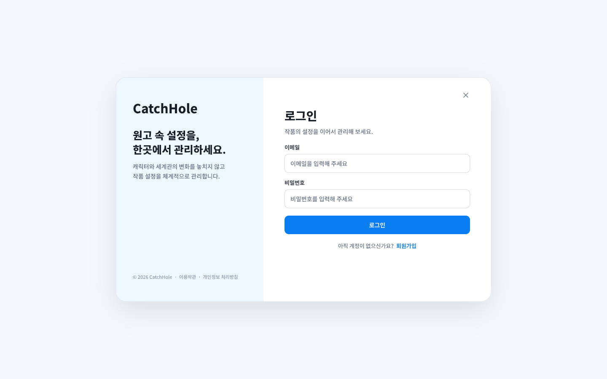
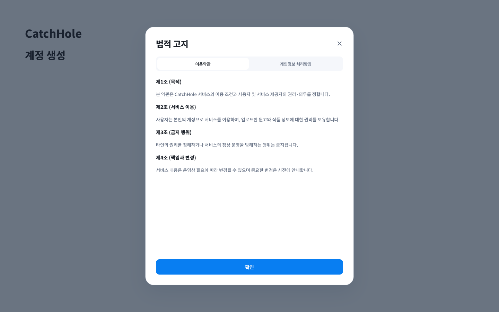
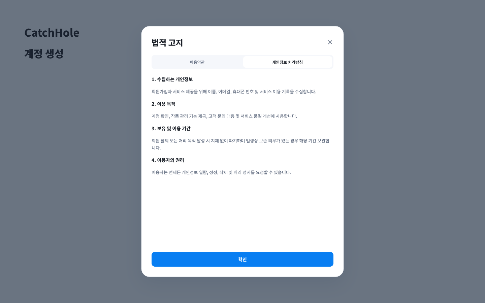

# 데이터 요구사항 — Auth(인증)

로그인·회원가입의 데스크톱 브랜드 패널과 모바일 폼은 공통 `BrandLogo`에서 왼쪽 유광 아크릴 심볼과 오른쪽 기존 CatchHole 워드마크를 함께 표시합니다. 심볼은 각각 44px/48px이며, 인증 요청·약관 동의·라우트 모달 계약은 변경하지 않습니다. [브랜드 적용 기준](../brand-assets.md)

[← 전체 인덱스](./README.md)


## 목차

- [랜딩 (SLanding)](#랜딩-slanding)
- [로그인 (SLogin)](#로그인-slogin)
- [회원가입 (SSignup)](#회원가입-ssignup)
- [사용자 메뉴·회원 탈퇴 (UserMenu)](#사용자-메뉴회원-탈퇴-usermenu)
- [상시 서비스 의견 (FeedbackDialog)](#상시-서비스-의견-feedbackdialog)
- [인증 사용자 AI 사용량](#인증-사용자-ai-사용량)
- [약관·개인정보 모달 (TermsModal)](#약관개인정보-모달-termsmodal)

### 보호 라우트 세션 확인

상태 화면: [인증 확인 중](../screens/Rxd2k.png) · [인증 서버 오류·재시도](../screens/Yj7td.png) · [모바일 확인 중](../screens/zMv34.png) · [모바일 서버 오류](../screens/A8vua.png)

- access token이 있는 상태로 보호 화면에 진입하면 `GET /api/v1/auth/me`로 현재 세션을 확인한다.
- 세계관 후보 검토(`/setting-review?candidateType=world`)와 세계관 DB(`/dashboard?nav=settingDB&tab=worldsettings`)도 같은 보호 라우트 게이트를 통과한 뒤에만 목록·상세 요청과 비교 상태 polling을 시작한다.
- 401은 인증 만료로 처리해 토큰을 제거하고 로그인 화면으로 이동한다.
- 5xx나 네트워크 오류는 일시적 장애로 처리해 토큰을 유지하고, 보호 화면의 데이터를 노출하지 않은 채 오류 안내와 재시도를 제공한다.
- 세계관 목록·상세·비교 요청의 5xx나 네트워크 오류도 인증 만료로 간주하거나 목 데이터로 전환하지 않는다.

### 사용자 메뉴·회원 탈퇴 (UserMenu)

**노출 위치**: `/works`를 포함해 `UserMenu`를 사용하는 인증 보호 화면의 상단 사용자 아바타. 별도 계정 관리 라우트는 만들지 않는다.

디자인 기준: `design/catchhole.pen`의 `Active / Account / User Menu / Desktop`, `Active / Account / Withdrawal / Desktop`, `Active / Account / User Menu / Mobile`, `Active / Account / Withdrawal / Mobile` 프레임.

**1. 화면에 표시할 데이터**

- 사용자 메뉴 상단에 현재 사용자의 프로필 이미지 또는 이름 첫 글자, 필명(`displayName`), 이메일을 표시한다.
- 보호 라우트가 이미 조회한 `GET /api/v1/auth/me` TanStack Query 캐시를 공유한다. 정보 재조회 중이거나 실패해도 로그아웃과 회원 탈퇴 진입점은 계속 사용할 수 있다.
- 로그아웃 아래 구분선 뒤에 위험 작업인 `회원 탈퇴`를 배치한다. 계정 관리 페이지, 탈퇴 복구, 삭제 진행 상태 화면은 현재 범위에 포함하지 않는다.
- 회원 탈퇴 모달에는 복구 불가 안내, 현재 비밀번호, 고정 확인 문구 `회원 탈퇴`, 취소와 최종 탈퇴 버튼을 표시한다.

**2. 상호작용·접근성 계약**

- 사용자 메뉴 버튼은 열림 상태를 `aria-expanded`로 알리고, 메뉴를 열면 첫 액션으로 포커스를 이동한다. `ArrowUp`·`ArrowDown`·`Home`·`End`로 액션을 이동하고 `Esc`로 닫아 트리거에 포커스를 돌려준다.
- 회원 탈퇴를 선택하면 사용자 메뉴를 닫고 확인 모달을 연다. 모달은 첫 비밀번호 입력으로 포커스를 이동하고, 포커스를 내부에 가두며, 닫힌 뒤 사용자 메뉴 트리거로 복원한다.
- 현재 비밀번호는 필수·최대 64자다. 확인 문구가 공백을 포함한 `회원 탈퇴`와 정확히 같을 때만 최종 버튼을 활성화한다.
- 요청 중에는 입력·닫기·배경 선택·`Esc`·최종 버튼을 잠가 중복 요청을 막는다.
- 320px 화면과 200% 확대에서도 메뉴와 모달이 가로로 넘치지 않아야 하며, 낮은 화면에서는 모달 본문을 내부 세로 스크롤한다.

**3. API·세션 계약**

```http
DELETE /api/v1/members/me
Content-Type: application/json

{
  "currentPassword": "사용자가 입력한 현재 비밀번호",
  "confirmation": "회원 탈퇴"
}
```

- 생성 SDK의 `withdrawMe`를 MutationCache를 거치지 않고 직접 호출하며 비밀번호와 확인 문구를 로그·브라우저 저장소·Query/Mutation 캐시에 기록하지 않는다.
- `202 Accepted`를 받은 뒤에만 진행 중인 refresh를 무효화하고 access token과 전체 Query/Mutation 캐시를 지운다. 이후 `/landing`으로 현재 히스토리 항목을 대체하고 한 번만 보이는 탈퇴 접수 안내를 전달한다.
- 랜딩은 안내를 화면 로컬 상태로 옮긴 직후 history state의 `memberWithdrawalAccepted`를 제거한다. 새로고침이나 뒤로가기로 같은 성공 안내를 반복하지 않는다.
- 비밀번호 불일치(`MEMBER_WITHDRAWAL_PASSWORD_MISMATCH`)는 현재 비밀번호 필드 오류로 표시한다. 요청 검증 오류는 해당 필드에 표시한다.
- 400·네트워크·일반 서버 오류에서는 모달, 두 입력값, access token과 캐시를 유지한다. 탈퇴 API가 refresh와 원 요청 재시도 뒤에도 401이면 `/auth/me`로 세션을 재검증하고, `/auth/me`도 401일 때만 세션을 제거한다. 세션이 유효하거나 확인할 수 없는 5xx·네트워크 오류에서는 입력과 세션을 유지한다.

**4. BE → FE 제공 데이터 요구사항**

| 데이터 의미 | 현재 필드·상태 | 화면 사용 |
| --- | --- | --- |
| 현재 사용자 요약 | `displayName`, `email`, `profileImageUrl` | 메뉴 프로필 요약과 아바타 fallback |
| 탈퇴 요청 접수 | HTTP `202`, `requestId`, `status` | 성공 여부 판정. 비동기 삭제 상태 화면은 제공하지 않음 |
| 비밀번호 불일치 | `MEMBER_WITHDRAWAL_PASSWORD_MISMATCH` | 현재 비밀번호 필드 오류 |
| 요청 검증 실패 | 오류 `details[].field`, `details[].message` | `currentPassword`·`confirmation` 필드 오류 |

**5. FE → BE 전달 데이터 요구사항**

- `currentPassword`: 사용자가 입력한 원문, 필수, 최대 64자
- `confirmation`: 공백을 포함한 고정 문자열 `회원 탈퇴`

### 상시 서비스 의견 (FeedbackDialog)

**노출 위치**: `UserMenu`를 사용하는 인증 보호 화면의 상단 아바타 왼쪽. 데스크톱은 `의견 보내기` 아이콘과 라벨을 함께 표시하고, 760px 이하에서는 같은 접근 가능한 이름을 가진 44px 아이콘 버튼으로 축소한다.

디자인 기준: `design/catchhole.pen`의 `FeedbackDialog / 상시 서비스 의견` 프레임. 랜딩 전용 `DESIGN.md` 토큰은 적용하지 않고 인증 화면의 Theme V2 `--ch-*` 의미 토큰을 사용한다.

**1. 입력·상태 계약**

- 의견은 앞뒤 공백을 제외한 Unicode 35~1000자로 입력하며, 원고 내용이나 민감정보를 입력하지 않아도 된다고 안내한다.
- 현재 화면은 query와 fragment를 제외한 `window.location.pathname`만 `pagePath`로 전송한다.
- 제출 중에는 입력·중복 제출·배경 선택·`Esc`·닫기를 잠근다. 실패 시 입력을 유지하고 성공 시에만 비운다.
- `CREATED`는 의견과 일반 피드백 보상 요청이 함께 접수됐다고 안내한다. `ALREADY_REQUESTED`는 의견만 새로 저장되고 이전 보상 요청을 재사용한다고 안내한다. `PENDING_REQUEST_EXISTS`는 다른 추가 사용량 요청이 처리 중이라 의견만 저장됐다고 안내한다.
- 성공 안내를 닫으면 상단 `의견 보내기` 트리거로 포커스를 복원한다. 320px와 실제 200% 확대에서도 헤더와 모달이 가로로 넘치지 않아야 한다.

**2. API·보상 계약**

```http
POST /api/v1/feedbacks
Content-Type: application/json

{
  "content": "사용자가 작성한 서비스 의견",
  "pagePath": "/dashboard"
}
```

- Backend는 유효한 의견을 `feedbacks`에 매번 새 행으로 저장한다.
- 첫 일반 피드백은 기존 추가 사용량 승인·지급 흐름의 `GENERAL_FEEDBACK_REWARD` 요청을 함께 만든다. 이 출처의 요청은 `PENDING`, `APPROVED`, `REJECTED` 전체 상태를 통틀어 회원당 한 번만 존재한다.
- 다른 추가 사용량 요청이 `PENDING`이면 의견은 저장하되 이번 보상 요청 생성은 보류한다. 이후 다시 의견을 보낼 때 대기 요청이 끝났고 일반 피드백 보상 이력이 없으면 최초 보상 요청을 생성할 수 있다.
- 보상 승인은 기존 운영자 API와 `AI_TOKEN_DEFAULT_GRANT`를 사용하며, `usedTokens`와 `reservedTokens`를 초기화하지 않는다.

| 데이터 의미 | API 필드·상태 | 화면 사용 |
| --- | --- | --- |
| 의견 본문 | `content`, trim 후 35~1000 Unicode 글자 | 입력 검증과 운영 검토 |
| 작성 화면 | `pagePath`, 내부 pathname | 의견 발생 화면 구분 |
| 보상 요청 결과 | `rewardRequestOutcome` | 생성·기존 요청·다른 대기 요청 구분 |
| 연결 요청 | `rewardRequestId`, `rewardRequestStatus` | 성공 안내 분기. 정확한 token 수치는 노출하지 않음 |

### 인증 사용자 AI 사용량

- 보호 화면의 사이드바는 `GET /api/v1/ai-token-usages/me`를 조회해 `remainingPercent`만 `남은 사용량`으로 표시한다. 이 비율은 누적 지급량이 아니라 현재 `AI_TOKEN_DEFAULT_GRANT`를 100% 기준으로 계산하므로, 소진 뒤 같은 양을 추가 지급받으면 100%로 복구된다.
- API가 제공하는 `grantedTokens`, `usedTokens`, `reservedTokens`, `remainingTokens`는 운영·정산용 값이며 사용자 화면에는 노출하지 않는다.
- 처리 중 예약량이 있으면 3초, 없으면 30초 간격으로 다시 조회해 분석 진행에 따른 남은 비율을 갱신한다.
- 최초 조회 중에는 `사용량 확인 중...`, 실패 시에는 재조회 버튼과 `사용량을 불러오지 못했습니다.`를 표시한다.
- 분석 생성·재시도 요청에서 `AI_TOKEN_QUOTA_EXHAUSTED`를 받으면 해당 요청을 시작한 확인 모달을 먼저 닫고 전역 사용량 소진 모달을 연다. 피드백 제출 또는 검토 중 안내 확인 뒤 이전 확인 모달이 다시 드러나지 않아야 한다.
- 분석 시작 뒤 비동기 Job 조회에서 같은 failure code를 확인해도 전역 모달을 연다. 같은 배치의 현재 Job이 모두 terminal 상태가 된 뒤 1차 추출 전 실패는 단일·전체·일부 실패 회차 수에 맞는 문구와 실패 회차 재시도를 안내하고, 1차 추출 뒤 비교 일부 중단이면 중단 건수, 완료 결과 보존, 세계관 검토에서 재개할 수 있다는 안내를 표시한다. 한 배치에 두 종류의 실패가 섞이면 실패 회차 수와 보존된 세계관 비교 중단 수를 한 모달에 함께 표시한다.
- 소진 모달을 열 때 `GET /api/v1/ai-token-usages/extension-requests/me/pending`으로 미처리 요청을 확인한다. 요청이 있으면 새 입력 폼 대신 운영자 검토 중 상태를 표시하고, 한 회원이 동시에 두 요청을 만들지 않게 한다.
- 소진 모달에서 생성한 요청은 `QUOTA_EXHAUSTION`, 상시 서비스 의견에서 회원당 한 번 만드는 보상 요청은 `GENERAL_FEEDBACK_REWARD` 출처로 구분한다. 운영자 승인·반려와 지급 원장은 같은 API와 상태 전이를 재사용한다.
- 새 요청은 단일 입력란의 앞뒤 공백을 제거한 Unicode 글자 수가 35~1000자일 때만 `POST /api/v1/ai-token-usages/extension-requests`로 보낸다. 입력 폼은 `제출`과 `취소` 액션을 구분한다. Front와 OpenAPI DTO가 같은 제약을 적용하며, 원고 본문·민감정보를 자동 첨부하지 않고 입력하지 말라는 안내를 함께 표시한다.
- 요청 body는 `feedback`과 모달 발생 원인인 `context`를 전달한다. 동기 차단은 `REQUEST_BLOCKED`, 1차 분석 실패는 `ANALYSIS_FAILED`, 1차 추출 뒤 비교 중단은 `ANALYSIS_INTERRUPTED`로 구분한다.
- 제출 중에는 중복 전송과 모달 닫기를 막는다. 성공하면 입력을 비우고 검토 중 상태로 전환하며, 실패하면 입력을 보존한 채 다시 시도할 수 있게 한다.
- 운영자 승인·반려 화면은 Front MVP 범위에 포함하지 않는다. 승인은 Backend 운영 API가 처리하며 승인량은 신규 회원의 초기 지급량과 같은 설정값을 사용한다. 누적 지급량·사용량은 초기화하지 않되 사용자용 비율은 현재 1회 제공량을 기준으로 최대 100%까지 표시하며, 정확한 token 수치는 사용자에게 노출하지 않는다.
- 서비스 이메일은 피드백 폼의 대체 수단이 아닌 보조 연락처로 계속 표시한다. Theme V2의 밝은 문의 영역에서 이메일 링크는 4.5:1 이상의 명암비를 갖는 의미 색상과 밑줄을 사용한다.
- 사용량 조회의 401은 기존 보호 라우트 세션 갱신·로그아웃 정책을 그대로 따른다.

| 데이터 의미 | API 필드·상태 | 화면 사용 |
| --- | --- | --- |
| 피드백 본문 | `feedback`, trim 후 35~1000 Unicode 글자 | 글자 수 검증과 운영자 검토 내용 |
| 요청 출처 | `source` | 사용량 소진 요청과 일반 피드백 보상 요청 구분 |
| 요청 발생 원인 | `context` | 동기 차단·분석 실패·비교 중단 구분 |
| 미처리 요청 | `pending`, `request.status=PENDING` | 중복 폼 대신 검토 중 상태 |
| 처리 결과 | `APPROVED` 또는 `REJECTED` | 현재 모달에서는 직접 조회·노출하지 않음 |

---

## 랜딩 (SLanding)

**URL**: [`/landing`](https://www.catchhole.com/landing)


화면 확대: [데스크톱 시작](../screens/landing-video-desktop.png) · [설정 추출](../screens/landing-video-settings.png) · [모바일 재생](../screens/landing-video-mobile.png) · [모바일 설정 추출](../screens/landing-video-mobile-settings.png) · [모바일 확정 완료](../screens/landing-video-mobile-complete.png)

제품 데모 고정 단계: [1단계](../screens/y2tKZo.png) · [2단계](../screens/EySqw.png) · [3단계](../screens/BlkIV.png) · [4단계](../screens/cK7by.png) · [5단계](../screens/E2RsD.png) · [6단계](../screens/BAC3B.png) · [7단계](../screens/k32SB.png) · [8단계](../screens/eCbQ8.png) · [모바일](../screens/u2KiIK.png)

비로그인 사용자에게 CatchHole의 핵심 가치를 소개하고, 가입 전에 공개 데모를 체험하도록 우선 안내하는 진입 화면.

> **Theme V2 활성 화면**: NHN Cloud의 넓은 여백, 명확한 정보 위계, 제품을 직접 보여주는 아코디언 구성을 레퍼런스 증거로 사용하되 CatchHole의 Primary Blue, 실제 제품 화면, 작가 검토 흐름으로 재해석합니다. 구현 기준은 `DESIGN.md`와 `design/catchhole.pen`의 `SLanding / 랜딩 · Approved Editable Source` 프레임이며, 오른쪽 `ACTIVE /LANDING` 영역에는 실제 Front의 Hero·8단계·모바일 캡처를 함께 둡니다. 밝은 캔버스·흰색 surface·의미 기반 토큰은 후속 대시보드·설정 검토 화면과 공유합니다.

> **CTA 우선순위**: 랜딩의 주 행동은 회원가입이 아니라 공개 데모입니다. 헤더·Hero·하단 CTA에서 `/demo`를 채워진 Primary Blue 버튼으로 반복하고, 로그인·회원가입은 보조 위계로 유지합니다.

**1. 화면에 표시할 데이터**
- 상단 고정 헤더: CatchHole 로고, 서비스 소개·주요 서비스 앵커, 로그인·무료 시작 보조 버튼, `로그인 없이 체험하기` 주 버튼
- Hero: 승인된 실사 영상(작가 → 노트북 원고)을 사용한다. 첫 화면은 흰 여백과 둥근 모서리, 영상 하단의 `설정 추출부터 검수까지 / 캐치홀 하나로` 제목으로 시작한다. 첫 장면에는 큰 제목만 표시하고, 체험 주 버튼·무료 시작 보조 버튼과 원문 근거·작가 확정 안내는 마지막 장면에서 표시한다. 마지막 영상 프레임에서 `잊힌 불씨 / 25화. 북쪽 성문` 원고와 세계관 3개·캐릭터 1개·마법 2개의 설정으로 이어진다. 소개용 설정 확정은 서버에 저장하지 않는다.
- 8단계 제품 흐름: 작품 → 업로드 → 분석 → 후보 → 확정 → 설정 → 상세 → 이력 순서와 단계별 서로 다른 실제 제품 장면. 데스크톱에서는 활성 장면과 세로 레일을 한 화면에 펼치는 아코디언, 태블릿·모바일에서는 단일 활성 장면과 단계 탭으로 표시. 520px 이하에서는 4열×2행의 52px 높이 탭을 사용하고, 제품 장면의 사이드바와 다열 목록은 모바일 단일 열로 재배치한다.
- 원고 학습 미사용 안내: 제품 데모 아래, 핵심 기능 3항목 요약 위에 항상 펼쳐진 간결한 섹션으로 표시한다. 제목은 `작가님의 원고는 AI 학습에 사용하지 않습니다.`, 본문은 `원고와 분석 결과 모두에 적용됩니다.`로 유지하고 `개인정보 처리방침 보기` 링크를 제공한다. 이 약속의 범위는 원고·분석 결과의 자체·외부 AI 모델 학습 미사용이다. 인접 섹션과 같은 캔버스 배경·콘텐츠 폭·왼쪽 정렬을 유지하고 `AI 학습에 사용하지 않습니다.`를 강조한다. 제목은 데스크톱 최대 32px·모바일 최소 26px, 위아래 여백은 데스크톱 56px·모바일 40px로 유지하며 `/landing#manuscript-protection`으로 직접 연결할 수 있다.
- 핵심 기능 요약: 캐릭터·세계관 후보, 원문 근거 연결, 작가 최종 확정
- 주요 서비스 카탈로그: 데스크톱 2열·모바일 1열 목록으로 작품 업로드, 캐릭터·세계관 자동 추출, 세계관 DB, 캐릭터 DB, 원문 근거를 설명. 캐릭터 관계도·설정 챗봇·오류 리포트는 같은 목록에서 `업데이트 예정`으로 명시하고 현재 기능으로 오인할 링크나 실행 액션을 제공하지 않음
- 하단 `로그인 없이 체험하기` 유도와 무료 가입 보조 영역
- Footer: 개인정보 처리방침, 이용약관, 저작권 문구
- 회원 탈퇴 202 응답으로 이동한 경우: 화면 상단에 탈퇴 접수와 세션 종료를 알리는 닫기 가능한 1회성 상태 안내

**2. 상호작용·반응형 계약**
- 영상 Hero는 실제 `.landing-page` 스크롤 컨테이너를 기준으로 동작한다. 데스크톱은 스크롤·마우스 드래그에 따라 여백과 모서리가 줄어들고 영상이 진행된다. 역방향 스크롤은 같은 장면을 되돌린다.
- 영상이 끝난 뒤 마지막 프레임의 노트북 화면에서 선명한 원고 화면으로 연결하고, 원고 주변에 설정 6개를 펼친다. 이동 중인 영상에 글자를 추적 합성하지 않는다. 종류별 확정·처음 장면으로 돌아가기를 제공한다. 설정 추출·확정이 끝나면 체험·무료 시작 CTA를 표시한다.
- 680px 이하 모바일에서는 긴 고정 스크롤 구간 없이 음소거 인라인 영상을 일반 재생한다. 영상이 끝나면 같은 위치에서 25화 원고를 보여주고 약 18초 동안 세계관·캐릭터·마법 카드가 순서대로 펼쳐지고 확정된다. 카드 3개 안의 설정 6개는 데스크톱과 같은 데이터이며 작은 화면에서는 읽을 수 있는 세로 배치를 사용한다. 스크롤은 영상 시간이나 추출 진행률을 변경하지 않고, 자동 스크롤도 하지 않는다.
- 모바일 영상·설정 추출은 각각 일시정지·재개할 수 있고, 설정을 직접 확정하면 자동 진행을 멈춘 뒤 해당 확정 상태를 보여준다. 설정 6개의 확정이 끝난 뒤에만 완료 문구·체험·무료 시작 CTA가 나온다. 처음부터 다시 보기는 영상과 모든 설정 상태를 초기화한다. 로그인 모달이나 숨겨진 탭에서는 영상과 추출 진행을 멈춘다. 영상 자동 재생이 차단되면 기본 재생 컨트롤을 표시한다.
- 모션 감소 설정에서는 영상 자동 재생과 스크롤 진행을 중단한다. 데스크톱은 버튼으로 정적 원고·설정 장면을 탐색하고, 모바일은 수동 영상 재생이 끝나면 원고·설정을 정적으로 보여주며 종류별 확정으로 마지막 CTA에 도달한다.
- 제품 흐름은 1단계부터 시작해 3초마다 다음 단계로 자동 전환하고 8단계 뒤 다시 1단계로 순환한다.
- 단계에 마우스를 올리거나 선택·포커스하면 해당 장면을 즉시 활성화한다. 마우스가 아코디언 안에 있거나 키보드 포커스가 내부에 있는 동안에는 자동 전환을 일시정지한다.
- 활성 장면의 재생 제어로 자동 전환을 일시정지·재개할 수 있다. `prefers-reduced-motion: reduce` 환경에서는 자동 전환과 fade 애니메이션을 사용하지 않고 재생 제어를 비활성화한다.
- 단계 탭은 `ArrowLeft`·`ArrowRight`·`ArrowUp`·`ArrowDown`으로 이전·다음, `Home`·`End`로 처음·마지막 단계를 이동하며, 활성 탭 하나만 순차 포커스 대상이 된다.
- 장면 교체는 콘텐츠 이동 없이 opacity 전환으로 처리해 레이아웃 흔들림을 만들지 않는다. 작은 화면에서는 세로 레일을 가로 스크롤 가능한 단계 탭으로 바꾸고 본문·서비스 목록은 한 열로 재배치한다.
- `서비스 소개`는 Hero, `주요 서비스`는 서비스 카탈로그로 부드럽게 스크롤한다. 사용자가 모션 감소를 요청한 환경에서는 즉시 이동해도 정보 구조와 기능이 동일해야 한다.

**3. 사용자 액션**
- 로그인 버튼 → 데스크톱과 모바일 모두 랜딩 위에 [로그인](#로그인-slogin) 라우트 모달 열기. 좁은 헤더에서는 회원가입 보조 버튼만 접고 로그인과 `로그인 없이 체험하기`는 직접 노출한다.
- 헤더·Hero·하단의 `로그인 없이 체험하기` 주 버튼 → 공개 [인터랙티브 데모](../screen-flow.md#2-인터랙티브-데모-wf-06)로 이동
- 공개 체험은 화면 맨 위에서 내용을 읽으며 내려가는 흐름을 유지한다. 안내 UI가 강조 버튼으로 화면을 자동 이동하거나 초기 포커스를 가져가지 않는다. 새 화면·재체험은 맨 위로 시작하고, 안내 내용 변경·화면 회전은 읽는 위치를 강제로 바꾸지 않는다.
- 회원가입·무료 시작 보조 버튼 → 랜딩 위에 [회원가입](#회원가입-ssignup) 라우트 모달 열기
- 서비스 소개·주요 서비스 → 해당 랜딩 영역으로 스크롤
- 제품 흐름 단계 선택·키보드 이동·자동 재생 일시정지 또는 재개
- 개인정보 처리방침 → 공개 `/privacy` 전체 화면으로 이동
- 원고 학습 미사용 안내의 `개인정보 처리방침 보기` → 같은 공개 `/privacy` 전체 화면으로 이동. 항상 보이는 네이티브 링크와 키보드 포커스 표시를 유지한다.
- 이용약관 → 공개 `/terms` 전체 화면으로 이동
- 회원 탈퇴 성공 안내 닫기. 안내 여부는 history state에서 즉시 소비하므로 새로고침해도 다시 표시하지 않음

**4. 화면 전환 식별자**
- 공개 데모: `/demo`
- 로그인 모달: `/login`
- 회원가입 모달: `/signup`
- 공개 법률 문서: `/terms`, `/privacy`
- 약관·개인정보 모달: `?terms=terms|privacy`


**5. 데이터 없음 / 실패 표시**
- 랜딩 카피·서비스 목록과 회원 탈퇴 성공 안내는 FE 정적 콘텐츠·라우트 상태이므로 별도의 API 실패 상태 없음
- 영상 로딩 전에는 포스터를 표시한다. 미디어 로딩 실패 시 재시도를 제공하며 제목·CTA·하단 제품 소개를 계속 사용할 수 있다.
- 이미지 로딩 전에도 제목·설명·CTA·단계명으로 핵심 가치와 이동 경로를 이해할 수 있어야 하며, 장식 이미지는 액션의 유일한 식별 수단으로 사용하지 않음

**6. 화면 데이터 요구사항**

**6-1. BE → FE 제공 데이터 요구사항**

현재 BE → FE 제공 데이터 없음. 화면 전체와 현재 노출 문구는 FE 정적 콘텐츠이며, 동적 통계 영역을 추가할 때 표시할 데이터의 의미를 다시 정의한다.

공개 `/demo`는 랜딩에서 이동하더라도 생성 SDK·API·브라우저 저장소에 연결하지 않고 `interactiveDemoFixture.ts`와 컴포넌트 메모리만 사용한다.

**6-2. FE → BE 전달 데이터 요구사항**
- 없음

**7. BE와 협의할 범위·상태값**
- Footer의 문의 항목은 현재 정적 문구만 표시 — 추후 문의 채널과 연결 방식 기획

---

## 로그인 (SLogin)


**URL**: [`/login`](https://www.catchhole.com/login)



상태 화면: [검증·인증 오류](../screens/m4bw7K.png) · [제출 중](../screens/q8pKvU.png) · [모바일 기본](../screens/sfZTz.png) · [모바일 오류](../screens/n1d7BZ.png)

가입한 사용자가 이메일과 비밀번호로 인증하고 작품 목록에 진입하는 라우트 모달. 데스크톱에서는 랜딩 위 중앙 모달로 표시하고, 모바일에서는 전체 화면으로 표시한다.

> **Theme V2 화면 계약**: 로그인·회원가입·약관은 흰색 모달 shell, 밝은 블루 브랜딩 면, 회색 입력 surface와 Primary Blue 액션을 공유한다. 입력 오류·휴대폰 인증 성공은 danger·success 의미색을 유지하고, 모바일에서는 같은 밝은 표면을 전체 화면으로 확장한다. 이 표현 변경은 Auth 히스토리와 토큰·검증 API 계약을 변경하지 않는다.

> **MVP 범위 메모**: 로그인은 이메일·비밀번호만 지원하고 화면에도 이 방식만 노출한다. 소셜 로그인은 OAuth 계약을 정한 뒤 별도 범위에서 추가한다. 회원 role(`USER`/`ADMIN`)은 FE 미사용(관리자 페이지 개발 시 재논의).

> **입력 정책**: 이메일은 필수이며 이메일 형식이어야 한다. 비밀번호는 필수이며, 길이·문자 조합 같은 비밀번호 생성 규칙은 [회원가입](#회원가입-ssignup)에서 검증하고 로그인에서는 빈 값 여부만 사전 검증한다.


**1. 화면에 표시할 데이터**
- 좌측 브랜딩 영역: CatchHole 로고, 서비스 소개, 이용약관·개인정보 처리방침
- 이메일·비밀번호 입력, 비밀번호 표시·숨김 버튼
- 로그인 버튼
- 회원가입 이동 링크


**2. 사용자 액션**
- 이메일·비밀번호 입력
- 비밀번호 표시·숨김
- 로그인 제출 → [작품 목록](./work.md#작품-목록-s0workpicker)
- 닫기·배경 선택·`Esc`·브라우저 뒤로가기 → 랜딩 복귀
- [회원가입](#회원가입-ssignup) 모달로 전환
- [약관·개인정보 모달](#약관개인정보-모달-termsmodal) 열기

**3. 화면 전환 식별자**
- 로그인 라우트 모달: `/login`
- 랜딩에서 연 경우 닫기 → 브라우저 뒤로가기, 직접 진입·인증 리다이렉트에서 닫기 → `/landing` 대체 이동
- 회원가입 전환: `/signup`으로 현재 히스토리 항목 대체
- 로그인 성공 시 `accessToken` 저장(이후 화면 접근 권한)
- 로그인 성공 → `/works`로 현재 히스토리 항목 대체
- 로그아웃 → `/landing`으로 현재 히스토리 항목 대체
- 약관·개인정보 모달: `?terms=terms|privacy`


**4. 데이터 없음 / 실패 표시**
- 이메일 미입력·이메일 형식 오류·비밀번호 미입력 ([검증 오류 대표 화면](../screens/m4bw7K.png))
- 이메일 또는 비밀번호 불일치와 네트워크 오류도 같은 오류 영역에서 사용자용 문구로 구분
- 로그인 제출 중 로딩·중복 제출 방지 ([제출 중](../screens/q8pKvU.png))

**5. 화면 데이터 요구사항**

**5-1. BE → FE 제공 데이터 요구사항**

**로그인 성공 후 인증 상태**

| 데이터 의미 | 형태·필수성 | 값 없음·조건 |
| --- | --- | --- |
| API 인증에 사용할 access token | 단일 값·로그인 성공 시 필수 | 로그인 실패 시 제공하지 않음 |
| 인증 갱신에 사용할 refresh token | HttpOnly 쿠키·로그인 성공 시 필수 | 로그인 실패 시 제공하지 않으며 FE가 본문 값으로 직접 읽지 않음 |

**로그인 실패**

| 데이터 의미 | 형태·필수성 | 값 없음·조건 |
| --- | --- | --- |
| 인증 실패 식별값 | 단일 상태값·자격 증명 불일치 시 필수 | `AUTH_INVALID_CREDENTIALS`; 이메일 미존재와 비밀번호 불일치를 구분하지 않음 |

**5-2. FE → BE 전달 데이터 요구사항**
- 이메일
- 비밀번호

**6. BE와 협의할 범위·상태값**
- 없음

---

## 회원가입 (SSignup)

**URL**: `/signup` — 랜딩 위의 회원가입 라우트 모달. 데스크톱 브랜드 패널·모바일 전체 화면·약관 딥링크와 자동 로그인은 유지한다.

브라우저 검증 화면: [데스크톱](../screens/email-signup-desktop.png) · [인증번호 입력](../screens/email-signup-code.png) · [인증 완료](../screens/email-signup-verified.png) · [320px 모바일](../screens/email-signup-mobile.png). Pencil 원본 반영 대상과 편집 상태는 [디자인 반영안](../../design/EMAIL_SIGNUP_GH181.md)을 따른다.

**인증 정책**

- 최초 진입마다 생성 SDK의 `GET /api/v1/auth/signup-policy`로 `verificationMethod`를 조회한다. `EMAIL`이면 이메일 인증만 표시하고 전화번호를 수집하지 않는다. `PHONE`이면 기존 이메일·비밀번호 가입 정보와 휴대폰 인증을 표시한다.
- Backend 기본 설정은 `EMAIL`이다. Front에 기본 인증 방식을 추측하는 fallback, 사용자 선택 토글 또는 별도 환경 변수를 두지 않는다.
- 정책 로딩·오류·알 수 없는 값에서는 발송과 가입을 막고 오류일 때 `인증 방식 다시 불러오기`를 제공한다. 서버 정책 변경 오류는 토큰을 폐기하고 정책을 재조회한다.

**입력·시간 정책**

| 항목 | 계약 |
| --- | --- |
| 이름(필명) | 필수, 최대 20자, 중복 허용 |
| 이메일 | 필수, 이메일 형식, 최대 255자, 중복 불가. 앞뒤 공백만 제거하고 대소문자를 보존한다. 인증·가입에 동일한 값을 보낸다. |
| 휴대폰 번호 | `PHONE` 정책에서만 필수, `010`으로 시작하는 11자리 숫자, 중복 불가 |
| 인증번호 | 6자리 숫자, 기본 유효시간 300초, 오입력 5회에서 해당 흐름 잠금 |
| 재전송 | 기본 대기 60초. 재전송 성공 시 최신 `verificationId`와 새 유효시간으로 교체 |
| 가입 토큰 | 인증 성공 후 기본 600초 동안 유효한 1회용 토큰. 가입 완료까지 남은 시간을 표시 |
| 비밀번호 | 8~64자, 영문·숫자 각각 한 개 이상 |
| 비밀번호 확인 | Front에서만 일치 검증 |
| 법률 확인 | 현재 게시 이용약관·개인정보처리방침을 한 체크로 동의·확인 |
| 나이 확인 | 별도 필수 체크로 만 14세 이상 확인, 생년월일은 수집하지 않음 |

인증 만료·재전송·가입 토큰 타이머는 모두 Backend 응답의 초를 사용한다. 화면에서 300/60/600을 상수로 재정의하지 않는다. 이메일 소유 인증은 실명·나이 확인을 대신하지 않는다.

**화면·상호작용**

1. 이름·이메일을 입력한다. `PHONE` 정책에만 휴대폰 입력이 추가된다.
2. 연락처 아래 전체 너비의 `인증번호 받기`를 누른다. 긴 이메일도 320px 화면에서 읽을 수 있으며 발송 중 중복 클릭은 차단한다.
3. 발송 성공 후 6자리 입력·`MM:SS` 만료 타이머·`인증` 버튼을 표시하고 재전송 대기 초를 버튼에 표시한다. 이메일 모드에서는 입력칸 아래 별도 안내 상자에 `인증메일이 도착하지 않았다면 스팸함도 확인해주세요.`를 표시하고 `스팸함`을 굵게 강조한다. 인증 완료 또는 이메일 변경 시 안내를 숨긴다.
4. 확인 성공 시 인증 완료 상태와 가입 완료까지 남은 시간을 표시한다. 인증번호는 화면 상태에서도 지운다.
5. 비밀번호·법률 문서·만 14세 이상 확인 후 가입한다. 가입·토큰 발급 한 요청 성공 시 자동 로그인하여 `/works`로 현재 히스토리를 대체한다.

- 인증 대상 이메일이나 번호를 바꾸면 토큰·인증번호·진행 상태를 즉시 폐기한다. 발송·확인 요청 중에도 연락처를 수정할 수 있다. 이전 주소의 늦은 성공·실패 응답은 새 흐름을 덮어쓰지 않는다. 이메일 대소문자 변경도 다른 주소로 취급하며 앞뒤 공백만 바뀌면 동일 주소다.
- 재전송 중 이전 인증번호 확인을 막는다. 인증번호 만료·오입력 한도에서 확인 입력을 닫되 남은 재전송 대기는 유지한다.
- 인증·법률·연령 확인 전에는 회원가입을 비활성화한다. 제출 중에는 인증 대상 입력·발송·확인을 잠근다.
- 로그인으로 전환할 때는 `/login`으로 대체한다. 랜딩에서 열었으면 닫기·뒤로가기로 복귀하고 직접 진입은 `/landing`으로 대체한다.

**저장소·세션**

| 저장 위치 | 저장 가능한 값 |
| --- | --- |
| `sessionStorage.catchhole_email_verification` | `verificationId`, `email`, `expiresAt`, `resendAt` |
| `sessionStorage.catchhole_phone_verification` | `verificationId`, `phoneNumber`, `expiresAt`, `resendAt` |
| 컴포넌트 메모리 | 인증번호·가입 토큰·비밀번호. 새로고침·모달 이탈 시 폐기 |

- 확인 성공·가입 성공 시 인증 진행 저장소를 지운다. 새로고침하면 성공 토큰을 복원하지 않으며 새 인증번호를 받아야 한다.
- 발송·확인·가입은 생성 SDK를 직접 호출하여 인증번호·비밀번호·가입 토큰이 공유 Query/Mutation 캐시에 남지 않도록 한다. 정책·법률 조회는 생성 TanStack Query 옵션을 사용한다.
- 모든 요청은 공통 `fetchWithAuth`와 `credentials: include`를 따른다. `signup-policy`, `email-verifications`, 기존 전화번호 인증·가입·로그인·refresh·logout에는 401 refresh 재시도를 적용하지 않는다.
- 가입 성공 시 access token은 localStorage에 저장하고 refresh token은 Backend의 HttpOnly 쿠키로만 다룬다. 실제 인증 저장 시 데모 데이터를 제거한다. 보호 화면에서는 `/auth/me`로 인증을 확인한다.

**API 계약**

| 요청 | 입력 | 성공 응답 `data` |
| --- | --- | --- |
| `GET /api/v1/auth/signup-policy` | 없음 | `verificationMethod: EMAIL \| PHONE` |
| `POST /api/v1/auth/email-verifications` | `email` | `verificationId`, `expiresInSeconds`, `resendAfterSeconds` |
| `POST /api/v1/auth/email-verifications/{verificationId}/confirm` | `code` | `emailVerificationToken`, `expiresInSeconds` |
| `POST /api/v1/auth/phone-verifications` | `phoneNumber` | 이메일 발송과 같은 형식 |
| `POST /api/v1/auth/phone-verifications/{verificationId}/confirm` | `code` | `phoneVerificationToken`, `expiresInSeconds` |
| `POST /api/v1/auth/signup` | `email`, `password`, `displayName`, 정책에 맞는 인증 토큰, 아래 법률 확인 필드 | `accessToken` 및 HttpOnly refresh 쿠키 |

회원가입에는 `termsAccepted=true`, `privacyPolicyAcknowledged=true`, `age14OrOlderConfirmed=true`, 사용자가 본 `termsDocumentId`, `privacyPolicyDocumentId`를 보낸다. Backend가 같은 트랜잭션에서 현재 게시본을 검증하고 문서 FK·종류·버전·행위와 서버 기록 시각을 보존한다. 전화번호는 가입 body에 직접 보내지 않고 인증 토큰에 연결된 값을 사용한다. 이메일 인증은 토큰의 주소와 가입 이메일이 일치해야 한다.

`MemberResponse`는 `emailVerified`와 기존 `phoneVerified`를 독립 제공한다. 이메일 가입자는 `phoneNumber=null`, `phoneVerified=false`, `emailVerified=true`이다. 기존 회원의 이메일 인증을 완료한 것으로 추측하지 않는다.

**오류 처리**

| 오류 코드 | 화면 처리 |
| --- | --- |
| `AUTH_EMAIL_DUPLICATED` / `AUTH_PHONE_NUMBER_DUPLICATED` | 해당 입력에 이미 가입된 주소·번호 안내 |
| `AUTH_EMAIL_VERIFICATION_CODE_INVALID` | 잘못된 인증번호 안내, 입력·타이머 유지 |
| `AUTH_EMAIL_VERIFICATION_EXPIRED` | 진행 상태 폐기, 새 발송 안내 |
| `AUTH_EMAIL_VERIFICATION_ATTEMPTS_EXCEEDED` | 확인 입력을 닫고 새 발송 안내, 재전송 대기 유지 |
| `AUTH_EMAIL_VERIFICATION_RATE_LIMITED` | 발송 한도·요청 과다 안내 |
| `AUTH_EMAIL_VERIFICATION_UNAVAILABLE` | 이메일 인증 일시 사용 불가, 가입 정보 유지 |
| `AUTH_EMAIL_VERIFICATION_TOKEN_INVALID` | 완료 토큰 폐기, 재인증 안내 |
| `AUTH_SIGNUP_VERIFICATION_METHOD_DISABLED` / `AUTH_EMAIL_VERIFICATION_TOKEN_REQUIRED` / `AUTH_PHONE_VERIFICATION_TOKEN_REQUIRED` | 정책 재조회·토큰 폐기·새 정책의 인증 안내 |
| `LEGAL_DOCUMENT_NOT_CURRENT` | 동의 해제, 최신 게시본 재조회 후 재확인 |
| `LEGAL_DOCUMENTS_UNAVAILABLE` | 동의 해제, 게시본 재조회 성공 전까지 가입 잠금 |
| 네트워크·기타 실패 | 현재 가입 입력 유지, 재시도 안내 |

전화번호 모드의 대응 오류는 기존 `AUTH_PHONE_VERIFICATION_*`를 같은 상태 처리에 사용한다. 원시 오류·내부 응답 본문을 사용자에게 표시하지 않는다.

AI 원고 처리와 GA4·Meta 자동 수집은 개인정보처리방침에 고지하고 별도 가입 동의나 반복 고지를 추가하지 않는다. 정책 변경으로 실제 수집 항목이 바뀌므로 운영 문서의 게시본은 배포 전에 검토해야 한다.

---

## 약관·개인정보 모달 (TermsModal)

**URL 상태**: 호출 화면(`/landing`, `/login`, `/signup`) + `?terms=terms|privacy`





모바일 상태: [이용약관](../screens/DUEj5.png) · [개인정보 처리방침](../screens/q9aYS.png)

비로그인 사용자가 서비스 이용약관과 개인정보처리방침을 확인하는 공통 모달. Auth 라우트 모달에서 열면 그 위에 한 단계 더 쌓인다. 랜딩 Footer에서는 같은 원문을 `/terms`, `/privacy` 공개 전체 화면으로 제공한다.

> **서비스 화면 문서 계약**: `docs/legal/`의 Markdown은 작성·리뷰 원문이고, 실행 화면은 Backend `legal_documents`의 현재 `PUBLISHED` 원문을 API로 조회한다. 현재 게시 버전은 `2026-08-24`이며 게시된 원문은 제자리에서 수정하지 않는다. 회원가입 시 Backend는 이용약관 동의와 개인정보처리방침 확인을 정확한 문서 FK·버전·행위·서버 기록 시각으로 별도 저장한다.

**1. 화면에 표시할 데이터**
- 모달 제목: `법적 고지`
- 이용약관·개인정보 처리방침 탭
- 현재 선택된 탭의 활성 상태
- 문서 버전과 시행일
- 선택한 탭의 약관 본문
- 닫기 버튼과 확인 버튼


**2. 사용자 액션**
- 이용약관·개인정보 처리방침 탭 전환
- 긴 약관 본문 스크롤
- 닫기 버튼 또는 확인 버튼 선택 → 모달을 닫고 기존 화면으로 복귀
- 모달 바깥 영역 선택 → 모달을 닫고 기존 화면으로 복귀
- `Esc`·브라우저 뒤로가기 → 약관 모달만 닫고 기존 랜딩 또는 Auth 모달 유지

**3. 화면 전환 식별자**
- 최초 표시 탭: `?terms=terms|privacy`
- 모달을 닫아도 호출 화면은 유지
- 호출 화면에서 연 경우 쿼리 히스토리를 한 단계 추가하고 닫을 때 제거하며, 약관 딥링크 직접 진입은 현재 URL에서 `terms`만 대체 제거


**4. 데이터 없음 / 실패 표시**
- 현재 문서 조회 중 skeleton 또는 로딩 안내
- 현재 `PUBLISHED` 문서가 없으면 이용 불가 안내와 랜딩 이동
- 네트워크·서버 실패 시 입력이나 호출 화면을 유지한 채 다시 시도

**5. 화면 데이터 요구사항**

**5-1. BE → FE 제공 데이터 요구사항**

`GET /api/v1/legal-documents/current?locale=ko-KR`의 현재 문서 묶음을 사용한다. 각 문서는 `id`, `documentType`, `locale`, `documentVersion`, `title`, `contentMarkdown`, `contentHash`, `status`, `effectiveDate`, `publishedAt`을 제공한다. 공개 개별 문서 조회는 `GET /api/v1/legal-documents/{id}`를 사용하며 `DRAFT`는 공개하지 않는다.

**5-2. FE → BE 전달 데이터 요구사항**
- 없음


**6. BE와 협의할 범위·상태값**
- 문서 원문·현재 버전의 런타임 단일 출처는 Backend `legal_documents`다. Front에 원문이나 버전을 하드코딩하지 않는다.
- 새 버전은 새 행으로 게시하고 기존 게시본을 `RETIRED`로 전환한다. 기존 `member_legal_records`와 과거 원문은 당시 고지 증빙으로 보존한다.
- 작성 원문·게시 절차·실제 설치 전 검증 항목은 [법률 문서 운영 기준](../legal/README.md)에서 관리한다.
