# 데이터 요구사항 — Character(설정/캐릭터)

[← 전체 인덱스](./README.md)

> 이 도메인은 협의 항목이 가장 많다. 설정 후보 검토 API는 BE [#40](https://github.com/catchhole-soma/catchhole-backend-java/pull/40)에서 구현됨([설정 검토](#설정-검토-ssettingreview) 참고). 캐릭터 목록/상세 조회 API는 아직 미구현.

## 목차

- [설정DB 캐릭터 탭](#설정db-캐릭터-탭)
- [설정DB 타임라인 탭](#설정db-타임라인-탭)
- [설정DB 세계관 규칙 탭](#설정db-세계관-규칙-탭)
- [설정DB 검색 탭](#설정db-검색-탭)
- [캐릭터 상세 모달 (CharDetailModal)](#캐릭터-상세-모달-chardetailmodal)
- [설정 검토 (SSettingReview)](#설정-검토-ssettingreview)
- [설정 빌더 모달](#설정-빌더-모달)
- [세계관 빌더 모달](#세계관-빌더-모달)

---

## 설정DB 캐릭터 탭

**URL**: [`/dashboard?nav=settingDB&tab=characters`](https://catch-hole.vercel.app/dashboard?nav=settingDB&tab=characters)

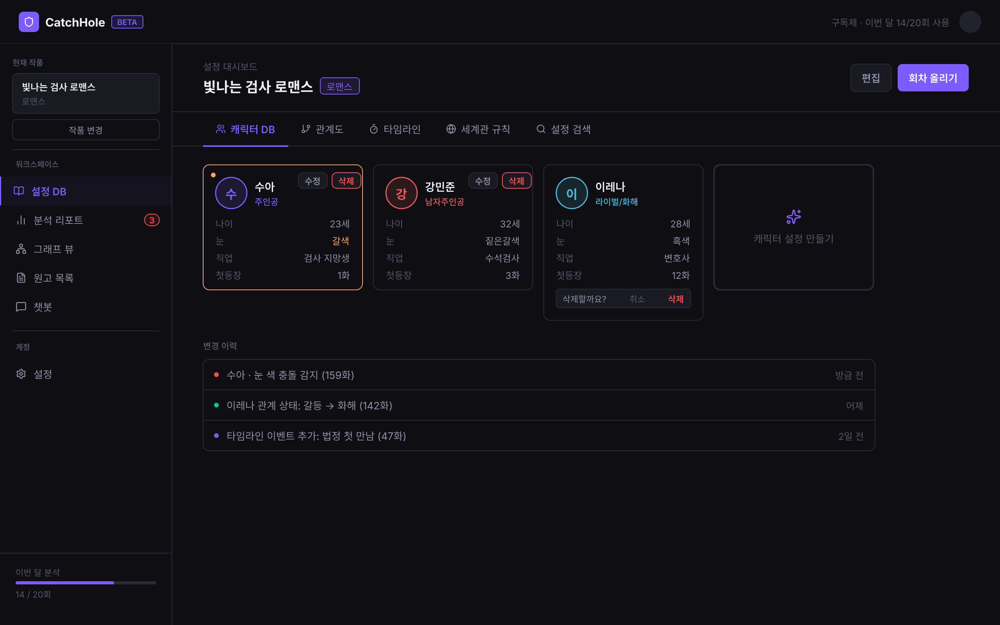

**1. 화면에 표시할 데이터**
- 캐릭터 카드 목록: 이름, 역할, 현재 나이/레벨, 주요 설정 요약

**2. 사용자 액션**
- 캐릭터 클릭 → [캐릭터 상세 모달](#캐릭터-상세-모달-chardetailmodal)
- 캐릭터 추가 → [설정 빌더 모달](#설정-빌더-모달)
- 검색 / 필터

**3. 화면 전환 식별자**
- `workId`, `characterId` (`?modal=char-detail&charId=`)

**4. 데이터 없음 / 실패 표시**
- 캐릭터 0개: 빈 상태 ([빈 상태](../screens/VFxs5.png))
- 조회 실패

**5. BE에 요청할 데이터**
- 작품 캐릭터 목록: 이름, 역할, 현재 나이, 현재 레벨, 프로필/스탯/스킬/아이템/상태

**6. BE와 협의할 범위·상태값**
- **캐릭터 조회 API 자체가 미구현** → 제공 형식
- 스탯/스킬/아이템/상태를 어떤 구조(JSON 등)로 내려줄지

---

## 설정DB 타임라인 탭

**URL**: [`/dashboard?nav=settingDB&tab=timeline`](https://catch-hole.vercel.app/dashboard?nav=settingDB&tab=timeline)

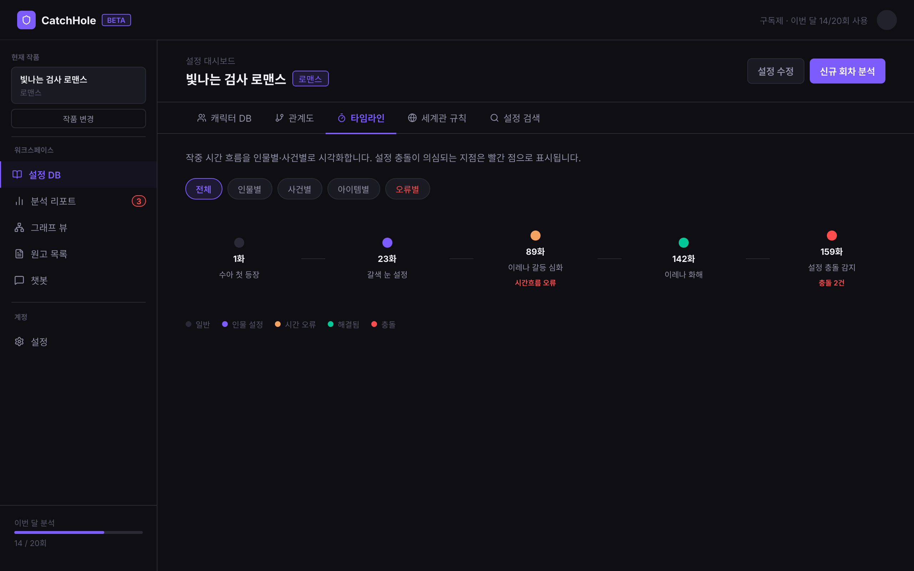

**1. 화면에 표시할 데이터**
- 회차별 사건·설정 변화 흐름 (시점 = 회차, 변화 내용)

**2. 사용자 액션**
- 타임라인 항목 클릭 → 상세 / 해당 회차로 이동

**3. 화면 전환 식별자**
- `workId`, `?tab=timeline`

**4. 데이터 없음 / 실패 표시**
- 이벤트 없음, 조회 실패

**5. BE에 요청할 데이터**
- 회차별 설정 변화 이벤트 (시점 회차, 대상 캐릭터/설정, 변화 내용)

**6. BE와 협의할 범위·상태값**
- 타임라인 이벤트 시점(회차) 표현 형식
- 어떤 변화(나이·관계·아이템·상태 등)를 이벤트로 집계할지

---

## 설정DB 세계관 규칙 탭

**URL**: [`/dashboard?nav=settingDB&tab=worldrules`](https://catch-hole.vercel.app/dashboard?nav=settingDB&tab=worldrules)

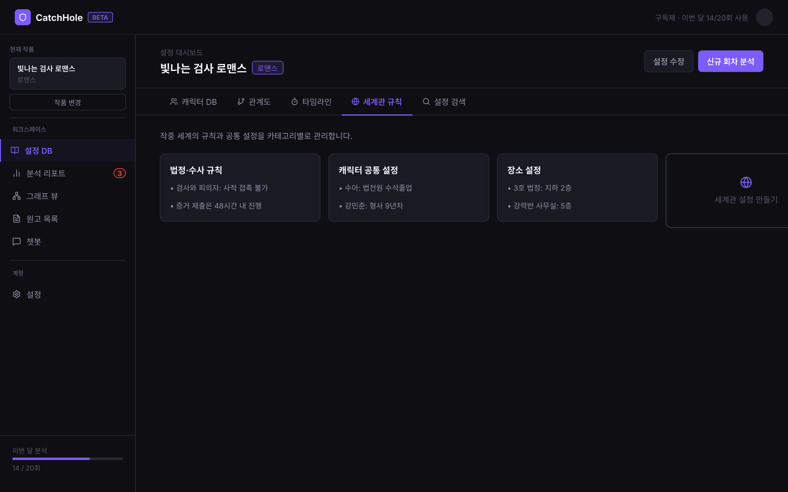

**1. 화면에 표시할 데이터**
- 세계관 규칙 목록 (예: 레벨링 규칙, 능력 체계)

**2. 사용자 액션**
- 규칙 추가/편집 → [세계관 빌더 모달](#세계관-빌더-모달)
- 규칙 클릭 → 상세

**3. 화면 전환 식별자**
- `workId`, `?tab=worldrules`

**4. 데이터 없음 / 실패 표시**
- 규칙 0개: 빈 상태, 조회 실패

**5. BE에 요청할 데이터**
- 세계관 규칙 목록: 제목, 내용, 적용 범위

**6. BE와 협의할 범위·상태값**
- 규칙 구조 (자유 텍스트 vs 구조화)
- 수치 규칙(레벨링 등)을 어떻게 표현할지

---

## 설정DB 검색 탭

**URL**: [`/dashboard?nav=settingDB&tab=search`](https://catch-hole.vercel.app/dashboard?nav=settingDB&tab=search)

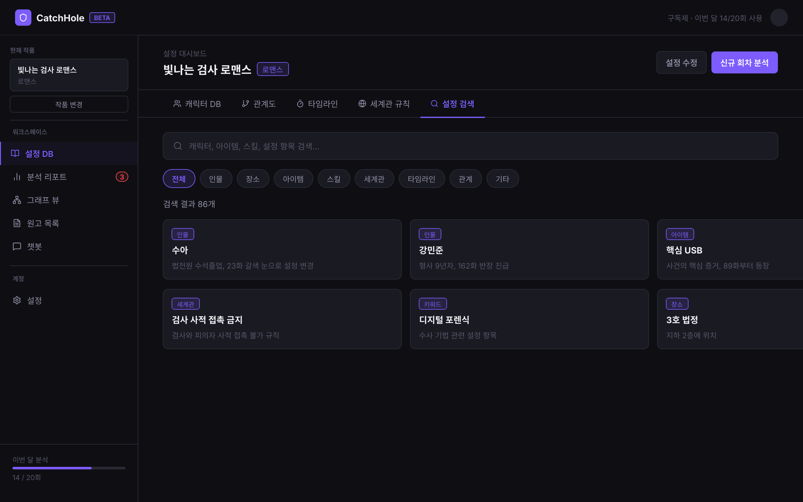

**1. 화면에 표시할 데이터**
- 통합 검색 결과 (캐릭터·아이템·규칙·타임라인 등 교차)

**2. 사용자 액션**
- 검색어 입력, 결과 클릭 → 해당 항목으로 이동

**3. 화면 전환 식별자**
- `workId`, `?tab=search`, 검색어

**4. 데이터 없음 / 실패 표시**
- 검색 결과 없음

**5. BE에 요청할 데이터**
- 설정 통합 검색: 검색어 → 매칭 항목(유형·이름·요약)

**6. BE와 협의할 범위·상태값**
- 검색 범위·방식 (서버 검색 vs 클라이언트 필터)
- 인덱싱 대상 (어떤 설정 유형까지 검색되는지)

---

## 캐릭터 상세 모달 (CharDetailModal)

**URL**: [`?modal=char-detail&charId=...`](https://catch-hole.vercel.app/dashboard?nav=settingDB&tab=characters)

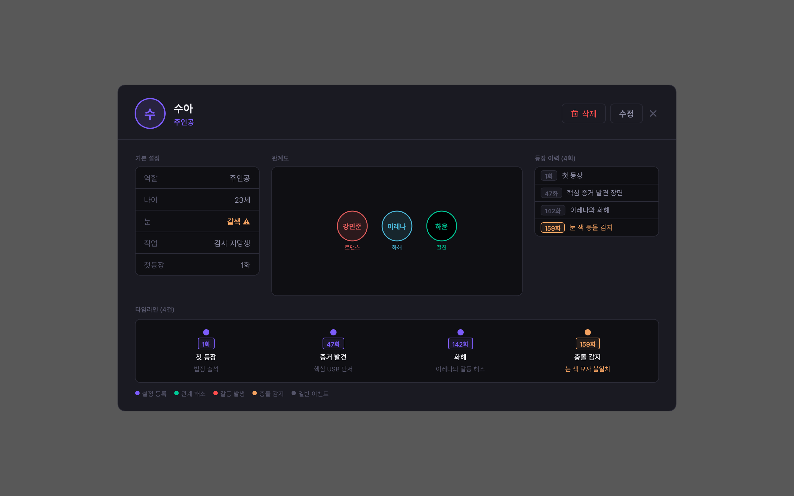

**1. 화면에 표시할 데이터**
- 캐릭터 프로필, 스탯/스킬/아이템/상태
- 설정 변경 이력 (회차별)

**2. 사용자 액션**
- 편집, 삭제(확인 모달 [x2KHG](../screens/x2KHG.png))

**3. 화면 전환 식별자**
- `charId` (`?modal=char-detail&charId=`)

**4. 데이터 없음 / 실패 표시**
- 조회 실패

**5. BE에 요청할 데이터**
- 캐릭터 상세 + 설정 이력(`CharacterFact`: 유형·키·값·근거 회차·확정 여부)

**6. BE와 협의할 범위·상태값**
- 캐릭터 수정/삭제 API
- 설정 이력의 시점(회차) 표현 방식

---

## 설정 검토 (SSettingReview)

**URL**: [`/setting-review`](https://catch-hole.vercel.app/setting-review)

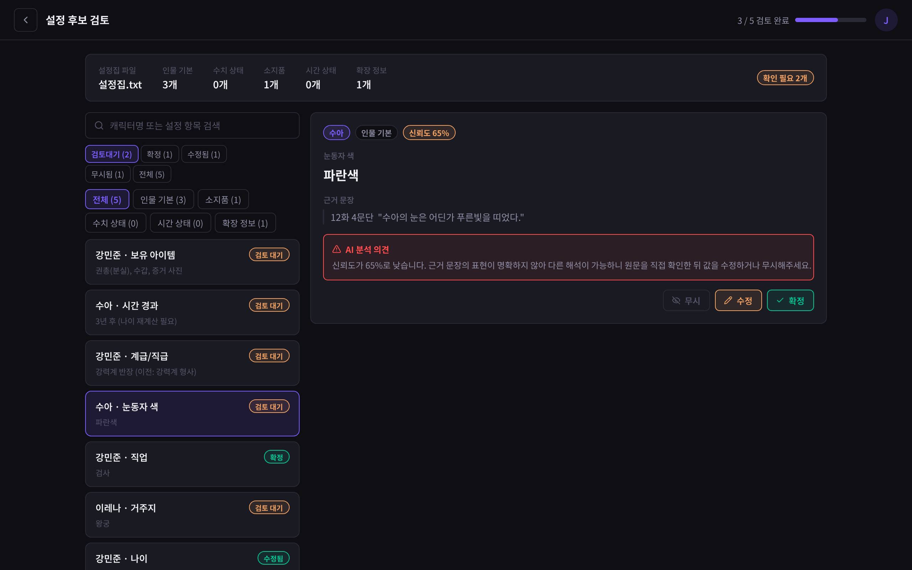

회차 업로드(설정 구축 목적) 후 AI가 추출한 설정 후보를 사용자가 확정/수정/무시한다.

> BE [#40](https://github.com/catchhole-soma/catchhole-backend-java/pull/40)에서 조회/수정 API가 구현됨(`GET`·`PATCH /api/v1/works/{workId}/setting-candidates`, [NVM-140](https://aiswmproject.atlassian.net/browse/NVM-140)). 응답은 `SettingCandidateResponse` **단일 DTO**이며, BE는 "목록/상세에 각각 필요한 필드가 확정되면 `SummaryResponse`/`DetailResponse`로 분리"를 제안. 아래 5·6번이 그 답이다.

**1. 화면에 표시할 데이터**
- 설정 후보 목록: 대상명, 설정 키, 값, 검토 상태
- 상세: 위 + 설정 유형, 신뢰도, 근거 문장(회차·문단·인용)
- 검토 진행도, 필터(상태/유형), 검색

**2. 사용자 액션**
- 확정 / 수정 / 무시 / 되돌리기
- 필터·검색, 설정집 다시 분석
- 회차 검사 시작 → [대시보드](./work.md#대시보드-s1dashboard)

**3. 화면 전환 식별자**
- `episodeId`(들) (검토 대상), `candidateId` (`?candidate=`)

**4. 데이터 없음 / 실패 표시**
- 후보 0개: 빈 상태 ([빈 상태](../screens/DhkMk.png))

**5. BE에 요청할 데이터 — 목록/상세 필드 분리**

`SettingCandidateResponse`(BE #40) 필드를 목록·상세 화면이 실제로 쓰는지 정리. (화면 근거: `src/app/components/catchhole/SSettingReview.tsx`)

| BE 필드 | 목록 | 상세 | FE 화면 매핑 |
| --- | :-: | :-: | --- |
| `id` | ✅ | ✅ | 후보 선택 식별 |
| `entityName` | ✅ | ✅ | 대상명 ("수아") |
| `attributeName` | ✅ | ✅ | 설정 키 ("눈동자 색") |
| `attributeValue` | ✅ | ✅ | 값 ("파란색") |
| `reviewStatus` | ✅ | ✅ | 상태 뱃지 |
| `confidence` | — | ✅ | 신뢰도 (목록 미표시) |
| `evidenceSpans` | — | ✅ | 근거 문장 |
| `entityType` | (필터) | ✅ | ※ 6번 협의 ③ 참고 |
| `valueJson` | — | (후속) | 구조화 값 — 6번 협의 ② |
| `rawAiResultJson` | — | — | FE 전혀 미사용 |
| `sourceChunkId`·`analysisJobId`·`valueType`·`createdAt`·`updatedAt` | — | — | 화면 표시 안 함 |

→ **목록 응답 분리 가능**: 목록은 `valueJson`·`evidenceSpans`·`rawAiResultJson`을 빼고 위 ✅ 필드만 내려도 충분.

검토 결과 저장(`PATCH`): 확정 / 수정값(`attributeValue`) / 무시. FE는 `attributeValue` 문자열만 전송(아래 협의 ② 참고).

**6. BE와 협의할 범위·상태값**

1. **`evidenceSpans` JSON 구조** — 현재 응답 타입이 `Object`(키 미정). 화면은 "159화 12문단 '인용'"을 그리므로 아래 모양으로 합의 제안:
   ```json
   "evidenceSpans": [
     { "episodeNumber": 159, "paragraph": 12, "quote": "수아는 파란 눈을…", "charStart": 0, "charEnd": 24 }
   ]
   ```
   배열로 받고 FE는 첫 항목 표시(현재 FE 타입은 `evidenceChunk` 단수). **회차 번호 동시 해결** — 응답엔 `episodeId`(UUID)만 있고 화면의 "159화" 숫자가 없으니 `episodeNumber`를 이 안에 포함.
2. **`valueJson` 표준 (값 표시 방식)** — 표시·편집은 MVP에서 `attributeValue`(문자열)로. 단 `보유 아이템`처럼 목록형 값이 있고(판타지 스킬/능력치 확장 시 급증) **목록형 값은 배열로** 내려주는 표준을 지금 합의. 값 표시 UI 3안:
   - **A** 콤마 문자열 한 줄(현행) — `attributeValue` 문자열
   - **B(권장)** 칩/태그 목록 — `valueJson` 배열, 항목별 편집
   - **C** 구조화 표(스탯 대응) — `valueJson` 객체

   (시각 시안 A/B/C는 `design/catchhole.pen`에 작성 예정)
3. **FE 카테고리 탭 ↔ BE `entityType` 축 불일치** — FE 필터는 설정 유형 5종(`SettingCandidateType`: 기본/수치/보유/시간/확장)인데 BE 응답 `entityType`은 `CHARACTER`/`ITEM`… 축이라 그대로 매핑 불가. 속성 분류 필드 추가 또는 매핑 규칙 협의 필요.

> 상태값 참고: `EDITED`는 FE 전용 상태(저장 시 `CONFIRMED`로 매핑, `types.ts`)라 별도 협의 불필요. 확정/무시 상태 전이와 `CharacterFact` 반영은 BE 후속 PR.

---

## 설정 빌더 모달

캐릭터를 직접 입력하거나 원고에서 추출해 설정DB를 구축하는 모달. 같은 모달의 상태 흐름이다.

| 상태 | 캡처 |
| --- | --- |
| 초기(데모) | 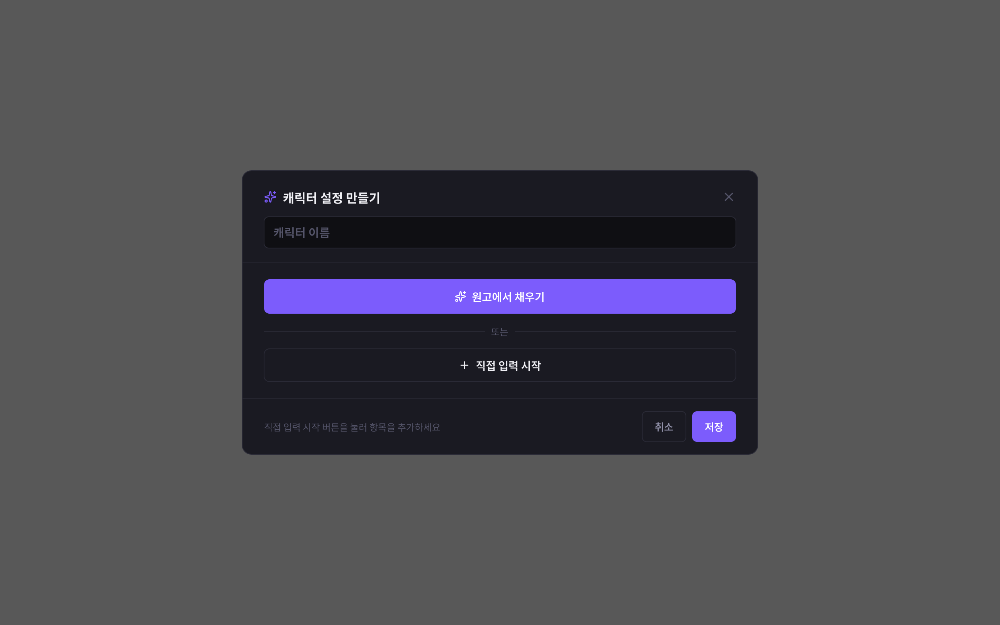 |
| 직접 입력 | 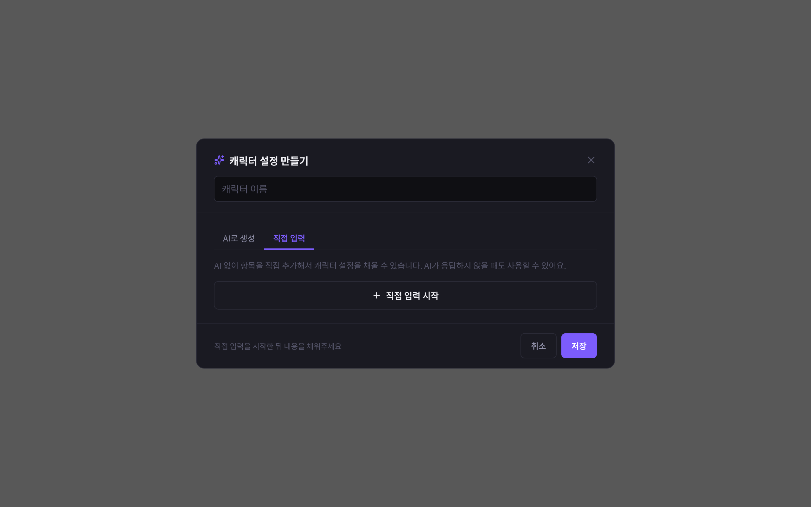 |
| 원고 분석 중 | 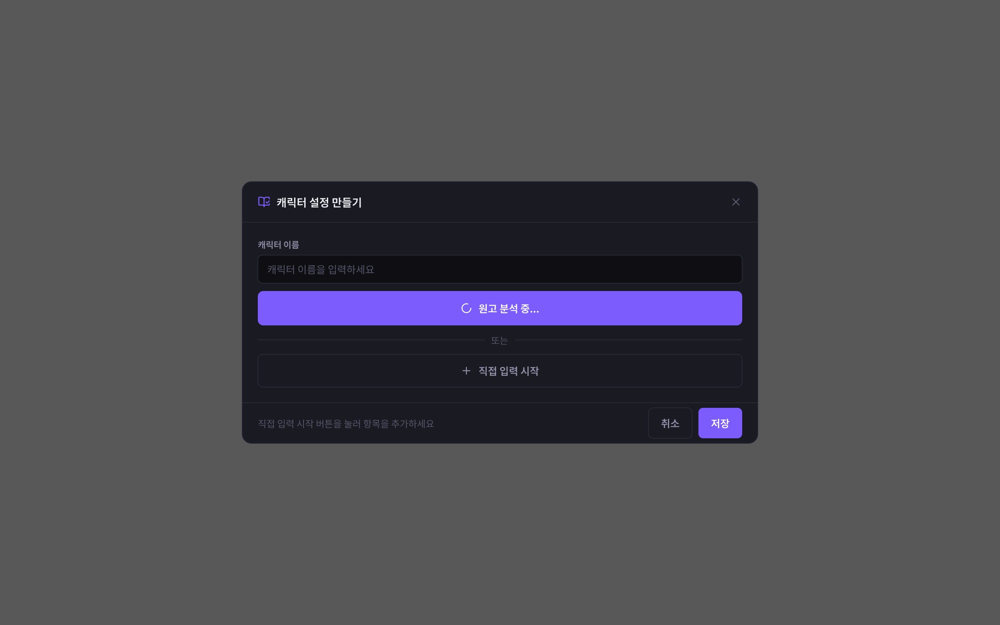 |
| 원고 추출 후(수용 UX) | 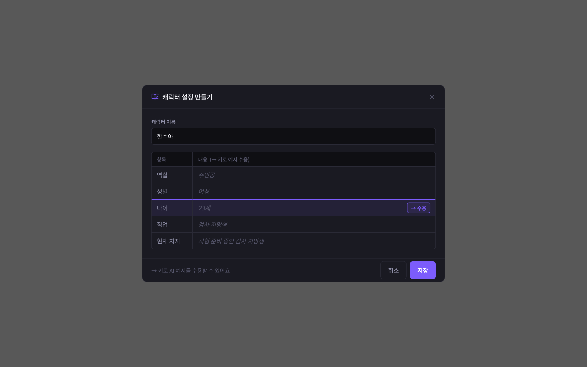 |

**1. 화면에 표시할 데이터**
- 직접 입력 폼(캐릭터 항목), 또는 원고 추출 진행 상태·추출 결과 후보

**2. 사용자 액션**
- 항목 입력·수정, 원고에서 추출, 추출 결과 수용/수정, 저장

**3. 화면 전환 식별자**
- `workId`, (편집 시) `characterId`

**4. 데이터 없음 / 실패 표시**
- 추출 결과 없음, 저장 실패

**5. BE에 요청할 데이터**
- 직접 입력 항목 저장 API
- 원고 추출 요청 → 추출 후보 결과

**6. BE와 협의할 범위·상태값**
- 직접 입력과 AI 추출 결과를 같은 저장 경로로 둘지
- 원고 추출 트리거·결과 형식 ([설정 검토](#설정-검토-ssettingreview)와 공유 여부)

---

## 세계관 빌더 모달

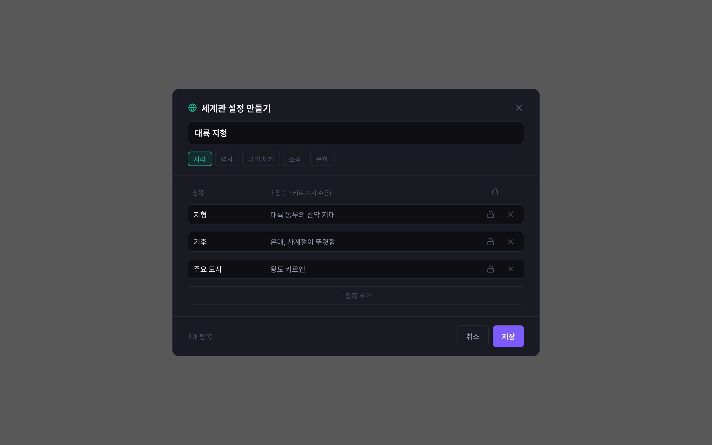

**1. 화면에 표시할 데이터**
- 세계관 규칙 입력 폼

**2. 사용자 액션**
- 규칙 입력·수정, 저장

**3. 화면 전환 식별자**
- `workId`

**4. 데이터 없음 / 실패 표시**
- 저장 실패

**5. BE에 요청할 데이터**
- 세계관 규칙 저장 API

**6. BE와 협의할 범위·상태값**
- 규칙 데이터 모델 ([설정DB 세계관 규칙 탭](#설정db-세계관-규칙-탭)과 동일 구조)
