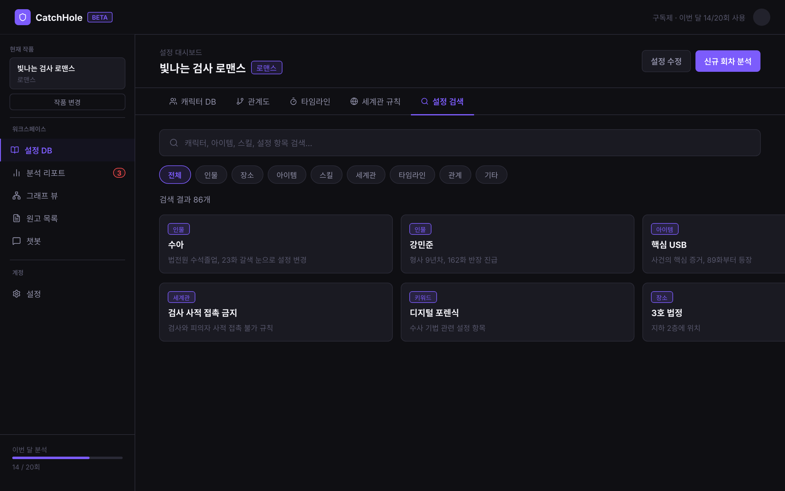
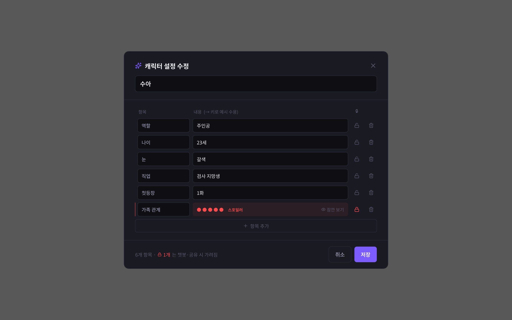
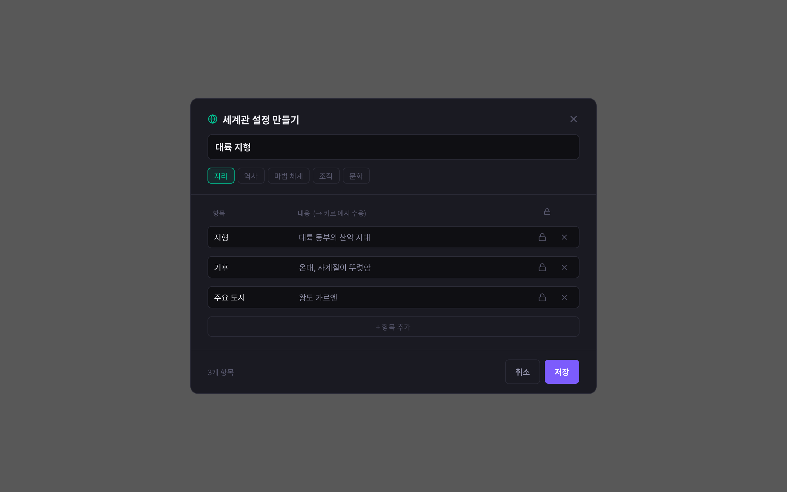

# 데이터 요구사항 — Character(설정/캐릭터)

[← 전체 인덱스](./README.md)

> 설정 후보(검토) API 계약은 [BE character.md](https://github.com/catchhole-soma/catchhole-backend-java/blob/main/docs/character.md) 기준. 캐릭터 목록/상세/CRUD API는 제공 형식 협의가 필요하다(각 화면 참고).

## 목차

- [설정DB 캐릭터 탭](#설정db-캐릭터-탭)
- [설정DB 타임라인 탭](#설정db-타임라인-탭)
- [설정DB 세계관 규칙 탭](#설정db-세계관-규칙-탭)
- [설정DB 검색 탭](#설정db-검색-탭)
- [캐릭터 상세 모달 (CharDetailModal)](#캐릭터-상세-모달-chardetailmodal)
- [설정 검토 (SSettingReview)](#설정-검토-ssettingreview)
- [설정 빌더 모달](#설정-빌더-모달)
- [세계관 빌더 모달](#세계관-빌더-모달)

---

## 설정DB 캐릭터 탭

**URL**: [`/dashboard?nav=settingDB&tab=characters`](https://www.catchhole.com/dashboard?nav=settingDB&tab=characters)

**1. 화면에 표시할 데이터**
- 캐릭터 카드 목록 (MVP 4필드): 이름, 나이, 직업, 첫 등장 회차 — 장르별 중요값 차등 노출은 MVP 이후

**2. 사용자 액션**
- 캐릭터 클릭 → [캐릭터 상세 모달](#캐릭터-상세-모달-chardetailmodal)
- 캐릭터 추가 → [설정 빌더 모달](#설정-빌더-모달)
- 검색 / 필터

**3. 화면 전환 식별자**
- `workId`, `characterId` (`?modal=char-detail&charId=`)

**4. 데이터 없음 / 실패 표시**
- 캐릭터 0개: 빈 상태 ([빈 상태](../screens/VFxs5.png))
- 조회 실패

**5. BE에 요청할 데이터**
- 작품 캐릭터 목록: 카드 표시용 4필드(이름·나이·직업·첫 등장 회차 번호) + 상세용 프로필/스탯/스킬/아이템/상태 — 캐릭터 목록 API는 현행 계약에 없어 신설 필요. 이게 정해져야 FE가 캐릭터 탭을 연동할 수 있음

**6. BE와 협의할 범위·상태값**
- 캐릭터 목록 조회 API 제공 형식 (BE character.md "이후 작업" 항목)
- 역할(`roleLabel`) 노출 여부 — 필드는 있으나 설정 추출이 역할(주인공/라이벌 등)을 고정적으로 가져오지 않아 후속 논의
- 스탯/스킬/아이템/상태 JSON 구조 — 작품별 key 관리 방식은 [NVM-228](https://aiswmproject.atlassian.net/browse/NVM-228) 결정·[NVM-230](https://aiswmproject.atlassian.net/browse/NVM-230) schema 구현과 연동

---

## 설정DB 타임라인 탭

**URL**: [`/dashboard?nav=settingDB&tab=timeline`](https://www.catchhole.com/dashboard?nav=settingDB&tab=timeline)

> **MVP 범위 아님** — MVP 이후 구현 시 현 화면 형태(회차 + 설명) 유지.

**1. 화면에 표시할 데이터**
- 회차별 사건·설정 변화 흐름 (시점 = 회차, 변화 내용)

**2. 사용자 액션**
- 타임라인 항목 클릭 → 상세 / 해당 회차로 이동

**3. 화면 전환 식별자**
- `workId`, `?tab=timeline`

**4. 데이터 없음 / 실패 표시**
- 이벤트 없음, 조회 실패

**5. BE에 요청할 데이터**
- 회차별 설정 변화 이벤트 (시점 회차, 대상 캐릭터/설정, 변화 내용)

**6. BE와 협의할 범위·상태값**
- 없음 (MVP 이후 — 구현 시 방향 합의됨: 회차+설명 형태, 축은 전체/캐릭터별/중요 사건별 3종, 아이템별은 고도화 검토, 오류별은 제외)

---

## 설정DB 세계관 규칙 탭

**URL**: [`/dashboard?nav=settingDB&tab=worldrules`](https://www.catchhole.com/dashboard?nav=settingDB&tab=worldrules)

> **MVP 범위 아님** — 세계관 요약·규칙 구조화 화면은 MVP 이후. MVP에서 업로드한 설정집 확인은 [원고 목록(대시보드 원고 탭)](./episode.md#원고-목록-대시보드-원고-탭)의 설정집 표시(제목 → 원문 보기)로 대신한다.

**1. 화면에 표시할 데이터**
- 세계관 규칙 목록 (예: 레벨링 규칙, 능력 체계)

**2. 사용자 액션**
- 규칙 추가/편집 → [세계관 빌더 모달](#세계관-빌더-모달)
- 규칙 클릭 → 상세

**3. 화면 전환 식별자**
- `workId`, `?tab=worldrules`

**4. 데이터 없음 / 실패 표시**
- 규칙 0개: 빈 상태, 조회 실패

**5. BE에 요청할 데이터**
- 세계관 규칙 목록: 제목, 내용, 적용 범위

**6. BE와 협의할 범위·상태값**
- 세계관 규칙은 BE 모델/API 신설이 선행돼야 함([NVM-211](https://aiswmproject.atlassian.net/browse/NVM-211)) — 구조화 규칙 화면이 MVP 이후로 조정되면서 티켓 우선순위도 함께 재확인 필요
- MVP 이후: 공통 고정 템플릿(캐릭터 공통 규칙·현재 장소 목록·아이템 총 목록 및 규칙 등)으로 구조화 입력해 오류 판단 근거로 활용 — 규칙 표현 형식(자유 텍스트 vs 구조화, 수치 규칙 표현)은 그때 확정

---

## 설정DB 검색 탭

**URL**: [`/dashboard?nav=settingDB&tab=search`](https://www.catchhole.com/dashboard?nav=settingDB&tab=search)

**1. 화면에 표시할 데이터**
- 통합 검색 결과 (캐릭터·아이템·규칙·타임라인 등 교차)

**2. 사용자 액션**
- 검색어 입력, 결과 클릭 → 해당 항목으로 이동

**3. 화면 전환 식별자**
- `workId`, `?tab=search`, 검색어

**4. 데이터 없음 / 실패 표시**
- 검색 결과 없음

**5. BE에 요청할 데이터**
- 설정 통합 검색: 검색어 → 매칭 항목(유형·이름·요약)

**6. BE와 협의할 범위·상태값**
- 검색 범위·방식 (서버 검색 vs 클라이언트 필터)
- 인덱싱 대상 (어떤 설정 유형까지 검색되는지)

---

## 캐릭터 상세 모달 (CharDetailModal)

**URL**: [`?modal=char-detail&charId=...`](https://www.catchhole.com/dashboard?nav=settingDB&tab=characters)

**1. 화면에 표시할 데이터**
- 캐릭터 프로필, 스탯/스킬/아이템/상태
- 설정 변경 이력 (회차별)

**2. 사용자 액션**
- 편집, 삭제 ([확인 모달](../screens/x2KHG.png))

**3. 화면 전환 식별자**
- `charId` (`?modal=char-detail&charId=`)

**4. 데이터 없음 / 실패 표시**
- 조회 실패

**5. BE에 요청할 데이터**
- 캐릭터 상세 + 설정 이력(`CharacterFact`: 유형·키·값·근거 회차·확정 여부) — 유형은 `CharacterFactType`(`AGE`/`LEVEL`/`STAT`/`SKILL`/`ITEM`/`STATUS`/`TIME`)

**6. BE와 협의할 범위·상태값**
- 캐릭터 수정/삭제 API
- 설정 이력의 시점(회차) 표현 방식

---

## 설정 검토 (SSettingReview)

**URL**: [`/setting-review`](https://www.catchhole.com/setting-review)

회차 업로드(설정 구축 목적) 후 AI가 추출한 설정 후보를 사용자가 확정/수정/무시한다.

**1. 화면에 표시할 데이터**
- 설정 후보 목록: 캐릭터명(`entityName`), 원문 표현(`rawEntityMention`), 속성명(`attributeName`), 값(`attributeValue`/`valueJson`), 신뢰도(`confidence`), 검토 상태(`reviewStatus`: `PENDING_REVIEW`/`CONFIRMED`/`DISMISSED`)
- 캐릭터 매칭 상태(`matchStatus`: `MATCHED`/`UNRESOLVED`/`AMBIGUOUS`) — `AMBIGUOUS`는 "연결할 캐릭터가 확실하지 않음" 안내
- 근거 문장(`evidenceSpans`): 회차·문단·인용
- 검토 진행도, 필터(상태/유형), 검색

**2. 사용자 액션**
- 확정(confirm) / 수정 / 무시(dismiss) / 되돌리기
- 캐릭터 연결 해소: `AMBIGUOUS` 후보(또는 대상을 바꾸고 싶은 후보)를 "기존 캐릭터에 연결" 또는 "새 캐릭터로 확정" (`character-match` API)
- 필터·검색, 설정집 다시 분석
- 회차 검사 시작 → [대시보드](./work.md#대시보드-s1dashboard)

**3. 화면 전환 식별자**
- `episodeId`(들) (검토 대상), `candidateId` (`?candidate=`)

**4. 데이터 없음 / 실패 표시**
- 후보 0개: 빈 상태 ([빈 상태](../screens/DhkMk.png))

**5. BE에 요청할 데이터**
- 설정 후보 목록/상세 조회·수정·확정·무시·캐릭터 연결 해소 — API 계약은 [BE character.md](https://github.com/catchhole-soma/catchhole-backend-java/blob/main/docs/character.md)의 `/works/{workId}/setting-candidates` 계열 기준
- 목록(카드 리스트) 응답에 필요한 필드:
  - 식별: `id`, 회차(`episodeId` — **`episodeNo` 추가 요청**)
  - 캐릭터: 캐릭터명(`entityName`), 원문 표현(`rawEntityMention`), 매칭 상태(`matchStatus`)
  - 설정 값: 속성명(`attributeName`), 표시용 값(`attributeValue`), 값 타입(`valueType`)
  - 검토: 신뢰도(`confidence`), 검토 상태(`reviewStatus`)
  - 구조화 값(`valueJson`), 근거 문장(`evidenceSpans`), AI 원본(`rawAiResultJson`, 디버깅용)은 **목록에서 빼기**
- 상세 응답: **현행 계약 그대로** + 회차 번호 표시용 **`episodeNo` 추가 요청** (목록과 동일)

**6. BE와 협의할 범위·상태값**
- 목록 요약 응답 분리 + 회차 번호(`episodeNo`) 추가 — FE 필요 필드는 5번에 확정, BE 확인 대기 (BE 문서 "설정 후보 조회 응답 후속 TODO"와 동일 논의)
- 수정은 `PENDING_REVIEW` 상태에서만 가능, 수정 필드는 `attributeName`/`attributeValue`/`valueType`/`valueJson`/`evidenceSpans` 5개로 확정 — 확정/무시 후 재오픈("되돌리기")은 미지원이므로 FE UX를 어떻게 둘지 협의
- `AMBIGUOUS` 후보는 연결 해소 전 confirm 거절(409) — 화면 안내 문구·흐름
- 확정 시 `CharacterFact`·현재 스냅샷 반영 정책은 BE 확정(문서 참고) — AI Worker 분석 결과 value 반영 정책([NVM-229](https://aiswmproject.atlassian.net/browse/NVM-229), 선행: [NVM-233](https://aiswmproject.atlassian.net/browse/NVM-233) schema 기반 snapshot 병합)만 미결. 결정에 따라 캐릭터 카드의 상태·아이템·스킬이 단일 값이냐 누적 목록이냐가 갈림
- 신뢰도(confidence) 표기 방식

---

## 설정 빌더 모달

캐릭터를 직접 입력해 설정DB를 구축하는 모달. 원고 기반 추출은 이 모달이 아니라 [회차 업로드](./upload.md#회차-업로드-sepisodeupload) → [설정 검토](#설정-검토-ssettingreview) 플로우가 담당한다.

**1. 화면에 표시할 데이터**
- 직접 입력 폼(캐릭터 항목)

**2. 사용자 액션**
- 항목 입력·수정, 저장

**3. 화면 전환 식별자**
- `workId`, (편집 시) `characterId`

**4. 데이터 없음 / 실패 표시**
- 저장 실패

**5. BE에 요청할 데이터**
- 직접 입력 항목 저장 API

**6. BE와 협의할 범위·상태값**
- 직접 입력 항목과 [설정 검토](#설정-검토-ssettingreview)에서 확정된 추출 설정을 같은 저장 경로(`CharacterFact`)로 둘지

---

## 세계관 빌더 모달

**1. 화면에 표시할 데이터**
- 세계관 규칙 입력 폼

**2. 사용자 액션**
- 규칙 입력·수정, 저장

**3. 화면 전환 식별자**
- `workId`

**4. 데이터 없음 / 실패 표시**
- 저장 실패

**5. BE에 요청할 데이터**
- 세계관 규칙 저장 API

**6. BE와 협의할 범위·상태값**
- 규칙 데이터 모델 ([설정DB 세계관 규칙 탭](#설정db-세계관-규칙-탭)과 동일 구조)

