# 데이터 요구사항 — Character(설정/캐릭터)

[← 전체 인덱스](./README.md)

> 설정 후보(검토) API 계약은 [BE character.md](https://github.com/catchhole-soma/catchhole-backend-java/blob/main/docs/character.md) 기준. 캐릭터 목록/상세/CRUD API는 제공 형식 협의가 필요하다(각 화면 참고).

## 목차

- [설정DB 캐릭터 탭](#설정db-캐릭터-탭)
- [설정DB 타임라인 탭](#설정db-타임라인-탭)
- [설정DB 세계관 규칙 탭](#설정db-세계관-규칙-탭)
- [설정집 업로드 모달](#설정집-업로드-모달)
- [설정DB 검색 탭](#설정db-검색-탭)
- [설정DB 검색 결과 상세 모달](#설정db-검색-결과-상세-모달)
- [캐릭터 상세 모달 (CharDetailModal)](#캐릭터-상세-모달-chardetailmodal)
- [설정 검토 (SSettingReview)](#설정-검토-ssettingreview)
- [설정 빌더 모달](#설정-빌더-모달)
- [세계관 빌더 모달](#세계관-빌더-모달)

---

## 설정DB 캐릭터 탭

**URL**: [`/dashboard?nav=settingDB&tab=characters`](https://www.catchhole.com/dashboard?nav=settingDB&tab=characters)

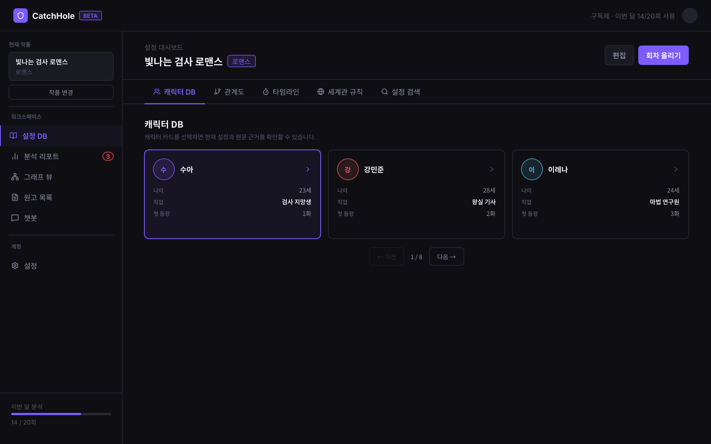

작품에 확정 등록된 캐릭터의 현재 대표 설정을 카드로 확인하고, 캐릭터 상세 정보로 진입하는 화면.

> **MVP 범위 메모**
> - 캐릭터 목록 조회와 캐릭터 상세 모달 진입만 지원한다.
> - 캐릭터 수정·삭제는 캐릭터 상세 모달 내부에서 진행한다.
> - 캐릭터 수동 추가와 분석 결과를 검토 없이 자동 등록하는 기능은 MVP 이후 지원한다. MVP에서는 원고 분석 결과의 설정 후보를 사용자가 검토·확정하여 캐릭터로 등록한다.
> - 최근 변경 이력은 MVP 이후 최근 변경 최대 20건을 표시하는 방향으로 구현한다.
> - 캐릭터 보관과 보관된 캐릭터 관리 기능은 MVP 이후 지원한다. 보관된 캐릭터는 캐릭터 설정 매칭과 오류 탐지 대상에서 제외한다.

> **카드 표시 정책**
> - 캐릭터 카드에는 이름·현재 나이·장르별 대표 속성·첫 등장 회차를 표시한다.
> - 장르별 대표 속성은 작품 장르에 따라 달라질 수 있다. 판타지·무협·게임 장르는 레벨, 로맨스·일상 장르는 직업 등을 우선 검토한다.
> - 이름은 필수값으로 표시한다.
> - 나이·장르별 대표 속성·첫 등장 회차가 없으면 `—`로 표시한다.
> - 첫 등장 회차 번호는 `{episodeNo}화` 형식으로 표시한다.
> - 캐릭터 이름의 첫 글자를 카드 프로필 이미지 대용으로 표시하며 FE에서 계산한다.

**1. 화면에 표시할 데이터**
- 캐릭터 카드 목록
  - 캐릭터 이름
  - 현재 나이
  - 장르별 대표 속성의 표시명과 현재값
  - 첫 등장 회차 번호

**2. 사용자 액션**
- 캐릭터 카드 선택 → [캐릭터 상세 모달](#캐릭터-상세-모달-chardetailmodal) 열기
- 빈 상태의 원고 분석 안내 버튼 선택 → [회차 업로드](./upload.md#회차-업로드-sepisodeupload) 이동
- 회차 올리기 → [회차 업로드](./upload.md#회차-업로드-sepisodeupload) 이동
- 다른 설정DB 탭 선택 → 선택한 탭으로 전환

캐릭터 수정·삭제는 목록에서 제공하지 않고 캐릭터 상세 모달에서 처리한다.

**3. 화면 전환 식별자**
- 현재 작품: `workId`
- 현재 탭: `nav=settingDB&tab=characters`
- 캐릭터 상세 모달: `?modal=char-detail&charId={characterId}`

**4. 데이터 없음 / 실패 표시**
- 목록 조회 중 로딩
- 등록된 캐릭터가 없으면 빈 상태 표시 ([빈 상태](../screens/VFxs5.png))
  - 안내 문구: `등록된 캐릭터가 없습니다`
  - 설명 문구: `원고를 분석하여 캐릭터를 추출해 보세요!`
  - 회차 업로드로 이동하는 `원고 분석하기` 버튼 제공
- 목록 조회 실패 시 오류 안내와 다시 시도 제공
- 나이·장르별 대표 속성·첫 등장 회차가 없으면 해당 값만 `—`로 표시
- 캐릭터 상세 조회 실패 시 모달 안에 오류 안내와 다시 시도 제공

**5. 화면 데이터 요구사항**

**5-1. BE → FE 제공 데이터 요구사항**
- 현재 작품에 등록된 캐릭터 목록
- 캐릭터별 카드 표시 데이터
  - 캐릭터 식별자
  - 이름
  - 현재 나이
  - 장르별 대표 속성의 표시명
  - 장르별 대표 속성의 현재값
  - 첫 등장 회차 번호
- 이름을 제외한 카드 값은 아직 확정값이 없으면 `null`
- 첫 등장 회차는 회차 식별자만이 아니라 화면에 표시할 회차 번호로 제공
- 장르별 대표 속성은 FE가 장르명을 보고 임의로 계산하지 않도록 표시명과 값을 함께 제공
- 캐릭터 상세 프로필·스탯·스킬·아이템·상태는 목록 응답에 포함하지 않고, 상세 모달을 열 때 해당 캐릭터의 상세 데이터로 조회

**5-2. FE → BE 전달 데이터 요구사항**
- 캐릭터 목록 조회 대상 작품의 `workId`
- 캐릭터 상세 조회 시 선택한 캐릭터의 `characterId`를 조회 대상으로 전달

목록 화면에서는 캐릭터 생성·수정·삭제 데이터를 전달하지 않는다.

**6. BE와 협의할 범위·상태값**
- 장르별 대표 속성을 결정하는 주체와 매핑 규칙(직업, 레벨 등)
  - 작품 장르에 따라 서버가 결정할지
  - 작품별 schema 설정을 기준으로 결정할지
  - 대표 속성의 schema key·표시명·값을 함께 제공할지
- 캐릭터 목록의 기본 정렬 기준과 페이징 적용 여부

---

## 설정DB 타임라인 탭

**URL**: [`/dashboard?nav=settingDB&tab=timeline`](https://www.catchhole.com/dashboard?nav=settingDB&tab=timeline)

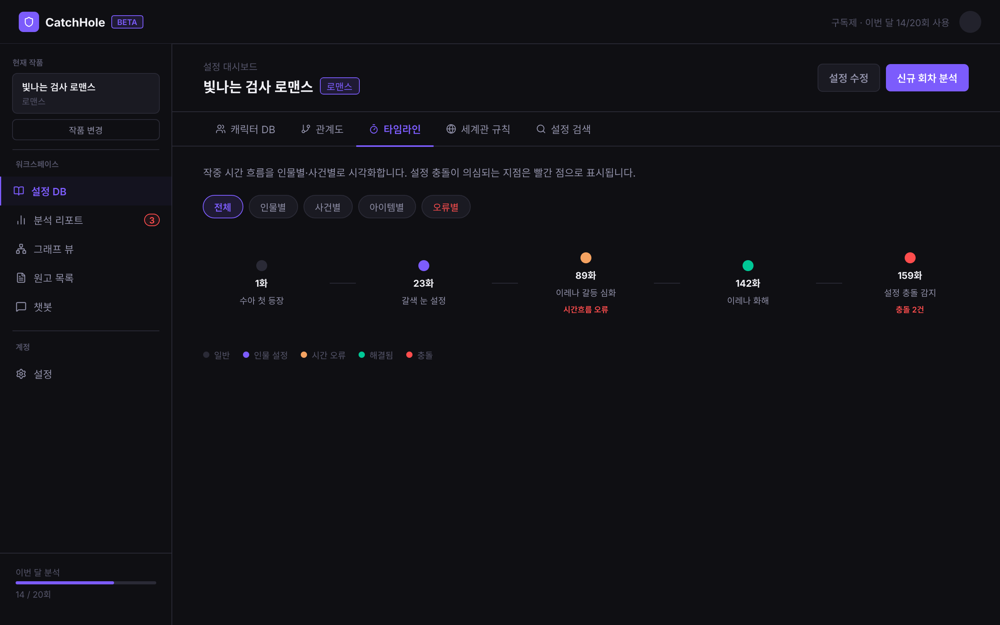

> **MVP 범위 아님** — MVP 이후 구현 시 현 화면 형태(회차 + 설명) 유지.

**1. 화면에 표시할 데이터**
- 회차별 사건·설정 변화 흐름 (시점 = 회차, 변화 내용)

**2. 사용자 액션**
- 타임라인 항목 클릭 → 상세 / 해당 회차로 이동

**3. 화면 전환 식별자**
- `workId`, `?tab=timeline`

**4. 데이터 없음 / 실패 표시**
- 이벤트 없음, 조회 실패

**5. BE에 요청할 데이터**
- 회차별 설정 변화 이벤트 (시점 회차, 대상 캐릭터/설정, 변화 내용)

**6. BE와 협의할 범위·상태값**
- 없음 (MVP 이후 — 구현 시 방향 합의됨: 회차+설명 형태, 축은 전체/캐릭터별/중요 사건별 3종, 아이템별은 고도화 검토, 오류별은 제외)

---

## 설정DB 세계관 규칙 탭

**URL**: [`/dashboard?nav=settingDB&tab=worldrules`](https://www.catchhole.com/dashboard?nav=settingDB&tab=worldrules)

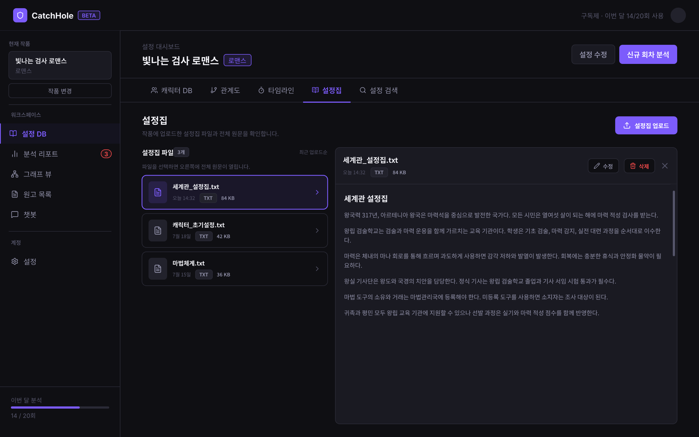

사용자가 작품에 업로드한 설정집 목록을 확인하고, 선택한 설정집의 전체 원문을 조회하는 화면.

> **MVP 범위 메모**
> - `SETTING_BOOK` 역할로 업로드된 설정집의 목록과 원문 조회만 지원한다.
> - 설정집에 대한 AI 분석·요약과 세계관 규칙 추출·구조화는 지원하지 않는다.
> - 현재 캡처의 카테고리별 세계관 규칙 카드와 `세계관 설정 만들기` 기능은 MVP 이후 목표 화면이다.
>
> **MVP 이후 범위**
> - 설정집과 회차 원문에서 세계관 규칙 추출
> - 법칙·사회 규칙, 캐릭터 공통 설정, 장소 설정 등 카테고리별 분류
> - 세계관 규칙 카드 목록과 상세 조회
> - 세계관 규칙 직접 생성·수정·삭제

> **표시 정책**
> - 설정집 이름 대신 업로드 당시의 원본 파일명을 표시한다.
> - 설정집 목록은 최근 업로드순으로 표시한다.
> - 처음 진입하면 설정집을 선택하지 않고 파일 목록을 전체 너비로 표시한다.
> - 사용자가 파일을 선택하면 목록과 원문 영역으로 화면을 분할하고 해당 설정집 원문을 불러온다.
> - 원문 영역을 닫으면 선택을 해제하고 파일 목록만 표시하는 화면으로 돌아간다.
> - 동일한 원본 파일명의 설정집을 다시 업로드해도 기존 파일을 덮어쓰지 않고 새로운 설정집 파일로 누적한다.

**1. 화면에 표시할 데이터**
- 설정집 파일 목록
  - 원본 파일명
  - 업로드 시각
  - 파일 형식
  - 파일 크기
- 파일 선택 시 표시하는 원문 영역
  - 현재 선택된 설정집 표시
  - 선택한 설정집의 원본 파일명과 업로드 정보
  - 선택한 설정집의 전체 원문
  - 수정·삭제 버튼
  - 원문 영역 닫기 버튼

**2. 사용자 액션**
- 설정집 파일 선택 → 목록·원문 분할 화면으로 전환하고 해당 설정집 원문 조회
- 수정 선택 → 원문 편집 모드로 전환하고 저장 시 수정 내용 반영
- 삭제 선택 → 삭제 확인 후 설정집 삭제, 선택 해제 및 파일 목록 새로고침
- 원문 영역 닫기 → 선택을 해제하고 파일 목록 전용 화면으로 복귀
- 설정집 업로드 선택 → [설정집 업로드 모달](#설정집-업로드-모달) 열기
- 긴 설정집 원문 스크롤
- 다른 설정DB 탭 선택 → 선택한 탭으로 전환

**3. 화면 전환 식별자**
- 현재 작품: `workId`
- 현재 탭: `nav=settingDB&tab=worldrules`
- 선택한 설정집 파일: `settingBookFileId` (`UploadFile.id`)
- 설정집 업로드 모달: `?modal=setting-book-upload`

**4. 데이터 없음 / 실패 표시**
- 설정집 목록 조회 중 로딩
- 업로드된 설정집이 없으면 빈 상태 표시
  - 안내 문구: `업로드된 설정집이 없습니다`
  - 설명 문구: `설정집을 업로드하면 이곳에서 원문을 확인할 수 있습니다.`
  - [설정집 업로드 모달](#설정집-업로드-모달)을 여는 `설정집 업로드하기` 버튼 제공
- 설정집 목록 조회 실패 시 오류 안내와 다시 시도 제공
- 선택한 설정집 원문 조회 중 로딩
- 원문 조회 실패 시 기존 목록을 유지하고 원문 영역에 오류 안내와 다시 시도 제공
- 원문 수정 실패 시 편집 내용과 원문 영역을 유지하고 다시 시도 제공
- 설정집 삭제 전 확인 안내, 삭제 실패 시 기존 목록과 선택 상태 유지

**5. 화면 데이터 요구사항**

**5-1. BE → FE 제공 데이터 요구사항**
- 현재 작품에 업로드된 `SETTING_BOOK` 파일 목록
- 설정집별 목록 표시 데이터
  - 설정집 파일 식별자(`UploadFile.id`)
  - 원본 파일명
  - MIME type
  - 파일 크기
  - 업로드 시각
- 설정집 목록은 최근 업로드순으로 제공하고, 없으면 빈 목록으로 제공
- 선택한 설정집의 전체 원문과 파일 메타데이터
- 설정집 원문은 S3 key나 내부 저장소 URL을 FE에 직접 노출하지 않고, 작품 소유권을 확인한 BE를 통해 제공
- 원문 수정·삭제 성공 여부와 갱신된 파일 메타데이터

**5-2. FE → BE 전달 데이터 요구사항**
- 설정집 목록 조회 대상 작품의 `workId`
- 설정집 원문 조회 시 선택한 파일의 `settingBookFileId`(`UploadFile.id`)를 조회 대상으로 전달
- 설정집 원문 수정 시 `workId`, `settingBookFileId`, 수정한 전체 원문 전달
- 설정집 삭제 시 `workId`, `settingBookFileId` 전달

설정집 파일 업로드 데이터는 [설정집 업로드 모달](#설정집-업로드-모달) 요구사항에서 다룬다.

**6. BE와 협의할 범위·상태값**
- MVP 원문 미리보기를 지원할 파일 형식 범위: `txt`만 표시할지, `docx`도 텍스트로 변환해 표시할지

---

## 설정집 업로드 모달

사용자가 회차 원고 없이 설정집 파일만 작품에 업로드하는 모달.

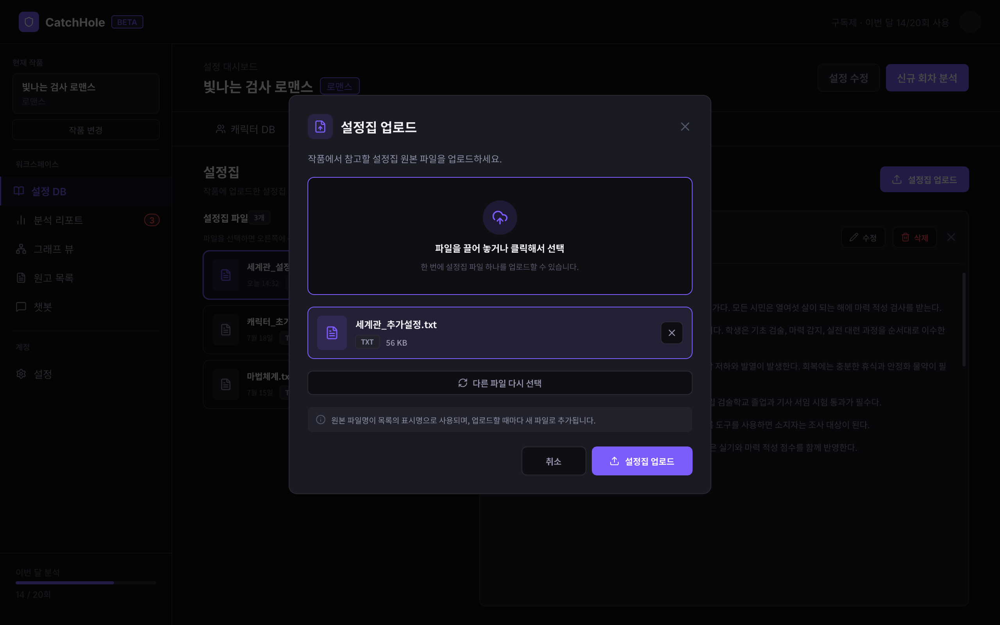

> **MVP 범위 메모**: 한 번에 설정집 파일 하나를 업로드한다. 설정집 이름을 별도로 입력하지 않고 원본 파일명을 화면 표시명으로 사용한다. 같은 작품에 동일한 파일명의 설정집을 다시 업로드해도 기존 파일을 덮어쓰지 않고 새 파일로 누적한다.

**1. 화면에 표시할 데이터**
- 모달 제목: `설정집 업로드`
- 파일 선택·드롭 영역
- 선택한 파일 정보
  - 원본 파일명
  - 파일 형식
  - 파일 크기
- 취소·업로드 버튼

**2. 사용자 액션**
- 설정집 파일 선택 또는 드래그 앤 드롭
- 선택한 파일 제거·다시 선택
- 업로드 선택 → 설정집 파일 업로드
- 업로드 성공 → 모달을 닫고 세계관 규칙 탭의 설정집 목록 새로고침
- 취소·닫기 선택 → 업로드하지 않고 세계관 규칙 탭으로 복귀

**3. 화면 전환 식별자**
- 업로드 대상 작품: `workId`
- 모달 상태: `?modal=setting-book-upload`

**4. 데이터 없음 / 실패 표시**
- 파일을 선택하지 않으면 업로드 버튼 비활성
- 지원하지 않는 파일 형식
- 파일 크기 제한 초과
- 업로드 중 로딩·중복 제출 방지
- 업로드 실패 시 모달과 선택한 파일을 유지하고 다시 시도 제공

**5. 화면 데이터 요구사항**

**5-1. BE → FE 제공 데이터 요구사항**
- 업로드 성공 시 생성된 설정집 파일 식별자(`UploadFile.id`)
- 업로드한 파일의 원본 파일명·MIME type·파일 크기·업로드 시각
- 업로드 실패 시 화면 안내에 사용할 실패 사유

**5-2. FE → BE 전달 데이터 요구사항**
- 업로드 대상 작품의 `workId`
- 사용자가 선택한 설정집 원본 파일

**6. BE와 협의할 범위·상태값**
- MVP에서 업로드를 허용할 파일 형식과 파일당 최대 크기

---

## 설정DB 검색 탭

**URL**: [`/dashboard?nav=settingDB&tab=search`](https://www.catchhole.com/dashboard?nav=settingDB&tab=search)

작품에 확정 등록된 캐릭터 설정의 현재값과 과거 이력을 키워드로 검색하는 화면. 검색 결과의 기준 데이터는 `CharacterFact`이며, 캐릭터 자체를 별도의 검색 결과로 만들지 않는다. 캐릭터 탭이 캐릭터별 현재 대표 설정을 보여준다면, 검색 탭은 개별 설정이 어느 캐릭터에게 속하고 언제 확인되었는지 작품 전체에서 탐색하는 역할을 한다.

> **MVP 범위 메모**
> - 서버 키워드 부분 일치 검색과 페이지네이션을 지원한다.
> - 검색 대상은 확정 과정에서 생성된 `CharacterFact.factKey`와 `CharacterFact.factValue`이다.
> - `인물` 유형과 캐릭터 자체 검색 결과는 제공하지 않는다. 캐릭터명은 각 설정의 소유주를 알려주는 표시 정보로만 사용한다.
> - `valueJson`과 `normalizedValue`는 내부 병합·비교용 데이터이므로 목록과 사용자용 설정값에 노출하지 않는다. 사용자용 설정값은 `factValue`만 사용한다.
> - `TIME`은 시간·사건의 구조화 방향이 다른 설정 유형과 다르므로 설정 검색에서 제외하고 타임라인 기능에서 별도로 다룬다.
> - 장소·세계관·타임라인·관계·기타 검색은 관련 데이터 구조화 기능과 함께 MVP 이후 지원한다.
> - 같은 이름이나 값을 가진 설정도 합치지 않고 `characterFactId`별로 각각 표시한다.

> **필터·정렬 정책**
> - 설정 유형 필터와 설정 시점 필터를 서로 독립적으로 제공한다.
> - 설정 유형 필터 값은 `ALL`, `AGE`, `LEVEL`, `STAT`, `SKILL`, `ITEM`, `STATUS`로 고정하며, 화면에는 각각 `전체`, `나이`, `레벨`, `스탯`, `스킬`, `아이템`, `상태`로 표시한다.
> - 설정 시점 필터 값은 `ALL`, `CURRENT`, `HISTORICAL`로 고정하며, 화면에는 각각 `전체 이력`, `현재 설정`, `이전 설정`으로 표시한다. `CURRENT`는 `isCurrent=true`, `HISTORICAL`은 `isCurrent=false`에 대응한다.
> - 기본값은 `q=""`, `factType=ALL`, `scope=ALL`, `page=1`, `size=20`이다.
> - 정렬은 `isCurrent DESC` → `effectiveFromEpisodeNo DESC NULLS LAST` → `createdAt DESC` → `characterFactId ASC` 순으로 고정한다.
> - 검색어 또는 필터가 바뀌면 `page=1`로 초기화한다.
> - `활성`·`비활성` 표현은 캐릭터의 보관 상태와 혼동될 수 있으므로 사용하지 않는다.

> **검색 결과 카드 텍스트 정책**
> - 1행: 설정 유형 한글 표시명 + `현재 설정` 또는 `이전 설정` 배지
> - 2행: `factValue`. 값이 없으면 `—`
> - 3행: `{characterName} · {sourceEpisodeNo}화에서 확인`. 출처 회차가 없으면 `{characterName} · 출처 회차 없음`
> - 기술 키인 `factKey`와 JSON 원문은 카드에 표시하지 않는다.

**1. 화면에 표시할 데이터**
- 키워드 검색 입력창
- 설정 유형 필터
  - 전체
  - 나이
  - 레벨
  - 스탯
  - 스킬
  - 아이템
  - 상태
- 설정 시점 필터
  - 전체 이력
  - 현재 설정
  - 이전 설정
- 검색 결과 총건수
- 페이지네이션된 검색 결과 카드
  - 설정 유형
  - 현재 설정·이전 설정 구분
  - 사용자용 설정값(`factValue`)
  - 해당 설정을 소유한 캐릭터명
  - 설정이 원문에서 확인된 출처 회차 번호
- 페이지 이동 정보

**2. 사용자 액션**
- 검색어 입력·삭제 → 서버 검색 결과 갱신
- 설정 유형 선택 → 해당 유형만 검색
- 설정 시점 선택 → 전체 이력·현재 설정·이전 설정 중 선택한 범위만 검색
- 페이지 이동
- 검색 결과 카드 선택 → 현재 설정과 이전 설정을 구분하지 않고 모두 [설정DB 검색 결과 상세 모달](#설정db-검색-결과-상세-모달) 열기
- 다른 설정DB 탭 선택 → 선택한 탭으로 전환

**3. 화면 전환 식별자**
- 현재 작품: `workId`
- 현재 탭: `nav=settingDB&tab=search`
- 검색어: `q={keyword}`. URL decoding 후 앞뒤 공백을 제거한 문자열이며, 빈 문자열은 전체 조회
- 설정 유형: `factType={ALL|AGE|LEVEL|STAT|SKILL|ITEM|STATUS}`
- 설정 시점: `scope={ALL|CURRENT|HISTORICAL}`
- 페이지 번호: `page={1 이상의 정수}`. 화면 URL에서는 1부터 시작
- 페이지 크기: `size=20`. MVP에서는 20으로 고정
- 상세 모달: `modal=fact-detail&factId={characterFactId}`
- 검색 URL 예시: `/dashboard?nav=settingDB&tab=search&q=체력+물약&factType=ITEM&scope=HISTORICAL&page=1&size=20`
- 상세 URL 예시: `/dashboard?nav=settingDB&tab=search&q=체력+물약&factType=ITEM&scope=HISTORICAL&page=1&size=20&modal=fact-detail&factId=01970c2e-7e6d-7000-8e5d-2a9bc4b6d333`
- 상세 모달을 닫을 때는 `modal`과 `factId`만 제거하여 검색어·필터·페이지를 유지한다.

**4. 데이터 없음 / 실패 표시**
- 최초 조회·검색 조건 변경·페이지 이동 중 로딩
- 검색어가 없으면 선택한 필터 범위의 설정을 페이지 단위로 표시
- 검색 결과가 없으면 `검색 결과가 없습니다` 안내
- 검색 실패 시 기존 검색 조건을 유지하고 오류 안내와 다시 시도 제공
- `factValue`가 없으면 설정값을 `—`로 표시
- 출처 회차가 없으면 `출처 회차 없음`으로 표시

**5. 화면 데이터 요구사항**

**5-1. BE → FE 제공 데이터 요구사항 — 목록 요약 응답**
- 신설 조회 API 제안: `GET /api/v1/works/{workId}/character-facts/search`
- 쿼리 파라미터: `q`, `factType`, `scope`, `page`, `size`
- 현재 작품의 `CharacterFact`를 검색 조건에 맞게 조회한 페이지 응답
- 검색어는 `factKey`, `factValue`를 대상으로 대소문자 구분 없이 부분 일치 검색
- 목록의 각 결과는 아래 필드만 제공
  - `characterFactId`: `CharacterFact.id`
  - `factType`: `AGE` / `LEVEL` / `STAT` / `SKILL` / `ITEM` / `STATUS`
  - `factTypeLabel`: `나이` / `레벨` / `스탯` / `스킬` / `아이템` / `상태`
  - `factValue`: 사용자에게 표시할 설정값, nullable
  - `isCurrent`: 현재 설정 여부
  - `characterId`: 설정 소유 캐릭터 식별자
  - `characterName`: 설정 소유 캐릭터명
  - `sourceEpisodeId`: 설정이 추출된 출처 회차 식별자, nullable
  - `sourceEpisodeNo`: 설정이 추출된 출처 회차 번호, nullable
  - `effectiveFromEpisodeNo`: 설정 적용 시작 회차 번호, nullable
- 목록 응답에는 `valueJson`, `normalizedValue`, `evidenceSpans`, `rawAiResultJson`, 원문 인용문을 포함하지 않는다.
- 페이지 메타데이터로 `page`(1부터 시작), `size`, `totalElements`, `totalPages`, `hasNext`를 제공한다.
- 동일한 `factValue`라도 `characterFactId`가 다르면 별도 결과로 반환한다.

**5-2. FE → BE 전달 데이터 요구사항**
- 검색 대상 작품의 `workId`
- `q`: 검색어. 빈 문자열이면 선택한 필터 범위 전체 조회
- `factType`: `ALL` / `AGE` / `LEVEL` / `STAT` / `SKILL` / `ITEM` / `STATUS`
- `scope`: `ALL` / `CURRENT` / `HISTORICAL`
- `page`: 1부터 시작하는 페이지 번호
- `size`: MVP 고정값 `20`
- 검색 결과 상세 조회 시 선택한 `characterFactId`

**6. BE와 협의할 범위·상태값**
- 없음

---

## 설정DB 검색 결과 상세 모달

**URL**: [`/dashboard?nav=settingDB&tab=search&modal=fact-detail&factId={characterFactId}`](https://www.catchhole.com/dashboard?nav=settingDB&tab=search&modal=fact-detail)

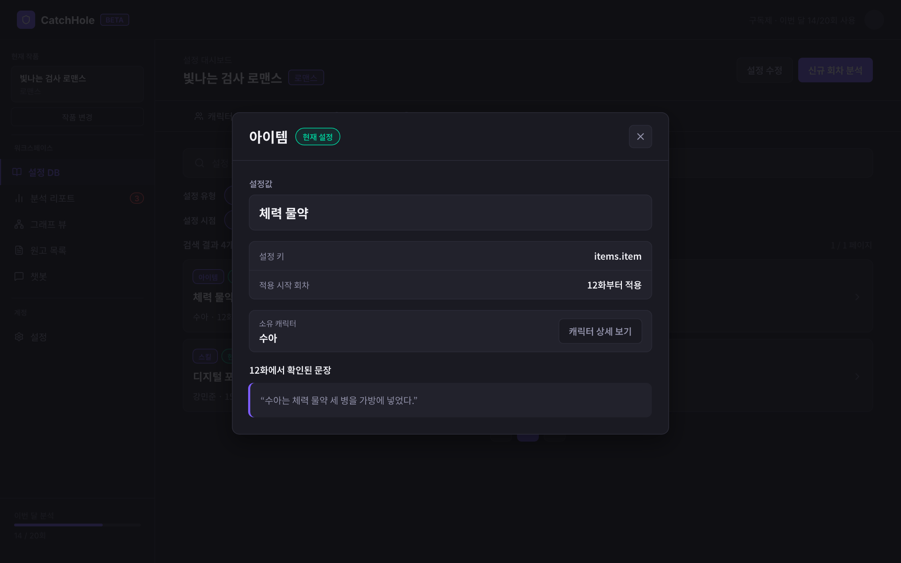

검색 결과로 선택한 하나의 `CharacterFact`를 현재·이전 설정 구분 없이 동일한 형식으로 조회하는 모달. 캐릭터 상세 모달을 재사용하지 않으며, `CharacterFact`의 사용자용 값과 해당 설정이 추출된 원문 근거를 함께 보여준다.

> **MVP 표시 정책**
> - 현재 설정과 이전 설정 모두 같은 상세 컴포넌트를 사용하고 `isCurrent` 배지만 다르게 표시한다.
> - 설정값은 `factValue`만 표시한다. `valueJson`, `normalizedValue`, `rawAiResultJson`은 사용자에게 노출하지 않는다.
> - `CharacterFact`에서 원본 `SettingCandidate`로 이동할 수 있도록 `character_facts.source_candidate_id` nullable 외래키를 추가한다.
> - AI 설정 후보를 확정하여 `CharacterFact`를 생성할 때 `source_candidate_id`에 해당 `SettingCandidate.id`를 저장한다. 기존 데이터 또는 이후 수동 생성된 설정은 `null`을 허용한다.
> - 상세 응답은 `SettingCandidate.evidenceSpans` 전체 JSON을 그대로 전달하지 않고, 화면에 필요한 `quote`만 `evidenceQuotes` 문자열 목록으로 변환하여 제공한다.
> - MVP에서는 원문 위치 하이라이트와 청크 원문 전체 조회를 지원하지 않는다.

**1. 화면에 표시할 데이터**
- 모달 제목: 설정 유형 한글 표시명
- 현재 상태 배지: `현재 설정` 또는 `이전 설정`
- 설정 정보
  - 사용자용 설정값(`factValue`)
  - 내부 설정 키(`factKey`)
  - 설정 적용 시작 회차(`effectiveFromEpisodeNo`)
- 소유 캐릭터 정보
  - 캐릭터명
  - 캐릭터 상세 보기 버튼
- 원문 근거
  - 출처 회차 번호: `{sourceEpisodeNo}화`
  - 해당 회차에서 추출된 인용 문장 목록(`evidenceQuotes`)
- 닫기 버튼

> **상세 화면 텍스트 정책**
> - 설정값: `factValue`가 없으면 `—`
> - 설정 키: `factKey`를 그대로 표시하되 `설정 키`라는 보조 라벨을 붙인다.
> - 적용 시작 회차: 값이 있으면 `{effectiveFromEpisodeNo}화부터 적용`, 없으면 `적용 회차 정보 없음`
> - 원문 근거 제목: 값이 있으면 `{sourceEpisodeNo}화에서 확인된 문장`, 출처 회차가 없으면 `출처 회차 없음`
> - 인용문은 각각 따옴표가 포함된 별도 블록으로 표시한다.
> - 인용문이 없으면 `저장된 원문 근거가 없습니다.`를 표시한다.

**2. 사용자 액션**
- 닫기·배경 선택 → 모달을 닫고 기존 검색어·필터·페이지가 유지된 검색 목록으로 복귀
- 캐릭터 상세 보기 선택 → [캐릭터 상세 모달](#캐릭터-상세-모달-chardetailmodal)로 전환

**3. 화면 전환 식별자**
- 현재 작품: `workId`
- 상세 대상: `factId={characterFactId}`
- 상세 모달 상태: `modal=fact-detail`
- 캐릭터 상세 보기 전환: `modal=char-detail&charId={characterId}`. 이때 `factId`는 URL에서 제거한다.
- 상세 모달 닫기: URL에서 `modal`과 `factId`만 제거하고 `nav=settingDB`, `tab=search`, `q`, `factType`, `scope`, `page`, `size`는 유지한다.

**4. 데이터 없음 / 실패 표시**
- 상세 조회 중 모달 내부 로딩
- 존재하지 않거나 현재 작품에 속하지 않는 `characterFactId`는 `설정 정보를 찾을 수 없습니다.` 표시 후 닫기 제공
- 상세 조회 실패 시 모달을 유지하고 오류 안내와 다시 시도 제공
- `factValue`가 없으면 `—`
- `sourceCandidateId`가 없거나 원본 후보가 없으면 `저장된 원문 근거가 없습니다.` 표시
- 출처 후보는 있으나 `evidenceQuotes`가 비어 있어도 동일하게 `저장된 원문 근거가 없습니다.` 표시

**5. 화면 데이터 요구사항**

**5-1. BE → FE 제공 데이터 요구사항 — 상세 응답**
- 신설 조회 API: `GET /api/v1/works/{workId}/character-facts/{characterFactId}`
- 작품 소유권과 해당 `CharacterFact`의 작품 소속을 확인한 뒤 아래 필드 제공
  - `characterFactId`
  - `factType`, `factTypeLabel`
  - `factKey`
  - `factValue`, nullable
  - `isCurrent`
  - `effectiveFromEpisodeNo`, nullable
  - `characterId`, `characterName`
  - `sourceCandidateId`, nullable
  - `sourceEpisodeId`, nullable
  - `sourceEpisodeNo`, nullable
  - `evidenceQuotes`: `SettingCandidate.evidenceSpans[*].quote`를 추출한 문자열 목록. 근거가 없으면 빈 목록
- `sourceEpisodeId`와 `sourceEpisodeNo`는 `CharacterFact.sourceEpisode`를 우선 사용하고, 없을 때 연결된 `SettingCandidate.episode`를 보조 출처로 사용한다.
- 상세 응답에도 `valueJson`, `normalizedValue`, `rawAiResultJson`, `sourceChunkId`, 원문 offset은 포함하지 않는다.

**5-2. FE → BE 전달 데이터 요구사항**
- 조회 대상 작품의 `workId`
- 조회 대상 설정의 `characterFactId`

**5-3. BE 저장 구조 요구사항**
- `character_facts.source_candidate_id UUID NULL` 컬럼과 `setting_candidates.id` 외래키 추가
- 설정 후보 확정 후 `CharacterFact` 생성 시 `source_candidate_id` 저장
- 설정 후보가 삭제되더라도 확정 설정 이력이 함께 삭제되지 않도록 외래키 삭제 정책은 `ON DELETE SET NULL`
- 기존 `CharacterFact`는 마이그레이션 시 `source_candidate_id=null`로 유지

**6. BE와 협의할 범위·상태값**
- 없음

---

## 캐릭터 상세 모달 (CharDetailModal)

**URL**: [`/dashboard?nav=settingDB&tab=characters&modal=char-detail&charId={characterId}`](https://www.catchhole.com/dashboard?nav=settingDB&tab=characters&modal=char-detail)

**MVP 이후 고도화 참고 화면**

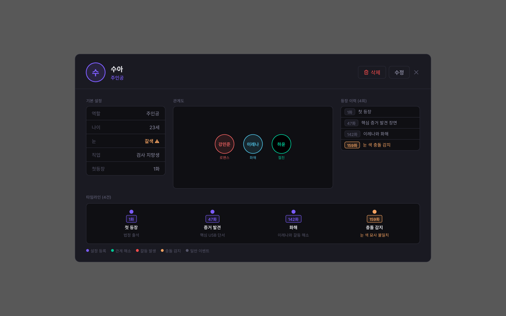

> 관계도·등장 이력·사건 타임라인을 함께 제공하는 형태는 MVP 이후 고도화 범위다. 현재 MVP 구현 기준으로 사용하지 않는다.

**현재 MVP 범위 화면**

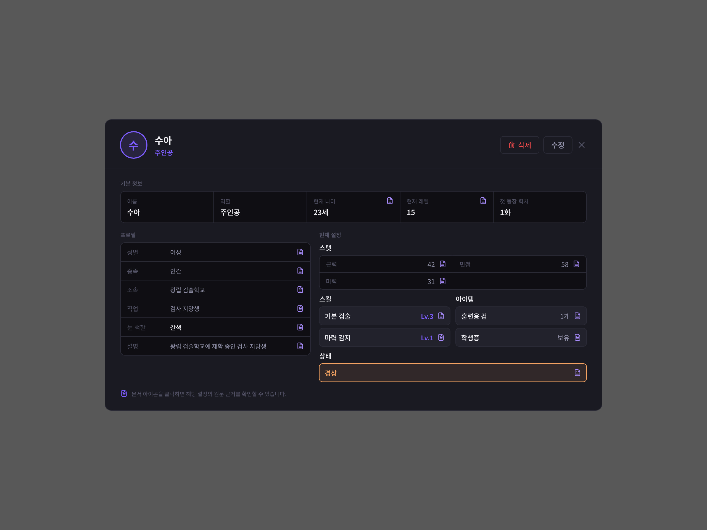

**수정 상태**

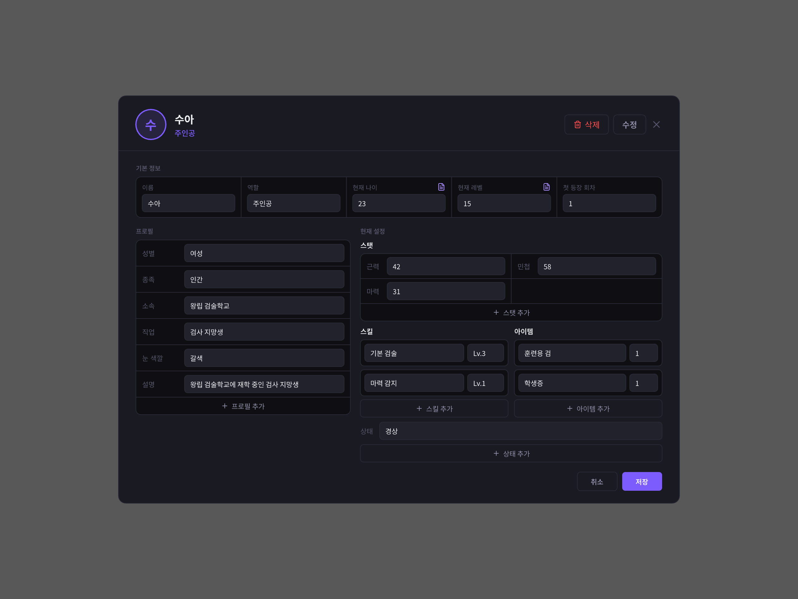

**삭제 확인 상태**

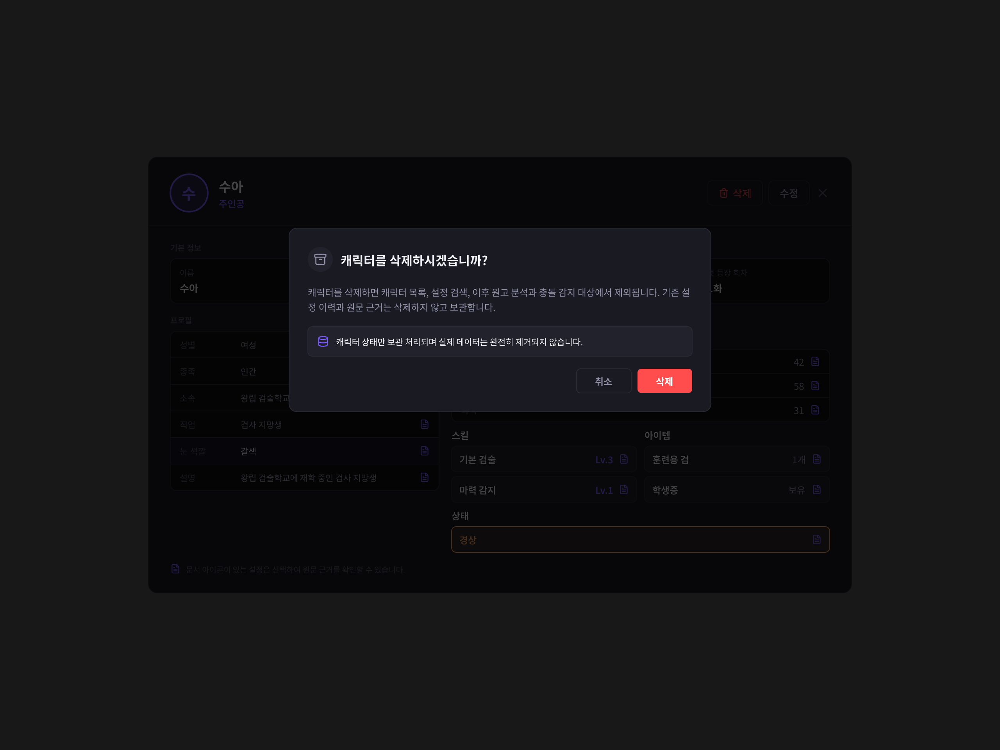

**원문 근거 상태**

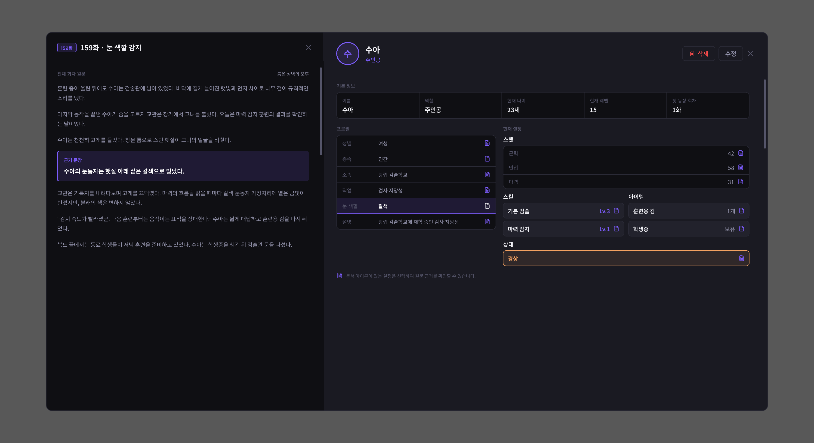

선택한 캐릭터의 현재 대표 정보와 현재 설정 전체를 확인하고, 설정별 원문 근거를 조회하거나 현재 설정을 일괄 수정·삭제하는 모달.

> **MVP 범위 메모**
> - 캐릭터의 현재 대표 정보와 현재 설정을 모두 표시한다.
> - 관계도·등장 이력·사건 타임라인과 `TIME` 설정은 MVP에서 제외한다.
> - 과거 설정 이력은 이 모달에 표시하지 않고 [설정DB 검색 탭](#설정db-검색-탭)과 [설정DB 검색 결과 상세 모달](#설정db-검색-결과-상세-모달)에서 조회한다.
> - 수정은 현재 설정 전체를 한 번에 편집하고 저장하는 방식으로 제공한다.
> - 화면의 `삭제`는 DB 행과 관련 이력을 제거하는 hard delete가 아니라 캐릭터 상태를 `ARCHIVED`로 바꾸는 soft delete이다.

> **현재 설정 표시 정책**
> - 기본 정보는 이름, 역할, 현재 나이, 현재 레벨, 첫 등장 회차를 표시한다.
> - 프로필은 성별·종족·소속·설명 등 `profileJson`에 저장된 항목을 표시한다.
> - 프로필·스탯은 저장된 항목을 `표시명: 값` 행으로 모두 표시한다.
> - 스킬·아이템·상태는 저장된 원소를 카드 또는 목록으로 모두 표시하고, 각 원소의 세부 속성도 `표시명: 값`으로 펼쳐 보여준다.
> - JSON 문자열 자체는 노출하지 않는다. schema 표시명이 있으면 표시명을 사용하고, 없으면 저장된 key를 보조 표시명으로 사용한다.
> - 값이 없는 영역은 숨기지 않고 `등록된 {설정 유형} 정보가 없습니다.`라는 빈 상태를 표시한다.
> - 원문 근거를 열 수 있는 현재 설정값에는 선택 가능한 상태를 표시한다.

> **원문 근거 패널 배치 정책**
> - `factId`가 없을 때는 캐릭터 상세 내용을 모달 전체 너비로 표시한다.
> - 설정값을 선택하면 모달 너비를 확장하고, 좌측 원문 근거 패널과 우측 캐릭터 상세 영역의 2열 구조로 전환한다.
> - 좌측에는 전체 회차 원문 또는 근거 청크와 하이라이트를 표시하고, 우측에는 선택 상태를 유지한 캐릭터 상세 정보를 표시한다.
> - 두 영역은 각각 독립적으로 스크롤하며, 원문 근거 패널을 닫으면 기존 단일 상세 모달 크기로 복귀한다.

**1. 화면에 표시할 데이터**
- 모달 헤더
  - 캐릭터 이름과 이름 첫 글자 아바타
  - 역할
  - 수정·삭제·닫기 버튼
- 기본 정보
  - 현재 나이
  - 현재 레벨
  - 첫 등장 회차 번호
- 프로필 설정 전체
- 현재 스탯 전체
- 현재 스킬 전체
- 현재 아이템 전체
- 현재 상태 전체
- 설정값 선택 시 모달 좌측에 여는 원문 근거 패널
  - 출처 회차 번호와 제목
  - 전체 회차 원문 또는 근거 청크 원문
  - 근거 인용문(`quote`)
  - 원문에서 근거 문장 하이라이트
  - 원문 패널 닫기 버튼

**2. 사용자 액션**
- 현재 설정값 선택 → 해당 설정의 원문 근거 패널 열기
- 원문 근거 패널이 열린 상태에서 우측의 다른 현재 설정값 선택 → 좌측 패널에 새로 선택한 설정의 근거 원문 표시
- 원문 근거 패널 닫기 → 캐릭터 상세 전용 화면으로 복귀
- 수정 선택 → 현재 표시된 기본 정보와 프로필·스탯·스킬·아이템·상태를 편집 모드로 전환
- 편집 중 저장 선택 → 수정 영향 경고 확인 후 변경된 전체 데이터를 한 번에 저장
- 편집 중 취소 선택 → 저장하지 않고 조회 상태로 복귀
- 삭제 선택 → [삭제 확인 상태](../screens/ZDc0T.png)에서 영향 안내 후 soft delete 실행
- 삭제 완료 → 상세 모달을 닫고 캐릭터 목록 새로고침
- 닫기·배경 선택 → 상세 모달 닫기

> **수정 영향 경고 문구**
>
> `수정한 내용은 현재 캐릭터 설정에 반영됩니다. 이미 업로드한 원고와 AI 분석 당시 저장된 원문·검색용 분석 데이터·근거 문장은 변경되지 않습니다. 수정된 이름이나 설정이 기존 원고의 표현과 달라지면 이후 설정 검색, 캐릭터 자동 연결, 충돌 감지 결과가 달라질 수 있습니다. 직접 수정한 설정에는 원문 근거가 표시되지 않을 수 있습니다. 계속 수정하시겠습니까?`
>
> - 화면에서는 `검색용 분석 데이터`라고 표현하고, 도움말에서 `원문 청크와 해당 청크로 만든 임베딩`을 뜻한다고 설명한다.
> - 경고 모달에는 영향을 받을 수 있는 기능을 `설정 검색`, `캐릭터 자동 연결`, `설정 충돌 감지`, `원문 근거 표시`로 나누어 표시한다.

> **삭제 확인 문구**
>
> `캐릭터를 삭제하면 캐릭터 목록, 설정 검색, 이후 원고 캐릭터 매칭과 충돌 감지 대상에서 제외됩니다. 삭제한 캐릭터는 1주안에 보관된 캐릭터에서 복구하면 설정 이력들을 유지할 수 있습니다. 삭제하시겠습니까?`

**3. 화면 전환 식별자**
- 현재 작품: `workId`
- 캐릭터 상세 모달: `modal=char-detail&charId={characterId}`
- 편집 모드: `mode=edit`
- 원문 근거 패널: `factId={characterFactId}`
- 조회 URL 예시: `/dashboard?nav=settingDB&tab=characters&modal=char-detail&charId=01970c2e-7e6d-7000-8e5d-2a9bc4b6d111`
- 편집 URL 예시: `/dashboard?nav=settingDB&tab=characters&modal=char-detail&charId=01970c2e-7e6d-7000-8e5d-2a9bc4b6d111&mode=edit`
- 원문 근거 URL 예시: `/dashboard?nav=settingDB&tab=characters&modal=char-detail&charId=01970c2e-7e6d-7000-8e5d-2a9bc4b6d111&factId=01970c2e-7e6d-7000-8e5d-2a9bc4b6d222`
- 원문 패널을 닫을 때는 `factId`만 제거한다.
- 편집 취소·저장 완료 시에는 `mode`만 제거한다.
- 상세 모달을 닫을 때는 `modal`, `charId`, `mode`, `factId`를 제거하고 캐릭터 탭 상태를 유지한다.

**4. 데이터 없음 / 실패 표시**
- 캐릭터 상세 조회 중 모달 내부 로딩
- 존재하지 않거나 현재 작품에 속하지 않는 캐릭터는 `캐릭터 정보를 찾을 수 없습니다.` 표시 후 닫기 제공
- 상세 조회 실패 시 모달을 유지하고 오류 안내와 다시 시도 제공
- 역할·나이·레벨·첫 등장 회차가 없으면 해당 값을 `—`로 표시
- 프로필·스탯·스킬·아이템·상태가 없으면 영역별 빈 상태 표시
- 원문 근거 조회 중 좌측 패널 로딩
- 출처 회차 원문을 불러오지 못하면 인용문과 출처 회차 정보만 표시하고 다시 시도 제공
- 저장 실패 시 사용자가 입력한 값과 편집 모드를 유지하고 다시 시도 제공
- soft delete 실패 시 상세 모달을 유지하고 오류 안내와 다시 시도 제공

**5. 화면 데이터 요구사항**

**5-1. BE → FE 제공 데이터 요구사항**

**캐릭터 현재 상세 데이터**

| 데이터 의미 | 형태·필수성 | 값 없음·조건 |
| --- | --- | --- |
| 캐릭터 식별자 | 단일 값·필수 | 없음 |
| 이름 | 단일 문자열·필수 | 없음 |
| 역할 | 단일 문자열·선택 | 없으면 `null` |
| 현재 나이 | 단일 정수·선택 | 없으면 `null` |
| 현재 레벨 | 단일 정수·선택 | 없으면 `null` |
| 첫 등장 회차 식별자·번호 | 단일 값·선택 | 없으면 모두 `null` |
| 프로필 설정 | key-value 항목 목록·필수 | 없으면 빈 목록 |
| 현재 스탯 | key-value 항목 목록·필수 | 없으면 빈 목록 |
| 현재 스킬 | 설정 원소 목록·필수 | 없으면 빈 목록 |
| 현재 아이템 | 설정 원소 목록·필수 | 없으면 빈 목록 |
| 현재 상태 | 설정 원소 목록·필수 | 없으면 빈 목록 |

- JSON 구조를 FE가 작품마다 직접 해석하지 않도록 각 항목은 화면 표시명, 사용자용 값, 원본 key를 구분해 제공한다.
- 설정별 원문 근거 진입을 위해 각 현재 설정 항목에는 대응하는 `characterFactId`를 제공한다.
- 캐릭터 상세의 현재 설정 목록에는 `isCurrent=true`인 `PROFILE`, `AGE`, `LEVEL`, `STAT`, `SKILL`, `ITEM`, `STATUS`만 포함하고 `TIME`과 과거 fact는 제외한다.

**선택한 설정의 원문 근거 데이터**

| 데이터 의미 | 형태·필수성 | 값 없음·조건 |
| --- | --- | --- |
| 설정 식별자 | `characterFactId`·필수 | 없음 |
| 출처 설정 후보 식별자 | 단일 값·선택 | 수동 수정 설정이면 `null` 가능 |
| 출처 회차 식별자·번호·제목 | 단일 값·선택 | 출처 회차가 없으면 모두 `null` |
| 전체 회차 원문 | 문자열·선택 | 회차 원문 조회 실패 시 `null` |
| 근거 청크 식별자·원문·전체 회차 내 시작 위치 | 단일 객체·선택 | 청크를 찾지 못하면 `null` |
| 근거 인용문 | `quote`, `startOffset`, `endOffset` 목록·필수 | 근거가 없으면 빈 목록 |

> **원문 표시·하이라이트 우선순위**
> 1. 전체 회차 원문과 회차 전체 기준 `startOffset`·`endOffset`이 유효하고 해당 범위의 문자열이 `quote`와 일치하면 전체 원문을 표시하고 모든 근거 범위를 하이라이트한다. 첫 근거 위치로 자동 스크롤한다.
> 2. 전체 원문에서 offset이 유효하지 않거나 원고 수정으로 문자열이 달라졌지만 근거 청크가 남아 있으면 청크 원문을 표시하고 청크 안에서 `quote`를 다시 찾아 하이라이트한다.
> 3. 전체 원문과 청크에서 위치를 확정하지 못하면 `quote`만 인용문 블록으로 표시하고 `원문에서 위치를 확인할 수 없습니다.`를 안내한다.
> 4. 근거 인용문도 없으면 `저장된 원문 근거가 없습니다.`를 표시한다.

**수정 완료 후 최신 데이터**

- 저장 성공 여부와 갱신된 캐릭터 현재 상세 데이터
- 수정된 설정별 새 `characterFactId`
- 이름·역할·첫 등장 회차 수정은 캐릭터의 현재 대표 필드에 반영
- 프로필·나이·레벨·스탯·스킬·아이템·상태 수정은 새로운 수동 정정 `CharacterFact`를 생성한 뒤 캐릭터의 현재 대표값과 JSON snapshot에 반영
- 이름 수정 후에도 기존 `CharacterFact`는 동일한 `characterId`를 참조하므로 상세와 이력의 캐릭터명은 갱신된 이름으로 표시
- 과거 원고, `EpisodeChunk.chunkText`와 임베딩, 기존 `SettingCandidate.entityName`·`rawEntityMention`·`evidenceSpans`, 과거 `CharacterFact`는 수정하지 않고 분석 당시 기록으로 유지
- 직접 수정한 설정은 원문에서 추출한 기존 fact를 덮어쓰지 않고 새로운 수동 정정 `CharacterFact`로 생성하며, 같은 `factType + factKey`의 이전 current fact는 과거 이력으로 전환
- 수동 정정 fact는 출처 후보·출처 회차·근거 인용문이 없으면 모두 `null` 또는 빈 목록으로 제공
- 원문 근거는 [설정DB 검색 결과 상세 모달](#설정db-검색-결과-상세-모달)에 정의한 `CharacterFact.sourceCandidate` 연결을 기준으로 조회

**soft delete 완료 후 최신 데이터**

- 캐릭터 상태를 `ACTIVE`에서 `ARCHIVED`로 변경한 결과
- `ARCHIVED` 캐릭터는 기본 캐릭터 목록, 설정 검색, AI Worker의 기존 캐릭터 자동 매칭 목록, 충돌 감지 대상에서 제외
- 캐릭터, `CharacterFact`, `SettingCandidate`와 원문 근거 데이터는 실제 삭제하지 않고 유지

**5-2. FE → BE 전달 데이터 요구사항**
- 상세 조회 대상 작품의 `workId`와 캐릭터의 `characterId`
- 원문 근거 조회 시 선택한 현재 설정의 `characterFactId`
- 수정 저장 시 다음 데이터를 하나의 요청으로 전달
  - 캐릭터의 `characterId`
  - 수정된 이름·역할·현재 나이·현재 레벨·첫 등장 회차
  - 수정된 프로필·스탯·스킬·아이템·상태 전체
- FE는 빈 문자열을 `null`로 정규화하고, 나이·레벨은 0 이상의 정수, 첫 등장 회차 번호는 1 이상의 정수인지 검증한다.
- 여러 설정이 함께 수정되면 일부 항목만 반영되지 않도록 전체 변경을 한 트랜잭션으로 처리한다.
- 삭제 시 작품의 `workId`와 캐릭터의 `characterId`를 전달한다.

**5-3. BE 보충 구현 요구사항 — 프로필 설정**
- `CharacterFactType`에 `PROFILE`을 추가한다.
- 설정 후보의 `attributeName`이 `profile` 또는 `profile.*`이면 `PROFILE`로 매핑한다.
- `PROFILE` 후보 확정 시 `CharacterFact`를 생성하고 current fact의 `valueJson`을 `WorkCharacter.profileJson` snapshot에 반영한다.
- 성별·종족·소속·설명처럼 프로필 항목이 여러 개이면 `factKey`별 current 이력을 유지하고, 상세 응답에서는 현재 프로필 항목 목록으로 제공한다.
- 프로필 설정에도 `characterFactId`와 출처 후보·회차·quote·offset을 제공하여 다른 설정과 동일하게 원문 근거를 열 수 있도록 한다.
- 현재 코드는 `profile`을 `SETTING_CANDIDATE_FACT_TYPE_UNSUPPORTED`로 거절하므로, 이 보충 구현이 완료된 뒤 프로필 후보 확정과 상세 화면을 연동한다.

**6. BE와 협의할 범위·상태값**
- 없음

---

## 설정 검토 (SSettingReview)

**URL**: [`/setting-review`](https://www.catchhole.com/setting-review)

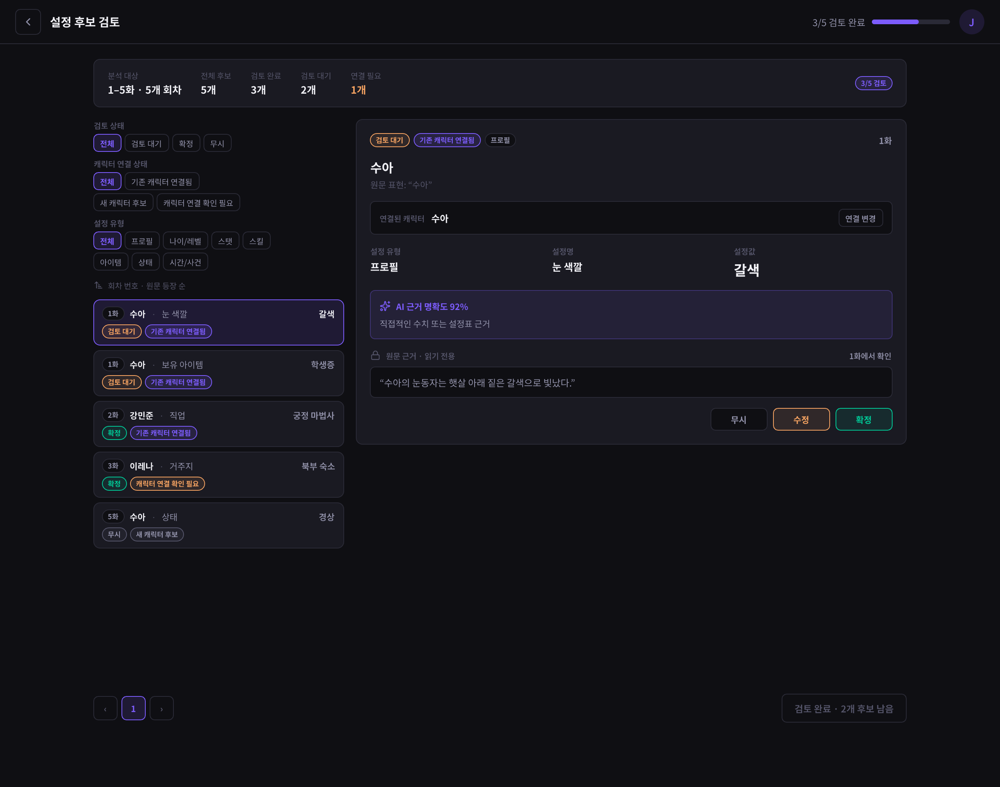

**캐릭터 연결 필요 상태**

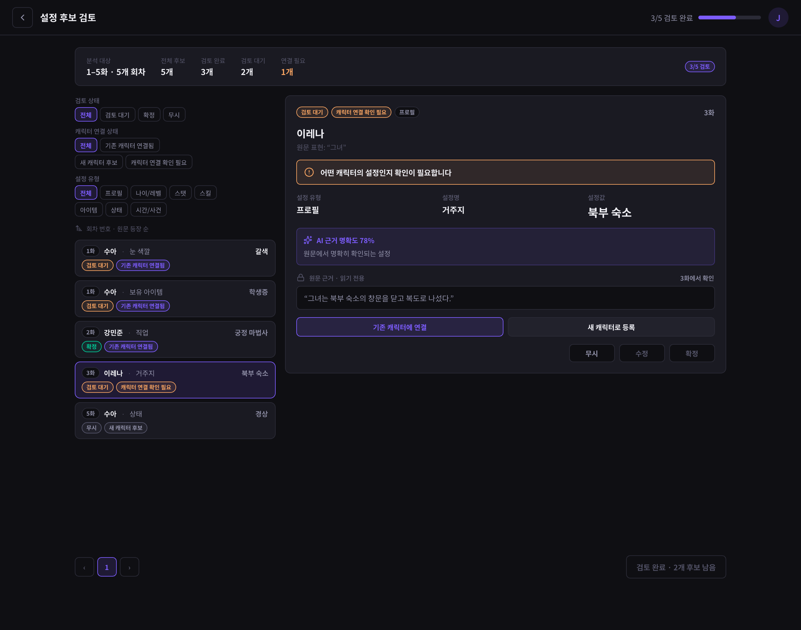

**캐릭터 연결 모달**

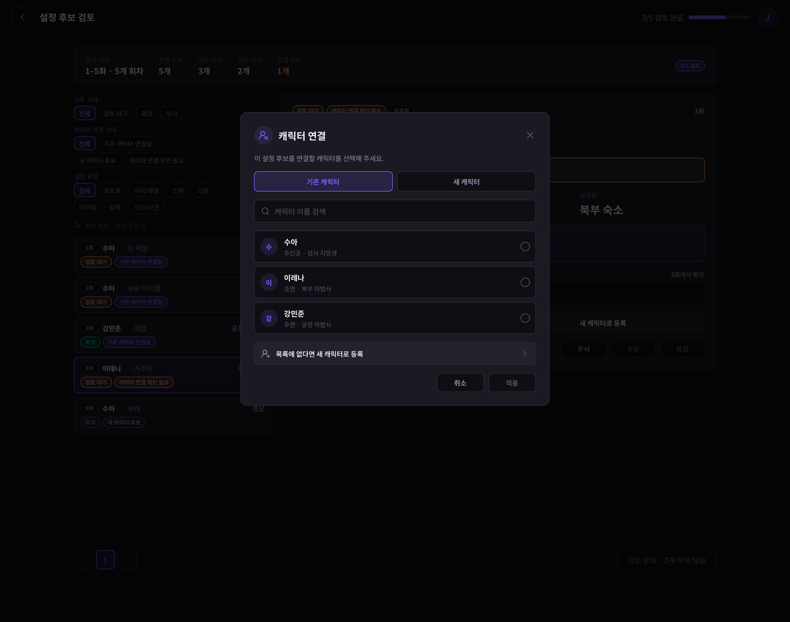

**후보 수정 상태**

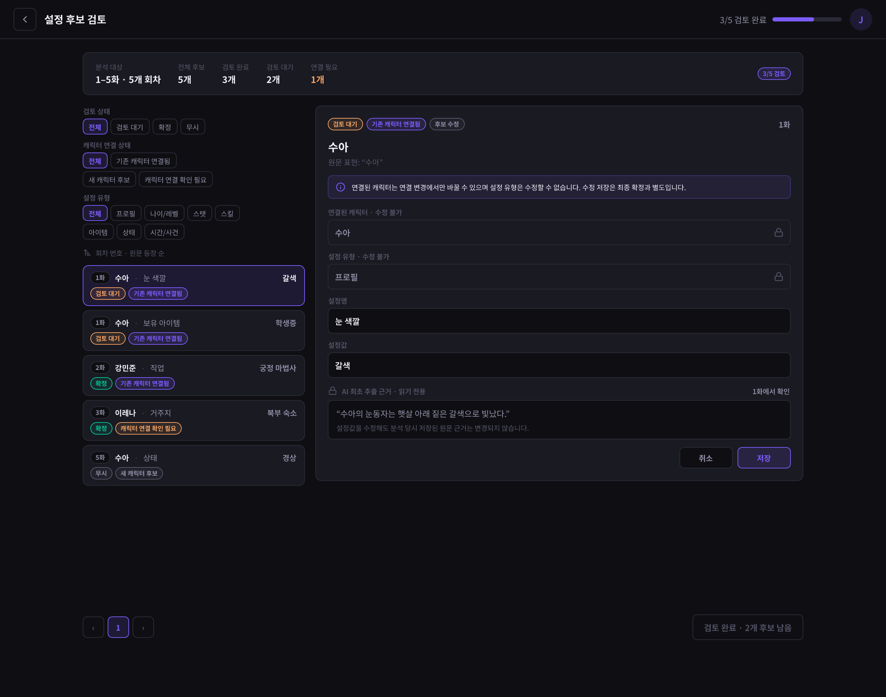

**검토 완료 상태**

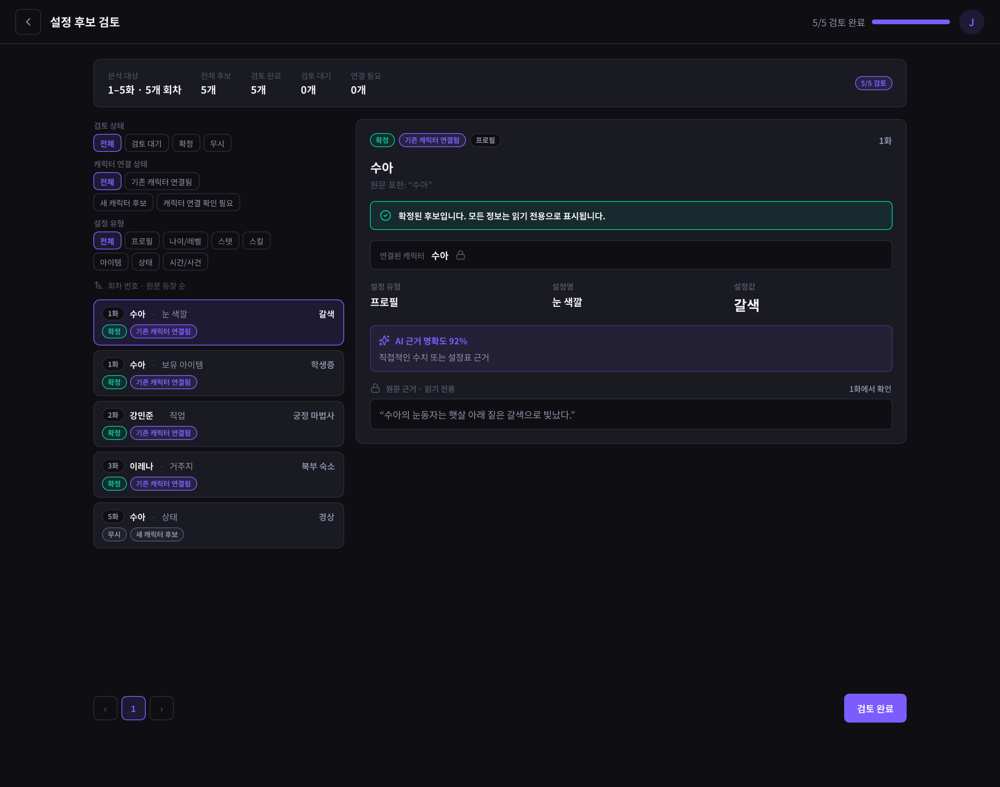

회차 업로드 후 하나의 분석 작업에서 AI가 추출한 설정 후보를 원문 근거와 함께 검토하고, 캐릭터 연결과 설정값을 보정한 뒤 확정하거나 무시하는 화면.

> **MVP 범위 메모**
> - 검토 범위는 작품 전체 후보가 아니라 현재 `analysisJobId`에서 생성된 후보로 제한한다.
> - 좌측 후보 목록은 요약 응답, 우측 선택 후보는 상세 응답으로 분리한다. 조회한 상세 응답은 FE에서 캐싱할 수 있다.
> - 후보 수정 저장과 확정은 별도 액션으로 제공하며, 사용자는 `PENDING_REVIEW` 상태에서 여러 번 수정할 수 있다.
> - `CONFIRMED`, `DISMISSED` 후보는 읽기 전용으로 표시하고 되돌리기는 지원하지 않는다.
> - 설정집 다시 분석, 일괄 확정·무시, 근거 문장 직접 수정, 문단 번호 표시는 MVP에서 제외한다.

> **상태 표시 정책**
>
> 검토 상태와 캐릭터 연결 상태를 별개의 배지와 필터로 표시한다. 연결 상태의 내부 enum 이름을 그대로 노출하지 않는다.
>
> | 구분 | 내부 상태 | 화면 표시명 |
> | --- | --- | --- |
> | 검토 상태 | `PENDING_REVIEW` | 검토 대기 |
> | 검토 상태 | `CONFIRMED` | 확정 |
> | 검토 상태 | `DISMISSED` | 무시 |
> | 연결 상태 | `MATCHED` | 기존 캐릭터 연결됨 |
> | 연결 상태 | `UNRESOLVED` | 새 캐릭터 후보 |
> | 연결 상태 | `AMBIGUOUS` | 캐릭터 연결 확인 필요 |
>
> - `수정됨`은 검토 상태가 아니므로 상태 필터에서 제외한다.
> - 설정 내용이 사용자에 의해 수정된 후보에는 상태와 별도로 `사용자 수정` 보조 배지를 표시한다.

> **후보 목록 정렬 정책**
> - `episodeNo ASC` → 회차 안의 첫 근거 `startOffset ASC` → 생성 시각 ASC 순으로 정렬한다.
> - 근거 offset이 없으면 같은 회차의 근거 있는 후보 뒤에 표시하고, 출처 회차가 없으면 전체 목록의 마지막에 표시한다.
> - 필터가 바뀌면 첫 페이지로 이동한다.

> **AI 근거 명확도 표시 정책**
> - `confidence`는 검증된 정확도가 아니라 LLM이 판단한 원문 근거의 명확도이므로 `정확도`라고 표현하지 않는다.
> - 90% 이상: `직접적인 수치 또는 설정표 근거`
> - 70% 이상 90% 미만: `원문에서 명확히 확인되는 설정`
> - 60% 이상 70% 미만: `원문을 직접 확인해 주세요`
> - `null` 또는 예상 범위를 벗어난 값: `근거 명확도 정보 없음`

**1. 화면에 표시할 데이터**
- 상단 분석·검토 요약
  - 분석 대상 회차 범위와 회차 수
  - 전체 후보 수
  - 검토 완료 수: `CONFIRMED + DISMISSED`
  - 검토 대기 수
  - 캐릭터 연결 필요 수: `PENDING_REVIEW + AMBIGUOUS`
  - `검토 완료 수 / 전체 후보 수` 진행 표시
- 좌측 후보 목록 영역
  - 캐릭터명
  - 설정 유형과 설정명
  - 표시용 설정값
  - 출처 회차 번호
  - 검토 상태 배지
  - 캐릭터 연결 상태 배지
  - 사용자 수정 배지
- 목록 필터
  - 검토 상태: 전체·검토 대기·확정·무시
  - 연결 상태: 전체·기존 캐릭터 연결됨·새 캐릭터 후보·캐릭터 연결 확인 필요
  - 설정 유형: 전체·프로필·나이/레벨·스탯·스킬·아이템·상태·시간/사건
- 우측 선택 후보 상세 영역
  - 캐릭터 후보명과 원문 표현
  - 검토 상태와 캐릭터 연결 상태
  - 현재 연결된 기존 캐릭터 또는 새 캐릭터 등록 예정 이름
  - 설정 유형·설정명·표시값·구조화된 세부 값
  - AI 근거 명확도와 구간별 안내 문구
  - `{episodeNo}화에서 확인` 출처 정보
  - `AI가 추출할 때 참고한 원문` quote 목록
  - 사용자 수정 후보인 경우 원문과 수정값이 다를 수 있다는 안내
- 목록 페이지네이션
- 검토 완료 후 다음 단계 이동 버튼

**2. 사용자 액션**
- 후보 선택 → 우측에 상세 조회
- 검토 상태·연결 상태·설정 유형 필터 선택·페이지 이동
- `PENDING_REVIEW + AMBIGUOUS`
  - 무시
  - `기존 캐릭터에 연결` 선택 → 검색 가능한 기존 캐릭터 선택 모달 열기
  - `새 캐릭터로 등록` 선택 → 새 캐릭터 이름 입력
  - 연결 해소 전에는 설정값 수정과 확정 비활성
  - 연결 완료 후 `MATCHED` 또는 `UNRESOLVED` 상태로 전환하고 수정·확정 가능
- `PENDING_REVIEW + MATCHED`
  - 설정값 수정·수정 저장·확정·무시
  - `연결 변경` → 다른 기존 캐릭터 또는 새 캐릭터로 변경
- `PENDING_REVIEW + UNRESOLVED`
  - 현재 후보명을 새 캐릭터 이름으로 사용하여 바로 확정하거나 무시
  - 설정값 수정·수정 저장
  - `연결 변경` → 기존 캐릭터에 연결하거나 새 캐릭터 이름 재입력
- 캐릭터 연결은 확정 전까지 여러 번 변경할 수 있고, 변경 후에도 검토 상태는 `PENDING_REVIEW` 유지
- 설정값 수정 저장 후에도 `PENDING_REVIEW`를 유지하며 다시 수정·확정·무시 가능
- `CONFIRMED`, `DISMISSED` 후보 선택 → 상세를 읽기 전용으로 조회
- 모든 후보의 검토가 끝나면 검토 완료 선택
  - 기존 확정 설정이 있는 작품의 추가 회차 분석 → 오류 탐지 작업을 시작하고 [분석 진행](./analysis.md#분석-진행-s4loading)으로 이동한 뒤 완료 시 오류 리포트로 이동
  - 작품의 최초 원고 분석 → 오류 리포트를 생성하지 않고 [설정DB 캐릭터 탭](#설정db-캐릭터-탭)으로 이동

> **캐릭터 연결 UI 정책**
> - `AMBIGUOUS` 상세에는 `기존 캐릭터에 연결`, `새 캐릭터로 등록` 버튼을 나란히 제공하고 무시 버튼은 연결 전에도 사용할 수 있게 한다.
> - `MATCHED`, `UNRESOLVED` 상세에는 현재 연결 결과와 `연결 변경` 보조 버튼을 표시한다.
> - 새 캐릭터 이름이 기존 캐릭터와 중복되면 `이미 같은 이름의 캐릭터가 있습니다. 기존 캐릭터에 연결해 주세요.`라고 안내한다.

> **설정 수정·원문 근거 보존 정책**
> - 설정 수정 화면에는 사용자용 설정명·표시값·구조화된 세부 값을 폼으로 표시하고 raw JSON은 노출하지 않는다.
> - 캐릭터 연결, 설정명, 설정값, 구조화 값이 수정되어도 분석 당시의 출처 회차·원문 표현·청크·quote·offset은 변경하거나 삭제하지 않는다.
> - quote와 offset은 `AI가 추출할 때 참고한 원문`으로 읽기 전용 표시하며 일반 설정 수정 요청에 포함하지 않는다.
> - 사용자가 설정 내용을 수정한 후보에는 다음 문구를 표시한다.
>
> `이 설정은 사용자가 수정했습니다. 아래 원문은 AI가 최초 추출할 때 참고한 내용으로, 수정된 값과 다를 수 있습니다.`

**3. 화면 전환 식별자**
- 현재 작품: `workId`
- 검토 대상 분석 작업: `analysisJobId`
- 선택 후보: `candidate={candidateId}`
- 검토 상태: `reviewStatus={ALL|PENDING_REVIEW|CONFIRMED|DISMISSED}`
- 연결 상태: `matchStatus={ALL|MATCHED|UNRESOLVED|AMBIGUOUS}`
- 설정 유형: `settingType={ALL|PROFILE|AGE_LEVEL|STAT|SKILL|ITEM|STATUS|TIME}`
- 페이지 번호: `page={1 이상의 정수}`
- 페이지 크기: `size=20`
- URL 예시: `/setting-review?analysisJobId=01970c2e-7e6d-7000-8e5d-2a9bc4b6d555&candidate=01970c2e-7e6d-7000-8e5d-2a9bc4b6d333&reviewStatus=PENDING_REVIEW&matchStatus=ALL&settingType=ALL&page=1&size=20`
- 검토 완료 후 오류 탐지 작업: `/loading?analysisJobId={validationAnalysisJobId}&next=report`
- 최초 원고 분석 검토 완료: `/dashboard?nav=settingDB&tab=characters`

**4. 데이터 없음 / 실패 표시**
- 목록·집계 조회 중 로딩
- 분석 결과 후보가 0개이면 빈 상태 표시 ([빈 상태](../screens/DhkMk.png))
  - 안내 문구: `검토할 설정 후보가 없습니다.`
  - 설명 문구: `이번 분석에서는 원문 근거가 명확한 설정을 찾지 못했습니다.`
  - 최초 분석이면 설정 DB로 이동, 추가 회차 분석이면 다음 오류 탐지 단계로 이동
- 필터 결과가 0개이면 `조건에 맞는 설정 후보가 없습니다.` 표시와 필터 초기화 제공
- 상세 조회 중 우측 영역 로딩
- 상세 조회 실패 시 선택 상태를 유지하고 오류 안내와 다시 시도 제공
- 수정 저장 실패 시 입력값과 편집 상태를 유지하고 다시 시도 제공
- 캐릭터 연결 실패 시 입력·선택 상태 유지
- 새 캐릭터 이름 중복 시 기존 캐릭터 연결 안내
- `AMBIGUOUS` 확정 시도는 사전에 버튼을 비활성화하고, 서버에서 409가 반환되면 연결 필요 안내 표시
- 확정·무시 실패 시 후보를 `PENDING_REVIEW` 상태로 유지하고 다시 시도 제공
- 오류 탐지 작업 시작 실패 시 검토 완료 상태를 유지하고 다시 시도 제공

**5. 화면 데이터 요구사항**

**5-1. BE → FE 제공 데이터 요구사항**

**검토 범위와 집계 데이터**

- 검토 범위·집계 데이터와 좌측 후보 목록은 하나의 목록 요약 응답으로 함께 제공한다. 우측에서 선택한 후보 상세만 별도 응답으로 조회한다.
- 상단 집계는 현재 필터와 관계없이 해당 `analysisJobId`의 전체 후보를 기준으로 유지하고, 페이지의 `totalElements`는 현재 필터가 적용된 결과 개수를 의미한다.

| 데이터 의미 | 형태·필수성 | 값 없음·조건 |
| --- | --- | --- |
| 검토 대상 분석 작업 식별자 | 단일 값·필수 | 없음 |
| 분석 대상 회차 시작·종료 번호와 회차 수 | 정수·필수 | 회차가 없으면 모두 `0` |
| 전체 후보 수 | 0 이상의 정수·필수 | 후보가 없으면 `0` |
| 검토 완료 수 | 0 이상의 정수·필수 | `CONFIRMED + DISMISSED` 개수 |
| 검토 대기 수 | 0 이상의 정수·필수 | `PENDING_REVIEW` 개수 |
| 캐릭터 연결 필요 수 | 0 이상의 정수·필수 | `PENDING_REVIEW + AMBIGUOUS` 개수 |
| 검토 상태별 개수 | 상태별 집계·필수 | 없는 상태는 `0` |
| 연결 상태별 개수 | 상태별 집계·필수 | 없는 상태는 `0` |
| 설정 유형별 개수 | 유형별 집계·필수 | 없는 유형은 `0` |
| 오류 탐지 가능 여부 | boolean·필수 | 현재 분석 작업 시작 전에 확정 설정이 이미 있었으면 `true` |

**좌측 후보 목록 요약 데이터**

| 데이터 의미 | 형태·필수성 | 값 없음·조건 |
| --- | --- | --- |
| 후보 식별자 | 목록 항목별 단일 값·필수 | 없음 |
| 출처 회차 식별자·번호 | 목록 항목별 단일 값·선택 | 출처 회차가 없으면 `null` |
| 캐릭터 후보명 | 목록 항목별 문자열·필수 | 없음 |
| 원문 캐릭터 표현 | 목록 항목별 문자열·선택 | 없으면 `null` |
| 설정 유형·한글 표시명 | 목록 항목별 단일 값·필수 | 없음 |
| 설정명 | 목록 항목별 문자열·필수 | 없음 |
| 표시용 설정값 | 목록 항목별 문자열·선택 | 없으면 `null` |
| 값 유형 | 목록 항목별 단일 값·필수 | 없음 |
| AI 근거 명확도 | 목록 항목별 0~1 값·선택 | 없으면 `null` |
| 검토 상태 | 목록 항목별 enum·필수 | `PENDING_REVIEW`/`CONFIRMED`/`DISMISSED` |
| 캐릭터 연결 상태 | 목록 항목별 enum·필수 | `MATCHED`/`UNRESOLVED`/`AMBIGUOUS` |
| 사용자 설정 내용 수정 여부 | 목록 항목별 boolean·필수 | 수정하지 않았으면 `false` |

- 목록은 `analysisJobId` 범위로 제한하고, 서버 필터·페이지네이션 결과를 제공한다.
- 페이지 메타데이터로 `page`, `size`, `totalElements`, `totalPages`, `hasNext`를 제공한다.
- 목록 요약에는 구조화 값, 근거 quote·offset, AI 원본 응답을 포함하지 않는다.

**우측 선택 후보 상세 데이터**

| 데이터 의미 | 형태·필수성 | 값 없음·조건 |
| --- | --- | --- |
| 목록 요약 정보 전체 | 단일 객체·필수 | 없음 |
| 기존 캐릭터 식별자·이름 | 단일 값·선택 | `MATCHED`가 아니면 `null` |
| 새 캐릭터 등록 예정 이름 | 문자열·선택 | `UNRESOLVED`가 아니면 `null` |
| 구조화된 설정 세부 값 | 객체·선택 | 단순 값이거나 없으면 `null` |
| 출처 청크 식별자 | 단일 값·선택 | 없으면 `null` |
| 원문 근거 | `quote`, 회차 전체 기준 `startOffset`, `endOffset` 목록·필수 | 근거가 없으면 빈 목록 |
| 사용자 설정 내용 수정 여부 | boolean·필수 | 수정하지 않았으면 `false` |

- 원문 근거에는 회차 번호를 반드시 제공하고 문단 번호는 제공하지 않는다.
- `rawAiResultJson`은 디버깅용 데이터이므로 사용자 화면 응답에 포함하지 않는다.
- 설정 내용이나 캐릭터 연결을 수정해도 출처 회차·원문 표현·청크·근거 quote·offset은 최초 추출값으로 유지한다.

**사용자 액션 완료 후 최신 데이터**

- 설정 수정 저장 후: 갱신된 후보 상세, `contentEdited=true`, 검토 상태 `PENDING_REVIEW`
- 캐릭터 연결 후: 갱신된 캐릭터명·연결 대상·연결 상태, 검토 상태 `PENDING_REVIEW`
- 확정·무시 후: 갱신된 검토 상태와 목록·집계에 반영할 최신 개수
- 전체 검토 완료 후:
  - 오류 탐지 가능 시 새 오류 탐지 작업 식별자와 이동 가능 상태
  - 최초 분석으로 오류 탐지가 불가능하면 설정 DB 이동 가능 상태

**5-2. FE → BE 전달 데이터 요구사항**

- 후보 목록·집계 조회
  - 작품의 `workId`
  - 현재 검토 대상 `analysisJobId`
  - 검토 상태, 연결 상태, 설정 유형, 페이지 번호, 페이지 크기
- 후보 상세 조회
  - `workId`, `analysisJobId`, `candidateId`
- 설정 내용 수정 저장
  - `workId`, `candidateId`
  - 사용자에게 표시한 설정명·설정값·값 유형·구조화된 세부 값
  - 원문 근거와 AI 근거 명확도는 수정 요청에 포함하지 않는다.
- 기존 캐릭터 연결
  - `workId`, `candidateId`, 사용자가 선택한 기존 `characterId`
- 새 캐릭터 지정 또는 이름 재수정
  - `workId`, `candidateId`, 사용자가 입력한 새 캐릭터 이름
- 후보 확정·무시
  - `workId`, `candidateId`, 사용자가 선택한 확정 또는 무시 액션
- 검토 완료
  - `workId`, 현재 검토 대상 `analysisJobId`
  - 검토 대기 수가 0일 때만 요청할 수 있다.

**6. BE와 협의할 범위·상태값**
- 없음

---

## 설정 빌더 모달

> **MVP 범위 아님** — 사용자가 캐릭터 설정을 직접 생성하는 설정 빌더는 MVP 이후 검토한다. MVP에서는 [회차 업로드](./upload.md#회차-업로드-sepisodeupload) → [설정 검토](#설정-검토-ssettingreview) → 확정 플로우만 지원한다.

---

## 세계관 빌더 모달

> **MVP 범위 아님** — 세계관 규칙을 직접 생성·수정하는 세계관 빌더는 MVP 이후 검토한다. MVP에서는 [설정DB 세계관 규칙 탭](#설정db-세계관-규칙-탭)에서 설정집 목록과 원문 조회만 지원한다.
