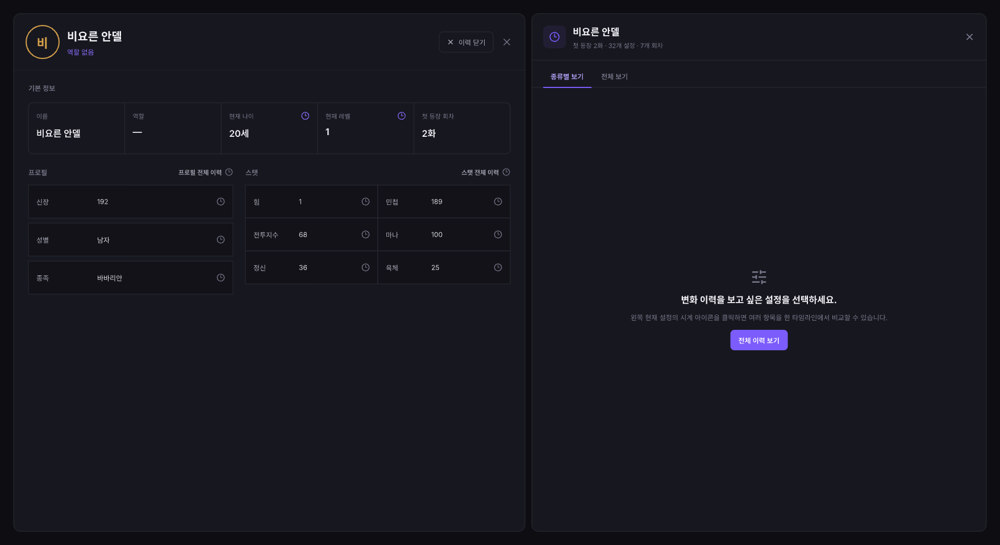
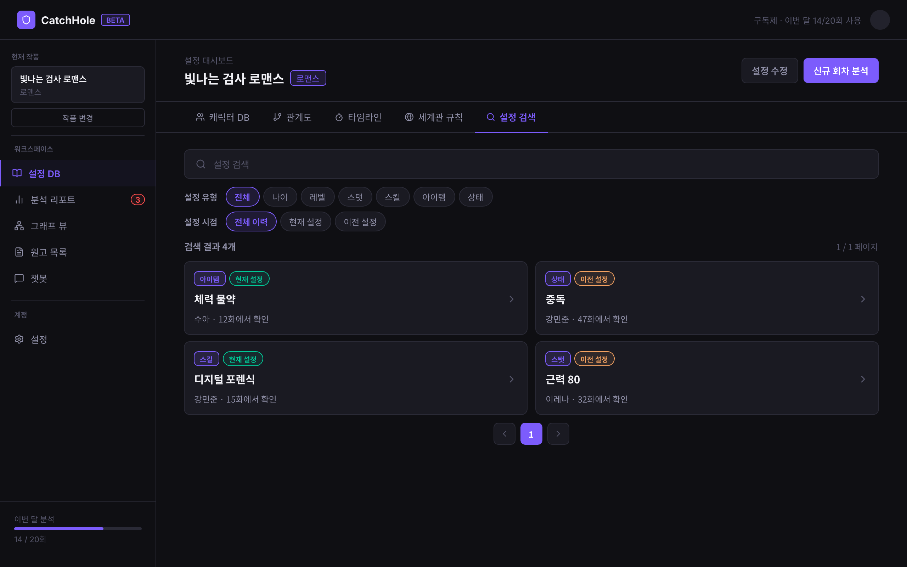
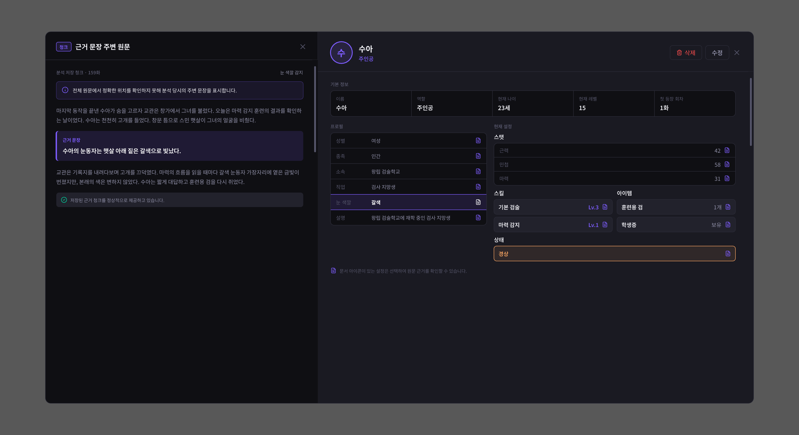

# 데이터 요구사항 — Character(설정/캐릭터)

[← 전체 인덱스](./README.md)

> 설정 후보(검토)와 캐릭터 목록·상세·수정·삭제 API 계약은 백엔드 Swagger/OpenAPI와 [BE character.md](https://github.com/catchhole-soma/catchhole-backend-java/blob/main/docs/character.md)를 기준으로 한다.

## 목차

- [설정DB 캐릭터 탭](#설정db-캐릭터-탭)
- [캐릭터 상세 변화 이력](#캐릭터-상세-변화-이력)
- [설정DB 설정집 목록 탭](#설정db-설정집-목록-탭)
- [설정집 업로드 모달](#설정집-업로드-모달)
- [설정DB 검색 탭](#설정db-검색-탭)
- [설정DB 검색 결과 상세 모달](#설정db-검색-결과-상세-모달)
- [캐릭터 상세 모달 (CharDetailModal)](#캐릭터-상세-모달-chardetailmodal)
- [설정 검토 (SSettingReview)](#설정-검토-ssettingreview)
- [설정 빌더 모달](#설정-빌더-모달)
- [세계관 빌더 모달](#세계관-빌더-모달)

---

## 설정DB 캐릭터 탭

**URL**: [`/dashboard?nav=settingDB&tab=characters`](https://www.catchhole.com/dashboard?nav=settingDB&tab=characters)

작품에 확정 등록된 캐릭터의 현재 대표 설정을 카드로 확인하고, 캐릭터 상세 정보로 진입하는 화면.

> **MVP 범위 메모**
> - 캐릭터 목록 조회와 캐릭터 상세 모달 진입만 지원한다.
> - 캐릭터 수정·삭제는 캐릭터 상세 모달 내부에서 진행한다.
> - 캐릭터 수동 추가와 분석 결과를 검토 없이 자동 등록하는 기능은 MVP 이후 지원한다. MVP에서는 원고 분석 결과의 설정 후보를 사용자가 검토·확정하여 캐릭터로 등록한다.
> - 최근 변경 이력은 MVP 이후 최근 변경 최대 20건을 표시하는 방향으로 구현한다.
> - 상세 모달의 `삭제`는 실제 데이터 삭제가 아니라 `ACTIVE → ARCHIVED` 상태 전환으로 처리하며, 캐릭터 탭의 보관함에서 다시 복구할 수 있다.

> **카드 표시 정책**
> - 캐릭터 카드에는 이름·현재 나이·장르별 대표 속성·첫 등장 회차를 표시한다.
> - 장르별 대표 속성은 작품 장르에 따라 달라질 수 있다. 판타지·무협·게임 장르는 레벨, 로맨스·일상 장르는 직업 등을 우선 검토한다.
> - 이름은 필수값으로 표시한다.
> - 나이·장르별 대표 속성·첫 등장 회차가 없으면 `—`로 표시한다.
> - 첫 등장 회차 번호는 `{episodeNo}화` 형식으로 표시한다.
> - 캐릭터 이름의 첫 글자를 카드 프로필 이미지 대용으로 표시하며 FE에서 계산한다.

**1. 화면에 표시할 데이터**
- 캐릭터 카드 목록
  - 캐릭터 이름
  - 현재 나이
  - 장르별 대표 속성의 표시명과 현재값
  - 첫 등장 회차 번호

**2. 사용자 액션**
- 캐릭터 카드 선택 → [캐릭터 상세 모달](#캐릭터-상세-모달-chardetailmodal) 열기
- 이전·다음 페이지 선택 → 현재 화면에 들어가는 카드 수를 유지한 채 서버 페이지 이동
- 빈 상태의 원고 분석 안내 버튼 선택 → [회차 업로드](./upload.md#회차-업로드-sepisodeupload) 이동
- 회차 올리기 → [회차 업로드](./upload.md#회차-업로드-sepisodeupload) 이동
- 다른 설정DB 탭 선택 → 선택한 탭으로 전환

캐릭터 수정·삭제는 목록에서 제공하지 않고 캐릭터 상세 모달에서 처리한다.

**3. 화면 전환 식별자**
- 현재 작품: `workId`
- 현재 탭: `nav=settingDB&tab=characters`
- 캐릭터 상세 모달: `?modal=char-detail&charId={characterId}`

**4. 데이터 없음 / 실패 표시**
- 목록 조회 중 로딩
- 등록된 캐릭터가 없으면 빈 상태 표시 ([빈 상태](../screens/VFxs5.png))
  - 안내 문구: `등록된 캐릭터가 없습니다`
  - 설명 문구: `원고를 분석하여 캐릭터를 추출해 보세요!`
  - 회차 업로드로 이동하는 `원고 분석하기` 버튼 제공
- 목록 조회 실패 시 오류 안내와 다시 시도 제공
- 캐릭터가 현재 화면의 카드 수보다 많으면 목록 아래에 이전·다음 페이지와 현재 페이지 표시
- 나이·장르별 대표 속성·첫 등장 회차가 없으면 해당 값만 `—`로 표시
- 캐릭터 상세 조회 실패 시 모달 안에 오류 안내와 다시 시도 제공

**5. 화면 데이터 요구사항**

**5-1. BE → FE 제공 데이터 요구사항**
- 현재 작품에 등록된 `ACTIVE` 캐릭터의 서버 페이지 목록
- 캐릭터별 카드 표시 데이터
  - 캐릭터 식별자
  - 이름
  - 현재 나이
  - 장르별 대표 속성의 표시명
  - 장르별 대표 속성의 현재값
  - 첫 등장 회차 번호
- 이름을 제외한 카드 값은 아직 확정값이 없으면 `null`
- 목록 응답의 첫 등장 회차는 카드에 표시할 회차 번호만 제공하며 회차 식별자와 제목은 포함하지 않음
- 장르별 대표 속성은 FE가 장르명을 보고 임의로 계산하지 않도록 표시명과 값을 함께 제공
- 캐릭터 상세 프로필·스탯·스킬·아이템·상태는 목록 응답에 포함하지 않고, 상세 모달을 열 때 해당 캐릭터의 상세 데이터로 조회
- 목록은 `createdAt DESC, id DESC`로 고정 정렬
- 페이지 메타데이터로 `content`, `page`, `size`, `totalElements`, `totalPages`, `hasNext` 제공
- API의 `page`는 0부터 시작하고 화면에는 `page + 1`로 표시

**5-2. FE → BE 전달 데이터 요구사항**
- 캐릭터 목록 조회 대상 작품의 `workId`
- `page`: 0부터 시작하는 서버 페이지 번호
- `size`: 현재 목록 영역의 너비·높이로 계산한 1~24 사이의 카드 수
- 캐릭터 상세 조회 시 선택한 캐릭터의 `characterId`를 조회 대상으로 전달

목록 화면에서는 캐릭터 생성·수정·삭제 데이터를 전달하지 않는다.

**6. 반응형 페이지 계산 정책**
- 목록 영역은 카드 최소 너비 `280px`, 고정 카드 높이 `177px`, 간격 `16px`을 기준으로 열과 행을 계산
- 열은 최대 5개, API 요청 크기는 최대 24개로 제한
- 페이지 버튼과 화면 아래 여백을 먼저 확보한 뒤 완전히 보이는 행만 페이지 크기에 포함
- 브라우저 크기·사이드바·확대 비율로 목록 영역이 바뀌면 `ResizeObserver`로 다시 계산
- 페이지 크기가 바뀌어도 기존 첫 항목의 절대 순번을 새 크기의 페이지로 환산해 해당 항목이 포함된 범위를 유지
- 삭제로 마지막 페이지가 비면 유효한 마지막 페이지로 이동
- 페이지 위치는 화면 배치에 종속된 표시 상태이므로 URL에 `size`를 저장하지 않음

**7. BE와 협의할 범위·상태값**
- 장르별 대표 속성을 결정하는 주체와 매핑 규칙(직업, 레벨 등)
  - 작품 장르에 따라 서버가 결정할지
  - 작품별 schema 설정을 기준으로 결정할지
  - 대표 속성의 schema key·표시명·값을 함께 제공할지

---

## 캐릭터 상세 변화 이력

**URL**: `/dashboard?nav=settingDB&tab=characters&modal=char-detail&charId={characterId}&mode=timeline`

캐릭터 DB 상세에서 현재 설정을 확인한 뒤 관심 있는 현재 설정 또는 설정 종류 전체의 `CharacterFact` 이력을 회차별로 확인하는 읽기 전용 화면이다. 독립된 캐릭터 타임라인 탭과 중복 캐릭터 목록은 두지 않는다.

**Pencil 디자인 원본**: `CharDetailModal / 변화 이력 분할 탐색 (MVP)` (`aOsEn`)

> **MVP 범위 메모**
> - 설정DB의 기본 진입은 `캐릭터 DB`이며 캐릭터 상세 헤더의 강조된 `변화 이력 보기`로 진입한다.
> - 세부 항목 선택지는 상세 응답의 현재 설정만 사용한다. 과거에만 존재하고 현재는 사라진 key는 세부 선택지로 노출하지 않는다.
> - `{유형명} 전체 이력`은 snapshot 기여 여부와 관계없이 해당 유형의 Fact를 모두 조회하므로 현재값에 포함되지 않은 설정도 확인할 수 있다.
> - 타임라인은 설정 후보 확정 또는 캐릭터 수동 수정으로 생성된 `CharacterFact` 전체를 기준으로 하며 현재 snapshot 기여 여부로 숨기거나 구분하지 않고 모두 표시한다.
> - `PENDING_REVIEW`·`DISMISSED` 상태의 `SettingCandidate`는 표시하지 않는다.
> - 중복으로 보이는 Fact도 프론트에서 합치거나 숨기지 않는다. 중복 감지와 추출 최적화는 별도 작업 범위다.
> - 회상·과거 서술 등 서사 시간을 판별하지 않는다. 회차 그룹에는 `1화`, `2화`처럼 출처 회차만 표시하고 사건이 해당 회차에 실제 발생했다고 표현하지 않는다.
> - 작품 전체 사건, 캐릭터 간 관계, 세계관 규칙과 `TIME` Fact는 이번 캐릭터 타임라인에 포함하지 않는다.
> - 타임라인은 조회 전용이다. Fact 확정·수정·삭제, 현재 상태 판정과 이전 상태 제거는 수행하지 않는다.
> - 별도 종류 선택 화면을 만들지 않는다. `변화 이력 보기`를 누르면 현재 상세는 왼쪽에 유지되고 우측 이력 패널이 열린다.
> - 우측 패널은 선택 없이 시작한다. 왼쪽 현재 설정 또는 종류 전체를 누르면 선택이 즉시 URL과 조회 조건에 반영되고 여러 조건을 함께 볼 수 있다.
> - `전체 이력 보기`는 다중 선택과 배타적인 전체 보기다. 전체 보기 중 왼쪽 설정을 누르면 해당 선택을 시작하는 종류별 보기로 전환한다.
> - 휴대폰에서는 왼쪽 설정을 계속 누를 수 있도록 이력을 하단 패널로 표시하고, 긴 원문 근거만 전체 화면으로 표시한다.

> **회차·원문 순서 정책**
> - 회차 그룹은 출처 회차 번호 오름차순으로 표시한다.
> - Python Worker는 청크를 `chunkIndex` 순서로 처리하지만, 한 청크에서 LLM이 반환하는 후보 배열이 원문의 등장 순서라는 보장은 없다.
> - 같은 회차의 Fact는 연결된 후보에 저장된 첫 번째 근거의 `startOffset` 오름차순으로 표시한다. Worker가 원문 등장순으로 저장한 근거 배열의 첫 항목을 정렬 기준으로 사용한다.
> - 유효 offset이 없는 Fact는 같은 회차의 offset이 있는 Fact 뒤에 두고 `createdAt ASC`, `characterFactId ASC`로 순서를 고정한다.
> - 출처 회차가 없는 수동 입력 Fact는 모든 회차 Fact 뒤의 `사용자 입력` 그룹에 `createdAt ASC`, `characterFactId ASC` 순으로 표시한다.
> - 이 순서는 원문에 설정이 등장한 순서이며, 작품 안에서 사건이 실제로 발생한 시간 순서를 의미하지 않는다.
> - 정렬에 사용하는 offset과 생성 시각은 서버 내부 정렬·cursor 경계에만 사용한다. 타임라인 목록 응답과 화면에는 노출하지 않는다.
> - 목록 정렬을 위해 S3 전체 원문을 읽지 않는다. 저장된 `evidenceSpans` 메타데이터만 사용하고 전체 원문은 사용자가 근거를 열었을 때만 조회한다.

> **타임라인 필터와 Fact 유형 정책**
> - 전체 보기의 단일 요청 필터는 `ALL`, `PROFILE`, `AGE`, `LEVEL`, `STAT`, `SKILL`, `ITEM`, `STATUS`를 지원한다.
> - `ALL`은 요청 전용 값이며 Fact 항목의 `factType`으로 반환하지 않는다.
> - 기존 `CharacterFactSearchType`은 `PROFILE`을 지원하지 않으므로 타임라인 요청에는 재사용하지 않는다. `PROFILE`을 포함하는 타임라인 전용 필터 계약을 둔다.
> - `TIME`은 타임라인 조회·필터·집계에서 제외한다.
> - 색상만으로 유형을 구분하지 않고 색상 막대, 한글 유형명과 설정명을 함께 표시한다.
> - 종류별 보기의 상위 종류는 기존 `CharacterFactType`, 하위 항목은 응답의 canonical `factKey`를 식별자로 사용한다. 표시명으로 요청 key를 추측하지 않는다.
> - 하위 항목은 전체 이력 facet과 캐릭터 상세의 현재 canonical key를 FE에서 교차해 만든다. 이 교차는 노출 범위만 정하며 선택한 key의 조회 결과는 과거 이력 전체다.
> - 상위 종류 전체와 하위 항목은 여러 그룹에 걸쳐 함께 선택할 수 있고, 서버 조회 조건은 OR이다. 예: `PROFILE` 전체 + `stats.strength`는 프로필 이력 또는 근력 이력을 모두 반환한다.
> - 상위 종류 전체를 선택하면 같은 종류의 하위 key 선택은 중복이므로 FE 초안에서 제거한다. 전체 이력 선택 상태에서 현재 세부 항목을 누르면 상위 전체를 해제하고 해당 canonical key의 이력만 선택한다. 현재 하위 key를 모두 골라도 숨겨진 과거 key를 포함하는 상위 전체로 자동 승격하지 않는다.
> - 선택 개수에 낮은 제품 제한을 두지 않는다. 다만 실제 캐릭터가 가진 facet만 선택지로 노출하고, 선택하지 않은 상태에서는 조회를 실행하지 않는다.

| Fact 유형 | 화면 표시 | 강조색 역할 |
| --- | --- | --- |
| `PROFILE` | 프로필 | 보라색 |
| `AGE` | 나이 | 주황색 |
| `LEVEL` | 레벨 | 분홍색 |
| `STAT` | 스탯 | 하늘색 |
| `SKILL` | 스킬 | 진한 보라색 |
| `ITEM` | 아이템 | 노란색 |
| `STATUS` | 상태 | 붉은색 |

**1. 화면에 표시할 데이터**

**우측 이력 패널 공통 헤더**

- 모달 헤더
  - 캐릭터 이름
  - 첫 등장 회차 번호
  - 전체 Fact 개수
  - Fact가 존재하는 전체 회차 개수
- 보기 방식 탭
  - `종류별 보기`가 기본값
  - `전체 보기`는 기존 전체 타임라인과 단일 유형 필터를 유지

**캐릭터 상세와 이력 패널의 동시 탐색**

- 상세 헤더의 Primary CTA `변화 이력 보기`를 누르면 수정·삭제 액션을 숨기고 우측 이력 패널을 연다. CTA는 관리 액션과 시각적으로 구분한다.
- 이력 패널은 처음에 `변화 이력을 보고 싶은 설정을 선택하세요.` 안내와 `전체 이력 보기`만 표시하고, 빈 다중 필터로 Fact 목록 API를 호출하지 않는다.
- `현재 나이`, `현재 레벨` 기본 정보 셀은 각각 `AGE`, `LEVEL` 전체 이력을 직접 선택·해제한다.
- 프로필·스탯·스킬·아이템·상태 제목의 `{유형명} 전체 이력`은 확정된 해당 유형 Fact 전체를 선택한다.
- 상세에 보이는 현재 설정 행은 canonical `factKey` 하나를 선택한다. 현재 화면에서 사라진 과거 key는 개별 선택지로 만들지 않는다.
- 종류 전체와 현재 설정 행은 서로 다른 그룹에 걸쳐 복수 선택할 수 있다. 체크박스를 추가하지 않고 선택된 셀·행의 배경과 이력 아이콘 색으로 구분한다.
- 왼쪽 설정을 누를 때마다 적용 칩과 타임라인을 즉시 갱신한다. 별도 `선택 완료`, 하단 고정 액션, 로컬 선택 초안은 두지 않는다.
- 이력 패널이 열린 동안 현재 설정의 문서 아이콘은 이력 선택 아이콘으로 대체한다. 현재 설정 원문과 타임라인 선택이 한 클릭에서 충돌하지 않게 한다.

캐릭터 상세와 타임라인은 기존 상세 응답, 타임라인 요약·목록 API를 그대로 재사용한다. 선택 상태는 URL이 단일 출처이며 패널을 닫으면 현재 상세만 남기고 타임라인 관련 파라미터를 제거한다.

**타임라인 표시 상태**

- 종류별 보기
  - 적용된 상위 전체/하위 설정명을 칩으로 표시
  - 적용 칩의 `×`를 누르면 해당 조건을 제거하고 남은 조건으로 즉시 다시 조회
  - `모두 지우기`로 적용 조건을 한 번에 제거
  - 마지막 적용 칩을 제거하면 빈 필터 요청을 보내지 않고 왼쪽 상세에서 다시 선택할 수 있는 안내와 `전체 이력 보기`를 표시
- 전체 보기
  - `전체`, `프로필`, `나이`, `레벨`, `스탯`, `스킬`, `아이템`, `상태` 단일 유형 필터와 각 개수
- 회차 바로가기
  - 회차 검색 또는 선택 입력
  - 현재 10화 범위. 예: `1–10화`, `101–110화`
  - 현재 범위에서 설정이 존재하는 회차 번호와 Fact 개수
  - 이전·다음 유효 범위 이동 액션
- 회차별 Fact 타임라인
  - 출처 회차 번호. `1화`, `2화` 형식으로 표시
  - 해당 회차의 Fact 개수
  - Fact 목록
- Fact 항목
  - 설정 유형과 유형별 색상
  - 사용자용 설정명
  - 사용자용 설정값
  - 원문 근거 액션
- 무한 스크롤 하단 상태
  - 다음 20개 로딩
  - 추가 데이터 없음
  - 다음 묶음 조회 실패와 재시도

snapshot 기여 여부는 실제 서사상 현재 상태를 보장하지 않으므로 타임라인 응답과 화면에 사용하지 않는다. 동일한 key의 이전 Fact와 최신 Fact도 각각 독립된 이력으로 표시한다.

**원문 근거가 열린 상태**

- 타임라인을 닫지 않고 같은 우측 패널 위에 원문 근거 화면을 겹쳐 표시한다. 데스크톱에서는 이력 패널 너비를 유지해 왼쪽 상세를 침범하지 않고, 모바일에서는 원문만 전체 화면으로 표시한다.
- 원문 근거가 열린 동안 왼쪽 캐릭터 상세는 흐리게 표시하고 클릭을 막아 선택과 근거 탐색이 섞이지 않게 한다.
- 선택한 Fact 강조
- 선택한 Fact의 유형, 설정명과 설정값
- 출처 회차 번호와 제목
- 분석 당시 회차 전체 원문
- 유효한 근거 위치의 하이라이트
- 원문 패널 닫기 액션. 닫으면 기존 필터·회차·로드된 목록·스크롤 위치를 유지한 타임라인으로 복귀

사용자 화면에는 `전체 원문에서 확인`과 같은 내부 검증 상태, `startOffset`·`endOffset` 숫자를 표시하지 않는다.

**2. 사용자 액션**
- 캐릭터 DB 카드 선택 → 현재 설정을 보여주는 캐릭터 상세 모달 열기
- 캐릭터 상세의 `변화 이력 보기` 선택 → 상세를 유지한 채 우측 이력 패널을 빈 선택 상태로 열고 Fact 목록은 아직 조회하지 않음
- `현재 나이`·`현재 레벨` 셀 선택 → 각각 `AGE`·`LEVEL` 전체 이력을 즉시 추가하거나 제거하고 첫 20개를 다시 조회
- `{유형명} 전체 이력` 선택 → 과거·현재를 포함한 해당 유형 전체를 즉시 추가하고 같은 유형의 개별 key를 제거
- 현재 설정 행 복수 선택 → 서로 다른 유형의 canonical key를 함께 유지하고 OR 조건으로 즉시 다시 조회
- 적용 칩의 `×` 또는 `모두 지우기` → 조건을 제거하고 남은 조건으로 즉시 재조회. 마지막 조건이 사라지면 Fact 목록 요청을 중단
- `전체 이력 보기` → 다중 선택을 지우고 전체 보기로 전환
- 전체 보기 중 왼쪽 현재 설정 선택 → 전체 보기를 해제하고 선택한 조건의 종류별 보기로 전환
- 보기 방식 또는 선택 조건 변경 → 목록·cursor·명시적 회차·선택 Fact를 초기화
- 전체 보기의 Fact 유형 선택 → 선택한 단일 유형으로 요약과 Fact 목록을 다시 조회하고 타임라인 목록·cursor·명시적 회차 선택을 초기화
- 전체 보기의 `전체` 선택 → 모든 지원 Fact 유형 표시
- 타임라인 하단 도달 → `nextCursor`가 있을 때 다음 20개를 자동 조회하고 기존 목록 뒤에 연결
- 무한 스크롤 페이지 경계가 같은 회차 중간에 걸림 → 기존 회차 그룹에 새 Fact를 이어 붙이고 회차 제목을 중복 표시하지 않음
- 회차 범위의 이전·다음 선택 → 10화 단위 숫자 범위를 이동하되 설정이 하나도 없는 범위는 건너뜀
- 회차 검색 또는 선택 → 현재 필터에서 Fact가 있는 회차만 선택 가능
- 회차 바로가기 선택 → 해당 회차부터 첫 20개를 새로 조회하고 선택 회차를 타임라인 상단에 배치
- 사용자가 타임라인을 일반 스크롤 → 불러온 Fact만 이어 표시하고, 회차 바로가기의 10화 범위와 명시적 선택은 사용자가 이동하기 전까지 유지
- Fact의 `근거` 선택 → 기존 캐릭터 DB와 동일한 CharacterFact 원문 근거 조회를 호출하고 타임라인 위에 원문 화면을 표시
- 원문 근거 패널에서 다른 Fact 선택 → 선택한 Fact의 근거로 교체
- 원문 근거 패널 닫기 → 선택 Fact만 해제하고 필터, 회차 범위, 로드한 Fact와 타임라인 스크롤 위치 유지
- `Escape` 입력 → 원문 화면이 열려 있으면 원문을 먼저 닫고, 원문이 닫혀 있으면 우측 이력 패널을 닫음
- 우측 이력 패널 닫기 → 같은 캐릭터의 현재 설정 상세만 남기고 이력 조회 상태를 제거
- 다른 설정DB 탭 선택 → 선택한 탭으로 전환

자동 로딩은 `IntersectionObserver`를 사용하되 키보드·스크린리더 사용자를 위해 동일 동작을 수행하는 `더 불러오기` 액션을 접근 가능한 형태로 제공한다. 중복 요청 중에는 추가 호출을 막는다.

**3. 화면 전환 식별자**
- 현재 작품: `workId`
- 현재 탭: `nav=settingDB&tab=characters`
- 캐릭터 상세 + 우측 이력 패널: `modal=char-detail&charId={characterId}&mode=timeline`
- 보기 방식: `timelineView=all`. 값이 없으면 기본 `types`
- 종류별 상위 유형 선택: `timelineFactTypes={PROFILE|AGE|LEVEL|STAT|SKILL|ITEM|STATUS}` 반복 파라미터
- 종류별 하위 key 선택: `timelineFactKeys={canonicalFactKey}` 반복 파라미터
- 전체 보기의 단일 Fact 유형 필터: `timelineFactType={ALL|PROFILE|AGE|LEVEL|STAT|SKILL|ITEM|STATUS}`
- 명시적으로 이동한 회차: `timelineEpisodeNo={1 이상의 정수}`
- 타임라인 원문 근거 화면: `timelineFactId={characterFactId}`. 일반 캐릭터 상세의 `factId`와 분리한다.
- 최초 패널 URL 예시: `/dashboard?nav=settingDB&tab=characters&modal=char-detail&charId=01970c2e-7e6d-7000-8e5d-2a9bc4b6d111&mode=timeline`
- 다중 선택 URL 예시: `/dashboard?nav=settingDB&tab=characters&modal=char-detail&charId=01970c2e-7e6d-7000-8e5d-2a9bc4b6d111&mode=timeline&timelineFactTypes=PROFILE&timelineFactKeys=stats.strength`
- 전체 보기 회차 이동 URL 예시: `/dashboard?nav=settingDB&tab=characters&modal=char-detail&charId=01970c2e-7e6d-7000-8e5d-2a9bc4b6d111&mode=timeline&timelineView=all&timelineFactType=STATUS&timelineEpisodeNo=101`
- 서버가 반환한 `nextCursor`, 현재까지 로드한 페이지 수와 스크롤 좌표는 일시적인 조회 상태이므로 URL에 저장하지 않는다.
- 새로고침 시 보기 방식, 적용된 다중 선택 또는 단일 유형과 `timelineEpisodeNo`를 복원하고 첫 묶음부터 다시 조회한다.
- 타임라인 원문 근거를 닫을 때는 `timelineFactId`만 제거한다.
- 우측 이력 패널을 닫을 때는 `modal=char-detail`과 같은 `charId`를 유지하고 `mode`, `timelineView`, `timelineFactTypes`, `timelineFactKeys`, `timelineFactType`, `timelineEpisodeNo`, `timelineFactId`를 제거한다.

**4. 데이터 없음 / 실패 표시**
- 현재 캐릭터 상세와 타임라인 요약 조회 중 모달 내부 로딩 표시
- 타임라인 최초 요약·Fact 조회 중 모달 내부 skeleton 표시
- 종류별 선택이 하나도 없으면 선택 안내와 `전체 이력 보기`를 표시하고 Fact 목록 API를 호출하지 않음
- 캐릭터가 존재하지 않거나 현재 작품에 속하지 않으면 `캐릭터 정보를 찾을 수 없습니다.` 표시 후 닫기 제공
- 선택한 캐릭터의 Fact가 없으면 `아직 확정된 설정 이력이 없습니다.` 표시
- 선택한 유형의 Fact가 없으면 `선택한 유형의 설정 이력이 없습니다.` 표시
- 최초 타임라인 조회 실패 시 모달과 선택 캐릭터를 유지하고 전체 오류 안내와 다시 시도 제공
- 다음 20개 조회 실패 시 이미 표시한 Fact는 유지하고 목록 하단에 `다음 설정을 불러오지 못했습니다.`와 재시도 제공
- 회차 이동 실패 시 선택한 회차 URL을 유지하고 오류 안내와 다시 시도 액션을 제공
- 만료되거나 잘못된 cursor로 다음 묶음 조회가 400을 반환하면 같은 cursor를 반복하지 않고 `처음부터 다시 불러오기`로 현재 필터·시작 회차의 첫 묶음을 재조회
- `factValue`가 없으면 설정값을 `—`로 표시
- 원문 근거가 없는 수동 입력 Fact는 근거 액션을 비활성화하고 `저장된 원문 근거가 없습니다.` 안내
- 원문 근거 로딩 중에는 오른쪽 패널 skeleton 표시
- 원문 근거 조회 실패 시 패널과 선택 Fact를 유지하고 다시 시도 제공
- 전체 원문과 유효 offset이 있으면 전체 원문을 표시하고 근거를 하이라이트한 뒤 첫 하이라이트로 스크롤
- 전체 원문을 읽지 못했거나 offset과 quote가 일치하지 않으면 저장된 quote 목록만 표시
- 전체 원문과 quote가 모두 없으면 `저장된 원문 근거가 없습니다.` 표시
- 인증 실패는 전역 인증 만료 흐름을 사용하고 화면 내부 재시도로 처리하지 않음

**5. 화면 데이터 요구사항**

**5-1. BE → FE 제공 데이터 요구사항 — 현재 상세와 타임라인 요약**

- 현재 세부 선택지는 기존 `getCharacter` 응답의 `profile`, `stats`, `skills`, `items`, `statuses`에 포함된 canonical key를 사용한다.
- `AGE`, `LEVEL`은 하위 항목이 없으므로 캐릭터 상세의 현재 나이·현재 레벨 셀에서 상위 유형으로만 선택한다.
- 타임라인 요약의 facet은 과거를 포함한 전체 key와 개수를 제공한다. 별도 선택 목록에는 사용하지 않고 적용 필터의 사용자용 이름과 집계 표시에 사용한다.

| 데이터 의미 | 형태·필수성 | 값 없음·조건 |
| --- | --- | --- |
| 캐릭터 식별자 | UUID 문자열·필수 | 없음 |
| 캐릭터 이름 | 문자열·필수 | 없음 |
| 첫 등장 회차 번호 | 단일 정수·선택 | 없으면 `null` |
| 전체 지원 Fact 개수 | 0 이상의 정수·필수 | 이력이 없으면 `0` |
| Fact가 있는 전체 회차 개수 | 0 이상의 정수·필수 | 회차 출처 Fact가 없으면 `0` |
| 적용된 유형 필터 | enum·필수 | 요청한 타임라인 필터와 동일 |
| 적용된 상위 유형 목록 | enum 목록·필수 | 종류별 상위 전체 선택이 없으면 빈 목록 |
| 적용된 하위 key 목록 | 문자열 목록·필수 | 종류별 하위 선택이 없으면 빈 목록 |
| 현재 필터의 Fact 개수 | 0 이상의 정수·필수 | 해당 유형이 없으면 `0` |
| 유형별 Fact 개수 | 지원 유형별 목록·필수 | 각 항목은 유형 enum, 한글 표시명, 0 이상의 개수 포함 |
| 종류별 facet | 지원 유형별 목록·필수 | 적용 필터 표시용 상위 유형·표시명·전체 개수와 실제 보유 하위 key·표시명·개수 포함 |
| 회차 바로가기 목록 | 목록·필수 | 현재 필터에서 Fact가 있는 회차만 회차 번호 오름차순으로 제공 |
| 바로가기 회차 식별자 | UUID 문자열·필수 | 없음 |
| 바로가기 회차 번호 | 1 이상의 정수·필수 | 없음 |
| 바로가기 회차 Fact 개수 | 1 이상의 정수·필수 | 0개 회차는 목록에서 제외 |
| 출처 없는 수동 Fact 개수 | 0 이상의 정수·필수 | 없으면 `0` |

- 요약의 전체 Fact·회차 수는 `TIME`을 제외한 지원 유형 전체를 기준으로 한다.
- 유형별 개수는 snapshot 기여 여부와 관계없이 현재 캐릭터의 전체 이력을 집계한다.
- 유형별 개수와 종류별 facet은 현재 선택과 무관한 캐릭터 전체 이력 기준이다. 적용 필터 칩의 이름과 전체 보기 집계가 선택에 따라 사라지지 않아야 한다.
- 현재 상세에 없는 과거 key는 하위 선택지에서 숨기지만 `{유형명} 전체 이력` 결과에는 포함한다.
- 회차 바로가기 목록과 현재 필터의 Fact 개수는 단일 유형 또는 `factTypes OR factKeys` 다중 조건을 적용한 결과다.
- 회차 바로가기 목록은 Fact 본문을 포함하지 않는 가벼운 메타데이터다. 300화 수준에서는 전체를 한 번에 제공하고 FE가 10화 숫자 범위로 나누어 표시한다.
- 출처 회차가 없는 수동 Fact는 회차 개수와 회차 바로가기 목록에서 제외하고 별도 개수로 제공한다.

**5-1. BE → FE 제공 데이터 요구사항 — 타임라인 Fact cursor 묶음**

| 데이터 의미 | 형태·필수성 | 값 없음·조건 |
| --- | --- | --- |
| Fact 목록 | 목록·필수 | 결과가 없으면 빈 목록 |
| 다음 cursor | 불투명 문자열·선택 | 다음 묶음이 없으면 `null` |
| 다음 묶음 존재 여부 | boolean·필수 | `nextCursor != null`과 일치 |
| 실제 응답 크기 | 0 이상의 정수·필수 | 현재 응답 항목 수 |
| CharacterFact 식별자 | Fact별 UUID 문자열·필수 | 없음 |
| Fact 유형 | Fact별 enum·필수 | `PROFILE`, `AGE`, `LEVEL`, `STAT`, `SKILL`, `ITEM`, `STATUS` 중 하나 |
| canonical Fact key | Fact별 문자열·필수 | 하위 선택 식별자. 표시명 대신 요청·URL에 사용 |
| Fact 유형 한글 표시명 | Fact별 문자열·필수 | 없음 |
| 사용자용 설정명 | Fact별 문자열·필수 | 활성 schema 표시명 또는 기존 display name resolver 결과 |
| 사용자용 설정값 | Fact별 문자열·선택 | 값이 없으면 `null` |
| 출처 종류 | Fact별 enum·필수 | 회차 출처 `EPISODE` 또는 수동 입력 `MANUAL` |
| 출처 회차 식별자·번호 | Fact별 UUID 문자열·정수·조건부 필수 | `EPISODE`면 필수, `MANUAL`이면 모두 `null` |
| 원문 근거 존재 여부 | Fact별 boolean·필수 | 근거 액션 활성화 여부에 사용 |

- Fact 묶음은 기본 20개이며 FE 요청 크기는 20으로 고정한다. BE는 검증과 테스트 편의를 위해 1~100 범위를 허용할 수 있다.
- 모달은 snapshot 기여 여부와 관계없이 선택 캐릭터의 전체 Fact를 대상으로 한다.
- 출처 회차는 `CharacterFact.sourceEpisode`를 우선 사용하고, 없을 때 연결된 `SettingCandidate.episode`를 보조 출처로 사용한다.
- 서버의 최종 정렬은 `출처 있음 우선` → `sourceEpisodeNo ASC` → `첫 번째 저장 근거 startOffset ASC NULLS LAST` → `createdAt ASC` → `characterFactId ASC`로 고정한다.
- 수동 Fact는 모든 회차 Fact 뒤에 `createdAt ASC` → `characterFactId ASC`로 정렬한다.
- 현재 MVP cursor는 캐릭터·정규화된 필터 fingerprint·시작 회차와 다음 조회 offset을 담는다. 정렬용 근거 offset과 생성 시각은 목록 항목 필드로 노출하지 않는다.
- cursor는 URL-safe 불투명 문자열로 제공한다. FE는 내용을 해석·수정하지 않고 다음 요청에 그대로 전달한다.
- cursor는 캐릭터, 상위 유형·하위 key 선택과 정렬 경계가 일치할 때만 유효하다. 다른 캐릭터·선택의 cursor를 전달하면 400으로 거절한다.
- 동일 회차 Fact가 두 cursor 묶음에 걸칠 수 있다. 서버는 정렬을 유지하고 FE는 `characterFactId`로 중복 제거한 뒤 동일 회차 그룹에 병합한다.
- 목록 응답에는 하위 선택 식별용 `factKey`를 포함한다. snapshot 기여 여부, `effectiveFromEpisodeNo`, `valueJson`, `normalizedValue`, 전체 원문, `evidenceSpans`, raw AI 응답은 포함하지 않는다.
- `hasEvidence`는 연결된 후보의 `evidenceSpans`에 비어 있지 않은 quote가 하나 이상 있을 때 `true`다. S3 전체 원문의 현재 조회 가능 여부와는 독립적이다.

**선택한 Fact의 원문 근거 데이터**

- [캐릭터 상세 모달의 원문 근거 데이터와 표시 우선순위](#캐릭터-상세-모달-chardetailmodal)를 그대로 재사용한다.
- 타임라인 Fact의 `characterFactId`로 기존 `getCharacterFactEvidence` 계약을 호출한다.

| 데이터 의미 | 형태·필수성 | 값 없음·조건 |
| --- | --- | --- |
| CharacterFact 식별자 | UUID 문자열·필수 | 없음 |
| 출처 설정 후보 식별자 | UUID 문자열·선택 | 수동 Fact면 `null` |
| 출처 회차 | 객체·선택 | 출처가 없으면 `null` |
| 출처 회차 식별자·번호 | UUID 문자열·1 이상의 정수·조건부 필수 | 회차 객체가 있으면 필수 |
| 출처 회차 제목 | 문자열·선택 | 제목이 없으면 `null` |
| 분석 당시 회차 전체 원문 | 문자열·선택 | 출처 없음 또는 저장소 조회 실패면 `null` |
| 원문 근거 범위 | 목록·필수 | 근거가 없으면 빈 목록 |
| 근거 quote | 범위별 문자열·필수 | 빈 문자열은 유효 근거로 취급하지 않음 |
| 시작·끝 offset | 범위별 정수·선택 | 위치를 확정하지 못하면 `null`; 끝은 exclusive |

- 기존 `CharacterEvidencePanel`의 Unicode code point → JavaScript UTF-16 code unit 변환과 quote 일치 검증 로직을 재사용한다.
- 전체 원문과 유효 범위가 있으면 전체 원문을 기본 표시하고 첫 근거로 자동 스크롤한다.
- 유효 범위가 없으면 저장 quote fallback을 사용한다.
- 원문 패널에는 내부 검증 배지와 offset 숫자를 표시하지 않는다.
- 원문 근거 패널을 열어도 선택 캐릭터, Fact 유형 필터, 회차 범위, 이미 로드한 Fact와 타임라인 위치를 유지한다.

**5-2. FE → BE 전달 데이터 요구사항**

| 전달 데이터 | 형태·필수성 | 전달 시점·검증 |
| --- | --- | --- |
| 현재 작품 식별자 | UUID 문자열·필수 | 모든 조회에서 전달 |
| 선택 캐릭터 식별자 | UUID 문자열·필수 | 요약과 Fact 조회 시 전달 |
| 타임라인 Fact 유형 | enum·필수 | 기본 `ALL`; 지원 값 외 전달 금지 |
| Fact 요청 크기 | 정수·필수 | FE는 `20` 사용 |
| 다음 cursor | 불투명 문자열·선택 | 다음 묶음 조회에서 서버 값을 그대로 전달 |
| 시작 회차 번호 | 1 이상의 정수·선택 | 회차 바로가기 이동 시 전달 |
| CharacterFact 식별자 | UUID 문자열·조건부 필수 | 원문 근거를 열 때 전달 |

- Fact 최초 조회는 cursor와 시작 회차 없이 요청한다.
- 다음 묶음 조회는 `cursor`만 전달한다.
- 회차 바로가기 이동은 `fromEpisodeNo`만 전달하고 cursor를 제거한다.
- `cursor`와 `fromEpisodeNo`는 동시에 전달하지 않는다. BE도 동시 전달을 400으로 거절한다.
- 유형 필터가 바뀌면 summary와 Fact 첫 묶음을 함께 다시 조회한다.
- 회차 검색 입력은 요약의 회차 바로가기 목록에 있는 값만 확정 가능하다. 현재 필터에 Fact가 없는 회차는 서버 요청 전에 안내한다.
- 타임라인은 읽기 전용이므로 생성·수정·삭제 데이터와 snapshot 기여 scope를 전달하지 않는다.

**FE ↔ BE 왕복 시나리오**

| 흐름 | FE 전달 | BE 제공 | FE 반영 |
| --- | --- | --- | --- |
| 우측 이력 패널 열기 | 캐릭터 ID, 전체 요약 조건 | 기존 캐릭터 상세 + 타임라인 요약 | 상세를 유지하고 빈 패널 안내 표시, Fact 목록은 요청하지 않음 |
| 현재 설정·종류 선택 | 캐릭터 ID, `factTypes OR factKeys`, size 20 | 필터 기준 요약 + 첫 Fact 묶음 | 우측 패널에서 가장 이른 회차부터 선택한 설정 이력 즉시 표시 |
| 유형 필터 변경 | 캐릭터 ID, 선택 유형, size 20 | 필터 기준 요약 + 첫 Fact 묶음 | 기존 cursor·회차 선택·Fact 제거 후 새 목록 표시 |
| 무한 스크롤 | 캐릭터 ID, 유형, next cursor, size 20 | 다음 Fact 묶음 | ID 중복 제거 후 같은 회차 그룹에 병합 |
| 회차 바로가기 | 캐릭터 ID, 유형, 시작 회차, size 20 | 선택 회차부터의 첫 Fact 묶음 | 성공 후 목록 교체, 선택 회차를 상단에 배치 |
| 원문 근거 열기 | 작품 ID, CharacterFact ID | 기존 CharacterFact 원문 근거 | 타임라인 위 원문 화면에서 전체 원문·하이라이트 또는 quote fallback 표시 |

**권장 계약 경계와 생성 타입**

- 기존 캐릭터 상세 계약 `getCharacter`를 현재 세부 선택지의 단일 출처로 재사용한다.
- 신규 타임라인 요약 계약과 신규 cursor Fact 목록 계약을 분리한다. 권장 operation ID는 `getCharacterTimelineSummary`, `getCharacterTimeline`이다.
- 기존 원문 근거 계약 `getCharacterFactEvidence`를 재사용한다.
- 신규 Swagger 반영 후 FE는 `npm run api:generate`로 SDK·타입·TanStack Query 옵션을 생성하며 `src/app/api/generated/`를 직접 수정하지 않는다.
- 권장 생성 타입 경계는 타임라인 필터 enum, 타임라인 요약, 유형별 개수, 회차 바로가기 요약, Fact 항목, cursor 묶음이다. 정확한 DTO·경로는 Swagger를 단일 출처로 유지한다.

**FE 조회·상태 관리 규칙**

- 요약 query key에는 `workId`, `characterId`, 정규화된 단일 또는 다중 필터를 포함한다.
- Fact infinite query key에는 `workId`, `characterId`, 정규화된 단일 또는 다중 필터, `fromEpisodeNo|null`을 포함한다.
- 원문 근거 query key에는 `workId`, `characterFactId`를 포함하고 `hasEvidence=true`인 Fact를 선택했을 때만 활성화한다.
- 페이지를 합칠 때 `characterFactId`로 중복 제거하고 서버 순서를 유지한다.
- 같은 캐릭터의 Fact 확정·수동 수정·보관 상태 변경이 성공하면 타임라인 요약, Fact 목록과 기존 캐릭터 목록 cache를 함께 무효화한다.
- 원문 패널을 열고 닫을 때 Fact infinite query를 초기화하지 않는다.

**반응형·대용량 처리와 확정된 구현 기준**

**우측 이력 패널**

- 데스크톱에서는 캐릭터 상세를 왼쪽에 유지하고 이력 패널이 오른쪽에서 열린다. 이력 패널 내부는 회차 바로가기와 Fact 타임라인의 2열 구조다.
- 원문 근거가 열리면 이력 패널 너비를 유지하고 기존 타임라인을 마운트한 채 원문 화면을 overlay한다. 닫으면 같은 목록·스크롤 위치로 돌아간다.
- 원문 화면이 닫힌 상태에서 빈 원문 영역을 미리 확보하지 않는다. Fact 타임라인이 사용 가능한 너비를 모두 사용한다.
- 1200px 미만에서는 회차 바로가기를 접을 수 있게 한다.
- 768px 이하에서는 현재 설정을 위에서 스크롤·선택할 수 있도록 이력을 하단 패널로 표시하고, 원문 근거는 타임라인을 덮는 전체 화면 하위 상태로 표시한다.
- 300화 수준의 회차 바로가기 메타데이터는 전체를 한 번에 받고, Fact 본문만 cursor로 20개씩 조회한다.
- 10화 범위는 숫자 범위로 표시한다. 추상적인 `11페이지` 대신 `101–110화`처럼 사용자가 계산하지 않아도 되는 문구를 사용한다.
- 범위 안에서는 현재 필터에 Fact가 있는 회차만 표시하고, 빈 범위는 이전·다음 탐색에서 건너뛴다.

**확정된 BE 계산 기준**

- ACTIVE 캐릭터만 조회 가능하며 작품 소유권과 캐릭터의 작품 소속을 검증한다.
- `PROFILE`을 포함하는 전용 타임라인 필터를 사용하고 `TIME`은 제외한다.
- snapshot 기여 여부와 관계없이 모든 Fact를 포함하고 기여 여부 필드를 응답하지 않는다.
- 회차 summary는 전체 제공하고 Fact는 cursor 20개 단위로 제공한다.
- 회차 없는 수동 Fact는 타임라인 마지막에 배치한다.
- offset은 서버 정렬과 기존 원문 하이라이트에만 사용하고 타임라인 응답·화면에 노출하지 않는다.
- 목록·요약 조회에서는 S3를 읽지 않고 원문 근거 단건 조회에서만 S3를 읽는다.

**포함하지 않는 범위**

- 설정 후보 중복 감지와 병합
- 회복·해제 Fact를 이용한 이전 상태 자동 제거
- 최신 회차 기준 현재 상태 판정
- 같은 인물·아이템·장소의 별칭 통합
- 실제 사건 시간과 회상·과거 서술 시간 구분
- 작품 전체 사건 타임라인
- 세계관 규칙·장소·세력·몬스터 타임라인
- 타임라인에서 Fact 수정·삭제·확정 상태 변경
- Fact 간 인과관계 또는 충돌 여부 표시

**6. BE와 협의할 범위·상태값**

현재 남은 기획·데이터 협의 사항은 없다. 정확한 API 경로, DTO 선언과 cursor 직렬화 방식은 위 의미 계약을 보존한 상태로 Backend Swagger에서 확정한다.

---

## 설정DB 설정집 목록 탭

**URL**: [`/dashboard?nav=settingDB&tab=worldrules`](https://www.catchhole.com/dashboard?nav=settingDB&tab=worldrules)

사용자가 작품에 업로드한 설정집 목록을 확인하고, 선택한 설정집의 전체 원문을 조회하는 화면.

> **MVP 범위 메모**
> - `SETTING_BOOK` 역할로 업로드된 설정집의 목록·업로드·원문 조회·수정·삭제를 지원한다.
> - 설정집에 대한 AI 분석·요약과 세계관 규칙 추출·구조화는 지원하지 않는다.
> - 회차 원문에서 추출·확정한 세계관 설정은 이 탭과 섞지 않고 별도 [세계관 DB](./world-setting.md#설정db-세계관-db-탭)에서 제공한다.
>
> **MVP 이후 범위**
> - 설정집 원문에서 세계관 후보 추출
> - 법칙·사회 규칙, 캐릭터 공통 설정, 장소 설정 등 카테고리별 분류
> - 설정집 후보와 회차 후보의 비교·병합

> **표시 정책**
> - 설정집 이름 대신 업로드 당시의 원본 파일명을 표시한다.
> - 설정집 목록은 최근 업로드순으로 표시한다.
> - 처음 진입할 때부터 왼쪽 파일 목록과 오른쪽 원문 안내 영역을 2열로 표시한다.
> - 사용자가 파일을 선택하면 오른쪽 안내 영역에 해당 설정집 원문을 불러오며, 목록 너비는 유지한다.
> - 원문 영역을 닫으면 선택을 해제하고 오른쪽에 설정집 선택 안내를 다시 표시한다.
> - 동일한 원본 파일명의 설정집을 다시 업로드해도 기존 파일을 덮어쓰지 않고 새로운 설정집 파일로 누적한다.

**1. 화면에 표시할 데이터**
- 설정집 파일 목록
  - 원본 파일명
  - 업로드 시각
  - 파일 형식
  - 파일 크기
- 파일 선택 시 표시하는 원문 영역
  - 현재 선택된 설정집 표시
  - 선택한 설정집의 원본 파일명과 업로드 정보
  - 선택한 설정집의 전체 원문
  - 수정·삭제 버튼
  - 원문 영역 닫기 버튼

**2. 사용자 액션**
- 설정집 파일 선택 → 오른쪽 원문 영역에서 해당 설정집 원문 조회
- 수정 선택 → 원문 편집 모드로 전환하고 저장 시 수정 내용 반영
- 삭제 선택 → 삭제 확인 후 설정집 삭제, 선택 해제 및 파일 목록 새로고침
- 원문 영역 닫기 → 선택을 해제하고 파일 목록 전용 화면으로 복귀
- 설정집 업로드 선택 → [설정집 업로드 모달](#설정집-업로드-모달) 열기
- 긴 설정집 원문 스크롤
- 다른 설정DB 탭 선택 → 선택한 탭으로 전환

**3. 화면 전환 식별자**
- 현재 작품: `workId`
- 현재 탭: `nav=settingDB&tab=worldrules`
- 선택한 설정집 파일: `settingBookFileId` (`UploadFile.id`)
- 설정집 업로드 모달: `?modal=setting-book-upload`

**4. 데이터 없음 / 실패 표시**
- 설정집 목록 조회 중 로딩
- 업로드된 설정집이 없으면 빈 상태 표시
  - 안내 문구: `업로드된 설정집이 없습니다`
  - 설명 문구: `설정집을 업로드하면 이곳에서 원문을 확인할 수 있습니다.`
  - [설정집 업로드 모달](#설정집-업로드-모달)을 여는 `설정집 업로드하기` 버튼 제공
- 설정집 목록 조회 실패 시 오류 안내와 다시 시도 제공
- 선택한 설정집 원문 조회 중 로딩
- 원문 조회 실패 시 기존 목록을 유지하고 원문 영역에 오류 안내와 다시 시도 제공
- 원문 수정 실패 시 편집 내용과 원문 영역을 유지하고 다시 시도 제공
- 설정집 삭제 전 확인 안내, 삭제 실패 시 기존 목록과 선택 상태 유지

**5. 화면 데이터 요구사항**

**5-1. BE → FE 제공 데이터 요구사항**
- 현재 작품에 업로드된 `SETTING_BOOK` 파일 목록
- 설정집별 목록 표시 데이터
  - 설정집 파일 식별자(`UploadFile.id`)
  - 원본 파일명
  - MIME type
  - 파일 크기
  - 업로드 시각
- 설정집 목록은 최근 업로드순으로 제공하고, 없으면 빈 목록으로 제공
- 선택한 설정집의 전체 원문과 파일 메타데이터
- 설정집 원문은 S3 key나 내부 저장소 URL을 FE에 직접 노출하지 않고, 작품 소유권을 확인한 BE를 통해 제공
- 원문 수정·삭제 성공 여부와 갱신된 파일 메타데이터

**5-2. FE → BE 전달 데이터 요구사항**
- 설정집 목록 조회 대상 작품의 `workId`
- 설정집 원문 조회 시 선택한 파일의 `settingBookFileId`(`UploadFile.id`)를 조회 대상으로 전달
- 설정집 원문 수정 시 `workId`, `settingBookFileId`, 수정한 전체 원문 전달
- 설정집 삭제 시 `workId`, `settingBookFileId` 전달

설정집 파일 업로드 데이터는 [설정집 업로드 모달](#설정집-업로드-모달) 요구사항에서 다룬다.

**6. BE와 협의할 범위·상태값**
- 없음. TXT와 DOCX 모두 서버에서 편집용 텍스트로 제공하며, DOCX 바이너리 원본은 변경하지 않는다.

---

## 설정집 업로드 모달

사용자가 회차 원고 없이 설정집 파일만 작품에 업로드하는 모달.

> **MVP 범위 메모**: 한 번에 설정집 파일 하나를 업로드한다. 설정집 이름을 별도로 입력하지 않고 원본 파일명을 화면 표시명으로 사용한다. 같은 작품에 동일한 파일명의 설정집을 다시 업로드해도 기존 파일을 덮어쓰지 않고 새 파일로 누적한다.

**1. 화면에 표시할 데이터**
- 모달 제목: `설정집 업로드`
- 파일 선택·드롭 영역
- 선택한 파일 정보
  - 원본 파일명
  - 파일 형식
  - 파일 크기
- 취소·업로드 버튼

**2. 사용자 액션**
- 설정집 파일 선택 또는 드래그 앤 드롭
- 선택한 파일 제거·다시 선택
- 업로드 선택 → 설정집 파일 업로드
- 업로드 성공 → 모달을 닫고 설정집 목록 탭의 파일 목록 새로고침
- 취소·닫기 선택 → 업로드하지 않고 설정집 목록 탭으로 복귀

**3. 화면 전환 식별자**
- 업로드 대상 작품: `workId`
- 모달 상태: `?modal=setting-book-upload`

**4. 데이터 없음 / 실패 표시**
- 파일을 선택하지 않으면 업로드 버튼 비활성
- 지원하지 않는 파일 형식
- 파일 크기 제한 초과
- 업로드 중 로딩·중복 제출 방지
- 업로드 실패 시 모달과 선택한 파일을 유지하고 다시 시도 제공

**5. 화면 데이터 요구사항**

**5-1. BE → FE 제공 데이터 요구사항**
- 업로드 성공 시 생성된 설정집 파일 식별자(`UploadFile.id`)
- 업로드한 파일의 원본 파일명·MIME type·파일 크기·업로드 시각
- 업로드 실패 시 화면 안내에 사용할 실패 사유

**5-2. FE → BE 전달 데이터 요구사항**
- 업로드 대상 작품의 `workId`
- 사용자가 선택한 설정집 원본 파일

**6. BE와 협의할 범위·상태값**
- MVP에서 업로드를 허용할 파일 형식과 파일당 최대 크기

---

## 설정DB 검색 탭

**URL**: [`/dashboard?nav=settingDB&tab=search`](https://www.catchhole.com/dashboard?nav=settingDB&tab=search)

작품에 확정 등록된 캐릭터 설정의 현재값과 과거 이력을 키워드로 검색하는 화면. 검색 결과의 기준 데이터는 `CharacterFact`이며, 캐릭터 자체를 별도의 검색 결과로 만들지 않는다. 캐릭터 탭이 캐릭터별 현재 대표 설정을 보여준다면, 검색 탭은 개별 설정이 어느 캐릭터에게 속하고 언제 확인되었는지 작품 전체에서 탐색하는 역할을 한다.

> **MVP 범위 메모**
> - 서버는 사용자용 `displayName`, 내부 `factKey`, `factValue`를 검색하고 페이지네이션한다. exact 표시명은 schema key로 역매핑하고 동적 설정명의 공백은 key의 underscore와 같은 구분자로 처리한다.
> - 레거시 `manual_*` Fact의 `valueJson.name` 검색은 MVP 범위에서 제외하고 해당 Fact의 `factKey`, `factValue` 검색은 유지한다.
> - `인물` 유형과 캐릭터 자체 검색 결과는 제공하지 않는다. 캐릭터명은 각 설정의 소유주를 알려주는 표시 정보로만 사용한다.
> - `valueJson`과 `normalizedValue`는 내부 병합·비교용 데이터이므로 목록과 사용자용 설정값에 노출하지 않는다. 사용자용 설정값은 `factValue`만 사용한다.
> - `TIME`은 시간·사건의 구조화 방향이 다른 설정 유형과 다르므로 설정 검색과 이번 CharacterFact 기반 캐릭터 설정 타임라인에서 제외한다. 작품 사건 타임라인 모델이 마련되면 별도로 다룬다.
> - 현재 엔드포인트는 CharacterFact 전용 MVP 검색이다. 확정 세계관은 [세계관 DB 자체 검색](./world-setting.md#설정db-세계관-db-탭)을 사용하며, 세계관·관계·작품 사건·기타 모델을 함께 찾는 통합 설정 검색은 후속 범위다.
> - 같은 이름이나 값을 가진 설정도 합치지 않고 `characterFactId`별로 각각 표시한다.

> **필터·정렬 정책**
> - 설정 유형 필터와 설정 시점 필터를 서로 독립적으로 제공한다.
> - 설정 유형 필터 값은 `ALL`, `AGE`, `LEVEL`, `STAT`, `SKILL`, `ITEM`, `STATUS`로 고정하며, 화면에는 각각 `전체`, `나이`, `레벨`, `스탯`, `스킬`, `아이템`, `상태`로 표시한다.
> - 설정 시점 필터 값은 하위 호환을 위해 `ALL`, `CURRENT`, `HISTORICAL`로 유지한다. 화면에는 각각 `전체 이력`, `현재값 근거`, `그 외 이력`으로 표시한다. `CURRENT`는 현재 snapshot 구성에 기여하는 Fact, `HISTORICAL`은 현재 snapshot에 기여하지 않는 나머지 이력을 뜻하며 서사상 현재·과거를 단정하지 않는다.
> - 기본값은 `q=""`, `factType=ALL`, `scope=ALL`, `page=1`, `size=20`이다.
> - 정렬은 `contributesToCurrentSnapshot DESC` → `effectiveFromEpisodeNo DESC NULLS LAST` → `createdAt DESC` → `characterFactId ASC` 순으로 고정한다. FE도 이 필드를 우선하고, 단계적 배포 중 구서버 응답에서만 deprecated `isCurrent`를 fallback으로 사용한다. 어느 필드도 서사상 현재 시점을 뜻하지 않는다.
> - 검색어 또는 필터가 바뀌면 `page=1`로 초기화한다.
> - `활성`·`비활성` 표현은 캐릭터의 보관 상태와 혼동될 수 있으므로 사용하지 않는다.

> **검색 결과 카드 텍스트 정책**
> - 1행: 설정 유형 한글 표시명 + `현재값 근거` 또는 `그 외 이력` 배지
> - 2행: 사용자용 설정명 `displayName`. 값이 없으면 `설정명 없음`
> - 3행: `factValue`. 값이 없으면 `—`
> - 4행: `{characterName} · {sourceEpisodeNo}화에서 확인`. 출처 회차가 없으면 `{characterName} · 출처 회차 없음`
> - 기술 키인 `factKey`와 JSON 원문은 카드에 표시하지 않는다.

**1. 화면에 표시할 데이터**
- 키워드 검색 입력창
- 설정 유형 필터
  - 전체
  - 나이
  - 레벨
  - 스탯
  - 스킬
  - 아이템
  - 상태
- 설정 시점 필터
  - 전체 이력
  - 현재값 근거
  - 그 외 이력
- 검색 결과 총건수
- 페이지네이션된 검색 결과 카드
  - 설정 유형
  - 현재 snapshot 기여 근거·그 외 이력 구분
  - 사용자용 설정명(`displayName`)
  - 사용자용 설정값(`factValue`)
  - 해당 설정을 소유한 캐릭터명
  - 설정이 원문에서 확인된 출처 회차 번호
- 페이지 이동 정보

**2. 사용자 액션**
- 검색어 입력·삭제 → 서버 검색 결과 갱신
- 설정 유형 선택 → 해당 유형만 검색
- 설정 시점 선택 → 전체 이력·현재값 근거·그 외 이력 중 선택한 범위만 검색
- 페이지 이동
- 검색 결과 카드 선택 → 현재값 근거와 그 외 이력을 구분하지 않고 모두 [설정DB 검색 결과 상세 모달](#설정db-검색-결과-상세-모달) 열기
- 다른 설정DB 탭 선택 → 선택한 탭으로 전환

**3. 화면 전환 식별자**
- 현재 작품: `workId`
- 현재 탭: `nav=settingDB&tab=search`
- 검색어: `q={keyword}`. URL decoding 후 앞뒤 공백을 제거한 문자열이며, 빈 문자열은 전체 조회
- 설정 유형: `factType={ALL|AGE|LEVEL|STAT|SKILL|ITEM|STATUS}`
- 설정 시점: `scope={ALL|CURRENT|HISTORICAL}`
- 페이지 번호: `page={1 이상의 정수}`. 화면 URL에서는 1부터 시작
- 페이지 크기: `size=20`. MVP에서는 20으로 고정
- 상세 모달: `modal=fact-detail&factId={characterFactId}`
- 검색 URL 예시: `/dashboard?nav=settingDB&tab=search&q=체력+물약&factType=ITEM&scope=HISTORICAL&page=1&size=20`
- 상세 URL 예시: `/dashboard?nav=settingDB&tab=search&q=체력+물약&factType=ITEM&scope=HISTORICAL&page=1&size=20&modal=fact-detail&factId=01970c2e-7e6d-7000-8e5d-2a9bc4b6d333`
- 상세 모달을 닫을 때는 `modal`과 `factId`만 제거하여 검색어·필터·페이지를 유지한다.

**4. 데이터 없음 / 실패 표시**
- 최초 조회·검색 조건 변경·페이지 이동 중 로딩
- 검색어가 없으면 선택한 필터 범위의 설정을 페이지 단위로 표시
- 검색 결과가 없으면 `검색 결과가 없습니다` 안내
- 검색 실패 시 기존 검색 조건을 유지하고 오류 안내와 다시 시도 제공
- `factValue`가 없으면 설정값을 `—`로 표시
- 출처 회차가 없으면 `출처 회차 없음`으로 표시

**5. 화면 데이터 요구사항**

**5-1. BE → FE 제공 데이터 요구사항 — 목록 요약 응답**
- 조회 API: `GET /api/v1/works/{workId}/character-facts/search`
- 쿼리 파라미터: `q`, `factType`, `scope`, `page`, `size`
- 현재 작품의 `CharacterFact`를 검색 조건에 맞게 조회한 페이지 응답
- 검색어는 `displayName`, `factKey`, `factValue`를 대상으로 대소문자 구분 없이 부분 일치 검색
- 목록의 각 결과는 아래 필드만 제공
  - `characterFactId`: `CharacterFact.id`
  - `factType`: `AGE` / `LEVEL` / `STAT` / `SKILL` / `ITEM` / `STATUS`
  - `factTypeLabel`: `나이` / `레벨` / `스탯` / `스킬` / `아이템` / `상태`
  - `displayName`: 사용자에게 표시할 설정명. exact schema는 registry 표시명, pattern은 정규화한 key suffix, custom은 `valueJson.name` 후 key suffix 순으로 결정
  - `factValue`: 사용자에게 표시할 설정값, nullable
  - `contributesToCurrentSnapshot`: 현재 snapshot 구성에 실제로 기여하는지 나타내는 boolean. 배지·정렬의 기준
  - `isCurrent`: deprecated 하위 호환 alias. `contributesToCurrentSnapshot`이 없는 구서버 응답에서만 fallback
  - `characterId`: 설정 소유 캐릭터 식별자
  - `characterName`: 설정 소유 캐릭터명
  - `sourceEpisodeId`: 설정이 추출된 출처 회차 식별자, nullable
  - `sourceEpisodeNo`: 설정이 추출된 출처 회차 번호, nullable
  - `effectiveFromEpisodeNo`: 설정 적용 시작 회차 번호, nullable
- 목록 응답에는 `valueJson`, `normalizedValue`, `evidenceSpans`, `rawAiResultJson`, 원문 인용문을 포함하지 않는다.
- 페이지 메타데이터로 `page`(0부터 시작), `size`, `totalElements`, `totalPages`, `hasNext`를 제공한다. 화면 URL의 1-based `page`는 API 요청 시 1을 빼고, 응답 페이지를 URL에 반영할 때는 1을 더한다.
- 동일한 `factValue`라도 `characterFactId`가 다르면 별도 결과로 반환한다.

**5-2. FE → BE 전달 데이터 요구사항**
- 검색 대상 작품의 `workId`
- `q`: 검색어. 빈 문자열이면 선택한 필터 범위 전체 조회
- `factType`: `ALL` / `AGE` / `LEVEL` / `STAT` / `SKILL` / `ITEM` / `STATUS`
- `scope`: `ALL` / `CURRENT` / `HISTORICAL`
- `page`: API에서는 0부터 시작하는 페이지 번호. 화면 URL의 1-based `page`를 변환하여 전달
- `size`: MVP 고정값 `20`
- 검색 결과 상세 조회 시 선택한 `characterFactId`

**6. BE와 협의할 범위·상태값**
- 없음

---

## 설정DB 검색 결과 상세 모달

**URL**: [`/dashboard?nav=settingDB&tab=search&modal=fact-detail&factId={characterFactId}`](https://www.catchhole.com/dashboard?nav=settingDB&tab=search&modal=fact-detail)

검색 결과로 선택한 하나의 `CharacterFact`를 현재 snapshot 기여 여부와 무관하게 동일한 형식으로 조회하는 모달. 캐릭터 상세 모달을 재사용하지 않으며, `CharacterFact`의 사용자용 값과 해당 설정이 추출된 원문 근거를 함께 보여준다.

> **MVP 표시 정책**
> - 현재값 근거와 그 외 이력 모두 같은 상세 컴포넌트를 사용하고 snapshot 기여 여부 배지만 다르게 표시한다.
> - 설정 유형은 `factTypeLabel`, 설정명은 `displayName`, 설정값은 `factValue`로 구분한다.
> - 내부 식별자인 `factKey`는 응답 계약에 유지하되 사용자 화면에는 표시하지 않는다.
> - 설정값은 `factValue`만 표시한다. `valueJson`, `normalizedValue`, `rawAiResultJson`은 사용자에게 노출하지 않는다.
> - `CharacterFact`에서 원본 `SettingCandidate`로 이동할 때 기존 `character_facts.setting_candidate_id` nullable 외래키를 사용한다.
> - AI 설정 후보를 확정하여 `CharacterFact`를 생성할 때 `setting_candidate_id`에 해당 `SettingCandidate.id`를 저장한다. 기존 데이터 또는 이후 수동 생성된 설정은 `null`을 허용한다.
> - 상세 응답은 `SettingCandidate.evidenceSpans` 전체 JSON을 그대로 전달하지 않고, 화면에 필요한 `quote`만 `evidenceQuotes` 문자열 목록으로 변환하여 제공한다.
> - MVP에서는 원문 위치 하이라이트와 청크 원문 전체 조회를 지원하지 않는다.

**1. 화면에 표시할 데이터**
- 모달 제목: 설정 유형 한글 표시명
- 현재 snapshot 기여 배지: `현재값 근거` 또는 `그 외 이력`
- 설정 정보
  - 사용자용 설정명(`displayName`)
  - 사용자용 설정값(`factValue`)
  - 설정 적용 시작 회차(`effectiveFromEpisodeNo`)
- 소유 캐릭터 정보
  - 캐릭터명
  - 캐릭터 상세 보기 버튼
- 원문 근거
  - 출처 회차 번호: `{sourceEpisodeNo}화`
  - 해당 회차에서 추출된 인용 문장 목록(`evidenceQuotes`)
- 닫기 버튼

> **상세 화면 텍스트 정책**
> - 설정명: `displayName`이 없으면 `설정명 없음`
> - 설정값: `factValue`가 없으면 `—`
> - 적용 시작 회차: 값이 있으면 `{effectiveFromEpisodeNo}화부터 적용`, 없으면 `적용 회차 정보 없음`
> - 원문 근거 제목: 값이 있으면 `{sourceEpisodeNo}화에서 확인된 문장`, 출처 회차가 없으면 `출처 회차 없음`
> - 인용문은 각각 따옴표가 포함된 별도 블록으로 표시한다.
> - 인용문이 없으면 `저장된 원문 근거가 없습니다.`를 표시한다.

**2. 사용자 액션**
- 닫기·배경 선택 → 모달을 닫고 기존 검색어·필터·페이지가 유지된 검색 목록으로 복귀
- 캐릭터 상세 보기 선택 → [캐릭터 상세 모달](#캐릭터-상세-모달-chardetailmodal)로 전환

**3. 화면 전환 식별자**
- 현재 작품: `workId`
- 상세 대상: `factId={characterFactId}`
- 상세 모달 상태: `modal=fact-detail`
- 캐릭터 상세 보기 전환: `modal=char-detail&charId={characterId}`. 이때 `factId`는 URL에서 제거한다.
- 상세 모달 닫기: URL에서 `modal`과 `factId`만 제거하고 `nav=settingDB`, `tab=search`, `q`, `factType`, `scope`, `page`, `size`는 유지한다.

**4. 데이터 없음 / 실패 표시**
- 상세 조회 중 모달 내부 로딩
- 존재하지 않거나 현재 작품에 속하지 않는 `characterFactId`는 `설정 정보를 찾을 수 없습니다.` 표시 후 닫기 제공
- 상세 조회 실패 시 모달을 유지하고 오류 안내와 다시 시도 제공
- `factValue`가 없으면 `—`
- `sourceCandidateId`가 없거나 원본 후보가 없으면 `저장된 원문 근거가 없습니다.` 표시
- 출처 후보는 있으나 `evidenceQuotes`가 비어 있어도 동일하게 `저장된 원문 근거가 없습니다.` 표시

**5. 화면 데이터 요구사항**

**5-1. BE → FE 제공 데이터 요구사항 — 상세 응답**
- 조회 API: `GET /api/v1/works/{workId}/character-facts/{characterFactId}`
- 작품 소유권과 해당 `CharacterFact`의 작품 소속을 확인한 뒤 아래 필드 제공
  - `characterFactId`
  - `factType`, `factTypeLabel`
  - `factKey`: 내부 식별·호환용이며 화면에는 노출하지 않음
  - `displayName`: 사용자용 설정명
  - `factValue`, nullable
  - `contributesToCurrentSnapshot`: 현재 snapshot 구성 기여 여부
  - `isCurrent`: deprecated 하위 호환 alias. 새 필드가 없을 때만 fallback
  - `effectiveFromEpisodeNo`, nullable
  - `characterId`, `characterName`
  - `sourceCandidateId`, nullable
  - `sourceEpisodeId`, nullable
  - `sourceEpisodeNo`, nullable
  - `evidenceQuotes`: `SettingCandidate.evidenceSpans[*].quote`를 추출한 문자열 목록. 근거가 없으면 빈 목록
- `sourceEpisodeId`와 `sourceEpisodeNo`는 `CharacterFact.sourceEpisode`를 우선 사용하고, 없을 때 연결된 `SettingCandidate.episode`를 보조 출처로 사용한다.
- 상세 응답에도 `valueJson`, `normalizedValue`, `rawAiResultJson`, `sourceChunkId`, 원문 offset은 포함하지 않는다.

**5-2. FE → BE 전달 데이터 요구사항**
- 조회 대상 작품의 `workId`
- 조회 대상 설정의 `characterFactId`

**5-3. BE 저장 구조 요구사항**
- 기존 V3 마이그레이션의 `character_facts.setting_candidate_id UUID NULL` 컬럼과 `setting_candidates.id` 외래키를 사용하며 신규 마이그레이션은 만들지 않는다.
- 설정 후보 확정 후 `CharacterFact` 생성 시 `setting_candidate_id` 저장
- `SettingCandidate`와 근거는 hard delete하지 않으며 기존 외래키에는 cascade 삭제를 적용하지 않는다.
- 출처 후보가 없는 기존 `CharacterFact`는 `setting_candidate_id=null`로 유지

**6. BE와 협의할 범위·상태값**
- 없음

---

## 캐릭터 상세 모달 (CharDetailModal)

**URL**: [`/dashboard?nav=settingDB&tab=characters&modal=char-detail&charId={characterId}`](https://www.catchhole.com/dashboard?nav=settingDB&tab=characters&modal=char-detail)

**MVP 이후 고도화 참고 화면**

> 관계도·등장 장면·작품 사건 타임라인을 캐릭터 상세에 함께 제공하는 형태는 MVP 이후 고도화 범위다. 현재 MVP의 CharacterFact 전체 이력은 같은 상세에서 진입하는 [캐릭터 상세 변화 이력](#캐릭터-상세-변화-이력)에서 다룬다.

**현재 MVP 범위 화면**

**수정 상태**

**삭제 확인 상태**

**원문 근거 상태**

**원문 청크 Fallback 참고 상태 — MVP 이후**

> 전체 원문에서 근거 위치를 확정하지 못했을 때 저장된 분석 청크를 좌측에 표시하는 상태다. 현재 MVP에서는 일반 원문 근거 패널까지만 구현하고, 청크 Fallback 전용 상태는 후속 범위로 둔다.

선택한 캐릭터의 현재 대표 정보와 현재 설정 전체를 확인하고, 설정별 원문 근거를 조회하거나 현재 설정을 일괄 수정·삭제하는 모달.

> **MVP 범위 메모**
> - 캐릭터의 현재 대표 정보와 현재 설정을 모두 표시한다.
> - 관계도·등장 장면·작품 사건 타임라인과 `TIME` 설정은 이 모달에서 제외한다.
> - 과거 설정 이력은 현재 설정 본문에 섞지 않고 헤더의 `변화 이력`으로 여는 [캐릭터 상세 변화 이력](#캐릭터-상세-변화-이력), [설정DB 검색 탭](#설정db-검색-탭)과 [설정DB 검색 결과 상세 모달](#설정db-검색-결과-상세-모달)에서 조회한다.
> - 수정은 현재 설정 전체를 한 번에 편집하고 저장하는 방식으로 제공한다.
> - 화면의 `삭제`는 DB 행과 관련 이력을 제거하는 hard delete가 아니라 캐릭터 상태를 `ARCHIVED`로 바꾸는 soft delete이다.
> - `CharacterFact` 검색·상세 API와 설정 DB 검색 상세 모달을 제공한다. 캐릭터 상세의 문서 아이콘을 선택하면 별도 원문 근거 API를 호출하여 분석 당시 회차 원문과 검증된 offset을 2열 패널에서 하이라이트한다.
> - 현재 설정 항목 선택으로 `CharacterFact` 상세를 열고 해당 Fact만 수정하는 기능은 설정 후보 확정 흐름을 완료한 뒤 후속으로 구현한다.

> **현재 설정 표시 정책**
> - 기본 정보는 이름, 역할, 현재 나이, 현재 레벨, 첫 등장 회차를 표시한다.
> - 프로필·스탯·스킬·아이템·상태는 모두 응답의 `displayName`과 사용자용 대표 `value`만 `표시명: 값` 행으로 표시한다.
> - 스탯과 상태는 같은 형식의 항목을 가로 2열로 배치해 한 줄에 최대 2개씩 표시한다.
> - `properties`와 `valueJson`의 세부 속성 및 JSON 문자열은 현재 설정 요약에 펼쳐 표시하지 않는다. schema 표시명이 있으면 표시명을 사용하고, 없으면 저장된 key를 보조 표시명으로 사용한다.
> - 값이 없는 영역은 숨기지 않고 `등록된 {설정 유형} 정보가 없습니다.`라는 빈 상태를 표시한다.
> - 현재 나이·현재 레벨을 포함해 원문 근거를 열 수 있는 현재 설정값에는 문서 아이콘 버튼을 표시한다.

> **원문 근거 패널 배치 정책**
> - `factId`가 없을 때는 캐릭터 상세 내용을 모달 전체 너비로 표시한다.
> - 설정값을 선택하면 모달 너비를 확장하고, 좌측 원문 근거 패널과 우측 캐릭터 상세 영역의 2열 구조로 전환한다.
> - 좌측에는 전체 회차 원문 또는 근거 청크와 하이라이트를 표시하고, 우측에는 선택 상태를 유지한 캐릭터 상세 정보를 표시한다.
> - 두 영역은 각각 독립적으로 스크롤하며, 원문 근거 패널을 닫으면 기존 단일 상세 모달 크기로 복귀한다.

**1. 화면에 표시할 데이터**
- 모달 헤더
  - 캐릭터 이름과 이름 첫 글자 아바타
  - 역할
  - Primary `변화 이력 보기`, 관리용 수정·삭제, 닫기 버튼
- 기본 정보
  - 현재 나이
  - 현재 레벨
  - 첫 등장 회차 번호
- 프로필 설정 전체
- 현재 스탯 전체
- 현재 스킬 전체
- 현재 아이템 전체
- 현재 상태 전체
- 설정값 선택 시 모달 좌측에 여는 원문 근거 패널
  - 출처 회차 번호와 제목
  - 전체 회차 원문 또는 근거 청크 원문
  - 근거 인용문(`quote`)
  - 원문에서 근거 문장 하이라이트
  - 원문 패널 닫기 버튼

**2. 사용자 액션**
- `변화 이력 보기` 선택 → 같은 상세를 유지하고 우측 [캐릭터 상세 변화 이력](#캐릭터-상세-변화-이력) 패널을 빈 선택 상태로 열기
- 우측 패널이 열린 상태에서 현재 나이·레벨, 종류 전체, 현재 canonical key 선택 → 여러 조건을 복수 선택하고 타임라인 즉시 갱신
- `이력 닫기` 또는 우측 패널 닫기 → 이력 필터를 제거하고 현재 설정 조회 상태만 유지
- 현재 설정값의 문서 아이콘 선택 → 해당 설정의 원문 근거 패널 열기
- 원문 근거 패널이 열린 상태에서 우측의 다른 현재 설정값 선택 → 좌측 패널에 새로 선택한 설정의 근거 원문 표시
- 원문 근거 패널 닫기 → 캐릭터 상세 전용 화면으로 복귀
- 수정 선택 → 현재 표시된 기본 정보와 프로필·스탯·스킬·아이템·상태를 편집 모드로 전환
- 편집 중 프로필·스탯·스킬·아이템·상태의 기존 항목 값 수정 또는 제거
- 편집 중 프로필·스탯·스킬·아이템·상태의 새 항목 추가. 모든 유형은 표시명과 사용자용 대표값만 입력하고, 기존 `properties` 세부 속성은 화면에 노출하거나 수정하지 않은 채 저장 요청에 그대로 유지한다.
- 편집 중 저장 선택 → 수정 영향 경고 확인 후 변경된 전체 데이터를 한 번에 저장
- 저장·삭제 성공 안내는 카드 목록의 높이와 반응형 페이지 크기를 바꾸지 않도록 화면 우측 상단의 고정 토스트로 표시하고 3초 뒤 자동으로 닫는다.
- 편집 중 취소 선택 → 저장하지 않고 조회 상태로 복귀
- 삭제 선택 → [삭제 확인 상태](../screens/ZDc0T.png)에서 영향 안내 후 soft delete 실행
- 삭제 완료 → 상세 모달을 닫고 캐릭터 목록 새로고침
- 보관된 캐릭터 선택 → 보관함 목록 열기
- 보관함에서 복구 선택 → 캐릭터를 `ACTIVE` 상태로 복구하고 활성 목록과 보관함 목록 새로고침
- 닫기·배경 선택 → 상세 모달 닫기

> **수정 영향 경고 문구**
>
> 위쪽 안내: `값을 직접 변경한 설정에는 근거 문장이 표시되지 않습니다. 업로드한 원고와 AI 분석 당시의 데이터는 변경되지 않습니다.`
>
> 하단 영향 안내: `수정 뒤에는 설정 검색, 캐릭터 자동 연결, 충돌 감지, 원문 근거 표시 결과가 달라질 수 있습니다.`
>
> - 화면에서는 `검색용 분석 데이터`라고 표현하고, 도움말에서 `원문 청크와 해당 청크로 만든 임베딩`을 뜻한다고 설명한다.
> - 경고 모달에는 영향을 받을 수 있는 기능을 `설정 검색`, `캐릭터 자동 연결`, `설정 충돌 감지`, `원문 근거 표시`로 나누어 표시한다.

> **삭제 확인 문구**
>
> 위쪽 안내: `캐릭터 목록, 설정 검색, 이후 원고 캐릭터 매칭과 충돌 감지 대상에서 제외됩니다. 기존 설정 이력과 원문 근거는 그대로 보관됩니다.`
>
> 하단 안내: `삭제된 캐릭터는 보관함으로 이동하며, 보관함에서 다시 복구할 수 있습니다.`

**3. 화면 전환 식별자**
- 현재 작품: `workId`
- 캐릭터 상세 모달: `modal=char-detail&charId={characterId}`
- 보관된 캐릭터 목록: `modal=character-archive`
- 편집 모드: `mode=edit`
- 원문 근거 패널: `factId={characterFactId}`
- 조회 URL 예시: `/dashboard?nav=settingDB&tab=characters&modal=char-detail&charId=01970c2e-7e6d-7000-8e5d-2a9bc4b6d111`
- 편집 URL 예시: `/dashboard?nav=settingDB&tab=characters&modal=char-detail&charId=01970c2e-7e6d-7000-8e5d-2a9bc4b6d111&mode=edit`
- 원문 근거 URL 예시: `/dashboard?nav=settingDB&tab=characters&modal=char-detail&charId=01970c2e-7e6d-7000-8e5d-2a9bc4b6d111&factId=01970c2e-7e6d-7000-8e5d-2a9bc4b6d222`
- 보관함 URL 예시: `/dashboard?nav=settingDB&tab=characters&modal=character-archive`
- 원문 패널을 닫을 때는 `factId`만 제거한다.
- 편집 취소·저장 완료 시에는 `mode`만 제거한다.
- 상세 모달을 닫을 때는 `modal`, `charId`, `mode`, `factId`를 제거하고 캐릭터 탭 상태를 유지한다.

**4. 데이터 없음 / 실패 표시**
- 캐릭터 상세 조회 중 모달 내부 로딩
- 존재하지 않거나 현재 작품에 속하지 않는 캐릭터는 `캐릭터 정보를 찾을 수 없습니다.` 표시 후 닫기 제공
- 상세 조회 실패 시 모달을 유지하고 오류 안내와 다시 시도 제공
- 역할·나이·레벨·첫 등장 회차가 없으면 해당 값을 `—`로 표시
- 프로필·스탯·스킬·아이템·상태가 없으면 영역별 빈 상태 표시
- 원문 근거 조회 중 좌측 패널 로딩
- 출처 회차 원문을 불러오지 못하면 인용문과 출처 회차 정보만 표시하고 다시 시도 제공
- 저장 실패 시 사용자가 입력한 값과 편집 모드를 유지하고 다시 시도 제공
- soft delete 실패 시 상세 모달을 유지하고 오류 안내와 다시 시도 제공
- 보관함 조회 실패 시 보관함을 유지하고 오류 안내와 다시 시도 제공
- 복구 실패 시 보관함과 현재 페이지를 유지하고 오류 안내와 다시 시도 제공

**5. 화면 데이터 요구사항**

**5-1. BE → FE 제공 데이터 요구사항**

**캐릭터 현재 상세 데이터**

| 데이터 의미 | 형태·필수성 | 값 없음·조건 |
| --- | --- | --- |
| 캐릭터 식별자 | 단일 값·필수 | 없음 |
| 이름 | 단일 문자열·필수 | 없음 |
| 역할 | 단일 문자열·선택 | 없으면 `null` |
| 현재 나이 | 단일 정수·선택 | 없으면 `null` |
| 현재 나이 출처 Fact | `sourceFacts[]` 목록·필수 | 수동 수정도 회차·원문 없는 Fact 1건을 포함하며, provenance를 복구할 수 없는 legacy snapshot만 빈 목록 |
| 현재 레벨 | 단일 정수·선택 | 없으면 `null` |
| 현재 레벨 출처 Fact | `sourceFacts[]` 목록·필수 | 수동 수정도 회차·원문 없는 Fact 1건을 포함하며, provenance를 복구할 수 없는 legacy snapshot만 빈 목록 |
| 첫 등장 회차 식별자·번호 | 단일 값·선택 | 없으면 모두 `null` |
| 프로필 설정 | key-value 항목 목록·필수 | 없으면 빈 목록 |
| 현재 스탯 | key-value 항목 목록·필수 | 없으면 빈 목록 |
| 현재 스킬 | 설정 원소 목록·필수 | 없으면 빈 목록 |
| 현재 아이템 | 설정 원소 목록·필수 | 없으면 빈 목록 |
| 현재 상태 | 설정 원소 목록·필수 | 없으면 빈 목록 |

- JSON 구조를 FE가 작품마다 직접 해석하지 않도록 각 항목은 화면 표시명, 사용자용 값, 원본 key를 구분해 제공한다.
- 현재값 하나가 여러 Fact를 병합한 결과일 수 있으므로 각 설정은 `sourceFacts[]`를 제공한다. 각 참조는 `characterFactId`, `hasEvidence`, nullable 출처 회차 식별자·번호를 포함하고, 현재 나이·현재 레벨도 각각 복수 출처 목록을 제공한다. 수동 수정 Fact도 `sourceEpisodeId/sourceEpisodeNo=null`, `hasEvidence=false`인 출처로 포함한다.
- `sourceFacts`가 하나면 문서 아이콘 선택 즉시 기존 단건 evidence API를 호출한다. 둘 이상이면 회차 탭을 표시하고 현재 탭의 Fact만 lazy 조회하며, 화면에는 `여러 근거를 종합한 현재값` 안내를 표시한다.
- 이전 서버와의 단계적 배포 동안 단일 `characterFactId`·`hasEvidence`·`currentAgeFact`·`currentLevelFact`가 함께 내려오면 `sourceFacts`가 비어 있을 때만 fallback으로 사용한다. FE는 이 단일 참조를 snapshot의 저장 여부나 React key로 사용하지 않는다.
- 캐릭터 상세의 현재 설정 목록은 `WorkCharacter` snapshot의 `PROFILE`, `AGE`, `LEVEL`, `STAT`, `SKILL`, `ITEM`, `STATUS`를 기준으로 제공하고 `TIME`과 snapshot에 반영되지 않은 Fact는 제외한다.
- 캐릭터 상세의 첫 등장 회차는 식별자와 번호만 제공하며, 화면에서 사용하지 않는 회차 제목은 포함하지 않는다.

**선택한 설정의 원문 근거 데이터**

| 데이터 의미 | 형태·필수성 | 값 없음·조건 |
| --- | --- | --- |
| 설정 식별자 | `characterFactId`·필수 | 없음 |
| 출처 설정 후보 식별자 | 단일 값·선택 | 수동 수정 설정이면 `null` 가능 |
| 출처 회차 식별자·번호·제목 | 단일 값·선택 | 출처 회차가 없으면 모두 `null` |
| 전체 회차 원문 | 문자열·선택 | 회차 원문 조회 실패 시 `null` |
| 근거 청크 식별자·원문·전체 회차 내 시작 위치 | 단일 객체·선택 | 청크를 찾지 못하면 `null` |
| 근거 인용문 | `quote`, `startOffset`, `endOffset` 목록·필수 | 근거가 없으면 빈 목록 |

> **원문 표시·하이라이트 우선순위**
> 1. 전체 회차 원문과 회차 전체 기준 `startOffset`·`endOffset`이 유효하고 해당 범위의 문자열이 `quote`와 일치하면 전체 원문을 표시하고 모든 근거 범위를 하이라이트한다. 첫 근거 위치로 자동 스크롤한다.
> 2. 전체 원문에서 offset이 유효하지 않거나 원고 수정으로 문자열이 달라졌지만 근거 청크가 남아 있으면 청크 원문을 표시하고 청크 안에서 `quote`를 다시 찾아 하이라이트한다.
> 3. 전체 원문과 청크에서 위치를 확정하지 못하면 `quote`만 인용문 블록으로 표시하고 `원문에서 위치를 확인할 수 없습니다.`를 안내한다.
> 4. 근거 인용문도 없으면 `저장된 원문 근거가 없습니다.`를 표시한다.

**수정 완료 후 최신 데이터**

- 저장 성공 여부와 갱신된 캐릭터 현재 상세 데이터
- 수정된 설정별 새 `CharacterFact`와 갱신된 `sourceFacts`
- 이름·역할·첫 등장 회차 수정은 캐릭터의 현재 대표 필드에 반영
- 프로필·나이·레벨·스탯·스킬·아이템·상태 수정은 새로운 수동 정정 `CharacterFact`를 생성한 뒤 캐릭터의 현재 대표값과 JSON snapshot에 반영
- 사용자가 새로 추가한 설정은 `manual_*` 식별자 대신 유형 prefix와 설정명을 합친 의미 있는 pattern key로 전달한다. 예를 들어 좌우명·행운·부상은 각각 `profile.좌우명`, `stats.행운`, `status.부상`이며, 표시명은 `properties.name`, 대표값은 설정 자체의 `value`로 함께 전달한다. Backend는 exact → alias → pattern 순으로 해석해 alias가 있으면 canonical key로 저장하고 canonicalize 후 중복을 거절한다.
- 이름 수정 후에도 기존 `CharacterFact`는 동일한 `characterId`를 참조하므로 상세와 이력의 캐릭터명은 갱신된 이름으로 표시
- 과거 원고, `EpisodeChunk.chunkText`와 임베딩, 기존 `SettingCandidate.entityName`·`rawEntityMention`·`evidenceSpans`, 과거 `CharacterFact`는 수정하지 않고 분석 당시 기록으로 유지
- 직접 수정한 설정은 원문에서 추출한 기존 fact를 덮어쓰지 않고 새로운 수동 정정 `CharacterFact`로 생성하며, snapshot 출처를 새 Fact로 갱신한다. 이전 Fact는 별도의 current flag 전환 없이 타임라인 이력으로 계속 보존한다.
- 수동 정정 fact는 출처 후보·출처 회차·근거 인용문이 없으면 모두 `null` 또는 빈 목록으로 제공
- 원문 근거는 [설정DB 검색 결과 상세 모달](#설정db-검색-결과-상세-모달)에 정의한 `CharacterFact.sourceCandidate` 연결을 기준으로 조회

**soft delete 완료 후 최신 데이터**

- 캐릭터 상태를 `ACTIVE`에서 `ARCHIVED`로 변경한 결과
- `ARCHIVED` 캐릭터는 기본 캐릭터 목록, 설정 검색, AI Worker의 기존 캐릭터 자동 매칭 목록, 충돌 감지 대상에서 제외
- 캐릭터, `CharacterFact`, `SettingCandidate`와 원문 근거 데이터는 실제 삭제하지 않고 유지

**보관함 조회·복구 후 최신 데이터**

- 보관함은 `ARCHIVED` 캐릭터만 0부터 시작하는 서버 페이지로 조회하고, 한 페이지에 9개씩 기본 목록과 같은 카드 요약값을 표시
- 다음 페이지 요청 중에는 직전 `totalPages`가 사라져도 현재 페이지를 0으로 되돌리지 않고 새 응답의 페이지 메타데이터가 준비된 뒤에만 유효 범위를 보정
- 복구 성공 시 해당 캐릭터를 보관함에서 제거하고 활성 캐릭터 목록에 다시 표시
- 복구는 캐릭터 상태만 `ARCHIVED → ACTIVE`로 변경하며 기존 `CharacterFact`, `SettingCandidate`, 원문 근거를 유지
- 같은 작품에서 이름이 이미 사용 중이면 복구하지 않고 중복 이름 오류를 표시

**5-2. FE → BE 전달 데이터 요구사항**
- 상세 조회 대상 작품의 `workId`와 캐릭터의 `characterId`
- 캐릭터 상세 원문 근거 패널에서 현재 선택한 `sourceFacts[].characterFactId`
- 수정 저장 시 다음 데이터를 하나의 요청으로 전달
  - 캐릭터의 `characterId`
  - 수정된 이름·역할·현재 나이·현재 레벨·첫 등장 회차
  - 수정된 프로필·스탯·스킬·아이템·상태 전체
- FE는 빈 문자열을 `null`로 정규화하고, 나이·레벨은 0 이상의 정수, 첫 등장 회차 번호는 1 이상의 정수인지 검증한다.
- 여러 설정이 함께 수정되면 일부 항목만 반영되지 않도록 전체 변경을 한 트랜잭션으로 처리한다.
- 삭제 시 작품의 `workId`와 캐릭터의 `characterId`를 전달한다.
- 보관함 조회 시 작품의 `workId`, 0부터 시작하는 `page`, 고정 `size=9`를 전달한다.
- 복구 시 작품의 `workId`와 보관된 캐릭터의 `characterId`를 전달한다.

**5-3. 후속 구현 요구사항 — 캐릭터 상세의 CharacterFact 단건 수정**
- 현재 설정의 원문 근거 진입은 `sourceFacts`와 구현된 CharacterFact evidence 조회를 재사용한다. 동일 현재값의 여러 출처는 한꺼번에 fetch하지 않고 사용자가 선택한 Fact만 조회한다.
- 단건 수정 화면은 [설정DB 검색 결과 상세 모달](#설정db-검색-결과-상세-모달)의 Fact 표현을 재사용해 `factType`, `factKey`, `factValue`, snapshot 기여 여부, 출처 회차와 저장된 인용문을 조회한다. 구조화된 세부 속성과 원문 전체는 현재 상세 API 범위가 아니다.
- Fact 단건 수정은 현재 캐릭터 전체 설정을 목표 상태로 보내는 API와 분리하여, 오래된 화면 데이터가 수정하지 않은 다른 설정을 덮어쓰지 않게 한다.
- 수정 시 기존 `CharacterFact` 행의 값과 근거를 덮어쓰지 않는다. 출처 없는 새 manual Fact를 만들고 해당 snapshot slot과 provenance만 갱신한다.
- 단건 수정이 구현되기 전에는 현재 설정 요약에서 `properties`를 펼치거나 항목 전체를 Fact 수정 링크처럼 표시하지 않는다.

**5-4. 프로필 설정 계약**
- Backend는 `CharacterFactType.PROFILE`과 전역 `profile.*` schema를 제공한다.
- 설정 후보의 `attributeName`이 활성 profile schema와 exact·alias·pattern으로 매칭되면 `PROFILE` Fact로 확정한다.
- `PROFILE` 후보 확정 시 `CharacterFact`를 생성하고 승인된 제안값을 `WorkCharacter.profileJson` snapshot에 반영한다.
- 성별·종족·소속·설명처럼 프로필 항목이 여러 개이면 `factKey`별 Fact 이력을 보존하고, 상세 응답에서는 snapshot의 현재 프로필 항목 목록으로 제공한다.
- 프로필 설정에도 `sourceFacts`와 출처 후보·회차·quote·offset을 제공하여 다른 설정과 동일하게 복수 원문 근거를 열 수 있도록 한다.
- Python Worker에는 활성 profile schema가 prompt hint로 전달되지만 고정 추출 대상·허용 key·예시에 `profile.*`이 아직 명시되지 않았다. 프로필 후보를 안정적으로 생성하려면 고정 프롬프트와 추출 테스트를 별도 후속 작업에서 정합화한다.

**6. BE와 협의할 범위·상태값**
- 없음

---

## 설정 검토 (SSettingReview)

**URL**: [`/setting-review`](https://www.catchhole.com/setting-review)

**캐릭터 연결 필요 상태**

**캐릭터 연결 모달**

**후보 수정 상태**

**검토 완료 상태**

회차 업로드 후 하나의 업로드 묶음에 속한 회차별 설정 추출 Job들이 만든 캐릭터 후보를 원문 근거와 함께 검토하는 화면. 이 문단은 캐릭터 연결·설정값 보정·확정·무시 계약을 다룬다. 같은 라우트의 `세계관 후보` 탭 계약은 [세계관 설정 요구사항](./world-setting.md#설정-후보-검토--세계관-후보-탭)을 따른다.

> **MVP 범위 메모**
> - 검토 범위는 작품 전체 후보가 아니라 현재 업로드의 `batchId`에 속한 회차별 설정 추출 Job이 생성한 후보로 제한한다.
> - `AnalysisJob`은 회차마다 하나씩 생성되므로 여러 회차 후보를 한 화면에서 검토할 때 단일 `analysisJobId`를 대표 식별자로 사용하지 않는다.
> - 같은 `/setting-review` 화면 안에서 `캐릭터 후보 / 세계관 후보` 탭을 제공하며 두 후보를 한 목록에 섞지 않는다.
> - 탭별 완료 수·전체 수를 표시하고, 캐릭터와 세계관 후보가 모두 처리돼야 전체 검토를 완료할 수 있다.
> - 좌측 목록은 `정규화한 캐릭터 이름`이 같은 후보를 그룹으로 표시하고, 우측에는 그룹 응답 안의 모든 후보를 세계관 검토처럼 세로로 이어서 표시한다. 후보 탭을 하나씩 전환하지 않으며 페이지 경계에서 같은 이름이 갈라지지 않도록 Backend가 그룹을 만든 뒤 페이지네이션한다.
> - 후보 수정·제외는 row 단위로 제공하지만 확정은 그룹의 남은 `PENDING_REVIEW` 후보 전체를 한 요청·한 트랜잭션으로 처리한다. 단일 후보 확정 버튼은 제공하지 않는다.
> - `CONFIRMED`, `DISMISSED` 후보는 읽기 전용으로 표시하고 되돌리기는 지원하지 않는다.
> - 설정집 다시 분석, 그룹 전체 무시, 근거 문장 직접 수정, 문단 번호 표시는 MVP에서 제외한다.

> **현재 구현 계약**
> - 캐릭터 후보 저장·확정 로직은 그대로 유지한다. 세계관 후보는 별도 데이터 계약을 사용하고 공통 검토 화면의 레이아웃·원문 근거·페이지네이션 패턴만 공유한다.
> - `batchId` 회차 범위, 전체·완료·대기·연결 필요 집계, 검토·연결 상태 필터, 서버 페이지네이션과 후보 목록·상세 조회를 연결한다.
> - 신규 그룹 화면은 목록 요청에 `includeLegacyCandidates=false`를 보내 같은 후보가 deprecated 단건 페이지에 중복되는 것을 막는다. Backend는 구형 클라이언트를 위해 이 값을 생략하면 기존 단건 페이지를 계속 반환한다.
> - 검토 완료 개수는 본문의 분석·검토 요약에서 확인하므로 헤더에는 중복된 완료 개수와 진행 바를 표시하지 않는다.
> - 검토 화면은 `PENDING_REVIEW`를 기본 필터로 사용한다. 이 기본 검토 흐름에서 확정·무시 후 서버에서 다시 받은 다음 검토 대기 후보를 자동 선택하되, 좌측 목록과 화면의 현재 스크롤 위치는 유지한다. 선택 변경을 이유로 카드나 상세 패널까지 자동 스크롤하지 않으며, 남은 대기 후보가 없으면 검토 완료 상태를 표시한다.
> - 탭·필터·현재 그룹은 필터 요청 중에도 언마운트하지 않는다. 직전 그룹을 표시한 채 새 목록을 받고, 응답에 현재 그룹이 없을 때만 첫 그룹으로 보정하거나 선택을 제거해 연속 클릭 대상을 유지한다.
> - 저장용 `attributeName`과 `valueType`을 그대로 노출하지 않고 설정 유형·설정명을 사용자용 문구로 변환한다. 후보에서는 `attributeValue`를 표시하며, 확정 후 이 값이 `CharacterFact.factValue`로 사용된다.
> - 같은 이름 그룹의 모든 `PENDING_REVIEW` 후보가 `MATCHED`, `AUTO_MATCHED_BY_NAME` 또는 신규 등록 예정 `UNRESOLVED`이고 비교 정책을 통과해야 그룹 전체를 확정할 수 있다. 하나라도 `AMBIGUOUS`이거나 비교 처리 중·실패이면 전체 확정을 잠근다.
> - 그룹 전체 확정은 후보별 `APPLY_PROPOSAL` 또는 `HISTORY_ONLY` 선택을 모아 단일 API로 전달한다. 서버는 요청 ID가 해당 배치·이름의 전체 대기 후보와 정확히 일치하는지 다시 검사한다.
> - 연결 상태와 관계없이 `PENDING_REVIEW` 후보를 무시할 수 있다. 성공 후 목록·상세·집계를 서버 기준으로 다시 조회하고, `DISMISSED` 상세는 읽기 전용으로 표시한다. 무시 실패 시 현재 후보와 선택 상태를 유지해 같은 화면에서 재시도한다.
> - 설정 유형 서버 필터, 상태별 세부 집계, 사용자 수정 여부, 목록·상세 DTO 분리는 후속 조회 단위에서 보강한다.
> - 모든 `PENDING_REVIEW` 후보는 설정명·표시값 수정 모달을 열 수 있다. 캐릭터 이름은 이 모달에서 편집하지 않는다. Backend가 응답한 `attributeNameEditable`과 `attributeNamePrefix`를 기준으로 고정 schema 설정명은 잠그고, 동적 pattern 설정명은 prefix를 잠근 채 suffix만 수정한다.
> - 상세 header의 `캐릭터 일괄 연결`은 현재 이름 그룹의 모든 대기 후보 ID에 기존 캐릭터 연결 또는 새 캐릭터 등록 예정 결정을 한 요청으로 적용한다. 한 후보만 바꾸려면 각 row의 기존 연결 버튼을 사용한다.
> - 모든 `PENDING_REVIEW` 후보는 기존 활성 캐릭터 연결 또는 새 캐릭터 등록 예정 상태로 연결을 바꿀 수 있다. `AMBIGUOUS` 후보는 연결을 해소한 뒤 확정한다.
> - 후보 수정과 캐릭터 연결 성공 후 목록·상세를 다시 조회한다. 실패하면 모달 입력과 선택을 유지해 같은 화면에서 재시도한다.
> - 캐릭터 연결이 확정된 후보는 현재 `WorkCharacter` snapshot과 2차 비교한 결과를 상세에 표시한다. 캐릭터 후보용 비교 DTO와 확정 mutation은 세계관 후보 계약과 합치지 않는다.
> - 비교 상태가 `PENDING`, `PROCESSING`이면 확정을 잠근다. `WAITING_FOR_CHARACTER_MATCH`는 기존 캐릭터 연결이 필요한 경우 잠그되, `matchStatus=UNRESOLVED`인 신규 캐릭터 등록 예정 후보는 확정을 허용한다. 서버가 같은 이름의 기존 캐릭터를 다시 찾으면 연결·비교 Job을 만든 뒤 재확정을 요구한다. 배포 전 후보가 `MATCHED/AUTO_MATCHED_BY_NAME + NOT_REQUIRED`이면 확정을 잠그고 `현재 설정 비교 시작`을 제공한다. `FAILED`, `RECOMPARISON_REQUIRED`이면 현재 상세와 최초 원문 근거를 유지하고 재비교를 제공한다.
> - `ADD`, `UPDATE`, `MERGE` 제안은 `AI 제안대로 현재 설정 반영` 또는 `이력에만 저장` 중 하나로 확정한다. `HISTORY_ONLY`는 이력 저장만, `EXCLUDE`는 기존 무시 액션, `REVIEW_REQUIRED`는 이력 저장 또는 후보 수정 후 재비교만 허용한다.
> - 기존 캐릭터의 현재값 변경 제안은 세계관 diff와 같은 밀도로 `기존값 / 제안값`, 함께 변경될 snapshot slot, 판단 이유를 읽기 전용으로 보여준다. 신규 캐릭터 후보는 비교할 기존 snapshot이 없으므로 추출값과 신규 반영 안내만 표시한다. 화면 diff는 Backend의 `beforeFactValue`·`proposedFactValue`를 우선하고 구조화 JSON은 구응답 fallback으로만 사용한다. 사용자가 기존 Fact 하나하나를 체크해 종료 대상을 재조립하는 UI는 두지 않는다.
> - 검토 완료 후 다음 단계 분기는 후속 변경 단위에서 연결한다.

> **사용자용 설정 문구 표시 정책**
> - 조회 화면의 문구 변환만으로는 저장된 `attributeName`을 변경하지 않는다. 사용자가 동적 후보의 설정명을 편집해 저장할 때만 기존 prefix를 고정하고 suffix를 새 이름에 맞게 변경한다.
> - `age`, `level`은 `나이/레벨` 유형으로 묶고, `profile`, `stats`, `skill`, `item`, `status`, `time` 접두어는 각각 `프로필`, `스탯`, `스킬`, `아이템`, `상태`, `시간/사건`으로 표시한다. 알 수 없는 접두어는 `기타`로 표시한다.
> - `profile.gender`처럼 고정 표시명이 있는 key는 `성별`처럼 FE에 정의한 한글 표시명을 사용한다. 동적 key는 첫 번째 `.` 뒤의 문자열에서 `_`를 공백으로 바꿔 표시한다.
> - 사용자용 설정값은 `attributeValue`만 표시하고 `valueType`, `valueJson`, `rawAiResultJson`은 노출하지 않는다.
> - 이 변환은 표시 전용이며 후보 분류나 key 유효성을 보정하지 않는다. exact/alias/pattern 판정과 편집 가능한 prefix는 Backend 응답을 따르고, 활성 schema와 맞지 않는 접두어·key·type은 Backend가 거절한다.
> - `status.이름_확정`처럼 허용 pattern 안에서 의미만 잘못 분류된 후보는 Backend schema만으로 판별할 수 없으므로 Worker prompt·결정적 후처리·추출 테스트에서 방지한다.

> **상태 표시 정책**
>
> 검토 상태와 캐릭터 연결 상태를 별개의 배지와 필터로 표시한다. 연결 상태의 내부 enum 이름을 그대로 노출하지 않는다.
>
> | 구분 | 내부 상태 | 화면 표시명 |
> | --- | --- | --- |
> | 검토 상태 | `PENDING_REVIEW` | 검토 대기 |
> | 검토 상태 | `CONFIRMED` | 확정 |
> | 검토 상태 | `DISMISSED` | 무시 |
> | 연결 상태 | `MATCHED` | 기존 캐릭터 연결됨 |
> | 연결 상태 | `AUTO_MATCHED_BY_NAME` | 신규 캐릭터에 연결됨 |
> | 연결 상태 | `UNRESOLVED` | 새 캐릭터 후보 |
> | 연결 상태 | `AMBIGUOUS` | 캐릭터 연결 확인 필요 |
>
> - `수정됨`은 검토 상태가 아니므로 상태 필터에서 제외한다.
> - 설정 내용이 사용자에 의해 수정된 후보에는 상태와 별도로 `사용자 수정` 보조 배지를 표시한다.
> - 연결 상태 필터의 `연결됨`은 `MATCHED`와 `AUTO_MATCHED_BY_NAME`을 함께 서버에 전달한다. 분석 시점부터 존재한 기존 캐릭터 연결과 이번 확정에서 생성된 신규 캐릭터 연결은 배지에서만 구분한다.

> **후보 목록 정렬 정책**
> - 1차 조회 계약은 `episodeNo ASC` → 생성 시각 ASC → 후보 ID ASC 순으로 정렬한다.
> - 근거 `startOffset` 정렬과 근거가 없는 후보의 세부 배치는 구조화 근거 DTO를 분리하는 후속 조회 단위에서 보강한다.
> - 필터가 바뀌면 첫 페이지로 이동한다.

> **AI 근거 명확도 표시 정책**
> - `confidence`는 검증된 정확도가 아니라 LLM이 판단한 원문 근거의 명확도이므로 `정확도`라고 표현하지 않는다.
> - 90% 이상: `직접적인 수치 또는 설정표 근거`
> - 70% 이상 90% 미만: `원문에서 명확히 확인되는 설정`
> - 60% 이상 70% 미만: `원문을 직접 확인해 주세요`
> - `null` 또는 예상 범위를 벗어난 값: `근거 명확도 정보 없음`

**1. 화면에 표시할 데이터**
- 상단 분석·검토 요약
  - 분석 대상 회차 범위와 회차 수
  - 전체 후보 수
  - 검토 완료 수: `CONFIRMED + DISMISSED`
  - 검토 대기 수
  - 캐릭터 연결 필요 수: `PENDING_REVIEW`이면서 `AMBIGUOUS`
- 좌측 후보 그룹 목록 영역
  - 캐릭터명과 그룹 내 설정 수
  - 그룹의 출처 회차 목록
  - 연결 상태와 확인 필요 개수
- 목록 필터
  - 검토 상태: 전체·검토 대기·확정·무시
  - 연결 상태: 전체·연결됨·새 캐릭터 후보·캐릭터 연결 확인 필요
  - 설정 유형: 전체·프로필·나이/레벨·스탯·스킬·아이템·상태·시간/사건
- 우측 선택 그룹·후보 상세 영역
  - 같은 이름 그룹의 후보 목록과 캐릭터 일괄 연결
  - 캐릭터 후보명과 원문 표현
  - 검토 상태와 캐릭터 연결 상태
  - 현재 연결된 기존 캐릭터 또는 새 캐릭터 등록 예정 이름
  - 사용자용 설정 유형·설정명·표시값
  - AI 근거 명확도와 구간별 안내 문구
  - `{episodeNo}화에서 확인` 출처 정보
  - `AI가 추출할 때 참고한 원문` quote 목록
  - 현재 snapshot 비교 상태·제안 작업·시점 분류
  - AI 제안값, 현재값 변경 목록과 판단 이유
  - `AI 제안대로 현재 설정 반영` / `이력에만 저장` 확정 방식
  - 사용자 수정 후보인 경우 원문과 수정값이 다를 수 있다는 안내
  - 남은 대기 후보 전체를 처리하는 그룹 `모두 확정`
- 목록 페이지네이션
- 검토 완료 후 다음 단계 이동 버튼

**2. 사용자 액션**
- 헤더 `뒤로`·`분석 목록으로` → `/dashboard?workId={workId}&nav=analyses`의 현재 작품 분석 목록으로 이동
- 캐릭터 이름 그룹 선택 → 우측에서 그룹 내 후보를 전환해 상세 조회
- 검토 상태·연결 상태·설정 유형 필터 선택·페이지 이동
- `PENDING_REVIEW + AMBIGUOUS`
  - 무시
  - `기존 캐릭터에 연결` 선택 → 페이지 조회한 기존 활성 캐릭터 선택 모달 열기
  - `새 캐릭터로 등록` 선택 → 새 캐릭터 이름 입력
  - 연결 해소 전에도 설정 후보 내용은 수정할 수 있지만 확정은 비활성
  - 연결 완료 후 `MATCHED` 또는 `UNRESOLVED` 상태로 전환하고 수정·확정 가능
- `PENDING_REVIEW + MATCHED/AUTO_MATCHED_BY_NAME`
  - 설정값 수정·수정 저장·확정·무시
  - `연결 변경` → 다른 기존 캐릭터 또는 새 캐릭터로 변경
- `PENDING_REVIEW + UNRESOLVED`
  - 현재 후보명을 새 캐릭터 이름으로 사용하여 바로 확정하거나 무시
  - 설정값 수정·수정 저장
  - `연결 변경` → 기존 캐릭터에 연결하거나 새 캐릭터 이름 재입력
- 캐릭터 연결은 확정 전까지 여러 번 변경할 수 있고, 변경 후에도 검토 상태는 `PENDING_REVIEW` 유지
- 설정값 수정 저장 후에도 `PENDING_REVIEW`를 유지하고 비교 상태를 재비교 필요로 갱신한다. 재비교가 완료될 때까지 확정은 잠그되 수정·무시는 가능하다.
- 비교 실패·기준 snapshot 변경 → `다시 비교`, 연결된 레거시 `NOT_REQUIRED` 후보 → `현재 설정 비교 시작`으로 retry하고 이전 제안·최초 원문 근거는 유지
- `ADD`·`UPDATE`·`MERGE` → 후보별 현재값 반영 또는 이력 저장 방식을 선택한 뒤 그룹 전체 확정
- `HISTORY_ONLY`·`REVIEW_REQUIRED` → 현재 snapshot을 바꾸지 않는 이력 저장만 선택 가능
- `EXCLUDE` → 후보 무시 액션으로 처리
- `CONFIRMED`, `DISMISSED` 후보 선택 → 상세를 읽기 전용으로 조회
- 그룹 캐릭터 일괄 연결 → 같은 이름의 모든 대기 후보를 하나의 기존 캐릭터 또는 동일 이름의 신규 캐릭터 등록 예정 상태로 변경
- 개별 캐릭터 연결 → 각 후보 row의 연결 버튼으로 처리하며 일반 설정 수정에서는 캐릭터 이름을 변경하지 않음
- 모든 후보의 검토가 끝나면 검토 완료 선택
  - 기존 확정 설정이 있는 작품의 추가 회차 분석 → 오류 탐지 작업을 시작하고 [분석 진행](./analysis.md#분석-진행-s4loading)으로 이동한 뒤 완료 시 오류 리포트로 이동
  - 작품의 최초 원고 분석 → 오류 리포트를 생성하지 않고 [설정DB 캐릭터 탭](#설정db-캐릭터-탭)으로 이동

> **캐릭터 연결 UI 정책**
> - `AMBIGUOUS` 상세에는 `기존 캐릭터에 연결`, `새 캐릭터로 등록` 버튼을 나란히 제공하고 무시 버튼은 연결 전에도 사용할 수 있게 한다.
> - `MATCHED`, `AUTO_MATCHED_BY_NAME`, `UNRESOLVED` 상세에는 현재 연결 결과와 `연결 변경` 보조 버튼을 표시한다.
> - 첫 신규 후보 확정으로 캐릭터가 생성되면 최초 확정 후보와 같은 이름의 나머지 후보를 모두 `AUTO_MATCHED_BY_NAME`으로 표시한다. 확정 시 기존 활성 캐릭터를 재사용하면 최초 후보와 나머지 후보 모두 `MATCHED`다. 사용자가 기존 캐릭터를 다시 직접 선택하면 `MATCHED`, 새 캐릭터 등록 예정으로 바꾸면 `UNRESOLVED`로 전환한다.
> - 새 캐릭터 이름이 기존 캐릭터와 중복되면 `이미 같은 이름의 캐릭터가 있습니다. 기존 캐릭터에 연결해 주세요.`라고 안내한다.
> - 기존 캐릭터 연결은 같은 작품의 `ACTIVE` 캐릭터만 대상으로 하며 페이지를 이동해 선택할 수 있다. 연결 요청 실패 시 현재 페이지와 선택을 유지한다.
> - `CREATE_NEW`는 즉시 캐릭터를 생성하지 않고 후보를 신규 등록 예정인 `UNRESOLVED` 상태로 바꾼다. 실제 캐릭터 생성은 후보 확정 시 처리한다.

> **설정 수정·원문 근거 보존 정책**
> - 설정 수정 화면과 요청에는 사용자용 설정명과 표시값만 포함한다. `valueType`, raw JSON, 중첩 속성, 원문 근거는 노출하거나 직접 수정하지 않는다.
> - 고정 exact/alias schema 설정명은 수정할 수 없다. 동적 `.*` pattern 설정명은 기존 prefix를 유지하고 suffix만 수정하며, Backend가 정규화한 suffix와 `valueJson.name`을 같은 의미로 동기화한다. 편집 가능 여부와 prefix는 응답의 `attributeNameEditable`, `attributeNamePrefix`를 단일 기준으로 사용한다.
> - 이름과 표시값이 의미상 그대로이거나 캐릭터 연결만 바뀐 후보는 기존 rich `valueJson`을 유지한다. 이때 key의 suffix 공백은 `_`로, 표시값 앞뒤 공백은 제거해 저장 표현만 정규화할 수 있다.
> - `SettingValueType.JSON` 복합 후보의 설정명 또는 표시값이 실제로 바뀌면 Backend는 현재 후보의 `valueJson`을 name-only JSON으로 축소한다. 숨은 `level`, `effect`, `quantity` 등을 유지하거나 표시값에서 추측하지 않는다.
> - scalar 후보는 기존 `valueType`을 유지하고 수정한 표시값을 해당 타입으로 검증한다. 중첩 속성별 타입·필수값을 제공하는 구조화 편집 폼은 후속 범위다.
> - 표시값 입력을 비우면 빈 문자열이 아니라 `null`을 전송한다. 따라서 원래 표시값이 `null`인 후보를 그대로 저장해도 실제 수정으로 오인하지 않으며, 내용 미수정 JSON은 축소되지 않는다.
> - 캐릭터 연결·설정명·설정값을 수정해도 분석 당시의 출처 회차·원문 표현·청크·quote·offset은 변경하거나 삭제하지 않는다.
> - quote와 offset은 `AI가 추출할 때 참고한 원문`으로 읽기 전용 표시하며 일반 설정 수정 요청에 포함하지 않는다.
> - `rawAiResultJson`은 최초 AI payload를 감사·디버깅하기 위한 값이며 수정된 현재 JSON을 복원하거나 confirm에 다시 병합하는 값으로 사용하지 않는다.
> - 사용자 수정 여부를 제공하는 API 계약이 추가되면 다음 문구와 보조 배지를 표시한다.
>
> `이 설정은 사용자가 수정했습니다. 아래 원문은 AI가 최초 추출할 때 참고한 내용으로, 수정된 값과 다를 수 있습니다.`

**3. 화면 전환 식별자**
- 현재 작품: `workId`
- 검토 대상 업로드 묶음: `batchId`
- 이전 화면: `/dashboard?workId={workId}&nav=analyses`
- 검토 후 다음 단계를 결정할 분석 목적: `jobType={EPISODE_VALIDATION|SETTING_EXTRACTION}`
- 선택 캐릭터 그룹: `group={normalizedCharacterName}`
- 구형 후보 딥링크 호환: `candidate={candidateId}`. 진입 후 후보가 속한 `group`으로 교체한다.
- 검토 상태: `reviewStatus={ALL|PENDING_REVIEW|CONFIRMED|DISMISSED}`
- 연결 상태 URL: `matchStatus={ALL|CONNECTED|UNRESOLVED|AMBIGUOUS}`. `CONNECTED`는 API의 `matchStatuses=MATCHED,AUTO_MATCHED_BY_NAME`으로 변환한다.
- 설정 유형: `settingType={ALL|PROFILE|AGE_LEVEL|STAT|SKILL|ITEM|STATUS|TIME}`
- 페이지 번호: `page={1 이상의 정수}`
- 페이지 크기: `size=20`
- URL 예시: `/setting-review?workId=01970c2e-7e6d-7000-8e5d-2a9bc4b6d444&batchId=01970c2e-7e6d-7000-8e5d-2a9bc4b6d555&jobType=EPISODE_VALIDATION&group=수아&reviewStatus=PENDING_REVIEW&matchStatus=ALL&page=1&size=20`
- `EPISODE_VALIDATION` 검토 완료: 오류 탐지 작업을 생성하고 `/loading?workId={workId}&analysisJobIds={commaSeparatedValidationJobIds}`로 이동한 뒤 성공 시 회차 오류 리포트로 이동
- `SETTING_EXTRACTION` 검토 완료: `/dashboard?workId={workId}&nav=settingDB&tab=characters`로 이동하며 오류 리포트는 표시하지 않음

**4. 데이터 없음 / 실패 표시**
- 목록·집계 조회 중 로딩
- `workId` 또는 `batchId`가 없으면 API를 호출하지 않고 검토 문맥 오류와 분석 목록 이동을 표시
- 존재하지 않거나 다른 작품의 `batchId`이면 목록 대신 검토 묶음을 찾을 수 없다는 오류와 다시 시도를 표시
- 분석 결과 후보가 0개이면 빈 상태 표시 ([빈 상태](../screens/DhkMk.png))
  - 안내 문구: `검토할 설정 후보가 없습니다.`
  - 설명 문구: `이번 분석에서는 원문 근거가 명확한 설정을 찾지 못했습니다.`
  - 최초 분석이면 설정 DB로 이동, 추가 회차 분석이면 다음 오류 탐지 단계로 이동
- 필터 결과가 0개이면 `조건에 맞는 설정 후보가 없습니다.` 표시와 필터 초기화 제공
- 상세 조회 중 우측 영역 로딩
- 상세 조회 실패 시 선택 상태를 유지하고 오류 안내와 다시 시도 제공
- 수정 저장 실패 시 입력값과 편집 상태를 유지하고 다시 시도 제공
- 캐릭터 연결 실패 시 입력·선택 상태 유지
- 새 캐릭터 이름 중복 시 기존 캐릭터 연결 안내
- `AMBIGUOUS` 확정 시도는 사전에 버튼을 비활성화하고, 서버에서 409가 반환되면 연결 필요 안내 표시
- 확정·무시 실패 시 후보를 `PENDING_REVIEW` 상태로 유지하고 다시 시도 제공
- 오류 탐지 작업 시작 실패 시 검토 완료 상태를 유지하고 다시 시도 제공

**5. 화면 데이터 요구사항**

**5-1. BE → FE 제공 데이터 요구사항**

**검토 범위와 집계 데이터**

- 검토 범위·집계 데이터와 좌측 후보 목록은 하나의 목록 요약 응답으로 함께 제공한다. 우측에서 선택한 후보 상세만 별도 응답으로 조회한다.
- 상단 집계는 현재 필터와 관계없이 해당 `batchId`의 전체 후보를 기준으로 유지하고, 페이지의 `totalElements`는 현재 필터가 적용된 결과 개수를 의미한다.

| 데이터 의미 | 형태·필수성 | 값 없음·조건 |
| --- | --- | --- |
| 검토 대상 업로드 묶음 식별자 | 단일 값·필수 | 없음 |
| 분석 대상 회차 시작·종료 번호와 회차 수 | 정수·필수 | 회차가 없으면 시작·종료 번호는 `null`, 회차 수는 `0` |
| 전체 후보 수 | 0 이상의 정수·필수 | 후보가 없으면 `0` |
| 검토 완료 수 | 0 이상의 정수·필수 | `CONFIRMED + DISMISSED` 개수 |
| 검토 대기 수 | 0 이상의 정수·필수 | `PENDING_REVIEW` 개수 |
| 캐릭터 연결 필요 수 | 0 이상의 정수·필수 | `PENDING_REVIEW`이면서 `AMBIGUOUS`인 후보 개수 |
| 검토 상태별 개수 | 상태별 집계·후속 | 없는 상태는 `0` |
| 연결 상태별 개수 | 상태별 집계·후속 | 없는 상태는 `0` |
| 설정 유형별 개수 | 유형별 집계·후속 | 없는 유형은 `0` |
| 오류 탐지 가능 여부 | boolean·후속 | 검토 완료 단위에서 다음 단계 분기와 함께 제공 |

**좌측 후보 목록 요약 데이터**

| 데이터 의미 | 형태·필수성 | 값 없음·조건 |
| --- | --- | --- |
| 후보 식별자 | 목록 항목별 단일 값·필수 | 없음 |
| 출처 회차 식별자·번호 | 목록 항목별 단일 값·선택 | 출처 회차가 없으면 `null` |
| 캐릭터 후보명 | 목록 항목별 문자열·필수 | 없음 |
| 원문 캐릭터 표현 | 목록 항목별 문자열·선택 | 없으면 `null` |
| 저장용 설정 key (`attributeName`) | 목록 항목별 문자열·필수 | FE가 표시용 유형·설정명을 계산하며 별도 서버 유형·표시명과 필터는 후속 |
| 설정명 | 목록 항목별 문자열·필수 | 없음 |
| 표시용 설정값 | 목록 항목별 문자열·선택 | 없으면 `null` |
| 값 유형 | 목록 항목별 단일 값·필수 | 없음 |
| AI 근거 명확도 | 목록 항목별 0~1 값·선택 | 없으면 `null` |
| 검토 상태 | 목록 항목별 enum·필수 | `PENDING_REVIEW`/`CONFIRMED`/`DISMISSED` |
| 캐릭터 연결 상태 | 목록 항목별 enum·필수 | `MATCHED`/`AUTO_MATCHED_BY_NAME`/`UNRESOLVED`/`AMBIGUOUS` |
| 사용자 설정 내용 수정 여부 | 목록 항목별 boolean·후속 | 수정 추적 계약 추가 전에는 표시하지 않음 |

- 목록은 `batchId` 범위로 제한하고, 서버 필터·페이지네이션 결과를 제공한다.
- MVP 첫 조회 계약은 `episodeNo ASC` → 생성 시각 ASC → 후보 ID ASC로 안정적인 순서를 보장한다. 근거 `startOffset` 정렬은 구조화 근거 DTO와 함께 후속 조회 계약에서 보강한다.
- 페이지 메타데이터로 `page`, `size`, `totalElements`, `totalPages`, `hasNext`를 제공한다.
- 화면 URL의 `page`는 1부터 시작하고 API 요청·응답의 `page`는 0부터 시작하므로 FE에서 변환한다.
- 1차 조회는 기존 후보 응답 DTO를 목록에도 재사용하지만 목록 변환에서는 화면에 사용하지 않는 `rawAiResultJson`을 제외한다. 신규 그룹 화면은 `includeLegacyCandidates=false`로 deprecated `candidates` 페이지까지 제외하며, 별도 목록 요약 DTO 분리는 후속 조회 단위에서 적용한다.

**우측 선택 후보 상세 데이터**

| 데이터 의미 | 형태·필수성 | 값 없음·조건 |
| --- | --- | --- |
| 목록 요약 정보 전체 | 단일 객체·필수 | 없음 |
| 연결된 캐릭터 식별자·이름 | 단일 값·선택 | `MATCHED`/`AUTO_MATCHED_BY_NAME`가 아니면 `null` |
| 새 캐릭터 등록 예정 이름 | 문자열·선택 | `UNRESOLVED`가 아니면 `null` |
| 구조화된 설정 세부 값 | 객체·선택 | 화면에는 표시하지 않음. 내용 미수정이면 유지하고 JSON 복합 후보의 이름·값 수정 시 name-only로 축소 |
| 출처 청크 식별자 | 단일 값·선택 | 없으면 `null` |
| 원문 근거 | `quote`, 회차 전체 기준 `startOffset`, `endOffset` 목록·필수 | 근거가 없으면 빈 목록 |
| 현재 설정 비교 상태 | enum·필수 | 비교 불필요·연결 대기·대기·처리·완료·실패·재비교 필요 |
| 제안 작업 | `ADD`/`UPDATE`/`MERGE`/`HISTORY_ONLY`/`EXCLUDE`/`REVIEW_REQUIRED`·선택 | 비교 완료 전에는 `null` |
| 시점 분류 | `PRESENT`/`PAST`/`HYPOTHETICAL`/`UNKNOWN`·선택 | 비교 완료 전에는 `null` |
| 비교 대상과 제안값 | fact type·canonical key·사용자용 `proposedFactValue`·구조화 `proposedValueJson`·선택 | 대상 또는 안전한 제안이 없으면 `null` |
| snapshot 변경 제안 | action·fact type·canonical key·사용자용 전후 표시값·구조화 전후 값 목록·필수 | 현재값 변경이 없으면 빈 목록 |
| AI 판단 이유 | 문자열·선택 | 없으면 `null` |
| 비교 기준 snapshot version | 0 이상의 정수·선택 | 비교 완료 전에는 `null` |
| 비교 오류 | 문자열·선택 | 실패·재비교 필요가 아니면 `null` |
| 사용자 설정 내용 수정 여부 | boolean·후속 | 수정 추적 계약 추가 전에는 표시하지 않음 |

- 원문 근거에는 회차 번호를 반드시 제공하고 문단 번호는 제공하지 않는다.
- `rawAiResultJson`은 디버깅용 데이터이므로 화면에는 표시하지 않으며, 상세 응답에서 제거하는 계약 분리는 후속 조회 단위에서 적용한다.
- 설정 내용이나 캐릭터 연결을 수정해도 출처 회차·원문 표현·청크·근거 quote·offset은 최초 추출값으로 유지한다.
- 비교 제안은 최초 원문 근거를 대체하지 않는다. FE는 snapshot 변경 목록을 표시만 하고 확정 요청에서 임의로 재조립하지 않는다.

**사용자 액션 완료 후 최신 데이터**

- 설정 수정 저장 후: 갱신된 후보 상세, 검토 상태 `PENDING_REVIEW`. 후속 응답 계약이 추가되면 `contentEdited=true` 포함
- 캐릭터 연결 후: 갱신된 캐릭터명·연결 대상·연결 상태, 검토 상태 `PENDING_REVIEW`
- 확정·무시 후: 갱신된 검토 상태와 목록·집계에 반영할 최신 개수
- 전체 검토 완료 후:
  - 오류 탐지 가능 시 새 오류 탐지 작업 식별자와 이동 가능 상태
  - 최초 분석으로 오류 탐지가 불가능하면 설정 DB 이동 가능 상태

**5-2. FE → BE 전달 데이터 요구사항**

- 후보 목록·집계 조회
  - 작품의 `workId`
  - 현재 검토 대상 `batchId`
  - 1차 조회는 검토 상태, 복수 연결 상태, 0부터 시작하는 API 페이지 번호, 페이지 크기
  - 신규 그룹 화면은 deprecated 단건 페이지 중복을 막기 위한 `includeLegacyCandidates=false`
  - 설정 유형 필터는 후속 조회 단위에서 추가
- 후보 상세 조회
  - `workId`, `batchId`, `candidateId`
- 설정 내용 수정 저장
  - `workId`, `candidateId`
  - 사용자 폼의 설정명과 설정값
  - 값 유형, 구조화된 세부 값, 원문 근거는 수정 요청에 포함하지 않는다.
  - 고정 schema 설정명은 잠그고, 동적 pattern 설정명은 기존 prefix를 유지한 전체 `attributeName`으로 전송한다.
  - 원문 근거와 AI 근거 명확도는 수정 요청에 포함하지 않는다.
  - Backend는 내용이 같은 후보의 `valueJson`과 모든 최초 근거를 유지하고, 실제로 수정한 JSON 복합 후보는 현재 `valueJson`을 name-only로 축소한다.
- 기존 캐릭터 연결
  - `workId`, `candidateId`, 사용자가 선택한 기존 `characterId`
- 새 캐릭터 지정 또는 이름 재수정
  - `workId`, `candidateId`, 사용자가 입력한 새 캐릭터 이름
- 후보 확정
  - `workId`, `candidateId`, 사용자가 선택한 `applicationMode`, 상세에서 받은 `comparisonBaseSnapshotVersion`
  - `applicationMode`은 `APPLY_PROPOSAL` 또는 `HISTORY_ONLY`만 전송하며 작업별 허용 여부를 화면과 Backend가 모두 검증한다.
- 후보 무시
  - `workId`, `candidateId`
- 후보 비교 시작·재시도
  - `workId`, `candidateId`
  - 실패·재비교 필요 또는 연결 완료된 레거시 `NOT_REQUIRED` 상태에서 호출하고 성공 후 목록·상세를 무효화한다.
- 검토 완료
  - `workId`, 현재 검토 대상 `batchId`
  - 검토 대기 수가 0일 때만 요청할 수 있다.

**6. BE와 협의할 범위·상태값**
- 후보 내용 수정의 MVP 축소 계약은 확정되었다. 중첩 속성별 타입 정의와 편집 UI, 수정 전후 구조화 값 자체의 별도 이력은 후속 범위다.
- `attributeValue`는 사용자용 대표값, `valueJson`은 병합·snapshot 조립용 구조화 값으로 역할을 고정한다. 두 값이 의미상 다르거나 `attributeValue`가 부실한 후보는 UI에서 JSON을 대신 노출하지 않고 Worker 추출·Backend 검증 단계에서 정합성을 보장한다.
- FE의 한글 문구 변환은 후보 유효성 검사가 아니다. 활성 schema와 맞지 않는 접두어·key·type은 Backend가 확정 전에 거절한다. 허용 pattern 안에서 의미만 잘못 분류된 후보는 Worker prompt·결정적 후처리·추출 테스트를 보강한다.
- 사용자 수정 배지를 표시하려면 목록·상세 응답에 `contentEdited` 또는 동등한 boolean 계약이 필요하다.
- `profile.*` 고정 추출 대상·허용 key·예시가 Worker prompt에 빠진 문제는 위 **5-4. 프로필 설정 계약**의 후속 작업으로 추적한다.

---

## 설정 빌더 모달

> **MVP 범위 아님** — 사용자가 캐릭터 설정을 직접 생성하는 설정 빌더는 MVP 이후 검토한다. MVP에서는 [회차 업로드](./upload.md#회차-업로드-sepisodeupload) → [설정 검토](#설정-검토-ssettingreview) → 확정 플로우만 지원한다.

---

## 세계관 빌더 모달

레거시 `WorldBuilderModal`은 신규 세계관 DB의 데이터 단위와 맞지 않으므로 그대로 사용하지 않는다. MVP의 새 대상 추가·대상 정보 수정·설정 인라인 편집 계약은 [세계관 DB](./world-setting.md#설정db-세계관-db-탭)를 따른다. 설정집 파일과 전체 원문 관리는 기존 [설정DB 설정집 목록 탭](#설정db-설정집-목록-탭)에서 계속 제공한다.
