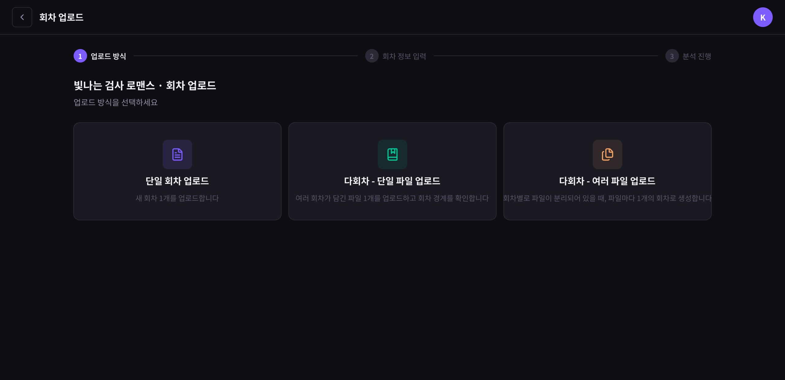
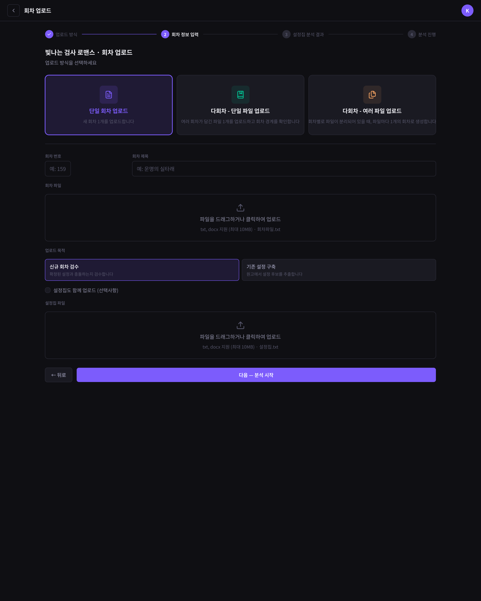
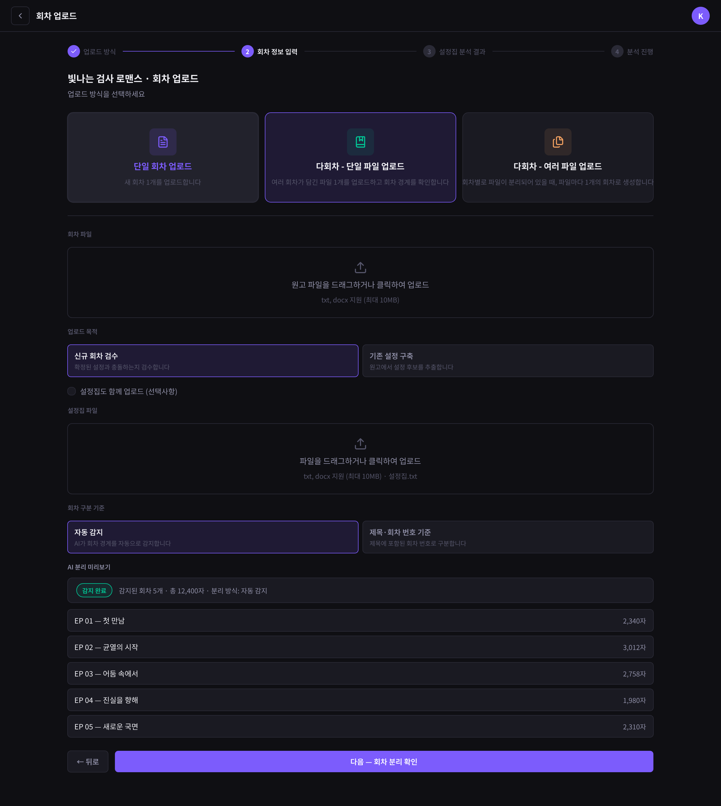
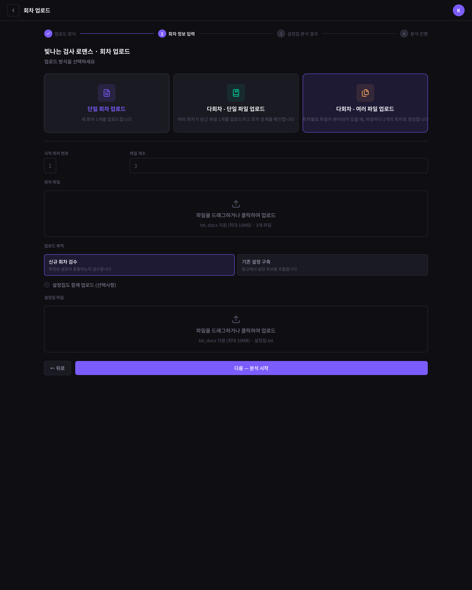
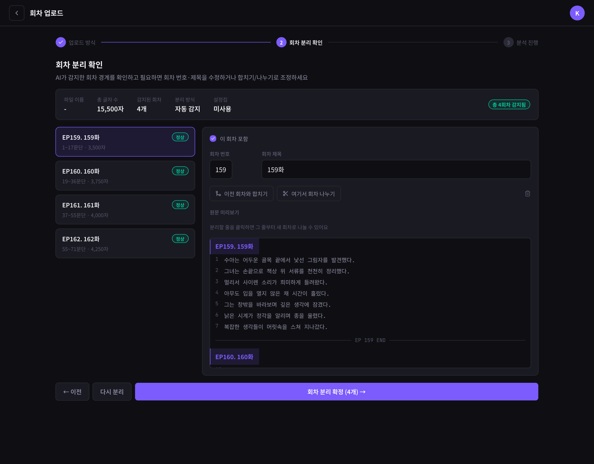
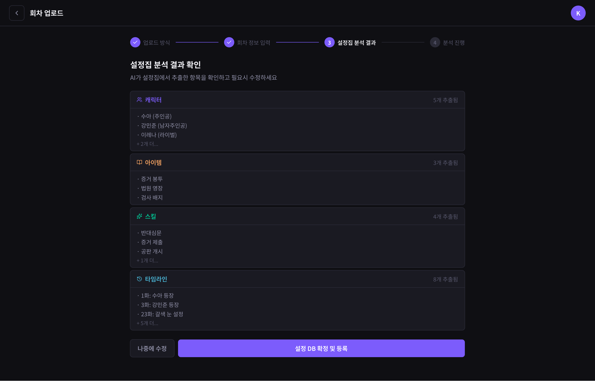
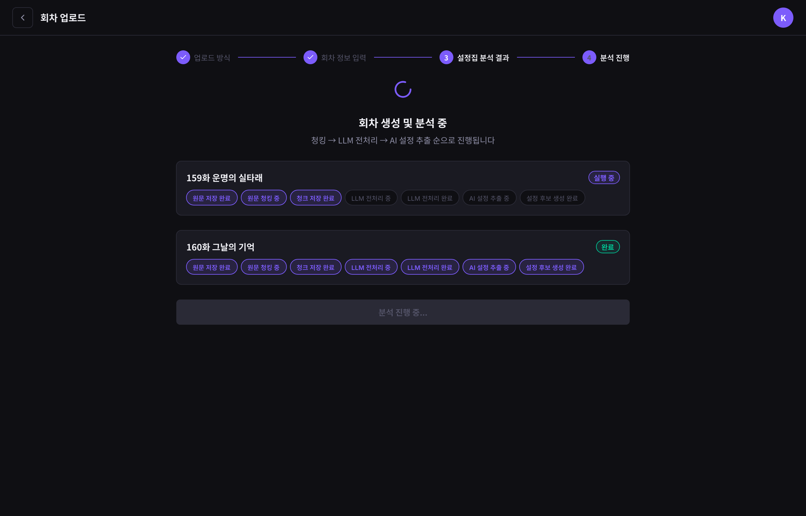

# 데이터 요구사항 — Episode(회차)

[← 전체 인덱스](./README.md)

## 목차

- [회차 업로드 (SEpisodeUpload)](#회차-업로드-sepisodeupload)
  - [1. 업로드 방식 선택](#1-업로드-방식-선택)
  - [2A. 단일 회차 입력](#2a-단일-회차-입력)
  - [2B. 다회차 단일 파일 (AI 자동 분리)](#2b-다회차-단일-파일-ai-자동-분리)
  - [2C. 다회차 여러 파일](#2c-다회차-여러-파일)
  - [3. 회차 분리 확인](#3-회차-분리-확인)
  - [4. 설정집 분석 결과 확인](#4-설정집-분석-결과-확인)
  - [5. 분석 진행](#5-분석-진행)
- [원고 목록 (대시보드 원고 탭)](#원고-목록-대시보드-원고-탭)

---

## 회차 업로드 (SEpisodeUpload)

**URL**: [`/episode-upload`](https://catch-hole.vercel.app/episode-upload)

단일 라우트에서 단계로 진행하지만 각 단계는 역할이 다르다. 공통 식별자는 `workId`(현재 작품)이며, 마지막에 생성된 `episodeId`(들)을 후속 화면으로 전달한다.

흐름: **방식 선택 → (단일/다회차 입력) → [다회차 단일 파일일 때] 회차 분리 확인 → [설정집 포함 시] 설정집 결과 확인 → 분석 진행 → 결과**

---

### 1. 업로드 방식 선택

**1. 화면에 표시할 데이터**
- 업로드 방식 3종 카드: 단일 회차 / 다회차 단일 파일 / 다회차 여러 파일 (각 설명)

**2. 사용자 액션**
- 방식 선택 → [2A](#2a-단일-회차-입력) / [2B](#2b-다회차-단일-파일-ai-자동-분리) / [2C](#2c-다회차-여러-파일) 입력으로 진입

**3. 화면 전환 식별자**
- `workId`

**4. 데이터 없음 / 실패 표시**
- 해당 없음 (선택 UI)

**5. BE에 요청할 데이터**
- 없음

**6. BE와 협의할 범위·상태값**
- 지원할 업로드 방식 범위 (단일/다회차 모두 1차에 포함할지)

---

### 2A. 단일 회차 입력

**1. 화면에 표시할 데이터**
- 회차 번호·제목 입력
- 원고 파일 드롭 (txt/docx, 최대 10MB)
- 업로드 목적 (신규 회차 검수 / 기존 설정 구축)
- 설정집 함께 업로드 옵션

**2. 사용자 액션**
- 파일 업로드, 목적 선택
- 분석 시작 → 설정집 포함 시 [4. 설정집 분석 결과](#4-설정집-분석-결과-확인), 아니면 [5. 분석 진행](#5-분석-진행)

**3. 화면 전환 식별자**
- `workId`, 입력한 회차 번호

**4. 데이터 없음 / 실패 표시**
- 파일 형식·크기 오류, 파일 없음(데모 모드 전환 제안)

**5. BE에 요청할 데이터**
- 회차 업로드 API: 원고 파일, 회차 번호, 제목, 업로드 목적, 설정집(선택)

**6. BE와 협의할 범위·상태값**
- 회차 번호 중복 처리 방식
- 업로드 목적(검수/설정구축)에 따른 후속 처리 분기

---

### 2B. 다회차 단일 파일 (AI 자동 분리)

**1. 화면에 표시할 데이터**
- 원고 파일 드롭
- 회차 구분 기준 (자동 감지 / 제목·회차 번호 기준)
- AI 분리 미리보기 (감지된 회차 수, 총 글자 수, 회차 목록)
- 업로드 목적, 설정집 옵션

**2. 사용자 액션**
- 파일 업로드, 구분 기준 선택
- 다음 → [3. 회차 분리 확인](#3-회차-분리-확인)

**3. 화면 전환 식별자**
- `workId`

**4. 데이터 없음 / 실패 표시**
- 파일 형식·크기 오류, 회차 경계 감지 실패

**5. BE에 요청할 데이터**
- AI 회차 자동 분리 결과: 경계별 회차 번호·제목·문단 범위·글자 수

**6. BE와 협의할 범위·상태값**
- AI 회차 자동 분리를 BE/AI가 제공하는지, 응답 형식
- 구분 기준(자동 vs 제목·번호) 지원 범위

---

### 2C. 다회차 여러 파일

**1. 화면에 표시할 데이터**
- 시작 회차 번호, 파일 개수
- 여러 파일 드롭 (파일당 1회차)
- 업로드 목적, 설정집 옵션

**2. 사용자 액션**
- 여러 파일 업로드
- 분석 시작 → 설정집 포함 시 [4. 설정집 분석 결과](#4-설정집-분석-결과-확인), 아니면 [5. 분석 진행](#5-분석-진행)

**3. 화면 전환 식별자**
- `workId`, 시작 회차 번호

**4. 데이터 없음 / 실패 표시**
- 파일 형식·크기 오류

**5. BE에 요청할 데이터**
- 파일별 1회차 업로드 API (시작 회차 번호 기준 자동 채번)

**6. BE와 협의할 범위·상태값**
- 파일 ↔ 회차 매핑 규칙 (업로드 순서 vs 파일명 기준)

---

### 3. 회차 분리 확인

> 2B(다회차 단일 파일)에서만 거치는 단계.

**1. 화면에 표시할 데이터**
- 감지된 회차 목록 (회차 번호·제목·문단 범위·글자 수, 포함 여부)
- 선택 회차 원문 미리보기 (분리 지점 표시)

**2. 사용자 액션**
- 회차 합치기 / 나누기, 회차 번호·제목 수정, 포함 여부 토글
- 분리 확정 → 설정집 포함 시 [4. 설정집 분석 결과](#4-설정집-분석-결과-확인), 아니면 [5. 분석 진행](#5-분석-진행)

**3. 화면 전환 식별자**
- `workId`, 확정된 회차 경계 목록

**4. 데이터 없음 / 실패 표시**
- 감지된 회차 없음

**5. BE에 요청할 데이터**
- 사용자가 확정·수정한 회차 경계 → 회차 생성

**6. BE와 협의할 범위·상태값**
- 사용자가 수정한 경계(합치기/나누기 결과)를 BE에 어떤 형식으로 전달·반영할지

---

### 4. 설정집 분석 결과 확인

> 설정집을 함께 업로드한 경우에만 거치는 단계.

**1. 화면에 표시할 데이터**
- 카테고리별(캐릭터/아이템/스킬/타임라인) 추출 항목 수와 미리보기

**2. 사용자 액션**
- 설정 DB 확정·등록 / 나중에 수정 → [5. 분석 진행](#5-분석-진행)

**3. 화면 전환 식별자**
- `workId`

**4. 데이터 없음 / 실패 표시**
- 추출 결과 없음

**5. BE에 요청할 데이터**
- 설정집 추출 결과 (카테고리별 항목)

**6. BE와 협의할 범위·상태값**
- 설정집 추출 결과 형식 ([설정 검토](./character.md#설정-검토-ssettingreview)와 동일 구조로 공유할지)

---

### 5. 분석 진행

회차 생성·분석을 처리하는 단계. 진행 표시는 [분석 진행 (S4Loading)](./report.md#분석-진행-s4loading)과 동일한 작업 상태를 사용한다.

**1. 화면에 표시할 데이터**
- 회차별 처리 상태 (청킹 → 전처리 → AI 추출), 작업 상태(대기/진행/완료)

**2. 사용자 액션**
- 완료 후 결과 보기 → 목적에 따라 [설정 검토](./character.md#설정-검토-ssettingreview) 또는 [회차 검사 결과](./report.md#회차-검사-결과-sepisodevalidationreport)

**3. 화면 전환 식별자**
- 생성된 `episodeId`(들), `analysisJobId`

**4. 데이터 없음 / 실패 표시**
- 분석 실패(FAILED), 재시도 안내

**5. BE에 요청할 데이터**
- 분석 작업 진행 상태 (단계, 상태), 완료 시 결과 식별자

**6. BE와 협의할 범위·상태값**
- 진행 상태를 폴링으로 받을지 푸시로 받을지 ([분석 진행](./report.md#분석-진행-s4loading)과 공통)

---

## 원고 목록 (대시보드 원고 탭)

**URL**: [`/dashboard`](https://catch-hole.vercel.app/dashboard) (원고 네비)

**1. 화면에 표시할 데이터**
- 회차 행: 회차 번호, 제목, 업로드일, 글자 수, 충돌 건수, 분석 상태

**2. 사용자 액션**
- 회차 클릭 → 상세 / 에디터(MVP 범위 밖)
- 회차 업로드 → [회차 업로드](#회차-업로드-sepisodeupload)
- 회차 삭제

**3. 화면 전환 식별자**
- `episodeId`

**4. 데이터 없음 / 실패 표시**
- 회차 0개: 빈 상태 ([빈 상태](../screens/v4hg9.png))
- 조회 실패

**5. BE에 요청할 데이터**
- 작품의 회차 목록: 회차 번호, 제목, 업로드일, 글자 수, 충돌 건수, 분석 상태

**6. BE와 협의할 범위·상태값**
- 회차별 충돌 건수·분석 상태를 목록에서 바로 줄 수 있는지
- 분할 회차(예: 151-1) 표기 방식
