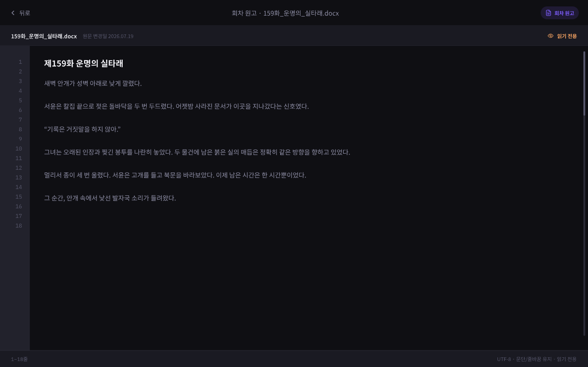
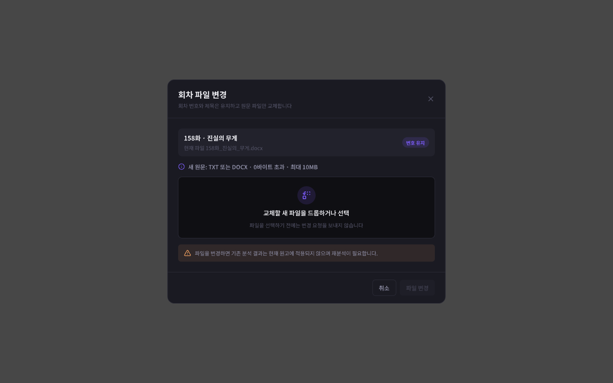

# 데이터 요구사항 — Episode(회차)

[← 전체 인덱스](./README.md)

> 회차 업로드 플로우(SEpisodeUpload)는 [upload.md](./upload.md)로 분리했다. 이 문서는 업로드 이후 원고 탭에서 회차를 조회·관리하는 흐름을 다룬다. 설정집 관리는 [설정DB 설정집 목록 탭](./character.md#설정db-설정집-목록-탭)에서 다룬다.
>
> **원고 목록 비노출 원칙**: 원고 목록은 회차만 표시한다. 설정집 목록·업로드·원문 조회·수정·삭제 UI는 원고 목록에 표시하지 않고 설정DB의 `설정집 목록` 탭에서만 제공한다.

## 목차

- [원고 목록 (대시보드 원고 탭)](#원고-목록-대시보드-원고-탭)
- [회차 원문 보기](#회차-원문-보기)
- [회차 파일 변경 모달](#회차-파일-변경-모달)

---

## 원고 목록 (대시보드 원고 탭)

**URL**: [`/dashboard?nav=manuscripts`](https://www.catchhole.com/dashboard?nav=manuscripts)

상태·관리 화면: [목록 로딩](../screens/zq2mP.png) · [원고 없음](../screens/v4hg9.png) · [목록 조회 실패](../screens/GWwkS.png) · [제목 인라인 수정](../screens/u6jby.png) · [직접 관리 액션](../screens/ovC3I.png) · [액션 실패·목록 유지](../screens/mGVGj.png)

**1. 화면에 표시할 데이터**

- 현재 선택한 작품명
- 업로드된 원고
  - soft delete되지 않은 실제 회차의 전체 개수: `총 N개 회차`
  - 회차 번호 내림차순의 페이지 목록. 한 페이지에 최대 20개 회차 표시
  - 회차 번호: MVP에서는 정수만 지원. `151-1` 같은 분할 회차와 업로드되지 않은 회차의 가상 행은 표시하지 않음
  - 제목: 감지하지 못한 경우 `제목을 찾지 못했어요`와 제목 입력 액션 표시
  - 원본 파일: 업로드 또는 파일 교체로 현재 적용된 원본 파일명
  - 변경일: 최초 파일 업로드 또는 파일 교체 시점(`YYYY.MM.DD`). 제목만 수정하면 변경하지 않음
  - 글자 수: 현재 원문에서 공백과 줄바꿈을 제외한 문자 수
  - 분석 상태: 분석 완료 / 재분석 필요 / 분석 중 / 분석 실패
- 원고 목록 상단에는 설정집 영역을 표시하지 않음
- 최신 분석 배치에 진행·실패·설정 후보 검토가 남아 있으면 원고 목록 위에 한 개의 상태 배너 표시
  - 진행 중: `진행 중인 분석이 있습니다.`
  - 일부·전체 실패: `일부 분석에 실패했습니다.`
  - 설정 후보 검토 필요: `검토할 설정 후보가 있습니다.`
  - 모든 배너의 `분석 목록으로` 액션은 `/dashboard?workId={workId}&nav=analyses`로 이동
- `미분석`, `missing` 상태와 원고 검색은 MVP에서 제공하지 않음

**2. 사용자 액션**

- 회차 올리기 → [회차 업로드](./upload.md#회차-업로드-sepisodeupload)
- 회차 제목
  - 제목 감지 실패 시 `제목 입력`, 제목이 있으면 수정 아이콘 표시
  - 행 안에서 제목을 직접 입력하고 저장 또는 취소
  - 제목 수정은 원문 변경일과 분석 상태에 영향을 주지 않음
- 원고 목록에서는 행별 `결과 보기`·`진행 보기`·`다시 시도` 액션을 제공하지 않음
- 원문 변경으로 `재분석 필요`가 된 회차에는 새 분석을 시작하는 `재분석` 액션을 유지
- `재분석`은 해당 회차 ID를 지정한 `SETTING_EXTRACTION` 작업을 생성해 교체 원문을 다시 청킹하고 캐릭터·세계관 설정 후보를 추출한다. 충돌 검수용 `EPISODE_VALIDATION` 작업으로 생성하지 않는다.
- 진행·실패·설정 후보 검토 상태 확인과 후속 액션은 상단 배너 또는 사이드바의 [분석 목록](./analysis.md#분석-목록-analysislist)에서 업로드 묶음 단위로 수행
- 행의 `원문` → 회차 원문을 [회차 원문 보기](#회차-원문-보기)로 열기
- 행의 `파일 변경` → [회차 파일 변경 모달](#회차-파일-변경-모달)
- 행의 `삭제`: 브라우저 기본 확인창이 아닌 제품 모달에서 아래 내용을 확인한 뒤 soft delete하여 목록에서 숨김
  > 이 회차를 삭제할까요? 삭제한 회차는 원고 목록에서 사라지며 현재 서비스에서는 직접 복구할 수 없습니다.
  - 삭제 대상의 회차 번호·제목·원본 파일명을 함께 표시
  - 취소, 바깥 영역 클릭, `Esc`로 닫을 수 있지만 삭제 요청 중에는 닫기와 중복 요청을 차단
  - 실패하면 회차를 목록에 유지하고 모달 안에 실패 안내와 `다시 시도` 액션 표시
- 분석 중인 회차는 원문 보기와 제목 수정만 허용하고 파일 변경·삭제·중복 분석 요청은 비활성화
- 분석 중인 행이 하나라도 있으면 현재 목록의 상태를 10초 간격으로 한 번에 갱신. 모두 완료·실패하거나 화면을 벗어나면 중단
- 회차 번호 수정, 원고 내용 편집, 삭제 복구, 파일 버전 이력은 MVP에서 제공하지 않음

**3. 화면 전환 식별자**

- 현재 선택된 작품을 구분하는 식별자
- 원문 보기·파일 변경·삭제 대상 회차를 구분하는 식별자
- 분석 목록으로 이동할 현재 작품 식별자

실제 필드명과 타입은 Swagger와 BE 도메인 문서를 따른다.

**4. 데이터 없음 / 실패 표시**

- 최초 목록 조회 중에는 로딩 안내 표시 ([목록 로딩](../screens/zq2mP.png))
- 원고가 없으면 `아직 업로드된 원고가 없습니다`와 회차 업로드 액션 표시 ([빈 상태](../screens/v4hg9.png))
- 목록 조회 실패 시 오류 안내와 `다시 시도` 표시 ([목록 조회 실패](../screens/GWwkS.png))
- 변경 액션은 서버 성공 후에만 화면에 반영
  - 삭제 실패: 행 유지
  - 파일 변경 실패: 기존 파일·분석 상태 유지
  - 제목 저장 실패: 기존 제목 유지 후 오류 안내
- 분석 요청·파일 변경·삭제 등 행 액션 실패 시 현재 목록을 유지하고 상단에 오류 안내 표시 ([액션 실패·목록 유지](../screens/mGVGj.png))
- 분석 상태 자동 갱신 실패 시 현재 상태를 유지하고 다음 갱신을 다시 시도

**5. 화면 데이터 요구사항**

**5-1. BE → FE 제공 데이터 요구사항**

아래 묶음은 화면이 데이터를 사용하는 단위이며, API나 응답 DTO를 같은 단위로 만들어야 한다는 뜻은 아니다. 실제 결합·분리 방식과 필드명은 Swagger와 BE 도메인 문서에서 정한다.

**원고 목록**

| 데이터 의미 | 형태·필수성 | 값 없음·조건 |
| --- | --- | --- |
| 현재 작품명 | 단일 값·필수 | 화면 제목에 표시 |
| 활성 회차 전체 개수 | 0 이상의 정수·필수 | 회차가 없으면 `0`; soft delete된 회차 제외 |
| 현재 페이지 회차 목록 | 목록·필수 | 회차가 없으면 빈 목록; 회차 번호 내림차순 |
| 페이지 이동 정보 | 단일 값·필수 | 다음·이전 페이지가 없음을 구분할 수 있어야 함 |

각 회차 항목은 다음 의미를 제공한다.

| 데이터 의미 | 형태·필수성 | 값 없음·조건 |
| --- | --- | --- |
| 회차 고유 식별자 | 단일 값·필수 | 원문 조회와 변경·삭제 대상 식별 |
| 회차 번호 | 정수·필수 | MVP에서는 분할 회차를 제공하지 않음 |
| 제목 | 단일 값·선택 | `null`이면 제목 감지 실패로 표시 |
| 현재 원본 파일명 | 단일 값·필수 | 원고 목록의 `원본 파일` 열과 변경·삭제 대상 확인에 표시 |
| 원문 변경 시점 | 단일 값·필수 | 최초 업로드 또는 파일 교체 시점; 제목 수정으로 바뀌지 않음 |
| 글자 수 | 0 이상의 정수·필수 | 현재 원문의 공백·줄바꿈 제외 문자 수 |
| 분석 상태 | 단일 상태값·필수 | 분석 완료 / 재분석 필요 / 분석 중 / 분석 실패 |

분석 상태를 갱신할 때는 현재 페이지 회차들의 고유 식별자와 분석 상태를 한 번에 받을 수 있어야 한다. 충돌 의심 항목의 미처리 수는 원고 목록 열로 표시하지 않고 분석 목록·리포트 문맥에서 관리한다.

**원고 목록 분석 안내 배너**

원고 목록은 서버가 최근 분석 요청순으로 정렬한 첫 번째 배치의 상태만 사용해 하나의 안내 배너를 선택한다. 최신 배치가 `PARTIALLY_FAILED`·`FAILED`, `IN_PROGRESS`, `REVIEW_REQUIRED`이면 각각 해당 안내를 표시하고, `COMPLETED`이면 과거 배치에 실패 이력이 남아 있어도 배너를 표시하지 않는다. 배너 조회 실패가 회차·설정집 목록을 가리거나 행별 상태를 추측하게 해서는 안 된다.

**작업 완료 후 갱신되어야 할 화면 데이터**

BE가 작업 응답으로 제공하거나 FE가 다시 조회해 다음 최신 상태를 확보할 수 있어야 한다.

| 작업 | FE가 확보해야 할 최신 데이터 |
| --- | --- |
| 제목 수정 | 저장된 제목 |
| 회차 파일 변경 | 원문 변경 시점, 글자 수, `재분석 필요` 상태 |
| 재분석 | 분석 작업을 추적할 식별 정보와 분석 중 상태 |
| 회차 soft delete | 대상이 제외된 최신 목록과 변경된 활성 회차 전체 개수 |

**5-2. FE → BE 전달 데이터 요구사항**

- 원고 목록 조회·갱신
  - 현재 작품 식별자, 페이지 위치와 크기(최대 20개), 회차 번호 내림차순 정렬 의도
  - 분석 중 회차가 있을 때 현재 목록 상태를 10초 간격으로 일괄 갱신하기 위한 조회 문맥
  - 상단 분석 안내 배너를 정하기 위한 최신 분석 배치 요약 조회 문맥
- 제목 저장
  - 대상 회차 식별자와 사용자가 입력한 제목
  - FE는 앞뒤 공백을 제거한 값을 전달
- 원문 조회
  - 원문을 열 대상 회차 식별자
- 회차 파일 변경
  - 대상 회차 식별자와 새 원문 파일
  - 회차 업로드와 동일한 파일 검증을 통과하고 사용자가 교체를 확인한 경우에만 전달
  - 회차 번호 변경은 전달하지 않음
- 회차 삭제
  - 대상 회차 식별자와 목록에서 제거하려는 사용자의 삭제 의도

**6. BE와 협의할 범위·상태값**

- **BE**: 화면의 분석 완료 / 재분석 필요 / 분석 중 / 분석 실패를 현행 분석 작업·회차 상태에 매핑하는 기준. `미분석` 상태는 MVP에서 사용하지 않음
- **BE**: 회차 파일을 원자적으로 교체하고 기존 분석 결과를 무효화한 뒤 `재분석 필요`로 전환하는 계약. 무효화된 행의 물리 삭제·비활성화 방식은 참조 무결성을 지키면서 BE가 결정
- **BE**: 회차의 soft delete 계약과 활성 목록·전체 개수·회차 번호 중복 검사에서 제외하는 기준. 사용자 복구 UI는 MVP에서 제공하지 않음
- **BE·분석**: 원고 목록 배너가 사용할 업로드 묶음별 진행·부분 실패·실패·검토 필요·완료 상태와 최근 분석 요청순 조회 계약
- **FE 보강**: 현재 mock의 `missing`, `unanalyzed`, `151-1`·`151-2` 회차는 MVP 요구사항이 아니며 실제 연동 시 제거

---

## 회차 원문 보기

**진입**: [원고 목록](#원고-목록-대시보드-원고-탭)의 회차 `원문 보기`

상태 화면: [원문 조회 중](../screens/KYpxM.png) · [조회·변환·접근 오류](../screens/vx47i.png)

회차의 현재 원문을 읽기 전용으로 확인한다.

**1. 화면에 표시할 데이터**

- 원본 파일명
- 문단과 줄바꿈을 유지한 텍스트 원문
- 원문 위치를 확인할 수 있는 줄 번호
- 원문 로딩 상태와 뒤로 가기
- 편집 전환, 설정 DB·충돌 분석 패널, 분석 실행, 문서 스타일·이미지·페이지 레이아웃은 표시하지 않음

**2. 사용자 액션**

- 원문 세로 스크롤
- `뒤로` → 이전 원고 목록의 페이지·스크롤 위치로 복귀
- 원문 편집·분석 요청·파일 다운로드는 MVP에서 제공하지 않음

**3. 화면 전환 식별자**

- 원문 조회 대상 회차 식별자

원고 목록의 페이지·스크롤 위치는 FE 화면 복귀 상태이며 BE에 전달하지 않는다. 실제 필드명과 타입은 Swagger와 BE 도메인 문서를 따른다.

**4. 데이터 없음 / 실패 표시**

- 원문 조회 중 로딩
- 네트워크·서버 조회 실패: 오류 안내와 다시 시도, 원고 목록으로 돌아가기 제공
- TXT·DOCX 텍스트 변환 실패: 원문을 표시할 수 없다는 안내와 원고 목록으로 돌아가기 제공
- soft delete되었거나 접근할 수 없는 원문: 사용할 수 없는 원문으로 안내하고 원고 목록으로 복귀

**5. 화면 데이터 요구사항**

**5-1. BE → FE 제공 데이터 요구사항**

**원문 표시 데이터**

| 데이터 의미 | 형태·필수성 | 값 없음·조건 |
| --- | --- | --- |
| 원본 파일명 | 단일 값·필수 | 화면 제목에 표시 |
| 텍스트 원문 | 단일 값·필수 | TXT·DOCX에서 추출하며 문단·줄바꿈 보존. 스타일·이미지·페이지 레이아웃 제외 |

줄 번호는 FE가 제공받은 텍스트를 기준으로 생성하므로 BE 제공 데이터가 아니다.

**원문 조회 실패**

| 데이터 의미 | 형태·필수성 | 값 없음·조건 |
| --- | --- | --- |
| 실패 식별값 | 단일 상태값·실패 시 필수 | 조회 실패 / 변환 실패 / 사용할 수 없는 원문을 구분해 FE 안내로 매핑 |

**5-2. FE → BE 전달 데이터 요구사항**

- 조회 대상 회차 식별자
- 스크롤 위치, 줄 번호, 뒤로 가기 대상은 FE 전용 상태이므로 전달하지 않음

**6. BE와 협의할 범위·상태값**

- **BE**: 회차 원문 조회의 실제 응답 필드
- **BE**: TXT·DOCX의 문단·줄바꿈 보존 기준과 변환 실패 상태값
- **BE**: soft delete되었거나 사용할 수 없는 원문의 조회 실패 기준

---

## 회차 파일 변경 모달

**진입**: [원고 목록](#원고-목록-대시보드-원고-탭)의 회차 행 `파일 변경`

상태 화면: [파일 검증 오류](../screens/olfM9.png) · [변경 실패·기존 파일 유지](../screens/ovixX.png) · [변경 중](../screens/xGRj3.png)

회차 번호와 식별자는 유지하면서 현재 원문 파일만 새 파일로 교체한다.

**1. 화면에 표시할 데이터**

- 모달 제목: `회차 파일 변경`
- 대상 회차 번호와 제목, 현재 원본 파일명
- TXT·DOCX, 파일당 최대 10MB 안내
- 새 원문 파일의 단일 파일 드롭·선택 영역
- 파일 선택 후 새 원본 파일명과 파일 크기
- 변경 영향 안내
  > 파일을 변경하면 기존 분석 결과는 현재 원고에 적용되지 않으며 재분석이 필요합니다.
- `취소`, `파일 변경`, 닫기(`X`) 액션과 변경 중 로딩 상태
- 회차 번호·제목 수정, 자동 재분석 선택, 기존 파일 버전 이력은 표시하지 않음

**2. 사용자 액션**

- 새 원문 파일을 드롭하거나 파일 선택기로 한 개 선택
- 변경 전 다른 파일로 다시 선택
- 파일 미선택 시 `파일 변경` 비활성화
- [회차 업로드](./upload.md#회차-업로드-sepisodeupload)와 같은 FE 파일 검증 적용
  - TXT·DOCX 외 형식, 10MB 초과, 0바이트 파일은 오류를 표시하고 서버로 전달하지 않음
- `파일 변경`
  - 제출 중 버튼·닫기·취소를 비활성화해 중복 요청과 이탈 방지
  - 새 파일 업로드와 서버 검증이 모두 성공한 뒤 현재 원문을 원자적으로 교체
  - 회차 식별자·회차 번호는 유지하고 기존 분석 결과는 무효화
  - 상태를 `재분석 필요`로 변경하되 자동 분석은 시작하지 않음
  - 성공 시 모달을 닫고 원고 행의 원문 변경일·글자 수·분석 상태 갱신
  - 실패 시 기존 파일과 분석 결과를 유지하고 모달의 새 파일 선택과 오류 안내를 유지해 다시 시도 제공
- 변경 전 `취소` 또는 `X` → 모달을 닫고 새 파일 선택 초기화
- 바깥 영역 클릭으로는 모달을 닫지 않음
- 분석 중인 회차에서는 원고 목록에서 진입 액션 자체를 비활성화

**3. 화면 전환 식별자**

- 파일 변경 대상 회차를 구분하는 식별자

실제 필드명과 타입은 Swagger와 BE 도메인 문서를 따른다.

**4. 데이터 없음 / 실패 표시**

- 새 파일 미선택: 기본 상태, `파일 변경` 비활성화
- 지원하지 않는 파일 형식
- 파일 크기 초과
- 빈 파일(0바이트)
- 대상 회차가 삭제되었거나 분석 중으로 전환되어 변경할 수 없음
- 파일 업로드·검증·교체 실패
  - 기존 원문과 분석 결과는 유지
  - 새 파일 선택과 오류 메시지를 유지하고 다시 시도 제공
- 변경 중: 로딩 표시, 중복 제출과 모달 닫기 방지

**5. 화면 데이터 요구사항**

**5-1. BE → FE 제공 데이터 요구사항**

**변경 대상 회차**

원고 목록 데이터로 확보하거나 모달 진입 후 추가 조회할 수 있다.

| 데이터 의미 | 형태·필수성 | 값 없음·조건 |
| --- | --- | --- |
| 회차 번호 | 정수·필수 | 사용자가 변경 대상을 확인하는 용도 |
| 회차 제목 | 단일 값·선택 | `null`이면 제목 감지 실패 상태로 표시 |
| 현재 원본 파일명 | 단일 값·필수 | 교체 대상 확인 용도 |

**파일 변경 완료 후 회차 상태**

BE가 변경 응답으로 제공하거나 FE가 목록을 다시 조회해 다음 최신 데이터를 확보할 수 있어야 한다.

| 데이터 의미 | 형태·필수성 | 값 없음·조건 |
| --- | --- | --- |
| 새 원본 파일명 | 단일 값·변경 성공 시 필수 | 이후 원문 보기 대상 |
| 원문 변경 시점 | 단일 값·변경 성공 시 필수 | 원고 목록의 `원문 변경일` 갱신 |
| 글자 수 | 0 이상의 정수·변경 성공 시 필수 | 새 원문의 공백·줄바꿈 제외 문자 수 |
| 분석 상태 | 단일 상태값·변경 성공 시 필수 | `재분석 필요` |

**파일 변경 실패**

| 데이터 의미 | 형태·필수성 | 값 없음·조건 |
| --- | --- | --- |
| 실패 식별값 | 단일 상태값·실패 시 필수 | 파일 검증 실패 / 대상 상태 충돌 / 서버 실패를 구분해 FE 안내로 매핑 |

**5-2. FE → BE 전달 데이터 요구사항**

- 변경 대상 회차 식별자
- 사용자가 선택한 TXT 또는 DOCX 새 원문 파일 한 개
- 새 원본 파일명과 파일 형식·크기 정보
- FE 검증 기준
  - 파일 형식은 TXT·DOCX
  - 파일 크기는 0바이트 초과 10MB 이하
- 사용자가 안내를 확인하고 현재 원문을 교체하려는 의도
- 회차 번호·제목, 모달 열림 여부, 선택 파일 미리보기 상태는 전달하지 않음

**6. BE와 협의할 범위·상태값**

- **BE**: 새 파일 저장과 현재 원문 참조 교체를 원자적으로 처리하고 실패 시 기존 원문을 유지하는 계약
- **BE**: 기존 분석 결과를 무효화하고 회차를 `재분석 필요`로 전환하는 계약. 무효화된 데이터의 물리 삭제·비활성화 방식은 참조 무결성을 지키면서 BE가 결정
- **BE**: MIME·확장자·파일 크기·빈 파일 검증 기준과 실패 상태값
- **BE**: 요청 중 대상 회차가 삭제되거나 분석 중으로 바뀐 경우의 동시성 실패 기준
