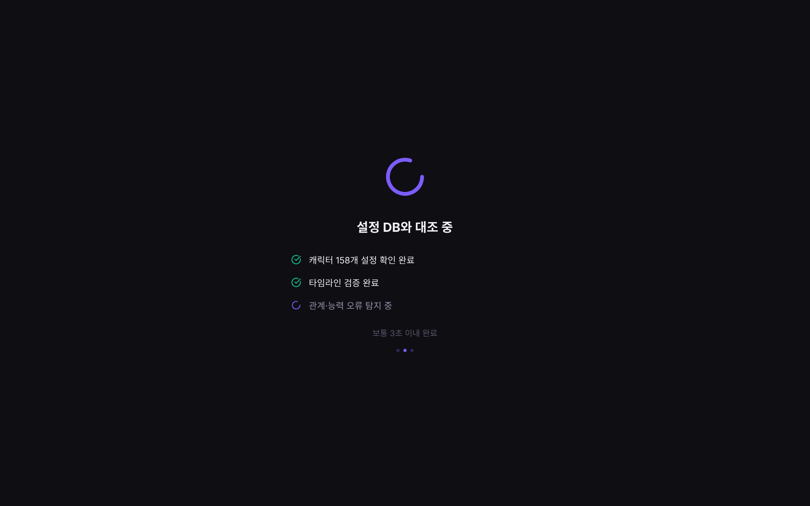
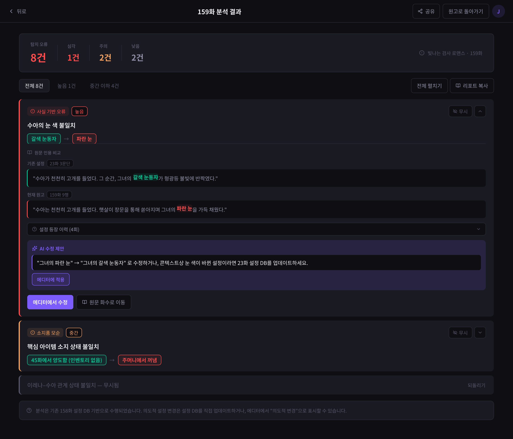
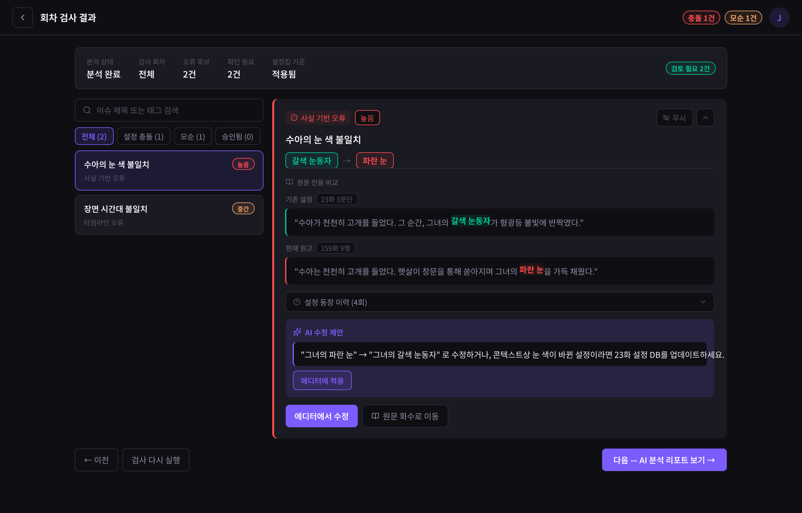

# 데이터 요구사항 — Report(분석/리포트)

[← 전체 인덱스](./README.md)

## 목차

- [분석 진행 (S4Loading)](#분석-진행-s4loading)
- [오류 리포트 (S5Report)](#오류-리포트-s5report)
- [회차 검사 결과 (SEpisodeValidationReport)](#회차-검사-결과-sepisodevalidationreport)

---

## 분석 진행 (S4Loading)

**URL**: [`/loading`](https://catch-hole.vercel.app/loading)

**1. 화면에 표시할 데이터**
- 진행 애니메이션, 단계별 진행(캐릭터 설정 확인 → 타임라인 검증 → 관계·능력 탐지)
- 회차별 처리 상태 (청킹 → 전처리 → AI 추출)

**2. 사용자 액션**
- 자동 완료 후 결과 화면으로 이동

**3. 화면 전환 식별자**
- `analysisJobId`, `episodeId` → 완료 시 [오류 리포트](#오류-리포트-s5report) 또는 [회차 검사 결과](#회차-검사-결과-sepisodevalidationreport)

**4. 데이터 없음 / 실패 표시**
- 분석 실패(FAILED) 상태, 재시도 안내

**5. BE에 요청할 데이터**
- 분석 작업 상태: 단계, 진행률, 상태(대기/진행/완료/실패)
- 완료 시 결과 식별자

**6. BE와 협의할 범위·상태값**
- 진행 상태를 폴링으로 받을지 푸시(SSE 등)로 받을지
- 단계·진행률 표기 형식
- 실패 시 에러 정보·재시도 방식

---

## 오류 리포트 (S5Report)

**URL**: [`/report`](https://catch-hole.vercel.app/report) · 발행 전 전체 검수: [`/report?mode=prePublish`](https://catch-hole.vercel.app/report?mode=prePublish)

회차 원고와 기존 설정 DB를 대조해 충돌/모순을 보여준다.

**1. 화면에 표시할 데이터**
- 요약: 탐지 오류 수, 심각도별(심각/주의/낮음) 집계
- 필터: 전체 / 높음 / 중간 이하
- 오류 카드별:
  - 오류 유형(태그), 심각도(높음/중간/낮음)
  - 제목, 변경 화살표(기존 값 → 현재 값)
  - 원문 인용 비교 — **기존 근거 문장**(근거 회차·문단)과 **문제된 신규 원문 문장**(회차·행), 하이라이트
  - 설정 등장 이력 (회차별 일치/충돌)
  - AI 수정 제안

**2. 사용자 액션**
- 오류 무시 / 되돌리기, 카드 펼치기
- 에디터에서 수정(MVP 범위 밖), 원문 화수로 이동, AI 제안 적용
- 공유, 발행 전 전체 검수 모드 전환

**3. 화면 전환 식별자**
- `episodeId`, `?mode=prePublish`, (오류) `issueId`

**4. 데이터 없음 / 실패 표시**
- 충돌 없음 상태 (발행 전 검수 충돌 없음: [f7ojLm](../screens/f7ojLm.png))
- 발행 전 전체 검수: [j7heI](../screens/j7heI.png)

**5. BE에 요청할 데이터**
- 오류(충돌/모순) 목록, 각 항목:
  - 오류 유형, 심각도
  - 문제된 신규 원문 문장
  - 비교 대상 기존 근거 문장
  - 근거 회차/문단 위치
  - 설정 등장 이력
  - 수정 제안

**6. BE와 협의할 범위·상태값**
- 심각도 단계 기준값과 표기 방식
- 근거 위치 정보 형식 (회차 / 문단 / 행 단위)
- 오류 유형 분류 체계 (사실·타임라인·관계·소지품·수치 등)
- AI 수정 제안 제공 여부·형식
- "발행 전 전체 검수"의 범위 지정 방식(전체 회차 일괄)

---

## 회차 검사 결과 (SEpisodeValidationReport)

**URL**: [`/episode-validation-report`](https://catch-hole.vercel.app/episode-validation-report)

신규 회차 검수(EPISODE_VALIDATION) 후 충돌/모순 결과. 오류 카드 구조는 [오류 리포트](#오류-리포트-s5report)와 동일.

**1. 화면에 표시할 데이터**
- 충돌·오류 건수 뱃지, 필터(전체/충돌/오류/무시)
- 오류 카드 (오류 리포트와 동일 구조)

**2. 사용자 액션**
- 무시 / 필터, (수정), 이슈 선택

**3. 화면 전환 식별자**
- `episodeId`(들), (이슈) `?issue=`

**4. 데이터 없음 / 실패 표시**
- 충돌 없음 상태 ([충돌 없음](../screens/uxGcn.png))

**5. BE에 요청할 데이터**
- 회차 검사 결과(충돌/모순) — 오류 리포트와 동일 구조

**6. BE와 협의할 범위·상태값**
- 오류 리포트와 동일 (심각도·근거 위치·유형 분류·수정 제안)
- 단일 회차 검수와 동일 응답 스키마를 공유할지
