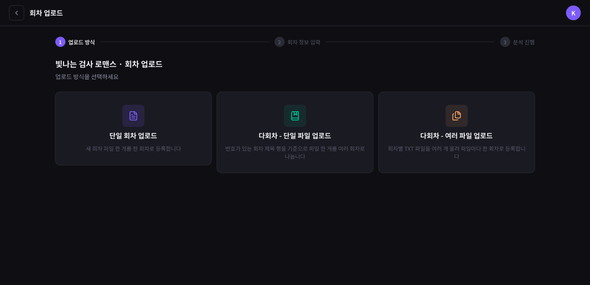
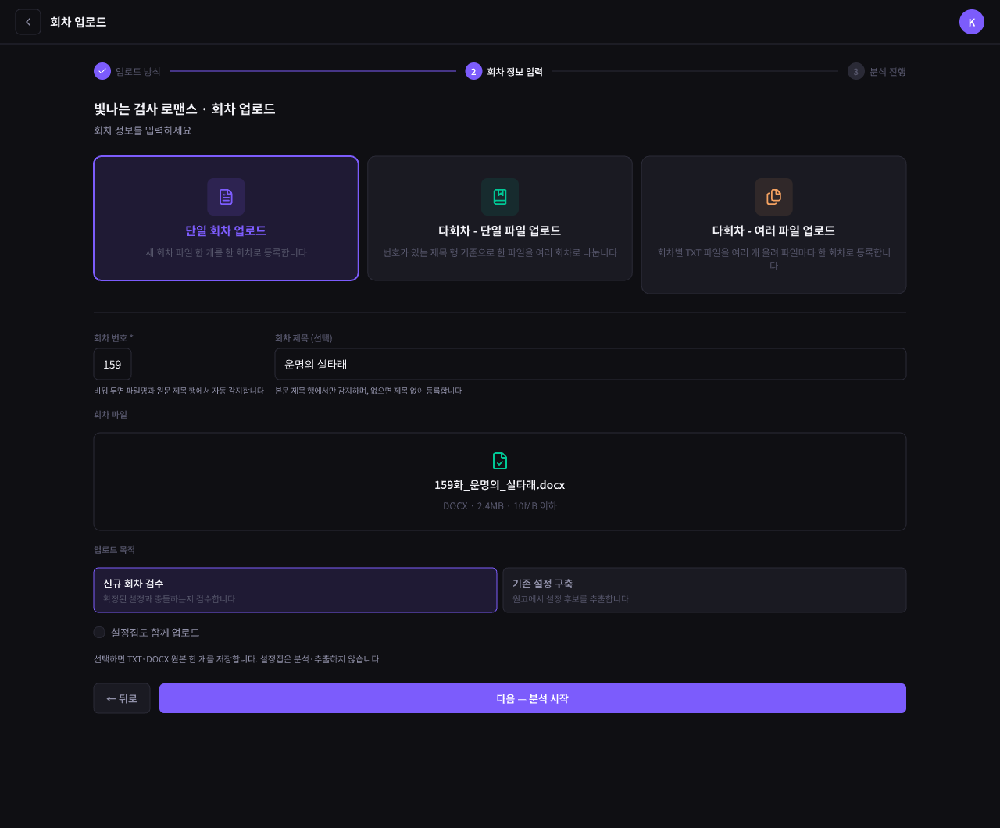
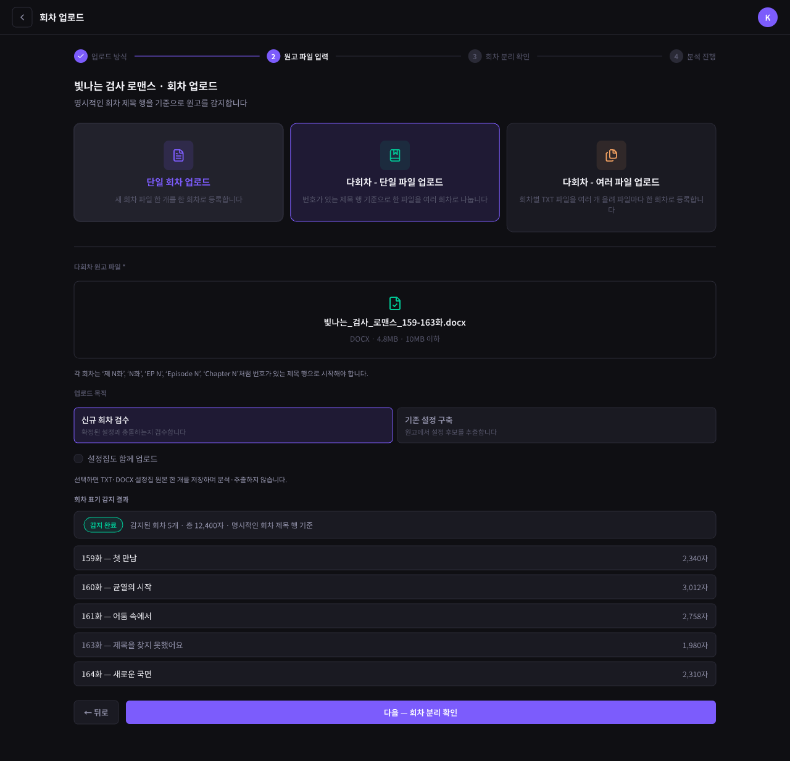
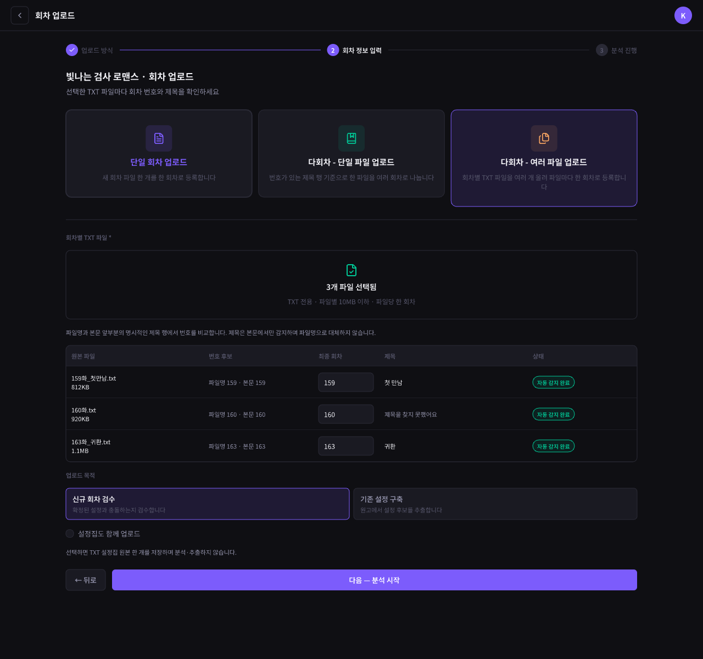
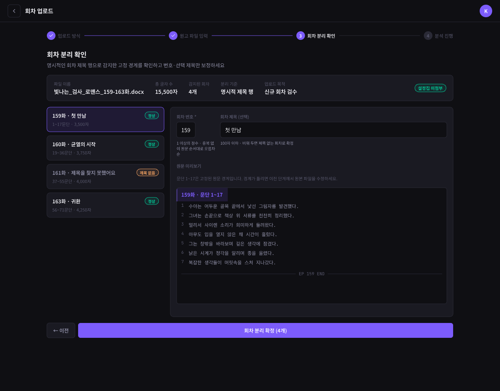
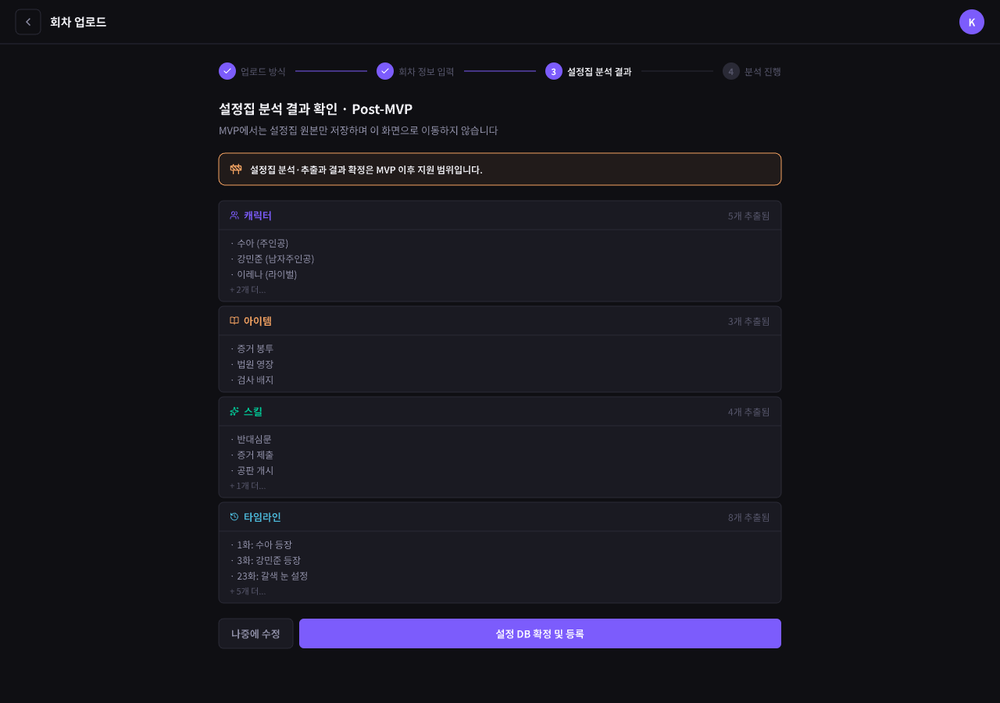
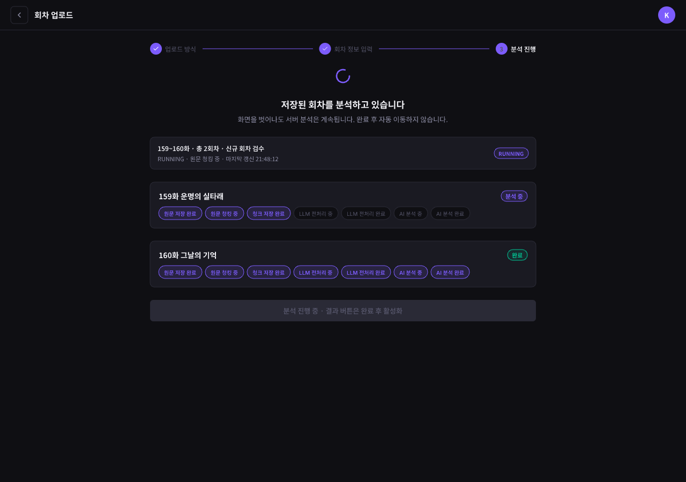

# 데이터 요구사항 — Upload(회차 업로드)

[← 전체 인덱스](./README.md)

## 목차

- [데이터 요구사항 — Upload(회차 업로드)](#데이터-요구사항--upload회차-업로드)
  - [목차](#목차)
  - [회차 업로드 (SEpisodeUpload)](#회차-업로드-sepisodeupload)
    - [1. 업로드 방식 선택](#1-업로드-방식-선택)
    - [2A. 단일 회차 입력](#2a-단일-회차-입력)
    - [2B. 다회차 단일 파일 입력](#2b-다회차-단일-파일-입력)
    - [2C. 다회차 여러 파일](#2c-다회차-여러-파일)
    - [3. 회차 분리 확인](#3-회차-분리-확인)
    - [4. 설정집 분석 결과 확인](#4-설정집-분석-결과-확인)
    - [5. 분석 진행](#5-분석-진행)

---

## 회차 업로드 (SEpisodeUpload)

**URL**: [`/episode-upload`](https://www.catchhole.com/episode-upload)

단일 라우트에서 단계로 진행하지만 각 단계는 역할이 다르다. 공통 식별자는 `workId`(현재 작품)이며, 마지막에 생성된 `episodeId`(들)을 후속 화면으로 전달한다.

MVP 흐름: **방식 선택 → (단일/다회차 입력) → [다회차 단일 파일일 때] 회차 분리 확인 → 분석 진행 → 결과**

> **Theme V2 화면 계약**: 방식 카드, 입력·파일 선택, 회차 분리 확인, 회차별 분석 진행·실패·완료 상태를 하나의 밝은 워크스페이스 안에서 이어서 표시한다. 단계·버튼·입력·진행 아이콘·상태 카드의 primary 강조는 공통 Theme V2 파란색 토큰을 사용하고, 성공·실패·주의 상태의 의미색은 유지한다. 기존 URL, 감지·확정 데이터, 업로드·재시도 mutation과 polling 계약은 바꾸지 않는다. 실제 분석 진행 화면은 별도 `/loading`이 아니라 `/episode-upload`의 `processing` 단계다.

> **출시 범위 메모**: 이번 MVP에서는 `기존 설정 구축`만 새 분석으로 시작할 수 있다. 화면에는 이 목적을 왼쪽의 기본 선택으로 표시하고, 오른쪽 `신규 회차 검수`는 `업데이트 예정`으로 비활성화한다. 과거에 생성된 검수 작업의 상태 조회·재시도 호환은 유지하지만 사용자가 새 검수 작업을 만들 수는 없다.

설정집 원본을 함께 업로드하더라도 설정집을 분석·추출하거나 별도의 결과 확인 단계를 거치지 않고, 원본 저장 결과와 회차 분석을 독립적으로 처리한다.

MVP 이후 설정집 분석·추출을 지원하면, 설정집을 포함한 업로드에서 [4. 설정집 분석 결과 확인](#4-설정집-분석-결과-확인)을 거쳐 분석 진행으로 이동한다.

---

### 1. 업로드 방식 선택

상태 화면: [작품 정보 로딩](../screens/bLnuy.png) · [작품 없음·접근 실패](../screens/z2zFht.png)

**1. 화면에 표시할 데이터**

- 현재 업로드 대상 작품명
- 현재 단계가 `업로드 방식`임을 보여주는 진행 단계 표시
- MVP에서 지원하는 업로드 방식 3종 카드
  - `단일 회차 업로드`: 새 회차 파일 한 개를 한 회차로 등록
  - `다회차 - 단일 파일 업로드`: 회차 번호·제목 표기가 있는 파일 한 개를 여러 회차로 자동 분리한 뒤 감지 목록 확인
  - `다회차 - 여러 파일 업로드`: 회차별 파일 여러 개를 파일당 한 회차로 등록
- `다회차 - 단일 파일 업로드`를 AI 문맥 기반 분리로 안내하지 않음

**2. 사용자 액션**

- 업로드 방식 선택
  - 단일 회차 → [2A. 단일 회차 입력](#2a-단일-회차-입력)
  - 다회차 단일 파일 → [2B. 다회차 단일 파일](#2b-다회차-단일-파일-입력)
  - 다회차 여러 파일 → [2C. 다회차 여러 파일](#2c-다회차-여러-파일)
- 다른 방식으로 전환했다가 돌아오면 해당 방식의 유효한 파일, 감지 결과와 사용자 수정값을 함께 복원
  - 파일은 남았지만 감지 결과만 사라진 반쪽 상태를 만들지 않음
  - 선택된 파일이 없는 방식의 파일 오류와 일시적인 요청 오류는 전환 시 초기화
- 뒤로 가기 → 업로드 화면에 진입하기 전 화면으로 복귀
- 방식 선택만으로는 업로드나 회차 생성을 요청하지 않음

**3. 화면 전환 식별자**

- 업로드 대상인 현재 작품을 구분하는 식별자
- 사용자가 선택한 업로드 방식은 다음 입력 단계를 결정하는 FE 화면 상태
- 각 방식의 파일·감지 결과·사용자 수정값은 `uploadType`별로 분리된 FE 화면 상태

실제 필드명과 타입은 Swagger와 BE 도메인 문서를 따른다.

**4. 데이터 없음 / 실패 표시**

- 현재 작품 정보를 불러오는 중: 작품명 영역 로딩 표시
- 현재 작품을 찾을 수 없거나 접근할 수 없음: 업로드 방식을 선택하지 못하게 하고 작품 목록으로 돌아가기 제공
- 업로드 방식 카드는 정적 UI이므로 별도 빈 상태 없음

**5. 화면 데이터 요구사항**

**5-1. BE → FE 제공 데이터 요구사항**

**업로드 대상 작품**

| 데이터 의미 | 형태·필수성 | 값 없음·조건 |
| --- | --- | --- |
| 작품 고유 식별자 | 단일 값·필수 | 업로드 대상과 접근 권한 확인 |
| 작품명 | 단일 값·필수 | 화면 제목에 표시 |

업로드 방식 카드의 명칭·설명은 FE 정적 데이터이며 BE 제공 대상이 아니다.

**5-2. FE → BE 전달 데이터 요구사항**

- 이 단계에서는 BE에 전달하는 데이터 없음
- 선택한 업로드 방식은 FE에 유지하고 각 입력 단계에서 실제 업로드 요청을 보낼 때 전달

**6. BE와 협의할 범위·상태값**

- 없음 — 세 업로드 방식을 모두 MVP에 포함하며, 각 방식의 파일·분리·회차 매핑 계약은 해당 입력·확인 단계에서 정리

---

### 2A. 단일 회차 입력

상태 화면: [설정집 동반 업로드](../screens/l7ThWN.png) · [입력 검증 오류](../screens/oy2N6.png) · [제출 중](../screens/XQUqV.png) · [전체 저장 실패](../screens/MwTeh.png) · [설정집 저장 부분 실패](../screens/a4PuBU.png) · [분석 시작 실패](../screens/ylHJO.png)

**1. 화면에 표시할 데이터**

- 현재 업로드 대상 작품명
- 현재 단계가 `회차 정보 입력`임을 보여주는 진행 단계 표시
  - `업로드 방식`은 완료, `회차 정보 입력`은 현재, `분석 진행`은 미진행 상태
  - 설정집 원본을 함께 올려도 별도의 설정집 분석·결과 확인 단계는 표시하지 않음
- 업로드 방식 3종 카드와 선택된 `단일 회차 업로드` 상태
- 회차 번호 입력
  - 최초에는 값을 비운 `자동 감지` 상태로 표시
  - 활성 회차가 있으면 가장 큰 회차 번호에 1을 더한 값을 `추천 다음 회차` 안내로만 표시
  - 활성 회차가 없으면 `추천 다음 회차: 1화`로 안내
  - 추천 번호는 입력값이나 감지 요청값으로 자동 사용하지 않음
  - 사용자가 다른 1 이상의 정수로 변경 가능
  - 값을 비워 두면 파일에서 회차 번호를 자동으로 감지
  - 자동 감지에 성공하면 감지한 번호를 입력란에 표시해 사용자가 제출 전에 확인·수정할 수 있음
- 회차 제목 입력
  - 최초에는 값을 비운 상태로 표시하는 선택 입력, 최대 100자
  - 사용자가 비워 두면 원문 앞부분의 명시적인 회차 제목 행에서 회차 번호 뒤 제목을 자동 감지
  - 사용자가 제목을 입력했다가 모두 지우면 다시 자동 감지 상태로 취급
  - 파일명은 제목으로 사용하지 않음
  - 감지하지 못하면 제목 없는 회차로 등록하고, 원고 목록에서 `제목을 찾지 못했어요`와 `제목 입력` 액션을 표시해 바로 수정할 수 있음
- 회차 원고 파일
  - TXT 또는 DOCX 한 개, 0바이트 초과 10MB 이하
  - 선택 전 드롭·파일 선택 영역, 선택 후 원본 파일명과 파일 크기
- 업로드 목적
  - `기존 설정 구축`: 이번 회차 원고에서 설정 후보를 추출하며 기본 선택·제출 가능
  - `신규 회차 검수`: `업데이트 예정`으로 표시하고 선택·제출 불가
- `설정집도 함께 업로드` 선택 옵션
  - 기본값은 선택하지 않은 상태
  - 선택한 경우에만 TXT 또는 DOCX 설정집 원본 파일 한 개의 입력 영역 표시
  - 설정집은 0바이트 초과 10MB 이하의 원본만 저장하고 분석·추출하지 않음
- `뒤로`, `다음 — 분석 시작` 액션과 제출 중 상태

**2. 사용자 액션**

- 다른 업로드 방식 카드를 선택해 해당 입력 방식으로 전환
- 추천 다음 회차를 참고해 번호를 직접 입력하거나 공란 상태에서 원고 파일 선택
  - 번호 입력이 비어 있으면 파일명과 원문 앞부분의 명시적인 회차 표기에서 번호 감지
  - 파일명과 원문에서 서로 다른 번호를 감지하거나 번호를 찾지 못하면 자동으로 결정하지 않고 직접 입력 안내
- 제목을 직접 입력하거나 비워 두어 원문의 회차 제목 행에서 자동 감지
  - 사용자가 입력한 제목은 앞뒤 공백을 제거해 사용
  - 입력한 제목을 모두 지운 뒤 파일을 선택하면 다시 자동 감지
  - 자동 감지 결과도 입력란에 표시해 제출 전에 수정 가능
- 회차 원고 파일을 드롭하거나 파일 선택기로 한 개 선택하고, 제출 전 다른 파일로 교체
  - 파일을 교체하면 이전 파일에서 감지하거나 사용자가 보정한 회차 번호·제목을 즉시 비움
  - 새 파일에는 이전 회차 번호·제목을 감지 요청값으로 재사용하지 않고 번호·제목을 다시 감지
  - 최신 파일의 감지 결과만 입력란에 표시하며, 먼저 선택한 파일의 늦은 응답은 반영하지 않음
- 업로드 목적 선택
- 설정집 동반 업로드 선택
  - 선택하면 설정집 파일 입력 영역을 열고 원본 한 개 선택
  - 선택을 해제하면 선택한 설정집 파일을 제출 대상에서 제외
- `다음 — 분석 시작`
  - 유효한 회차 번호, 원고 파일, 업로드 목적이 있어야 활성화
  - 설정집 동반 업로드를 선택했다면 유효한 설정집 파일도 있어야 활성화
  - 회차와 선택 설정집 원본을 저장한 뒤 선택한 목적의 분석 작업을 시작하고 [5. 분석 진행](#5-분석-진행)으로 이동
  - 설정집을 함께 올려도 설정집 분석 결과 확인 단계는 거치지 않음
  - 제출 중에는 입력·파일 교체·방식 변경·뒤로 가기와 중복 제출을 비활성화
- 부분 실패 후에는 성공한 결과를 다시 만들지 않고 실패한 작업만 재시도
  - 회차 저장 성공·설정집 저장 실패: 회차 분석은 시작하고 설정집 실패 안내와 설정집만 다시 올릴 액션 제공
  - 설정집 저장 성공·회차 저장 실패: 설정집 원본은 유지하고 이 화면에서 회차 저장만 다시 시도
  - 회차 저장 성공·분석 시작 실패: 회차를 다시 올리지 않고 분석 시작만 다시 시도
- 하단 `뒤로` → 업로드 요청 없이 업로드 방식 선택 상태로 복귀
- 헤더 `뒤로` → 업로드 화면에 진입하기 전 화면으로 복귀

**3. 화면 전환 식별자**

- 업로드 대상인 현재 작품을 구분하는 식별자
- 사용자가 선택한 단일 회차 업로드 방식은 현재 입력 폼을 결정하는 FE 화면 상태
- 저장 성공 후 생성된 회차를 구분하는 식별자
- 설정집 동반 업로드에 성공한 경우 저장된 설정집 원본을 구분하는 식별자
- 분석 진행 화면에서 추적할 분석 작업을 구분하는 식별자
- 부분 실패 후 성공한 결과를 유지하고 실패한 작업만 재시도하기 위한 대상 식별 정보

입력한 회차 번호와 제목, 선택 파일·목적은 5-2의 전달 데이터이며 화면 전환 식별자가 아니다. 실제 필드명과 타입은 Swagger와 BE 도메인 문서를 따른다.

**4. 데이터 없음 / 실패 표시**

- 업로드 대상 작품 정보를 불러오는 중: 작품명과 추천 회차 번호 안내 영역 로딩 표시
- 작품을 찾을 수 없거나 접근할 수 없음: 입력과 분석 시작을 비활성화하고 작품 목록으로 돌아가기 제공
- 활성 회차 최대 번호를 불러오지 못함
  - 회차 번호를 빈 `자동 감지` 상태로 표시하고 직접 입력 또는 파일 자동 감지는 허용
  - 기본값을 계산하지 못했다는 비차단 안내와 다시 시도 제공
- 회차 번호
  - 정수가 아니거나 1보다 작은 값
  - 파일명·원문에서 번호를 감지하지 못함
  - 파일명과 원문에서 서로 다른 번호를 감지함
  - 이미 등록된 활성 회차 번호와 중복
- 제목
  - 100자 초과
  - 직접 입력과 자동 감지 모두 없으면 오류로 막지 않고 제목 없는 회차로 등록
- 회차 원고 파일
  - 파일 미선택
  - TXT·DOCX가 아닌 형식, 10MB 초과, 빈 파일
  - 교체한 파일의 감지에 실패하면 이전 파일의 번호·제목을 복원하지 않고 새 파일 기준으로 직접 입력 또는 재선택 안내
- 설정집 원본 파일
  - 동반 업로드를 선택했지만 파일 미선택
  - TXT·DOCX가 아닌 형식, 10MB 초과, 빈 파일
  - 현재 작품의 활성 설정집 원본과 파일명 중복
- 제출 중: 로딩 표시와 입력·이동·중복 제출 방지
- 회차·설정집 저장 실패
  - 전체 실패면 입력값과 선택 파일을 유지하고 오류 안내와 다시 시도 제공
  - 부분 성공이면 성공 대상을 명시하고 실패한 대상만 다시 시도
- 분석 시작 실패: 저장된 회차는 유지하고 분석 시작만 다시 시도

**5. 화면 데이터 요구사항**

**5-1. BE → FE 제공 데이터 요구사항**

아래 묶음은 화면이 데이터를 사용하는 단위이며, API나 응답 DTO를 같은 단위로 만들어야 한다는 뜻은 아니다. 실제 결합·분리 방식과 필드명은 Swagger와 BE 도메인 문서에서 정한다.

**최초 화면 데이터**

| 데이터 의미 | 형태·필수성 | 값 없음·조건 |
| --- | --- | --- |
| 현재 작품 식별 정보 | 단일 값·필수 | 업로드 대상과 접근 권한 확인 |
| 현재 작품명 | 단일 값·필수 | 화면 제목에 표시 |
| 활성 회차 최대 번호 | 0 이상의 정수·필수 | 활성 회차가 없으면 `0`; 이 값에 1을 더한 번호를 입력값이 아닌 추천 안내로 표시 |

**회차 번호·제목 자동 감지 결과**

| 데이터 의미 | 형태·필수성 | 값 없음·조건 |
| --- | --- | --- |
| 회차 번호 감지 상태 | 단일 상태값·번호 자동 감지 시 필수 | 감지 성공 / 감지 실패 / 감지 결과 충돌을 구분 |
| 감지한 회차 번호 | 1 이상의 정수·조건부 | 성공 시 입력란에 표시; 실패·충돌이면 값 없음 |
| 제목 감지 상태 | 단일 상태값·제목 자동 감지 시 필수 | 감지 성공 / 감지 실패를 구분 |
| 감지한 제목 | 단일 값·조건부 | 성공 시 입력란에 표시; 실패하면 값 없음 |

회차 번호는 파일명과 원문 앞부분의 명시적인 회차 표기에서 감지한다. 두 위치의 번호가 다르면 충돌로 처리한다. 제목은 원문의 회차 제목 행에서만 감지하며 파일명을 대체 제목으로 사용하지 않는다. 세부 감지 패턴은 BE 도메인 문서에서 관리한다.

**번호 사용 가능 여부**

| 데이터 의미 | 형태·필수성 | 값 없음·조건 |
| --- | --- | --- |
| 확인 대상 회차 번호 | 1 이상의 정수·번호 확인 시 필수 | 사용자가 입력하거나 자동 감지한 번호 |
| 번호 사용 가능 여부 | 불리언·번호 확인 시 필수 | 활성 회차와 중복이면 `false` |

**저장·분석 시작 결과**

BE가 각 작업 응답으로 제공하거나 FE가 다시 조회해 다음 최신 상태를 확보할 수 있어야 한다.

| 데이터 의미 | 형태·필수성 | 값 없음·조건 |
| --- | --- | --- |
| 회차 저장 결과 | 단일 상태값·필수 | 성공 / 실패를 구분 |
| 생성된 회차 식별자 | 단일 값·회차 저장 성공 시 필수 | 분석 시작과 실패 작업 재시도 대상 식별 |
| 저장된 회차 번호 | 1 이상의 정수·회차 저장 성공 시 필수 | 사용자가 확인한 최종 번호 |
| 저장된 회차 제목 | 단일 값·선택 | 직접 입력·자동 감지 모두 실패하면 `null` |
| 설정집 원본 저장 결과 | 단일 상태값·설정집 선택 시 필수 | 성공 / 실패를 회차 저장 결과와 독립적으로 구분 |
| 저장된 설정집 원본 식별자 | 단일 값·설정집 저장 성공 시 필수 | 성공 결과 유지와 후속 원문 관리에 사용 |
| 설정집 원본 파일명 | 단일 값·설정집 저장 성공 시 필수 | 설정DB `설정집 목록` 탭에 표시 |
| 설정집 업로드 시점 | 단일 값·설정집 저장 성공 시 필수 | 설정DB `설정집 목록` 탭의 최근 업로드 순 정렬 기준 |
| 분석 시작 결과 | 단일 상태값·회차 저장 성공 시 필수 | 시작 성공 / 시작 실패를 구분 |
| 분석 작업 식별자 | 단일 값·분석 시작 성공 시 필수 | 분석 진행 상태 추적 |
| 실패 식별값 | 단일 상태값·작업 실패 시 필수 | 번호 중복, 파일 검증, 회차 저장, 설정집 저장, 분석 시작 실패를 구분해 다시 시도 범위 결정 |

**5-2. FE → BE 전달 데이터 요구사항**

- 최초 화면 표시
  - 업로드 대상 작품 식별자
- 회차 번호·제목 자동 감지
  - 사용자가 번호 또는 제목을 비워 둔 상태와 선택한 원고 파일
  - 추천 다음 회차는 사용자가 직접 입력하지 않은 한 `singleEpisodeNo`로 전달하지 않음
  - 파일 교체 시 이전 파일의 번호·제목을 전달하지 않고 새 파일과 값 없음 상태로 다시 감지
  - 번호는 파일명과 원문 앞부분의 명시적인 회차 표기, 제목은 원문의 회차 제목 행에서 감지하려는 의도
- 회차 번호 사용 가능 여부 확인
  - 현재 작품 식별자와 사용자가 입력하거나 자동 감지한 1 이상의 정수 회차 번호
- 단일 회차 저장
  - 현재 작품 식별자와 단일 회차로 등록하려는 사용자의 의도
  - 사용자가 확인한 1 이상의 정수 회차 번호
  - 사용자가 입력했거나 원문에서 감지한 제목. 둘 다 없으면 빈 문자열이 아닌 값 없음
  - TXT 또는 DOCX 회차 원고 파일 한 개
  - FE 검증 기준: 0바이트 초과 10MB 이하, 지원 형식, 활성 회차 번호와 중복되지 않음, 제목은 값이 있다면 앞뒤 공백 제거 후 100자 이하
- 설정집 원본 동반 저장
  - 사용자가 옵션을 선택한 경우에만 TXT 또는 DOCX 설정집 원본 파일 한 개
  - FE 검증 기준: 0바이트 초과 10MB 이하, 지원 형식, 현재 작품의 활성 설정집 원본 파일명과 중복되지 않음
  - 설정집을 분석하지 않고 회차 업로드와 함께 원본만 추가하려는 의도
- 분석 시작
  - 저장에 성공한 회차 또는 업로드 작업을 구분하는 식별 정보
  - 사용자가 선택한 `신규 회차 검수` 또는 `기존 설정 구축` 목적에 해당하는 분석 시작 의도
- 부분 실패 재시도
  - 이미 성공한 회차·설정집 원본·분석 작업의 식별 정보와 실패한 작업만 다시 시도하려는 의도
  - 설정집만 다시 올릴 때 회차 원고를, 분석만 다시 시작할 때 회차·설정집 파일을 중복 전달하지 않음
- 모드 선택, 입력 포커스, 파일 드래그 상태, 로딩 표시 같은 FE 전용 상태는 전달하지 않음

**6. BE와 협의할 범위·상태값**

- **BE 변경 필요**: 활성 회차 최대 번호와 사용자가 입력·감지한 번호의 중복 여부를 제공하는 계약
- **BE 변경 필요**: 번호를 비워 둔 경우 파일명과 원문 제목 행에서 회차 번호를 감지하고, 결과 충돌·실패를 구분하는 계약. 세부 패턴과 지원 범위는 BE 도메인 문서에서 관리
- **BE 변경 필요**: 제목을 비워 둔 경우 원문 회차 제목 행에서만 제목을 감지하고, 감지 실패 시 `null`로 저장하며 파일명을 제목으로 대체하지 않는 계약
- **BE 변경 필요**: 회차와 선택 설정집 원본의 저장 결과를 독립적으로 유지하고 실패한 대상만 멱등하게 재시도하는 계약
- **BE 변경 필요**: 회차 저장과 분석 작업 생성을 분리해 분석 시작 실패 시 회차를 다시 올리지 않고 분석만 재시도하는 계약
- **BE·FE**: 회차 저장 성공 후 선택 목적에 맞는 분석 작업을 생성하고, 설정집 저장 실패가 회차 분석 시작을 막지 않는 연동 방식과 실패 식별값
- **FE 현재 구현**: 회차 감지·저장·분석 시작은 실제 API를 사용하며, 파일 미선택 시 데모 전환 없이 입력 오류를 표시합니다. MVP의 새 분석 목적은 `SETTING_EXTRACTION`으로 제한합니다.

---

### 2B. 다회차 단일 파일 입력

상태 화면: [파일 선택 전](../screens/fuMQf.png) · [회차 표기 감지 중](../screens/o7G4rR.png) · [파일 수정 필요](../screens/k5bZG.png) · [감지 처리 실패·재시도](../screens/Rrr2Y.png) · [설정집 동반 업로드](../screens/DvXMi.png)

**1. 화면에 표시할 데이터**

- 현재 업로드 대상 작품명
- 다회차 단일 파일 흐름의 진행 단계 표시
  - `업로드 방식`은 완료, `원고 파일 입력`은 현재 상태
  - `회차 분리 확인`, `분석 진행`은 미진행 상태
  - 설정집 원본을 함께 올려도 별도의 설정집 분석·결과 확인 단계는 표시하지 않음
- 업로드 방식 3종 카드와 선택된 `다회차 - 단일 파일 업로드` 상태
- 다회차 원고 파일
  - TXT 또는 DOCX 한 개, 0바이트 초과 10MB 이하
  - 선택 전 드롭·파일 선택 영역, 선택 후 원본 파일명과 파일 크기
  - 모든 회차가 `제 N화`, `N화`, `EP N`, `Episode N`, `Chapter N`처럼 번호가 포함된 명시적 회차 제목 행으로 시작해야 한다는 안내
- 업로드 목적
  - `신규 회차 검수`: 확정된 기존 설정과 감지한 회차들의 충돌을 검사하며 기본 선택
  - `기존 설정 구축`: 감지한 회차들에서 설정 후보를 추출
  - 선택한 목적은 분리 확인에서 최종 포함한 모든 회차에 공통 적용
- `설정집도 함께 업로드` 선택 옵션
  - 기본값은 선택하지 않은 상태
  - 선택한 경우에만 TXT 또는 DOCX 설정집 원본 파일 한 개의 입력 영역 표시
  - 설정집은 0바이트 초과 10MB 이하의 원본만 저장하고 분석·추출하지 않음
- 회차 표기 자동 감지 안내
  - 별도의 분리 기준 선택 없이 명시적인 회차 제목 행을 정규식으로 감지
  - AI가 원고 문맥을 해석해 경계를 추론한다고 안내하지 않음
- 분리 미리보기 상태
  - 파일 선택 전: 미리보기 미표시
  - 감지 중: 로딩 상태와 `회차 표기를 확인하고 있습니다` 안내
  - 감지 완료: 감지한 회차 수, 전체 글자 수, 회차 목록
  - 각 감지 회차의 번호, 제목, 글자 수
  - 제목을 감지하지 못한 회차는 `제목을 찾지 못했어요`로 표시하고 [3. 회차 분리 확인](#3-회차-분리-확인)에서 수정 가능
  - 기존 활성 회차와 겹치는 번호가 있으면 감지 요약과 함께 `이미 등록된 회차 번호가 포함되어 있습니다: 20화.`처럼 실제 중복 번호를 오류로 표시
    - 중복 번호가 5개를 넘으면 앞의 5개를 표시하고 `외 N개`로 나머지 개수를 안내
- `뒤로`, `다음 — 회차 분리 확인` 액션

**2. 사용자 액션**

- 다른 업로드 방식 카드를 선택해 해당 입력 방식으로 전환
- 다회차 원고 파일을 드롭하거나 파일 선택기로 한 개 선택
  - FE 파일 검증을 통과하면 별도 실행 버튼 없이 회차 표기 감지 시작
  - 파일을 교체하면 이전 감지 결과를 즉시 폐기하고 새 파일로 다시 감지
- 회차 표기 감지
  - 원문의 순서대로 각 명시적 회차 제목 행을 경계로 사용
  - 제목 행에서 1 이상의 정수 회차 번호와 번호 뒤의 선택 제목 감지
  - 감지 번호는 파일 표기를 그대로 사용하며 서로 중복되지 않고 오름차순이어야 함
  - 번호 사이가 비연속적이어도 양의 정수·중복 없음·오름차순 조건을 만족하면 허용
  - 기존 활성 회차와 번호가 중복되면 진행하지 않고 중복된 회차 번호를 표시한 뒤 파일의 회차 표기를 수정해 다시 올리도록 안내
- 감지 결과 처리
  - 2개 이상의 회차가 모두 정상 감지된 경우에만 미리보기 성공 상태 표시
  - 경계를 찾지 못했거나 한 회차만 감지하면 오류를 표시하고 파일 수정·재업로드 안내
  - 미배정 원문, 빈 회차, 해석할 수 없는 회차 표기처럼 일부만 감지한 경우 오류를 표시하고 파일 수정·재업로드 안내
  - 파일 수정이 필요한 감지 실패에서는 실패한 파일을 선택 상태에 남기지 않고 입력 영역을 비움
  - 다른 업로드 방식으로 전환하면 현재 파일의 감지 실패 안내도 함께 초기화하며, 다회차 단일 파일 방식으로 돌아와도 다시 표시하지 않음
  - 파일 변환·읽기 또는 일시적인 처리에 실패하면 선택 파일을 유지하고 같은 파일로 다시 시도하거나 다른 파일 선택
- 업로드 목적 선택
- 설정집 동반 업로드 선택
  - 선택하면 설정집 파일 입력 영역을 열고 원본 한 개 선택
  - 선택을 해제하면 선택한 설정집 파일을 후속 저장 대상에서 제외
- `다음 — 회차 분리 확인`
  - 현재 파일에서 2개 이상의 회차를 정상 감지하고, 감지 번호가 기존 활성 회차와 하나도 겹치지 않으며, 설정집 동반 업로드를 선택했다면 유효한 설정집 파일도 있을 때 활성화
  - 기존 활성 회차와 겹치는 번호가 하나라도 있으면 오류에 해당 번호를 표시하고 버튼을 비활성화
  - FE가 선택한 `File` 객체와 `detectedEpisodes`, 목적·설정집 선택 문맥을 메모리에 유지해 [3. 회차 분리 확인](#3-회차-분리-확인)에서 사용
  - 이 단계에서는 영구 회차·설정집 원본을 저장하거나 분석 작업을 시작하지 않음
  - 감지 중에는 파일 교체·방식 변경·뒤로 가기와 중복 요청을 비활성화
- 하단 `뒤로` → 영구 저장 요청 없이 업로드 방식 선택 상태로 복귀
- 헤더 `뒤로` → 업로드 화면에 진입하기 전 화면으로 복귀

**3. 화면 전환 식별자**

- 업로드 대상인 현재 작품을 구분하는 식별자
- 각 감지 회차는 응답의 0부터 시작하는 `detectionOrder`로 사용자 수정값과 연결
- 여러 원본 파일에서는 0부터 시작하는 `sourceFileIndex`로 어떤 선택 파일에서 감지됐는지 구분
- 선택한 업로드 목적과 설정집 동반 업로드 여부는 다음 단계까지 유지하는 FE 화면 상태

감지 API는 stateless이며 임시 원고·경계 식별자를 발급하거나 서버에 감지 결과를 저장하지 않는다. 이 단계에서는 영구 회차·설정집 원본·분석 작업 식별자가 생성되지 않는다.

**4. 데이터 없음 / 실패 표시**

- 업로드 대상 작품 정보를 불러오는 중: 작품명 영역 로딩 표시
- 작품을 찾을 수 없거나 접근할 수 없음: 파일 선택과 다음 진행을 비활성화하고 작품 목록으로 돌아가기 제공
- 다회차 원고 파일
  - 파일 미선택: 기본 상태, 미리보기와 다음 버튼 미표시 또는 비활성화
  - TXT·DOCX가 아닌 형식, 10MB 초과, 빈 파일
- 감지 중
  - 이전 미리보기를 숨기고 로딩 표시
  - 중복 감지 요청과 다음 진행 방지
- 파일 수정이 필요한 감지 실패
  - 명시적인 회차 경계 0개 또는 한 회차만 감지
  - 미배정 원문, 빈 회차, 해석할 수 없는 회차 표기로 일부만 감지
  - 파일 내부 회차 번호가 1 미만, 중복 또는 역순
  - 기존 활성 회차와 번호 중복
  - 실패한 파일과 부분 감지 결과는 선택·미리보기 상태로 유지하지 않고 오류 원인만 표시한 뒤, 파일 표기를 수정해 다시 올리도록 안내
  - 다른 업로드 방식으로 전환하면 해당 오류도 함께 초기화하며, 다회차 단일 파일 방식으로 돌아와도 다시 표시하지 않음
- 재시도 가능한 처리 실패
  - TXT·DOCX 변환 실패, 파일 읽기 실패, 네트워크·서버의 일시적 실패
  - 선택 파일을 유지하고 `다시 시도`와 다른 파일 선택 제공
- 제목 감지 실패
  - 회차 번호와 경계가 유효하면 진행을 막지 않음
  - 미리보기에서 `제목을 찾지 못했어요`로 표시하고 다음 화면에서 수정 가능
- 회차 번호 사이의 공백은 오류로 처리하지 않음
- 파일 교체: 이전 파일의 감지 상태와 미리보기를 즉시 제거
- 설정집 원본 파일
  - 동반 업로드를 선택했지만 파일 미선택
  - TXT·DOCX가 아닌 형식, 10MB 초과, 빈 파일
  - 현재 작품의 활성 설정집 원본과 파일명 중복

**5. 화면 데이터 요구사항**

**5-1. BE → FE 제공 데이터 요구사항**

아래 묶음은 화면이 데이터를 사용하는 단위이며, API나 응답 DTO를 같은 단위로 만들어야 한다는 뜻은 아니다. 실제 결합·분리 방식과 필드명은 Swagger와 BE 도메인 문서에서 정한다.

**최초 화면 데이터**

| 데이터 의미 | 형태·필수성 | 값 없음·조건 |
| --- | --- | --- |
| 현재 작품 식별 정보 | 단일 값·필수 | 업로드 대상과 접근 권한 확인 |
| 현재 작품명 | 단일 값·필수 | 화면 제목에 표시 |

**회차 표기 감지 결과**

| 데이터 의미 | 형태·필수성 | 값 없음·조건 |
| --- | --- | --- |
| 감지 상태 | 단일 상태값·필수 | 감지 중 / 감지 완료 / 파일 수정 필요 / 파일 읽기 실패 / 일시적 실패를 구분 |
| 감지한 회차 수 | 2 이상의 정수·감지 완료 시 필수 | 정상 감지한 회차 개수 |
| 전체 글자 수 | 0 이상의 정수·감지 완료 시 필수 | 각 감지 회차의 공백 제외 Unicode 문자 수 합계 |
| `detectedEpisodes` | 목록·감지 완료 시 필수 | 원문 순서로 제공하며 정상 결과가 없으면 빈 목록 |
| 실패 식별값 | 단일 상태값·감지 실패 시 필수 | 파일 수정 필요 사유와 같은 파일 재시도 가능 사유를 구분 |

원본 파일명과 크기는 브라우저의 선택 `File`에서 표시한다. 각 `detectedEpisodes` 항목은 다음 의미를 제공한다.

| 데이터 의미 | 형태·필수성 | 값 없음·조건 |
| --- | --- | --- |
| `detectionOrder` | 목록 항목별 0 이상의 정수·필수 | 전체 감지 결과에서의 원문 순서이며 사용자 확정값과 연결 |
| `sourceFileIndex` | 목록 항목별 0 이상의 정수·필수 | 선택 원본 파일 배열에서의 위치 |
| 감지한 회차 번호 | 목록 항목별 1 이상의 정수·필수 | 파일 표기를 그대로 사용; 중복 없이 오름차순 |
| 감지한 제목 | 목록 항목별 단일 값·선택 | 제목 행에 번호 뒤 제목이 없으면 `null` |
| `sourceHeading` | 목록 항목별 문자열 또는 `null`·필수 | 다회차 단일 파일에서는 경계로 감지한 원본 회차 제목 행을 그대로 제공하며, 제목 행을 본문과 분리하지 않는 방식에서는 `null` |
| `content` | 목록 항목별 문자열·필수 | 서버가 제목 행 다음의 감지 경계로 분리한 회차 본문이며 미리보기에 사용 |
| 글자 수 | 목록 항목별 0 이상의 정수·필수 | 해당 감지 회차 원문의 공백 제외 Unicode 문자 수 |

정상 감지 결과는 응답으로만 반환되며 서버에 보관되지 않는다. FE가 [3. 회차 분리 확인](#3-회차-분리-확인)에서 사용할 동안 선택 파일과 함께 메모리에 유지하고, 사용자가 확정하기 전에는 영구 회차를 생성하지 않는다.

**5-2. FE → BE 전달 데이터 요구사항**

- 최초 화면 표시
  - 업로드 대상 작품 식별자
- 회차 표기 감지
  - 현재 작품 식별자와 TXT 또는 DOCX 다회차 원고 파일 한 개
  - 명시적인 회차 제목 행을 기준으로 회차 경계를 감지하려는 의도
  - FE 검증 기준: 0바이트 초과 10MB 이하, 지원 형식
- 감지 결과 검증 기준
  - 2개 이상의 비어 있지 않은 감지 회차
  - 파일 표기를 그대로 사용한 1 이상의 정수 회차 번호
  - 파일 내부 번호가 중복 없이 오름차순이며 기존 활성 회차 번호와 중복되지 않아야 함
  - 번호가 비연속적이어도 허용
  - 모든 비어 있지 않은 원문이 하나의 감지 회차에 배정되어야 함
- 감지 재시도
  - 파일 변환·읽기 또는 일시적 처리 실패 후 같은 선택 파일을 다시 전달해 감지하려는 의도
  - 파일을 수정해야 하는 실패에서는 같은 결과를 재시도하지 않고 사용자가 새로 선택한 파일 전달
- 다음 화면 이동
  - 별도 BE 요청 없이 선택 파일과 `detectedEpisodes`를 FE 화면 문맥으로 유지
  - 선택한 업로드 목적과 설정집 동반 업로드 여부도 FE 화면 문맥으로 유지
- 이 단계에서는 영구 회차·설정집 원본 저장이나 분석 시작 의도를 전달하지 않음
- 모드 선택, 입력 포커스, 파일 드래그 상태, 로딩 표시 같은 FE 전용 상태는 전달하지 않음

**6. BE와 협의할 범위·상태값**

- **BE·FE 현재 계약**: 감지 API는 원고를 저장하지 않고 정규식 기반 결과를 `detectionOrder`, `sourceFileIndex`, 번호, 제목, 원본 제목 행 `sourceHeading`, `content`, 글자 수로 반환
- **BE·FE 현재 계약**: 최종 업로드에서 FE가 같은 원본 파일을 다시 전송하고, 서버가 다시 파싱한 경계·본문에 `episodeConfirmations`의 번호·제목을 적용
- **BE 변경 필요**: 감지 완료 / 파일 수정 필요 / 파일 읽기 실패 / 일시적 실패를 구분하고, 파일 수정과 같은 파일 재시도를 다른 안내로 매핑할 실패 식별값
- **BE 변경 필요**: 파일 내부 번호의 양의 정수·중복·순서와 기존 활성 회차 번호 중복을 확인하는 계약. 비연속 번호는 허용
- **FE 현재 계약**: 서버 만료 개념 없이 현재 화면 메모리에서만 결과를 유지하며, 파일 교체·새로고침·이탈 시 해당 결과를 폐기
- **팀·문서**: 최종 경계 수정·확정과 회차·설정집 저장 시점은 [3. 회차 분리 확인](#3-회차-분리-확인)을 검토할 때 정리

---

### 2C. 다회차 여러 파일

상태 화면: [파일 부족](../screens/QRoWj.png) · [파일별 감지 중](../screens/Rl55g.png) · [파일 매핑 오류](../screens/zn57U.png) · [제출 중](../screens/MB9fo.png) · [회차 묶음 저장 실패](../screens/I9lwP.png) · [설정집 동반 업로드](../screens/rviD9.png) · [설정집 저장 부분 실패](../screens/FBHjx.png) · [분석 시작 실패](../screens/O59oE.png)

**1. 화면에 표시할 데이터**

- 현재 업로드 대상 작품명
- 다회차 여러 파일 흐름의 진행 단계 표시
  - `업로드 방식`은 완료, `회차 정보 입력`은 현재 상태
  - `분석 진행`은 미진행 상태
  - 설정집 원본을 함께 올려도 별도의 설정집 분석·결과 확인 단계는 표시하지 않음
- 업로드 방식 3종 카드와 선택된 `다회차 - 여러 파일 업로드` 상태
- 여러 회차 원고 파일
  - TXT 파일을 최소 2개 선택하며 파일 한 개를 회차 한 개로 등록
  - 각 파일은 0바이트 초과 10MB 이하
  - 시작 회차 번호와 파일 개수를 직접 입력하지 않음
  - 선택한 실제 파일 수를 자동으로 표시
- 회차 번호·제목 자동 감지 안내
  - 회차 번호는 각 파일의 파일명과 본문 앞부분의 명시적인 회차 제목 행에서 감지
  - 본문 전체의 일반 문장에 등장하는 회차 표현은 감지 대상으로 사용하지 않음
  - 제목은 본문 앞부분의 명시적인 회차 제목 행에서만 감지하고 파일명은 제목으로 사용하지 않음
- 파일별 회차 매핑 목록
  - 원본 파일명과 파일 크기
  - 파일명에서 감지한 회차 번호와 본문에서 감지한 회차 번호
  - 사용자가 확인한 최종 회차 번호
  - 본문에서 감지한 선택 제목
  - 자동 감지 완료 / 사용자 확인 필요 / 파일 읽기 실패 상태
  - 제목을 감지하지 못한 파일은 `제목을 찾지 못했어요`로 표시
- 회차 번호 감지 결과 처리
  - 파일명과 본문에서 같은 번호를 감지하면 해당 번호를 자동 입력
  - 한쪽에서만 번호를 감지하면 해당 번호를 자동 입력
  - 서로 다른 번호를 감지하면 두 값을 표시하고 사용자가 최종 번호를 선택하거나 수정
  - 어느 쪽에서도 번호를 감지하지 못하면 사용자가 파일별 번호를 직접 입력
  - 자동 입력된 번호도 사용자가 수정 가능
- 회차 제목 처리
  - 본문에서 감지한 제목을 입력값으로 표시하고 사용자가 수정 가능
  - 제목은 선택 입력이며 감지·직접 입력 모두 없으면 제목 없는 회차로 등록
- 업로드 목적
  - `신규 회차 검수`: 확정된 기존 설정과 이번 회차들의 충돌을 검사하며 기본 선택
  - `기존 설정 구축`: 이번 회차들에서 설정 후보를 추출
  - 선택한 목적은 이번 묶음의 모든 회차에 공통 적용
- `설정집도 함께 업로드` 선택 옵션
  - 기본값은 선택하지 않은 상태
  - 선택한 경우에만 TXT 설정집 원본 파일 한 개의 입력 영역 표시
  - 설정집은 0바이트 초과 10MB 이하의 원본만 저장하고 분석·추출하지 않음
- `뒤로`, `다음 — 분석 시작` 액션과 감지·제출 중 상태

**2. 사용자 액션**

- 다른 업로드 방식 카드를 선택해 해당 입력 방식으로 전환
- 회차별 TXT 파일을 최소 2개 드롭하거나 파일 선택기로 선택
  - 파일 형식·개별 크기·빈 파일 여부를 먼저 검증
  - 검증을 통과하면 파일별 회차 번호·제목 감지를 시작
  - 파일을 추가·제거·교체하면 해당 파일의 이전 감지 결과와 사용자가 보정한 값을 함께 제거
- 파일별 회차 번호 확인·보정
  - 파일명과 본문에서 같은 번호를 감지하거나 한쪽에서만 감지하면 자동 입력된 값을 그대로 사용하거나 수정
  - 두 감지 번호가 다르면 표시된 후보를 확인해 하나를 선택하거나 다른 1 이상의 정수 입력
  - 번호를 감지하지 못한 파일에는 1 이상의 정수를 직접 입력
  - 이번 묶음 안에서 같은 번호를 두 번 사용할 수 없음
  - 현재 작품의 기존 활성 회차 번호와 중복된 번호를 사용할 수 없음
  - 번호가 비연속적이어도 각 번호가 유효하고 중복되지 않으면 허용
- 파일별 제목 확인·보정
  - 본문 앞부분의 명시적인 회차 제목 행에서 감지한 제목을 그대로 사용하거나 수정
  - 사용자가 입력한 제목은 앞뒤 공백을 제거하고 100자 이하로 제한
  - 제목을 비워 두면 파일명으로 대체하지 않고 제목 없는 회차로 등록
- 업로드 목적 선택
- 설정집 원본 동반 업로드 선택
  - 선택하면 TXT 설정집 원본 파일 입력 영역을 열고 한 개 선택
  - 선택을 해제하면 선택한 설정집 파일을 제출 대상에서 제외
- `다음 — 분석 시작`
  - 유효한 TXT 회차 파일이 2개 이상이고 모든 파일의 최종 회차 번호가 유효하며 중복되지 않아야 활성화
  - 설정집 동반 업로드를 선택했다면 유효한 TXT 설정집 파일도 있어야 활성화
  - 사용자가 확인한 파일별 회차 번호·제목으로 파일 한 개당 회차 한 개를 저장
  - 회차 파일 묶음은 전체가 성공할 때만 생성하고 한 파일이라도 실패하면 어떤 회차도 생성하지 않음
  - 회차 저장에 성공하면 선택한 목적의 분석 작업을 시작하고 [5. 분석 진행](#5-분석-진행)으로 이동
  - 설정집을 함께 올려도 설정집 분석 결과 확인 단계는 거치지 않음
  - 감지·제출 중에는 입력·파일 교체·방식 변경·뒤로 가기와 중복 제출을 비활성화
- 실패 후 재시도
  - 감지·검증 실패: 선택 파일과 정상 감지 결과를 유지하고 문제가 있는 파일의 번호·파일만 수정해 다시 확인
  - 회차 묶음 저장 실패: 어떤 회차도 생성하지 않고 선택 파일과 사용자가 보정한 번호·제목을 유지해 전체 묶음 재시도
  - 회차 묶음 저장 성공·설정집 저장 실패: 회차 분석은 시작하고 설정집 실패 안내와 설정집만 다시 올릴 액션 제공
  - 설정집 저장 성공·회차 묶음 저장 실패: 설정집 원본은 유지하고 회차 묶음만 다시 시도
  - 회차 묶음 저장 성공·분석 시작 실패: 회차를 다시 올리지 않고 분석 시작만 재시도
- 하단 `뒤로` → 영구 저장 요청 없이 업로드 방식 선택 상태로 복귀
- 헤더 `뒤로` → 업로드 화면에 진입하기 전 화면으로 복귀

**3. 화면 전환 식별자**

- 업로드 대상인 현재 작품을 구분하는 식별자
- `sourceFileIndex`와 `detectionOrder`로 선택한 파일, 감지 결과와 사용자 보정값을 FE 메모리에서 연결
- 선택한 업로드 목적과 설정집 동반 업로드 여부는 제출할 때까지 유지하는 FE 화면 상태
- 제출 전에는 영구 회차·업로드 묶음·분석 작업 식별자가 생성되지 않음
- 제출 성공 후 생성된 업로드 묶음, 회차 목록과 분석 작업을 구분하는 식별 정보를 [5. 분석 진행](#5-분석-진행)에 전달

실제 필드명과 타입은 Swagger와 BE 도메인 문서를 따른다.

**4. 데이터 없음 / 실패 표시**

- 업로드 대상 작품 정보를 불러오는 중: 작품명 영역 로딩 표시
- 작품을 찾을 수 없거나 접근할 수 없음: 파일 선택과 분석 시작을 비활성화하고 작품 목록으로 돌아가기 제공
- 회차 파일 선택
  - 파일 미선택 또는 한 개만 선택: 최소 2개가 필요하다는 안내와 분석 시작 비활성화
  - TXT가 아닌 형식, 10MB 초과, 빈 파일
  - 지원하지 않는 파일은 목록에 추가하지 않고 파일명과 실패 이유 표시
- 파일별 감지
  - 감지 중: 해당 파일에 로딩 상태를 표시하고 분석 시작 비활성화
  - 파일명·본문에서 서로 다른 번호 감지: 두 후보와 `회차 번호를 확인해 주세요` 표시
  - 번호 감지 실패: `회차 번호를 입력해 주세요` 표시
  - 파일 읽기 실패 또는 일시적 처리 실패: 선택 파일을 유지하고 해당 파일 다시 감지 또는 교체 제공
  - 제목 감지 실패: `제목을 찾지 못했어요`로 표시하되 진행을 막지 않음
- 회차 번호 검증
  - 1 미만, 정수가 아닌 값
  - 이번 묶음 안의 번호 중복
  - 현재 작품의 기존 활성 회차 번호와 중복
  - 문제가 있는 파일 행에 원인과 수정 안내를 표시하고 분석 시작 비활성화
- 파일 제거·교체
  - 해당 파일의 감지 상태와 사용자가 입력한 번호·제목을 즉시 제거
  - 남은 파일이 2개 미만이면 분석 시작 비활성화
- 설정집 원본 파일
  - 동반 업로드를 선택했지만 파일 미선택
  - TXT가 아닌 형식, 10MB 초과, 빈 파일
  - 현재 작품의 활성 설정집 원본과 파일명 중복
- 제출 중: 현재 입력과 파일 목록을 유지한 채 로딩 표시와 중복 제출 방지
- 회차 묶음 저장 실패
  - 어떤 회차도 생성되지 않았음을 명시
  - 선택 파일과 사용자가 보정한 번호·제목을 유지하고 실패 원인과 전체 묶음 재시도 제공
- 설정집 원본 저장 실패: 회차 저장·분석과 분리해 안내하고 설정집만 다시 올리기 제공
- 분석 시작 실패: 저장된 회차 묶음을 표시하고 파일 재업로드 없이 분석 시작 다시 시도 제공

**5. 화면 데이터 요구사항**

**5-1. BE → FE 제공 데이터 요구사항**

아래 묶음은 화면이 데이터를 사용하는 단위이며, API나 응답 DTO를 같은 단위로 만들어야 한다는 뜻은 아니다. 실제 결합·분리 방식과 필드명은 Swagger와 BE 도메인 문서에서 정한다.

**최초 화면 데이터**

| 데이터 의미 | 형태·필수성 | 값 없음·조건 |
| --- | --- | --- |
| 현재 작품 식별 정보 | 단일 값·필수 | 업로드 대상과 접근 권한 확인 |
| 현재 작품명 | 단일 값·필수 | 화면 제목에 표시 |
| 기존 활성 회차 번호 정보 | 목록 또는 중복 확인 가능 정보·필수 | 활성 회차가 없으면 빈 목록 또는 모두 사용 가능 상태 |
| 활성 설정집 원본 파일명 정보 | 목록 또는 중복 확인 가능 정보·설정집 선택 시 필수 | 활성 원본이 없으면 빈 목록 또는 모두 사용 가능 상태 |

**파일별 회차 번호·제목 감지 결과**

감지 기능을 BE가 담당하는 경우 다음 의미를 제공한다. FE가 감지를 담당하더라도 최종 저장 시 BE가 같은 기준으로 검증할 수 있어야 하며, 구현 위치는 6번에서 협의한다.

| 데이터 의미 | 형태·필수성 | 값 없음·조건 |
| --- | --- | --- |
| 파일별 감지 결과 목록 | 목록·필수 | 선택한 각 회차 파일과 한 항목씩 대응 |
| `detectionOrder` | 목록 항목별 0 이상의 정수·필수 | 전체 감지 결과 순서이며 사용자 보정과 최종 저장 값 연결 |
| `sourceFileIndex` | 목록 항목별 0 이상의 정수·필수 | 선택 원본 파일 배열에서의 위치 |
| 원본 파일명 | 목록 항목별 단일 값·필수 | 파일 확인과 파일명 감지 근거 표시 |
| 파일 크기 | 목록 항목별 0보다 큰 정수·필수 | 파일 정보와 제한 확인 |
| 감지 상태 | 목록 항목별 단일 상태값·필수 | 감지 중 / 자동 감지 완료 / 사용자 확인 필요 / 파일 읽기 실패 / 일시적 실패를 구분 |
| 파일명에서 감지한 회차 번호 | 목록 항목별 1 이상의 정수·선택 | 명시적인 회차 표기가 없으면 `null` |
| 본문에서 감지한 회차 번호 | 목록 항목별 1 이상의 정수·선택 | 본문 앞부분의 명시적인 회차 제목 행이 없으면 `null` |
| 본문에서 감지한 제목 | 목록 항목별 단일 값·선택 | 명시적인 제목이 없으면 `null`; 파일명으로 대체하지 않음 |
| 실패 식별값 | 목록 항목별 단일 상태값·감지 실패 시 필수 | 번호 충돌·미감지처럼 사용자 보정 가능한 상태와 파일 읽기·일시적 실패를 구분 |

**회차 묶음 저장·분석 시작 결과**

| 데이터 의미 | 형태·필수성 | 값 없음·조건 |
| --- | --- | --- |
| 회차 묶음 저장 상태 | 단일 상태값·필수 | 전체 성공 / 전체 실패를 구분하며 부분 성공 상태는 사용하지 않음 |
| 업로드 묶음 식별자 | 단일 값·회차 묶음 저장 성공 시 필수 | 생성 회차와 후속 분석 대상 연결 |
| 생성된 회차 목록 | 목록·회차 묶음 저장 성공 시 필수 | 선택 파일별로 정확히 한 회차가 대응 |
| 생성된 회차 식별자 | 목록 항목별 단일 값·필수 | 분석 진행과 후속 결과 화면 대상 식별 |
| 저장된 회차 번호 | 목록 항목별 1 이상의 정수·필수 | 사용자가 확인한 최종 번호 |
| 저장된 회차 제목 | 목록 항목별 단일 값·선택 | 직접 입력·자동 감지 모두 없으면 `null` |
| 원본 파일 식별 정보 | 목록 항목별 단일 값·필수 | 생성 회차와 사용자가 선택한 원본 파일 연결 |
| 설정집 원본 저장 결과 | 단일 상태값·설정집 선택 시 필수 | 성공 / 실패를 회차 묶음 저장 결과와 독립적으로 구분 |
| 저장된 설정집 원본 식별자 | 단일 값·설정집 저장 성공 시 필수 | 성공 결과 유지와 후속 원문 보기에 사용 |
| 설정집 원본 파일명 | 단일 값·설정집 저장 성공 시 필수 | 설정DB `설정집 목록` 탭에 표시 |
| 설정집 업로드 시점 | 단일 값·설정집 저장 성공 시 필수 | 설정DB `설정집 목록` 탭의 최근 업로드 순 정렬 기준 |
| 분석 시작 결과 | 단일 상태값·회차 묶음 저장 성공 시 필수 | 시작 성공 / 시작 실패를 구분 |
| 분석 작업 식별자 | 단일 값·분석 시작 성공 시 필수 | 분석 진행 상태 추적 |
| 실패 식별값 | 단일 또는 파일별 상태값·작업 실패 시 필수 | 파일 검증, 번호 감지·중복, 묶음 저장, 설정집 저장, 분석 시작 실패를 구분해 재시도 범위 결정 |

**5-2. FE → BE 전달 데이터 요구사항**

- 최초 화면 표시
  - 업로드 대상 작품 식별자
- 파일별 회차 번호·제목 감지
  - TXT 회차 파일 최소 2개와 현재 작품 식별자
  - 각 파일의 파일명과 본문 앞부분의 명시적인 회차 제목 행에서 번호·제목을 감지하려는 의도
  - FE 검증 기준: 파일별 0바이트 초과 10MB 이하, TXT 형식
  - 감지를 FE가 담당하는 경우 이 단계의 파일 전달은 생략할 수 있으나 최종 저장 시 BE가 같은 기준으로 검증
- 회차 묶음 저장
  - 현재 작품 식별자와 여러 파일을 파일당 한 회차로 등록하려는 의도
  - 선택한 TXT 회차 파일 최소 2개
  - 각 항목의 `detectionOrder`와 사용자가 확인한 1 이상의 정수 회차 번호
  - 각 파일에서 사용자가 확인한 선택 제목. 값이 없으면 빈 문자열이 아닌 값 없음
  - FE 검증 기준: 모든 파일의 번호가 입력되고 이번 묶음과 기존 활성 회차 안에서 중복되지 않으며, 제목은 값이 있다면 앞뒤 공백 제거 후 100자 이하
  - 하나의 파일이나 매핑이라도 유효하지 않으면 전체 묶음을 저장하지 않으려는 의도
- 설정집 원본 동반 저장
  - 사용자가 옵션을 선택한 경우에만 TXT 설정집 원본 파일 한 개
  - FE 검증 기준: 0바이트 초과 10MB 이하, 현재 작품의 활성 설정집 원본 파일명과 중복되지 않음
  - 설정집을 분석하지 않고 회차 업로드와 함께 원본만 추가하려는 의도
- 분석 시작
  - 저장에 성공한 회차 묶음을 구분하는 식별 정보
  - 사용자가 선택한 `신규 회차 검수` 또는 `기존 설정 구축` 목적에 해당하는 분석 시작 의도
- 실패 재시도
  - 감지 실패 파일만 다시 감지하거나 교체하려는 의도
  - 회차 묶음 저장 실패 후 보정한 전체 파일·매핑으로 다시 저장하려는 의도
  - 이미 성공한 설정집 원본이나 회차 묶음의 식별 정보를 유지하고 실패한 설정집 저장 또는 분석 시작만 다시 시도하려는 의도
- 파일 드래그 상태, 입력 포커스, 펼침 상태, 로딩 표시 같은 FE 전용 상태는 전달하지 않음

**6. BE와 협의할 범위·상태값**

- **BE·FE 현재 계약**: 서버는 파일별 감지 결과를 저장하지 않으며, FE가 선택 파일과 `detectionOrder`·`sourceFileIndex` 기반 결과를 현재 화면 메모리에 유지하고 최종 업로드에서 같은 파일들을 다시 전송
- **BE 변경 필요**: 파일별로 사용자가 확인·수정한 최종 회차 번호와 선택 제목을 받아 저장하고, 서버 재감지 결과로 사용자 확정값을 덮어쓰지 않는 계약
- **BE 변경 필요**: 파일명과 본문 앞부분의 회차 번호 후보를 독립적으로 제공·검증하고, 일치 / 한쪽만 감지 / 충돌 / 모두 미감지를 구분하는 계약. 본문 전체의 일반 문장은 감지 근거로 사용하지 않음
- **BE 변경 필요**: 제목은 본문 앞부분의 명시적인 회차 제목 행에서만 감지하고, 감지 실패 시 `null`로 저장하며 파일명을 제목으로 대체하지 않는 계약
- **BE 변경 필요**: 이번 묶음 안의 번호 중복과 기존 활성 회차 번호 중복을 영구 저장 전에 모두 검증하고, 회차 파일 하나라도 실패하면 어떤 회차도 생성하지 않는 전체 성공·전체 실패 계약
- **BE 변경 필요**: 회차 묶음·선택 설정집 원본·분석 시작 결과를 독립적으로 유지하고, 이미 성공한 대상을 다시 만들지 않은 채 실패한 대상만 멱등하게 재시도하는 계약
- **BE·FE**: 한 번에 선택할 수 있는 최대 회차 파일 수. 확정 전까지 FE에 임의 상한을 두지 않고 BE 운영 한계와 함께 결정
- **FE 현재 구현**: 선택 파일별 감지·보정 목록과 실제 묶음 저장 API를 사용하며, 파일 미선택 상태에서는 분석 단계로 진입하지 않습니다.

---

### 3. 회차 분리 확인

상태 화면: [번호 검증 오류](../screens/D9but.png) · [원문 미리보기 실패](../screens/sdY7e.png) · [확정 중](../screens/Qs9Pe.png) · [회차 묶음 저장 실패](../screens/JtOgg.png) · [설정집 저장 부분 실패](../screens/G2LBO.png) · [분석 시작 실패](../screens/SidGN.png)

> 2B(다회차 단일 파일)에서 정상 감지된 회차가 2개 이상일 때만 거치는 단계. 감지 결과와 원본 파일은 서버가 아닌 현재 FE 메모리에만 유지한다. MVP에서는 감지된 원문 경계를 합치거나 나누거나 제외하지 않고, 회차 번호·제목을 보정한 뒤 전체 원문을 회차 묶음으로 확정한다.

**1. 화면에 표시할 데이터**

- 현재 업로드 대상 작품명
- 다회차 단일 파일 흐름의 진행 단계 표시
  - `업로드 방식`, `원고 파일 입력`은 완료 상태
  - `회차 분리 확인`은 현재 상태, `분석 진행`은 미진행 상태
  - 설정집 원본을 함께 올려도 별도의 설정집 분석·결과 확인 단계는 표시하지 않음
- 원본 파일과 감지 결과 요약
  - 원본 파일명과 파일 크기
  - 전체 글자 수와 감지된 회차 수
  - `명시적인 회차 제목 행 기준` 분리 방식
  - 선택한 업로드 목적
  - 설정집 원본 동반 업로드 여부와 선택한 경우 설정집 파일명
- 원문 순서대로 정렬된 감지 회차 목록
  - 회차별 `detectionOrder`, 감지한 회차 번호와 선택 제목
  - 감지된 `content`와 공백을 제외한 Unicode 문자 수
  - 번호·제목 검증 상태와 현재 선택한 회차 표시
  - 제목이 없으면 `제목을 찾지 못했어요`로 표시하되 확정을 막지 않음
- 선택한 회차의 상세 확인 영역
  - 수정 가능한 회차 번호와 선택 제목
  - 감지 응답에서 경계로 사용한 원본 제목 행 `sourceHeading`과 그 뒤의 고정된 `content` 원문 미리보기
  - `sourceHeading`은 현재 수정 중인 회차 번호·제목으로 다시 조합하지 않고 원본에서 감지한 문자열을 그대로 표시
  - MVP에서는 회차 포함 여부, 삭제, 합치기, 나누기와 분리 지점 편집을 제공하지 않음
- `이전`, `회차 분리 확정` 액션과 확정 중 상태

**2. 사용자 액션**

- 목록에서 확인할 회차 선택
- 회차 번호 확인·수정
  - 1 이상의 정수만 입력 가능
  - 최종 회차 목록 안에서 중복 없이 원문 순서대로 오름차순이어야 함
  - 번호가 비연속적이어도 허용
  - 현재 작품의 기존 활성 회차 번호와 중복될 수 없음
- 회차 제목 확인·수정
  - 앞뒤 공백을 제거하고 100자 이하로 제한
  - 제목을 비워 두면 빈 문자열이 아닌 값 없음으로 확정하고 파일명으로 대체하지 않음
  - 번호·제목 수정은 최종 저장 메타데이터에만 반영하며 원본 참고용 `sourceHeading` 미리보기는 변경하지 않음
- 감지된 원문 경계 확인
  - MVP에서는 경계 합치기·나누기, 회차 제외·삭제와 자동 재분리를 제공하지 않음
  - 경계가 잘못 감지됐다면 `이전`으로 돌아가 원본의 회차 제목 행을 수정한 파일로 교체·재업로드
- `회차 분리 확정`
  - 감지된 회차가 2개 이상이고 모든 회차 번호·제목 검증을 통과해야 활성화
  - 감지된 모든 원문 경계를 순서대로 포함하고, 사용자가 확정한 번호·제목으로 회차 묶음을 저장
  - 회차 묶음은 전체가 성공할 때만 생성하며 한 회차라도 실패하면 어떤 회차도 생성하지 않음
  - 설정집 동반 업로드를 선택했다면 설정집은 분석·추출하지 않고 원본만 별도로 저장
  - 회차 묶음 저장에 성공하면 선택한 업로드 목적의 분석 작업을 시작하고 [5. 분석 진행](#5-분석-진행)으로 이동
  - 설정집 원본을 함께 저장해도 MVP에서는 [4. 설정집 분석 결과](#4-설정집-분석-결과-확인)는 거치지 않음
  - 확정 중에는 번호·제목 수정, 이전·헤더 뒤로 가기와 중복 제출을 비활성화
- 실패 후 재시도
  - 회차 번호·제목 검증 실패: 선택 파일과 사용자 수정값을 FE 메모리에 유지하고 문제가 있는 회차만 보정
  - 회차 묶음 저장 실패: 어떤 회차도 생성하지 않고 수정값을 유지해 전체 묶음 다시 시도
  - 회차 묶음 저장 성공·설정집 저장 실패: 회차 분석은 시작하고 설정집 실패 안내와 설정집만 다시 올릴 액션 제공
  - 설정집 저장 성공·회차 묶음 저장 실패: 설정집 원본은 유지하고 회차 묶음만 다시 시도
  - 회차 묶음 저장 성공·분석 시작 실패: 회차를 다시 만들지 않고 분석 시작만 다시 시도
- 하단 `이전` → 원본 파일·감지 결과·사용자 수정값·업로드 목적·설정집 선택을 유지하고 [2B. 다회차 단일 파일 입력](#2b-다회차-단일-파일-입력)으로 복귀
- 헤더 `뒤로` → 영구 저장 요청 없이 업로드 화면에 진입하기 전 화면으로 복귀. 미확정 수정값이 있으면 이탈 확인
- 브라우저 새로고침이나 직접 URL 진입 후 감지 결과를 복원하지 않음
  - FE 메모리의 선택 파일과 감지 결과가 사라지면 2B 입력 단계로 돌아가 파일을 다시 선택

**3. 화면 전환 식별자**

- 업로드 대상인 현재 작품을 구분하는 식별자
- 2B에서 선택한 원본 `File`과 감지 응답은 FE 화면 상태로 유지
- 각 감지 회차와 사용자 수정값은 0부터 시작하는 `detectionOrder`로 연결
- 여러 파일일 때 원본 파일 위치는 0부터 시작하는 `sourceFileIndex`로 구분
- 선택한 업로드 목적과 설정집 동반 업로드 여부는 확정할 때까지 유지하는 FE 화면 상태
- 확정 전에는 영구 업로드 묶음·회차·설정집 원본·분석 작업 식별자가 생성되지 않음
- 확정 성공 후 생성된 업로드 묶음과 회차 목록을 구분하는 식별 정보
- 설정집 원본 저장 성공 시 저장된 설정집 원본을 구분하는 식별 정보
- 분석 시작 성공 시 [5. 분석 진행](#5-분석-진행)에서 추적할 분석 작업 식별 정보
- 부분 실패 재시도에서는 이미 성공한 대상의 식별 정보를 유지해 같은 대상을 다시 만들지 않음

사용자가 확정한 회차 번호·제목은 5-2의 전달 데이터이며 화면 전환 식별자가 아니다. 실제 필드명과 타입은 Swagger와 BE 도메인 문서를 따른다.

**4. 데이터 없음 / 실패 표시**

- 업로드 대상 작품 정보를 불러오는 중: 작품명 영역 로딩 표시
- 작품을 찾을 수 없거나 접근할 수 없음: 수정과 확정을 비활성화하고 작품 목록으로 돌아가기 제공
- 선택 파일·감지 결과의 FE 화면 문맥 없음
  - 새로고침·직접 URL 진입을 포함해 FE 메모리 상태를 복원하지 않음
  - 이전 작업을 복원할 수 없음을 안내하고 2B 입력 단계에서 파일 재선택 제공
- 감지 회차 없음 또는 한 회차만 존재
  - 이 화면을 열지 않고 2B의 감지 실패 상태로 돌아가 원본 파일 수정·재업로드 안내
- 원문 미리보기 읽기 실패
  - 회차 목록과 사용자 수정값을 유지하고 미리보기 다시 시도 제공
  - 감지 응답의 `content`를 사용할 수 없으면 2B에서 같은 파일을 다시 감지하도록 안내
- 회차 번호
  - 값 없음, 1 미만, 정수가 아닌 값
  - 최종 목록 안의 번호 중복 또는 원문 순서와 다른 역순
  - 현재 작품의 기존 활성 회차 번호와 중복
  - 문제가 있는 회차에 원인과 수정 안내를 표시하고 확정 비활성화
- 회차 제목
  - 100자 초과
  - 값이 없으면 `제목을 찾지 못했어요`로 표시하되 확정을 막지 않음
- 원문 경계 무결성 실패
  - 빈 회차, 원문 경계의 누락·겹침·역순 또는 원문 일부가 어느 회차에도 배정되지 않은 상태
  - 이 화면에서 경계를 수정하지 않고 2B에서 원본 파일 수정·재업로드 안내
- 설정집 원본 파일이 선택 문맥에서 사라졌거나 확정 시 중복으로 확인됨
  - 설정집 파일 재선택 또는 동반 업로드 해제 안내
- 확정 중: 현재 목록과 수정값을 유지한 채 로딩 표시와 수정·이동·중복 제출 방지
- 확정 시 기존 활성 회차가 추가되어 번호 중복이 발생함
  - 영향을 받은 회차와 최신 중복 상태를 표시하고 번호 수정 후 다시 시도
- 회차 묶음 저장 실패
  - 어떤 회차도 생성되지 않았음을 명시
  - 선택 파일과 사용자 수정값을 유지하고 실패 원인과 전체 묶음 재시도 제공
- 설정집 원본 저장 실패: 회차 묶음 저장·분석과 분리해 안내하고 설정집만 다시 올리기 제공
- 분석 시작 실패: 저장된 회차 묶음을 표시하고 회차 재생성 없이 분석 시작 다시 시도 제공

**5. 화면 데이터 요구사항**

**5-1. BE → FE 제공 데이터 요구사항**

아래 묶음은 화면이 데이터를 사용하는 단위이며, API나 응답 DTO를 같은 단위로 만들어야 한다는 뜻은 아니다. 실제 결합·분리 방식과 필드명은 Swagger와 BE 도메인 문서에서 정한다.

**FE가 유지하는 선택 파일·감지 결과**

| 데이터 의미 | 형태·필수성 | 값 없음·조건 |
| --- | --- | --- |
| 현재 작품 식별 정보 | 단일 값·필수 | 업로드 대상과 접근 권한 확인 |
| 현재 작품명 | 단일 값·필수 | 화면 제목에 표시 |
| 선택 원본 `File` | 단일 값·FE 상태로 필수 | 최종 업로드에서 같은 파일을 다시 전송 |
| 전체 글자 수 | 0 이상의 정수·필수 | 각 감지 회차의 공백 제외 Unicode 문자 수 합계 |
| 감지 회차 수 | 2 이상의 정수·필수 | 정상 감지된 회차 개수 |
| 감지 경계 목록 | 목록·필수 | 원문 순서로 2개 이상 제공 |
| 기존 활성 회차 번호 정보 | 목록 또는 중복 확인 가능 정보·필수 | 확정 전 번호 검증에 사용; 활성 회차가 없으면 빈 목록 또는 모두 사용 가능 상태 |

각 감지 경계 항목은 다음 의미를 제공한다.

| 데이터 의미 | 형태·필수성 | 값 없음·조건 |
| --- | --- | --- |
| `detectionOrder` | 목록 항목별 0 이상의 정수·필수 | 사용자 수정값과 확정 대상을 원문 순서로 연결 |
| `sourceFileIndex` | 목록 항목별 0 이상의 정수·필수 | 선택 원본 파일 배열에서의 위치 |
| 감지한 회차 번호 | 목록 항목별 1 이상의 정수·필수 | 사용자 수정 전 초기 번호 |
| 감지한 제목 | 목록 항목별 단일 값·선택 | 제목을 찾지 못했으면 `null`; 파일명으로 대체하지 않음 |
| `sourceHeading` | 목록 항목별 문자열·필수 | 서버가 경계로 감지한 원본 회차 제목 행이며 사용자 수정값으로 재조합하지 않음 |
| `content` | 목록 항목별 문자열·필수 | 서버가 제목 행 다음의 감지 경계로 분리한 회차 본문 미리보기 |
| 글자 수 | 목록 항목별 0 이상의 정수·필수 | 해당 감지 회차 원문의 공백 제외 Unicode 문자 수 |

**회차 묶음 저장·설정집 원본 저장·분석 시작 결과**

| 데이터 의미 | 형태·필수성 | 값 없음·조건 |
| --- | --- | --- |
| 최종 경계 검증 상태 | 단일 상태값·확정 요청 후 필수 | 재파싱 성공 / 사용자 보정 필요 / 원본 파일 불일치를 구분 |
| 회차 묶음 저장 상태 | 단일 상태값·필수 | 전체 성공 / 전체 실패를 구분하며 부분 성공 상태는 사용하지 않음 |
| 업로드 묶음 식별자 | 단일 값·회차 묶음 저장 성공 시 필수 | 생성 회차와 후속 분석 대상 연결 |
| 생성된 회차 목록 | 목록·회차 묶음 저장 성공 시 필수 | 확정한 각 감지 회차와 정확히 한 회차가 대응 |
| 생성된 회차 식별자 | 목록 항목별 단일 값·필수 | 분석 진행과 후속 결과 화면 대상 식별 |
| 저장된 회차 번호 | 목록 항목별 1 이상의 정수·필수 | 사용자가 확정한 최종 번호 |
| 저장된 회차 제목 | 목록 항목별 단일 값·선택 | 사용자가 비워 두면 `null` |
| 설정집 원본 저장 결과 | 단일 상태값·설정집 선택 시 필수 | 성공 / 실패를 회차 묶음 저장 결과와 독립적으로 구분 |
| 저장된 설정집 원본 식별자 | 단일 값·설정집 저장 성공 시 필수 | 성공 결과 유지와 후속 원문 보기에 사용 |
| 설정집 원본 파일명 | 단일 값·설정집 저장 성공 시 필수 | 설정DB `설정집 목록` 탭에 표시 |
| 설정집 업로드 시점 | 단일 값·설정집 저장 성공 시 필수 | 설정DB `설정집 목록` 탭의 최근 업로드 순 정렬 기준 |
| 분석 시작 결과 | 단일 상태값·회차 묶음 저장 성공 시 필수 | 시작 성공 / 시작 실패를 구분 |
| 분석 작업 식별자 | 단일 값·분석 시작 성공 시 필수 | 분석 진행 상태 추적 |
| 실패 식별값 | 단일 또는 회차별 상태값·작업 실패 시 필수 | 번호·경계 검증, 묶음 저장, 설정집 저장, 분석 시작 실패를 구분해 재시도 범위 결정 |

**5-2. FE → BE 전달 데이터 요구사항**

- 회차 번호·제목 보정
  - 각 `detectionOrder`와 사용자가 확정한 1 이상의 정수 회차 번호
  - 각 감지 회차에서 사용자가 확정한 선택 제목. 값이 없으면 빈 문자열이 아닌 값 없음
  - 원문 경계는 2B에서 감지한 범위를 그대로 사용하며 사용자가 변경한 범위를 전달하지 않음
  - FE 검증 기준: 회차가 2개 이상이고 번호가 중복 없이 원문 순서대로 오름차순이며 기존 활성 회차와 중복되지 않아야 함
  - FE 검증 기준: 제목은 값이 있다면 앞뒤 공백 제거 후 100자 이하
- 회차 분리 확정·묶음 저장
  - 감지할 때 선택했던 동일 원본 파일을 다시 전송
  - `episodeConfirmations`에 모든 `detectionOrder`와 사용자 확정 번호·제목을 원문 순서대로 포함
  - 서버는 파일을 다시 파싱하고 감지된 경계·본문에 사용자 확정 번호·제목을 적용
  - 한 경계라도 유효하지 않거나 저장에 실패하면 어떤 회차도 생성하지 않으려는 의도
  - 선택한 `신규 회차 검수` 또는 `기존 설정 구축` 업로드 목적
- 설정집 원본 동반 저장
  - 사용자가 2B에서 옵션을 선택한 경우에만 TXT 또는 DOCX 설정집 원본 파일 한 개
  - 설정집을 분석하지 않고 회차 확정과 함께 원본만 추가하려는 의도
- 분석 시작
  - 저장에 성공한 업로드 묶음을 구분하는 식별 정보
  - 선택한 업로드 목적에 해당하는 분석 작업을 시작하려는 의도
- 실패 재시도
  - 검증 실패 후 사용자 수정값을 유지한 최종 회차 목록으로 다시 확정하려는 의도
  - 회차 묶음 저장 실패 후 같은 원본 파일과 보정값으로 전체 묶음을 다시 저장하려는 의도
  - 이미 성공한 설정집 원본이나 회차 묶음의 식별 정보를 유지하고 실패한 설정집 저장 또는 분석 시작만 다시 시도하려는 의도
- 선택한 회차, 스크롤 위치, 입력 포커스, 로딩 표시 같은 FE 전용 상태는 전달하지 않음

**6. BE와 협의할 범위·상태값**

- **BE·FE 현재 계약**: 서버 임시 식별자 없이 동일 원본 파일과 `episodeConfirmations`를 다시 받고, `detectionOrder`로 사용자 확정 번호·제목을 재파싱 결과에 적용
- **BE 현재 계약**: 확정 시 원본 파일을 다시 파싱해 경계와 본문을 만들고, 회차 수·감지 순서와 최종 번호의 양의 정수·중복 없음·오름차순·기존 활성 회차 중복 여부를 검증
- **BE 변경 필요**: 최종 경계 검증 상태와 사용자 보정이 필요한 회차별 실패 식별값을 제공하고, 사용자 확정 번호·제목을 서버 재감지 결과로 덮어쓰지 않는 계약
- **BE 변경 필요**: 회차 묶음은 한 회차라도 실패하면 어떤 회차도 생성하지 않는 전체 성공·전체 실패 계약
- **BE 변경 필요**: 회차 묶음·선택 설정집 원본·분석 시작 결과를 독립적으로 유지하고, 이미 성공한 대상을 다시 만들지 않은 채 실패한 대상만 멱등하게 재시도하는 계약
- **BE·FE 현재 계약**: 감지 응답에 `content`를 포함해 미리보기에 사용하며 서버 저장·만료 계약은 두지 않음
- **FE 현재 계약**: 선택 파일과 감지 결과는 현재 화면 메모리에만 유지하고 새로고침·이탈 시 폐기
- **FE 보강**: 회차 번호·제목 검증, 전체 성공·전체 실패 확정, 부분 작업의 멱등 재시도와 새로고침 시 2B 복귀 처리 추가
- **FE 테스트 보강**: 회차 번호·제목 보정과 검증, 경계 고정, 묶음 저장 전체 실패, 설정집·분석 부분 실패 재시도, 새로고침 시 2B 복귀 시나리오 추가

---

### 4. 설정집 분석 결과 확인

Pencil 화면도 `Post-MVP` 범위로 표시하며, MVP 진행 단계와 Workflow Board에서는 이 화면을 경유하지 않는다.

> **MVP 이후 범위.** MVP에서는 설정집 원본만 저장하고 분석·추출하지 않으므로 이 화면을 거치지 않는다. 설정집 분석과 추출 결과의 검토·등록을 지원할 때 추가할 화면이다.

**1. 화면에 표시할 데이터**
- 카테고리별(캐릭터/아이템/스킬/타임라인) 추출 항목 수와 미리보기

**2. 사용자 액션**
- 설정 DB 확정·등록 / 나중에 수정 → [5. 분석 진행](#5-분석-진행)

**3. 화면 전환 식별자**
- `workId`

**4. 데이터 없음 / 실패 표시**
- 추출 결과 없음

**5. BE에 요청할 데이터**
- 설정집 추출 결과 (카테고리별 항목)

**6. BE와 협의할 범위·상태값**
- 설정집 추출 결과 형식 ([설정 검토](./character.md#설정-검토-ssettingreview)와 동일 구조로 공유할지)

---

### 5. 분석 진행

상태 화면: [분석 대기](../screens/VqDrM.png) · [신규 회차 검수 성공](../screens/OMNgq.png) · [기존 설정 구축 성공](../screens/Qh8iV.png) · [일부 회차 실패](../screens/t5QRh.png) · [전체 분석 실패](../screens/uA6hL.png) · [상태 조회 실패](../screens/msuRC.png) · [실패 회차 재시도 중](../screens/sWguu.png) · [결과 준비 중](../screens/UbGMS.png) · [회차별 목록 조회 실패](../screens/z6f3CA.png) · [작업 없음·접근 실패](../screens/UYw6G.png)

앞 단계에서 회차와 선택 설정집 원본을 저장하고 회차별 분석 작업을 시작한 뒤, 생성된 Job 목록의 진행 상태를 집계하는 업로드 전용 단계다. `UploadBatch`는 재진입 문맥과 업로드 출처를 묶고, 실제 실행·실패 단위는 회차별 `AnalysisJob`이다. 이 화면에서 회차를 새로 만들거나 오류를 검토하지 않는다.

> **분석 실패 메시지 노출 정책**
> - `AnalysisJob.errorMessage`에는 LLM 응답 검증 오류, 내부 식별자 등 개발·운영용 상세 정보가 포함될 수 있으므로 화면에 원문을 직접 표시하지 않는다.
> - 일부 또는 전체 분석 실패 시 `분석 중 문제가 발생했습니다. 실패한 회차를 다시 시도해주세요.`라는 사용자용 안내를 표시한다.
> - 실패 대상은 Job·Episode 상태로 식별하고, 원인별 안내가 필요해지면 서버의 안정적인 실패 식별값을 사용자 문구에 매핑한다. 상세 문자열을 프론트에서 해석하지 않는다.

**1. 화면에 표시할 데이터**

- 현재 업로드 대상 작품명과 진행 단계 표시
  - 단일 회차·다회차 여러 파일은 `업로드 방식 → 회차 정보 입력 → 분석 진행`
  - 다회차 단일 파일은 `업로드 방식 → 원고 파일 입력 → 회차 분리 확인 → 분석 진행`
  - 설정집 원본을 함께 저장해도 MVP에서는 `설정집 분석 결과` 단계를 추가하지 않음
- 분석 대상과 목적
  - 업로드 묶음의 회차 범위와 전체 회차 수
  - `신규 회차 검수` 또는 `기존 설정 구축`
- 회차별 분석 Job 집계 상태
  - 각 Job의 `PENDING`: 해당 회차 분석 대기
  - 각 Job의 `RUNNING`: 해당 회차 분석 진행 중
  - 모든 현재 Job의 `SUCCEEDED`: 업로드 묶음 분석 성공
  - 현재 Episode 상태가 분석 완료 당시와 다르면 성공 상태를 유지하면서 원고 변경 여부 확인과 필요 시 재분석 안내 표시
  - 활성 Job이 없고 하나 이상 `FAILED`: 일부 또는 전체 실패
  - Job별 현재 처리 단계와 마지막 상태 갱신 시점
- 원문 순서의 회차별 진행 카드
  - 회차 번호와 선택 제목
  - 회차 처리 상태와 상태별 단계 표시
  - `UPLOADED`: 원문 저장 완료
  - `CHUNKING` / `CHUNKED`: 원문 청킹 중 / 청크 저장 완료
  - `PREPROCESSING` / `PREPROCESSED`: LLM 전처리 중 / LLM 전처리 완료
  - `ANALYZING` / `ANALYZED`: AI 분석 중 / AI 분석 완료
  - `FAILED`: 처리 실패
  - `ARCHIVED`는 정상 분석 진행 단계로 표시하지 않음
- 실제 진행률을 계산할 수 없으므로 숫자 퍼센트나 가짜 진행률을 표시하지 않음
- 분석 성공 후 두 분석 목적의 주 액션: `설정 후보 검토`
  - `신규 회차 검수`: 후보 검토 완료 후 오류 탐지 작업을 시작하고 분석 진행을 거쳐 오류 리포트로 이동
  - `기존 설정 구축`: 후보 검토 완료 후 설정 DB로 진행하며 오류 리포트는 생성하지 않음
- 일부 또는 전체 실패 시 실패 회차, 사용자용 실패 안내와 `실패 회차 다시 시도` 액션

**2. 사용자 액션**

- 화면 진입 즉시 URL의 모든 현재 분석 Job과 대상 회차 상태를 조회
- 현재 Job 중 하나라도 `PENDING` 또는 `RUNNING`이면 일정 간격으로 상태를 다시 조회
  - 완료·실패 상태가 확정되거나 화면을 벗어나면 polling 중단
  - 다시 진입하거나 브라우저 탭이 활성화되면 즉시 최신 상태를 조회한 뒤 필요한 경우 polling 재개
- 헤더 `뒤로` 또는 `분석 목록으로 돌아가기`
  - 화면 이탈은 분석 취소 요청이 아니며 서버 작업은 계속 진행
  - `/dashboard?workId={workId}&nav=analyses`의 [분석 목록](./analysis.md#분석-목록-analysislist)으로 돌아감
  - 분석 목록에서 업로드 묶음의 `진행 보기`·`실패 확인`을 눌러 언제든 이 화면으로 재진입
  - 분석이 끝난 묶음의 `결과 보기`는 이 완료 화면을 다시 거치지 않고 설정 후보 검토로 바로 이동
  - 브라우저 새로고침이나 직접 재진입 시에도 분석 작업 식별자로 최신 상태 복원
- 분석 성공 후에는 자동 이동하지 않고 `설정 후보 검토` 버튼을 표시
  - 현재 업로드의 `workId`, `batchId`, `jobType`을 유지해 [설정 검토](./character.md#설정-검토-ssettingreview)로 이동
  - `EPISODE_VALIDATION`은 후보 검토 완료 후 오류 탐지 작업을 생성하고 [분석 진행](./analysis.md#분석-진행-s4loading)을 거쳐 [회차 검사 결과](./analysis.md#회차-검사-결과-sepisodevalidationreport)로 이어짐
  - `SETTING_EXTRACTION`은 후보 검토 완료 후 설정 DB로 이어지며 오류 리포트는 표시하지 않음
- 회차 일부 또는 전체 분석 실패
  - 성공한 회차의 `ANALYZED` 상태와 생성 결과는 유지
  - 기존 실패 분석 작업은 `FAILED` 이력으로 유지
  - 다른 현재 Job이 모두 종료된 뒤 실패 재시도 액션을 활성화
  - 삭제된 `ARCHIVED` 회차가 함께 있어도 삭제되지 않은 `FAILED` 회차의 재시도 액션은 유지하고, 삭제 회차는 재시도 대상에서 제외
  - `실패 회차 다시 시도`로 서버가 확인한 실패 회차만 대상으로 새 분석 작업 생성
  - 새 작업이 생성되면 추적 이력은 유지하고, 현재 polling 목록의 재시도 대상 실패 ID만 새 ID로 교체하며 기존 성공·복구 불가 current ID는 유지
  - 삭제된 `ARCHIVED` 대상이 없고 모든 현재 Job이 `SUCCEEDED`이면 설정 후보 검토 버튼 활성화
  - 이때 현재 Episode 상태가 `ANALYZED`가 아니면 완료를 취소하지 않고 원고 변경 여부 확인과 필요 시 재분석 안내 표시
- 상태 조회가 일시적으로 실패하면 마지막으로 성공한 화면 데이터를 유지하고 `다시 불러오기`
- FE는 분석 작업이나 회차 처리 상태를 직접 변경하지 않으며 사용자에게 분석 취소 기능을 제공하지 않음

**3. 화면 전환 식별자**

- 현재 작품을 구분하는 식별자
- 분석 대상 업로드 묶음을 구분하는 식별자
- 최초 또는 재시도 분석 작업을 구분하는 식별자 목록
- 분석 대상 각 회차를 구분하는 식별자 목록
- 재시도 작업과 기존 실패 작업을 연결하는 식별 정보
- 뒤로갈 분석 목록 URL: `/dashboard?workId={workId}&nav=analyses`

분석 목적과 작업·회차 상태는 화면 표시와 분기를 결정하는 데이터이며 화면 전환 식별자가 아니다. 실제 필드명과 타입은 Swagger와 BE 도메인 문서를 따른다.

**4. 데이터 없음 / 실패 표시**

- 최초 조회 중: 분석 대상 요약과 회차 카드 영역 로딩 표시
- 작품 또는 현재 분석 작업 중 하나를 찾을 수 없거나 접근할 수 없음
  - 다른 작품의 작업을 표시하지 않고 현재 작품의 분석 목록으로 돌아가기 제공
- 분석 대상 회차 없음
  - 분석을 진행할 회차가 없음을 표시하고 분석 작업 실패 상태와 분석 목록 이동 제공
- `PENDING`이며 현재 단계 없음
  - 오류로 처리하지 않고 `분석을 준비하고 있어요` 표시
- 회차별 Job 중 일부 상태를 불러오지 못함
  - 마지막 성공 데이터를 유지하고 누락된 회차 상태를 추측하거나 다른 Job 상태로 복제하지 않음
  - 회차별 진행 다시 불러오기 제공
- polling 또는 네트워크의 일시적 실패
  - 마지막 성공 데이터를 유지하고 상태 갱신 실패 안내와 즉시 다시 불러오기 제공
  - 다시 연결되면 최신 상태를 받은 뒤 polling 재개
- 회차 일부 실패
  - 성공·진행·실패 회차를 각각 구분하고 사용자용 실패 안내 표시
  - Job·Episode의 내부 실패 상세 문자열은 화면에 표시하지 않음
  - 삭제 회차와 함께 표시되는 경우에도 삭제되지 않은 실패 회차는 다시 시도할 수 있음
  - 완료된 회차 결과를 지우지 않고 실패 회차 다시 시도 제공
  - 삭제된 `ARCHIVED` 대상이 없고 모든 현재 Job이 `SUCCEEDED`가 될 때까지 설정 후보 검토 버튼 비활성화
- 회차 전체 또는 분석 작업 실패
  - 사용자용 실패 안내와 회차별 실패 상태 표시
  - 분석 작업의 마지막 실패 원문은 표시하지 않음
  - 업로드한 회차·설정집 원본을 다시 만들지 않고 분석만 다시 시도
- 재시도 작업 생성 실패
  - 기존 실패 작업과 성공 회차 상태를 유지하고 중복 작업을 만들지 않은 채 다시 시도 제공
- 분석은 성공했지만 설정 후보 검토 결과를 아직 열 수 없음
  - 분석 완료 상태를 유지하고 결과 준비 상태 다시 조회

**5. 화면 데이터 요구사항**

**5-1. BE → FE 제공 데이터 요구사항**

아래 묶음은 화면이 데이터를 사용하는 단위이며, API나 응답 DTO를 같은 단위로 만들어야 한다는 뜻은 아니다. 실제 결합·분리 방식과 필드명은 Swagger와 BE 도메인 문서에서 정한다.

**분석 작업과 대상 요약**

| 데이터 의미 | 형태·필수성 | 값 없음·조건 |
| --- | --- | --- |
| 현재 작품 식별 정보 | 단일 값·필수 | 접근 권한과 대상 작품 확인 |
| 현재 작품명 | 단일 값·필수 | 화면의 대상 작품 표시 |
| 업로드 묶음 식별 정보 | 단일 값·필수 | 분석 대상 회차 묶음과 재진입 문맥 연결 |
| 분석 작업 식별 정보 | 회차별 목록·필수 | 모든 Job polling, 새로고침 복원과 분석 목록 재진입 대상 |
| 분석 목적 | 단일 상태값·필수 | 신규 회차 검수 / 기존 설정 구축을 구분하고 설정 후보 검토 완료 후 다음 단계 결정 |
| 분석 작업 상태 | Job별 상태값·필수 | `PENDING` / `RUNNING` / `SUCCEEDED` / `FAILED`; 화면 전체 상태는 목록을 집계 |
| 현재 처리 단계 | Job별 값·선택 | `PENDING`에서 아직 시작하지 않았으면 값 없음 |
| 분석 대상 회차 범위 | 단일 범위·필수 | 시작·끝 회차 번호와 전체 회차 수; 대상이 없으면 작업 실패 |
| 마지막 실패 사유 | 단일 값·실패 시 선택 | 개발·운영 진단용 데이터로 취급하며 FE 화면에는 원문을 표시하지 않음 |
| 작업 생성·시작·완료·갱신 시점 | 시점별 단일 값·조건부 | 아직 시작·완료하지 않았으면 해당 시점은 값 없음 |

**회차별 진행 상태**

| 데이터 의미 | 형태·필수성 | 값 없음·조건 |
| --- | --- | --- |
| 분석 대상 회차 목록 | 목록·필수 | 업로드 묶음의 실제 대상 회차를 원문 순서로 제공; 대상이 없으면 빈 목록과 작업 실패 상태 |
| 회차 식별 정보 | 목록 항목별 단일 값·필수 | 회차 카드, 결과 연결과 실패 회차 재시도 대상 식별 |
| 회차 번호 | 목록 항목별 1 이상의 정수·필수 | 원문 순서와 카드 제목 표시 |
| 회차 제목 | 목록 항목별 단일 값·선택 | 제목이 없으면 `제목을 찾지 못했어요` 표시 |
| 회차 처리 상태 | 목록 항목별 단일 상태값·필수 | `UPLOADED` / `CHUNKING` / `CHUNKED` / `PREPROCESSING` / `PREPROCESSED` / `ANALYZING` / `ANALYZED` / `FAILED`; `ARCHIVED`는 정상 분석 대상으로 제공하지 않음 |
| 회차 실패 사유 | 목록 항목별 단일 값·실패 시 선택 | 개발·운영 진단용 데이터로 취급하며 실패 카드는 상태값으로 표시; 값이 없어도 재시도 대상 식별 가능 |
| 회차 상태 갱신 시점 | 목록 항목별 단일 값·필수 | polling으로 새 상태인지 판단하고 화면 갱신 |

**완료 결과와 재시도 결과**

| 데이터 의미 | 형태·필수성 | 값 없음·조건 |
| --- | --- | --- |
| 설정 후보 검토 준비 상태 | 단일 상태값·분석 성공 후 필수 | 준비됨 / 준비 중 / 결과 생성 실패를 구분 |
| 재시도 분석 작업 식별 정보 | 회차별 목록·재시도 생성 성공 시 필수 | 기존 실패 작업 대신 새로 polling할 Job들 |
| 재시도 대상 회차 목록 | 목록·재시도 생성 성공 시 필수 | 서버가 확인한 `FAILED` 회차만 포함 |
| 기존 실패 작업 연결 정보 | 단일 값·재시도 생성 성공 시 필수 | 실패 이력과 새 작업의 관계 확인 |
| 재시도 작업 생성 실패 식별값 | 단일 값·생성 실패 시 필수 | 중복 요청과 일시적 생성 실패를 구분 |

**5-2. FE → BE 전달 데이터 요구사항**

- 분석 작업·회차 상태 조회
  - 현재 작품과 조회할 분석 Job 목록을 구분하는 식별 정보
  - 최초 진입, polling, 새로고침·재진입과 수동 다시 불러오기에서 각 영구 Job의 최신 상태를 조회하려는 의도
- 실패 회차 재시도
  - 기존 실패 분석 작업을 구분하는 식별 정보와 실패한 회차만 다시 분석하려는 사용자 의도
  - FE가 임의 회차를 실패 대상으로 확정하지 않고, 서버가 기존 작업과 현재 회차 상태를 다시 확인해 재시도 대상 결정
  - 기존 작업을 되살리거나 덮어쓰지 않고 새 분석 작업을 생성하려는 의도
- 결과 화면 이동은 기존 분석·결과를 변경하지 않는 조회·화면 전환이며, 이 화면에서 오류 검토 상태나 설정 DB 내용을 전달하지 않음
- 화면 이탈·새로고침은 분석 취소 요청을 전달하지 않음
- FE는 `AnalysisJob.status`, 현재 처리 단계와 `Episode.status`를 직접 갱신하지 않음

**6. 현재 연동 계약과 후속 협의**

- **현재 계약**: 생성 API는 batch의 회차마다 단일 대상 Job을 생성해 목록으로 반환하고, Worker payload도 단일 `episode`를 사용
- **현재 계약**: Worker는 Job을 하나씩 claim하며 실패를 보고한 뒤 다음 Job을 계속 처리하므로 성공·실패 회차가 서로 상태를 덮어쓰지 않음
- **현재 계약**: 업로드 진행 상세는 별도 부분 실패 상태 없이 FE가 현재 Job 목록에서 활성 작업 여부, `SUCCEEDED`, `FAILED` 조합을 집계한다. 대시보드 분석 목록은 서버의 배치 집계 상태 `PARTIALLY_FAILED`를 사용한다.
- **현재 계약**: 기존 `FAILED` 작업과 성공 이력을 유지하고 서버가 확인한 실패 회차만 새 Job으로 재시도
- **FE 현재 계약**: 실패 여부와 재시도 대상은 상태값으로 판단하고, Job·Episode의 상세 실패 문자열 대신 고정된 사용자용 안내를 표시
- **BE·FE**: polling 요청 간격과 일시적 조회 실패 후 재개 기준. MVP 전송 방식은 polling으로 확정하고 푸시 방식은 사용하지 않음
- **BE·리포트**: 신규 회차 검수의 설정 후보 검토 완료 후 오류 탐지 작업을 생성하고, 해당 작업 성공 시 회차 검사 결과를 열 식별 정보를 제공하는 계약
- **BE·설정 후보**: 두 분석 목적 모두 같은 `batchId`의 설정 후보 검토로 이동하고, 검토 완료 후 `jobType`에 따라 오류 리포트 또는 설정 DB로 연결하는 계약
- **FE 테스트 보강**: 작업 대기·진행·성공, 회차별 단계 전이, 일부·전체 실패, 내부 실패 원문 비노출, 조회 일시 실패, 실패 회차 재시도, 화면 이탈·새로고침·분석 목록 재진입과 목적별 완료 이동 시나리오 추가
