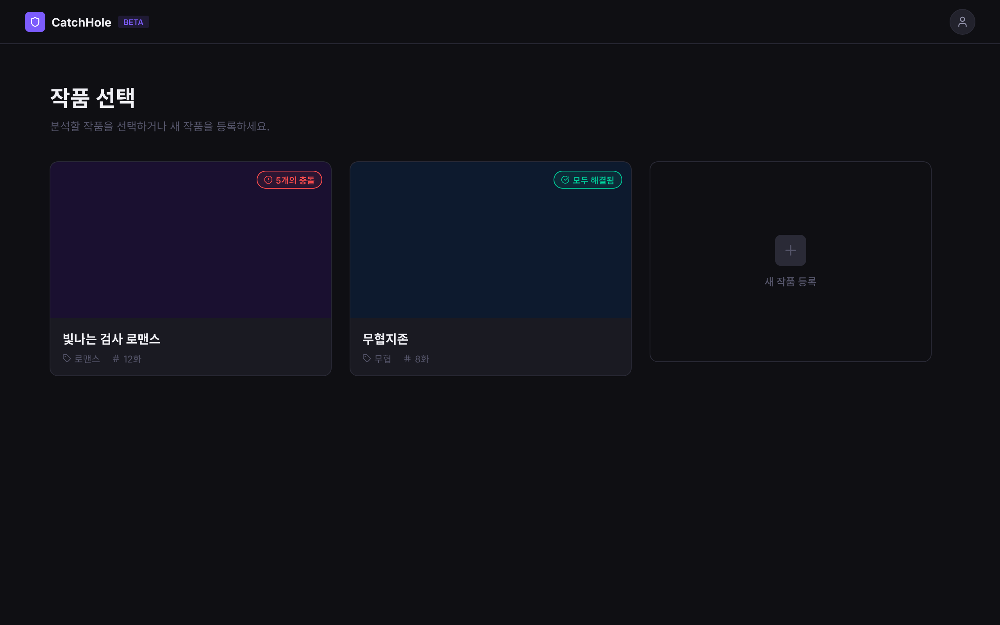
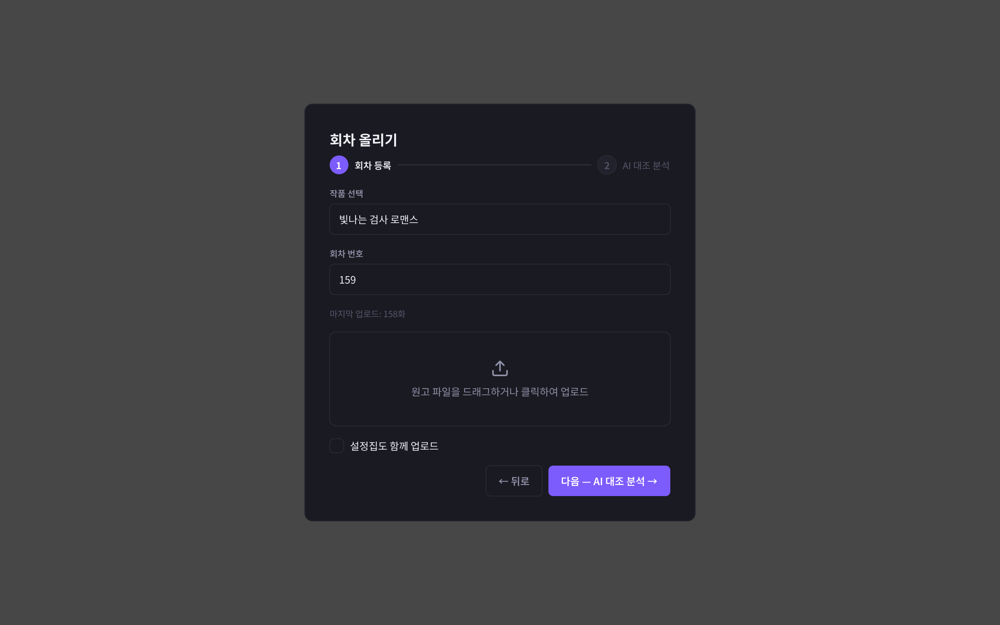
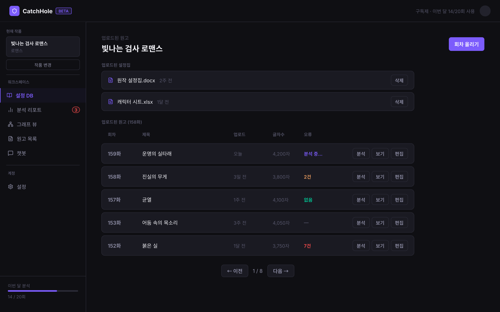

# 데이터 요구사항 — Work(작품)

[← 전체 인덱스](./README.md)

## 목차

- [작품 목록 (S0WorkPicker)](#작품-목록-s0workpicker)
- [작품 등록 모달 (UploadModal)](#작품-등록-모달-uploadmodal)
- [대시보드 (S1Dashboard)](#대시보드-s1dashboard)

---

## 작품 목록 (S0WorkPicker)

**URL**: [`/works`](https://catch-hole.vercel.app/works)

**1. 화면에 표시할 데이터**
- 작품 제목, 장르
- 회차 수
- 분석 상태 (대기 / 진행 중 / 완료)
- 충돌 건수 및 심각도 (없음 / 주의 / 오류 / 모두 해결)
- 최근 수정일

**2. 사용자 액션**
- 작품 카드 클릭 → [대시보드](#대시보드-s1dashboard)로 이동
- 새 작품 등록 → [작품 등록 모달](#작품-등록-모달-uploadmodal) 열기
- 조회 실패 시 다시 시도

**3. 화면 전환 식별자**
- `workId` — 카드 선택 시 [대시보드](#대시보드-s1dashboard)로 전달

**4. 데이터 없음 / 실패 표시**
- 로딩 중: 스켈레톤 카드 ([로딩 상태](../screens/DAsxW.png))
- 작품 0개: 빈 상태 안내 + 새 작품 등록 유도 ([빈 상태](../screens/gpJdz.png))
- 조회 실패: 에러 메시지 + 다시 시도 버튼

**5. BE에 요청할 데이터**
- 작품 목록 응답: id, 제목, 장르, 회차 수, 분석 상태, 충돌 건수, 최근 수정일

**6. BE와 협의할 범위·상태값**
- 회차 수·분석 상태·충돌 건수를 목록 응답에서 바로 줄 수 있는지 (아니면 별도 집계 API)
- 심각도 단계 기준값 (예: 미해결 충돌 N건 이상 = 오류)
- "회차 수"의 정의: 최신 회차 번호 vs 실제 회차 개수 (결번/분할 시 차이)
- "최근 수정일"의 정의: 작품 정보 수정 시각 vs 최근 회차 활동 시각

---

## 작품 등록 모달 (UploadModal)

작품 목록·대시보드에서 열리는 모달 (별도 URL 없음).

**1. 화면에 표시할 데이터**
- 작품 제목 입력, 장르 선택
- 원고 파일 드롭(txt/docx, 최대 10MB), 설정집 파일(선택)

**2. 사용자 액션**
- 작품 등록 제출 → 등록 후 목록 갱신 / 대시보드 이동
- 모달 닫기

**3. 화면 전환 식별자**
- 생성된 `workId`

**4. 데이터 없음 / 실패 표시**
- 파일 형식·크기 오류, 등록 실패(네트워크 등)

**5. BE에 요청할 데이터**
- 작품 생성 API: 제목, 장르, (첫 회차 원고 파일, 설정집 파일)

**6. BE와 협의할 범위·상태값**
- 작품 생성과 첫 회차 업로드를 한 번에 처리할지, 분리할지
- 장르를 자유 입력으로 둘지 고정 목록으로 둘지

---

## 대시보드 (S1Dashboard)

**URL**: [`/dashboard`](https://catch-hole.vercel.app/dashboard)

작품 작업의 허브. 좌측 네비로 설정DB·리포트·그래프·원고를 전환한다. (탭별 상세는 각 도메인 문서 참고)

**1. 화면에 표시할 데이터**
- 현재 작품 정보(제목, 장르, 회차 요약)
- 좌측 네비게이션 (설정DB / 분석 리포트 / 그래프 / 원고)

**2. 사용자 액션**
- 네비 전환 → [설정DB](./character.md#설정db-캐릭터-탭) / [원고 목록](./episode.md#원고-목록-대시보드-원고-탭) / [분석 리포트](./report.md#오류-리포트-s5report)
- 회차 업로드 → [회차 업로드](./episode.md#회차-업로드-sepisodeupload)
- 작품 전환 → [작품 목록](#작품-목록-s0workpicker)

**3. 화면 전환 식별자**
- `workId`, `?nav=settingDB|reports|graph|manuscripts` (+ 하위 `?tab=`)

**4. 데이터 없음 / 실패 표시**
- 작품 정보 로드 실패, 각 탭의 빈/실패 상태(해당 도메인 참고)

**5. BE에 요청할 데이터**
- 작품 상세: 제목, 장르, 회차 수, 분석 상태

**6. BE와 협의할 범위·상태값**
- 대시보드 진입 시 작품 요약 집계(회차 수·충돌 수·분석 상태)를 한 번에 줄지
