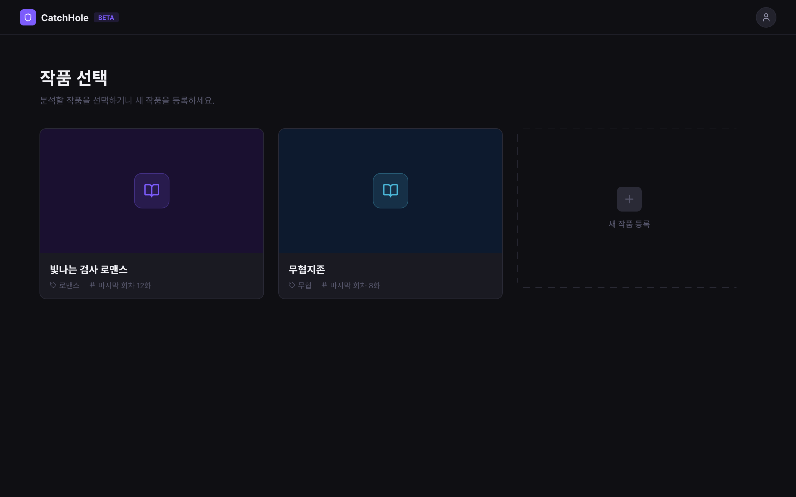
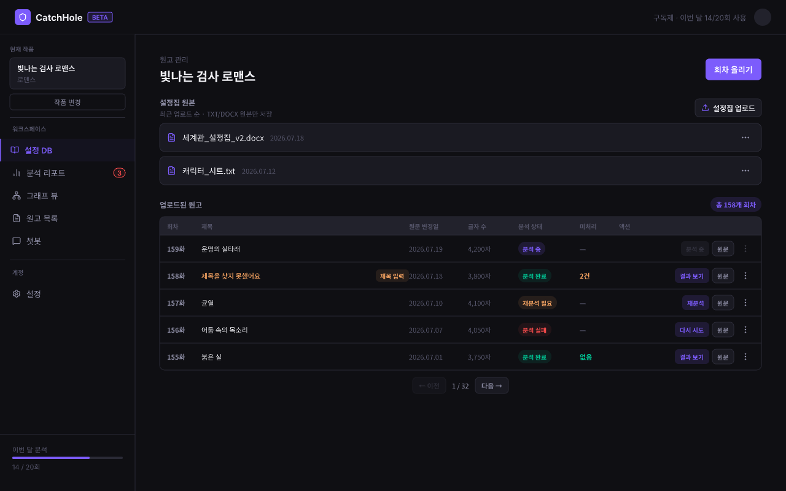

# 데이터 요구사항 — Work(작품)

[← 전체 인덱스](./README.md)

## 목차

- [작품 목록 (S0WorkPicker)](#작품-목록-s0workpicker)
- [작품 등록 모달 (WorkCreateModal)](#작품-등록-모달-workcreatemodal)
- [대시보드 (S1Dashboard)](#대시보드-s1dashboard)

---

## 작품 목록 (S0WorkPicker)

**URL**: [`/works`](https://www.catchhole.com/works)

로그인한 사용자가 등록한 작품을 확인하고 작업할 작품을 선택하는 화면.

> **MVP 범위 메모**
> - 작품 카드는 작품 선택에 필요한 제목·장르·마지막 회차만 표시한다.
> - 현재 시안의 분석 상태·충돌 건수 뱃지와 최근 수정일은 표시하지 않는다.
> - 작품 목록은 최신 생성순으로 표시하며 검색·필터·페이지네이션은 지원하지 않는다.

> **카드 표시 정책**
> - `latestEpisodeNo`는 등록된 회차의 실제 개수가 아니라 가장 큰 회차 번호다.
> - `latestEpisodeNo > 0`이면 `마지막 회차 {latestEpisodeNo}화`로 표시한다.
> - `latestEpisodeNo = 0`이면 `등록된 회차 없음`으로 표시한다.
> - 장르는 작품 등록 시 반드시 선택하는 필수값이며 모든 작품 카드에 표시한다.
> - 카드 커버는 BE 데이터 없이 FE의 기본 이미지 또는 그라데이션으로 표시한다.

**1. 화면에 표시할 데이터**
- 작품 카드 목록
  - 작품 제목
  - 장르
  - 마지막 회차 번호
- 새 작품 등록 카드

**2. 사용자 액션**
- 작품 카드 선택 → 선택한 작품의 [대시보드](#대시보드-s1dashboard)로 이동
- 새 작품 등록 카드 선택 → [작품 등록 모달](#작품-등록-모달-workcreatemodal) 열기
- 조회 실패 시 다시 시도

**3. 화면 전환 식별자**
- 작품 선택: `/dashboard?workId={workId}`
- 작품 등록 모달: `?modal=work-create`

**4. 데이터 없음 / 실패 표시**
- 로딩 중: 스켈레톤 카드 ([로딩 상태](../screens/DAsxW.png))
- 작품 0개: 빈 상태 안내와 새 작품 등록 유도 ([빈 상태](../screens/gpJdz.png))
- 조회 실패: 에러 메시지 + 다시 시도 버튼
- 마지막 회차 번호가 `0`이면 `등록된 회차 없음` 표시

**5. 화면 데이터 요구사항**

**5-1. BE → FE 제공 데이터 요구사항**
- 로그인한 사용자가 등록한 작품 목록을 최신 생성순으로 제공
- 작품별 카드 표시 데이터
  - 작품 식별자 `id`
  - 작품 제목 `title`
  - 장르 `genre`
  - 가장 큰 회차 번호 `latestEpisodeNo`
- `genre`는 작품 등록 시 선택한 필수값이며 `null`로 제공하지 않음
- `latestEpisodeNo`는 회차 개수가 아니라 가장 큰 회차 번호이며, 등록된 회차가 없으면 `0`
- 작품 설명·생성 시각·수정 시각은 응답에 포함되어도 MVP 작품 카드에는 표시하지 않음
- 분석 상태와 충돌 건수 집계는 작품 목록 응답에 요구하지 않음

**5-2. FE → BE 전달 데이터 요구사항**
- 작품 목록 조회는 인증된 사용자 정보를 기준으로 하며 별도의 조회 조건을 전달하지 않음
- 작품 카드 선택 시 해당 카드의 `id`를 `workId`로 사용해 `/dashboard?workId={workId}`로 이동

**6. BE와 협의할 범위·상태값**
- 없음

---

## 작품 등록 모달 (WorkCreateModal)

작품 목록·대시보드에서 열리는 모달 (별도 URL 없음).

> **화면 시안 TODO** — 기존에 연결된 이미지는 회차 업로드 화면이므로 제거했다. 작품 제목과 장르만 입력하는 단일 단계 모달 시안으로 교체한다.

> **MVP 범위 메모**
> - 작품 제목과 장르만 입력해 작품을 생성한다.
> - 작품 설명과 커버 이미지 등록은 MVP 이후 검토한다. MVP 작품 카드는 FE의 기본 이미지 또는 그라데이션을 사용한다.
> - 원고·설정집 파일은 작품 등록 모달에서 받지 않는다.
> - 작품 생성과 회차 업로드는 서로 독립된 작업이며, 등록된 회차가 없는 작품도 정상 상태다.
> - 작품 생성 후 해당 작품의 대시보드로 이동하고, 대시보드의 빈 원고 영역에서 첫 회차 업로드를 유도한다.

**1. 화면에 표시할 데이터**
- 모달 제목: `새 작품 등록`
- 작품 제목 입력
- 장르 필수 선택
  - 모든 지원 장르를 포함한 고정 목록
- 취소·작품 만들기 버튼

**2. 사용자 액션**
- 작품 제목 입력
- 고정 목록에서 장르 선택
- 작품 만들기 선택 → 작품 생성
- 작품 생성 성공 → 모달을 닫고 생성된 작품의 [대시보드](#대시보드-s1dashboard)로 이동
- 취소·닫기 선택 → 작품을 생성하지 않고 기존 작품 목록 또는 대시보드로 복귀

**3. 화면 전환 식별자**
- 모달 상태: `?modal=work-create`
- 작품 생성 성공: `/dashboard?workId={workId}`

**4. 데이터 없음 / 실패 표시**
- 작품 제목을 입력하지 않으면 작품 만들기 버튼 비활성화
- 작품 제목이 100자를 초과하면 입력 오류 표시
- 장르를 선택하지 않으면 작품 만들기 버튼 비활성화
- 작품 생성 중 로딩·중복 제출 방지
- 작품 생성 실패 시 입력값과 모달을 유지하고 오류 안내와 다시 시도 제공

**5. 화면 데이터 요구사항**

**5-1. BE → FE 제공 데이터 요구사항**
- 작품 생성 성공 시 생성된 작품 정보
  - 작품 식별자 `id`
  - 작품 제목 `title`
  - 장르 `genre`
  - 가장 큰 회차 번호 `latestEpisodeNo` (`0`)
- 작품 생성 실패 시 화면 안내에 사용할 실패 사유

**5-2. FE → BE 전달 데이터 요구사항**
- 작품 제목 `title` (필수, 최대 100자)
- 선택한 장르 `genre` (필수, 지원 장르 값 중 하나)
- 작품 설명·커버 이미지·원고 파일·설정집 파일은 전달하지 않음

**6. BE와 협의할 범위·상태값**
- FE에 표시할 장르 목록과 BE가 허용할 `genre` 값 집합·표시명 매핑

---

## 대시보드 (S1Dashboard)

**URL**: [`/dashboard`](https://www.catchhole.com/dashboard)

작품 작업의 허브. 좌측 네비로 설정DB·리포트·그래프·원고를 전환한다. (탭별 상세는 각 도메인 문서 참고)

**1. 화면에 표시할 데이터**
- 현재 작품 정보(제목, 장르, 회차 요약)
- 좌측 네비게이션 (설정DB / 분석 리포트 / 그래프 / 원고)

**2. 사용자 액션**
- 네비 전환 → [설정DB](./character.md#설정db-캐릭터-탭) / [원고 목록](./episode.md#원고-목록-대시보드-원고-탭) / [분석 리포트](./analysis.md#오류-리포트-s5report)
- 회차 업로드 → [회차 업로드](./upload.md#회차-업로드-sepisodeupload)
- 작품 전환 → [작품 목록](#작품-목록-s0workpicker)

**3. 화면 전환 식별자**
- `workId`, `?nav=settingDB|reports|graph|manuscripts` (+ 하위 `?tab=`)

**4. 데이터 없음 / 실패 표시**
- 작품 정보 로드 실패, 각 탭의 빈/실패 상태(해당 도메인 참고)

**5. BE에 요청할 데이터**
- 작품 상세: 제목, 장르, 설명, 회차 수(`latestEpisodeNo`) — 계약은 [BE work.md](https://github.com/catchhole-soma/catchhole-backend-java/blob/main/docs/work.md) 기준
- 분석 상태·충돌 수 집계는 현재 계약에 없음 — 6번 협의 항목

**6. BE와 협의할 범위·상태값**
- 대시보드 진입 시 작품 요약 집계(회차 수·충돌 수·분석 상태)를 한 번에 줄지
