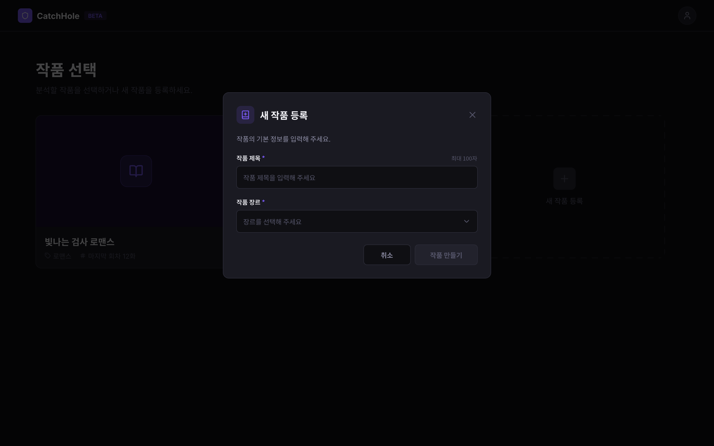

# 데이터 요구사항 — Work(작품)

[← 전체 인덱스](./README.md)

## 목차

- [작품 목록 (S0WorkPicker)](#작품-목록-s0workpicker)
- [작품 등록 모달 (WorkCreateModal)](#작품-등록-모달-workcreatemodal)
- [작품 수정 모달 (WorkEditModal)](#작품-수정-모달-workeditmodal)
- [작품 삭제 확인 모달 (WorkDeleteModal)](#작품-삭제-확인-모달-workdeletemodal)

---

## 작품 목록 (S0WorkPicker)

**URL**: [`/works`](https://www.catchhole.com/works)

로그인한 사용자가 등록한 작품을 확인하고 작업할 작품을 선택하는 화면.

> **Theme V2 파일럿**: 랜딩과 같은 밝은 캔버스·Primary Blue·둥근 카드 규칙을 사용한다. 상단 브랜드, 페이지 제목, 액션, 카드 상태는 `ui-v2`와 의미 기반 CSS 토큰을 재사용하며 작품 조회·선택·수정·삭제 계약은 바꾸지 않는다.

> **MVP 범위 메모**
> - 작품 카드는 제목·한 줄 작품 설명·장르·마지막 회차를 표시한다.
> - 현재 시안의 분석 상태·충돌 건수 뱃지와 최근 수정일은 표시하지 않는다.
> - 작품 목록은 최신 생성순으로 표시하며 검색·필터·페이지네이션은 지원하지 않는다.

> **카드 표시 정책**
> - `latestEpisodeNo`는 등록된 회차의 실제 개수가 아니라 가장 큰 회차 번호다.
> - `latestEpisodeNo > 0`이면 `마지막 회차 {latestEpisodeNo}화`로 표시한다.
> - `latestEpisodeNo = 0`이면 `등록된 회차 없음`으로 표시한다.
> - 장르는 작품 등록 시 반드시 선택하는 필수값이며 모든 작품 카드에 표시한다.
> - 작품 설명은 최대 50자이며 한 줄 말줄임으로 표시한다. 기존 데이터가 `null`이면 `작품 소개가 없습니다.`를 표시한다.
> - 카드 커버는 BE 데이터 없이 FE의 기본 이미지 또는 그라데이션으로 표시한다.
> - 카드에 마우스를 올리거나 카드 내부 액션에 키보드 초점이 들어오면 수정·삭제 버튼을 표시한다.

**1. 화면에 표시할 데이터**
- 작품 카드 목록
  - 작품 제목
  - 한 줄 작품 설명
  - 장르
  - 마지막 회차 번호
- 새 작품 등록 카드

**2. 사용자 액션**
- 작품 카드 선택 → 선택한 작품의 [원고 목록](./episode.md#원고-목록-대시보드-원고-탭)으로 이동
- 작품 카드의 수정 선택 → [작품 수정 모달](#작품-수정-모달-workeditmodal) 열기
- 작품 카드의 삭제 선택 → [작품 삭제 확인 모달](#작품-삭제-확인-모달-workdeletemodal) 열기
- 새 작품 등록 카드 선택 → [작품 등록 모달](#작품-등록-모달-workcreatemodal) 열기
- 조회 실패 시 다시 시도

**3. 화면 전환 식별자**
- 작품 선택: `/dashboard?workId={workId}&nav=manuscripts`
- 작품 등록 모달: `?modal=work-create`
- 작품 수정 모달: `?modal=work-edit&targetWorkId={workId}`
- 작품 삭제 확인 모달: `?modal=work-delete&targetWorkId={workId}`

**4. 데이터 없음 / 실패 표시**
- 로딩 중: 스켈레톤 카드 ([로딩 상태](../screens/DAsxW.png))
- 작품 0개: 빈 상태 안내와 제목 너비에 맞춘 정사각형 새 작품 등록 카드로 등록 유도 ([빈 상태](../screens/gpJdz.png))
- 조회 실패: 에러 메시지 + 다시 시도 버튼
- 마지막 회차 번호가 `0`이면 `등록된 회차 없음` 표시

**5. 화면 데이터 요구사항**

**5-1. BE → FE 제공 데이터 요구사항**
- 로그인한 사용자가 등록한 작품 목록을 최신 생성순으로 제공
- 작품별 카드 표시 데이터
  - 작품 식별자 `id`
  - 작품 제목 `title`
  - 작품 설명 `description`
  - 장르 `genre`
  - 가장 큰 회차 번호 `latestEpisodeNo`
- `genre`는 작품 등록 시 선택한 필수값이며 `null`로 제공하지 않음
- `latestEpisodeNo`는 회차 개수가 아니라 가장 큰 회차 번호이며, 등록된 회차가 없으면 `0`
- 작품 설명은 최대 50자 한 줄로 표시하고, 생성 시각·수정 시각은 MVP 작품 카드에 표시하지 않음
- 분석 상태와 충돌 건수 집계는 작품 목록 응답에 요구하지 않음

**5-2. FE → BE 전달 데이터 요구사항**
- 작품 목록 조회는 인증된 사용자 정보를 기준으로 하며 별도의 조회 조건을 전달하지 않음
- 작품 카드 선택 시 해당 카드의 `id`를 `workId`로 사용해 `/dashboard?workId={workId}&nav=manuscripts`로 이동
- 작품 수정·삭제 요청에는 액션을 선택한 카드의 `id`를 사용

**6. BE와 협의할 범위·상태값**
- 없음

---

## 작품 등록 모달 (WorkCreateModal)

작품 목록·원고 목록에서 열리는 모달 (별도 URL 없음).

> **MVP 범위 메모**
> - 작품 제목, 선택 작품 설명, 장르를 입력해 작품을 생성한다.
> - 작품 설명은 목록에 표시할 최대 50자의 짧은 소개이며, 커버 이미지는 MVP 이후 검토한다.
> - 원고·설정집 파일은 작품 등록 모달에서 받지 않는다.
> - 작품 생성과 회차 업로드는 서로 독립된 작업이며, 등록된 회차가 없는 작품도 정상 상태다.
> - 작품 생성 후 해당 작품의 [원고 목록](./episode.md#원고-목록-대시보드-원고-탭)으로 이동하고, 빈 원고 영역에서 첫 회차 업로드를 유도한다.

**1. 화면에 표시할 데이터**
- 모달 제목: `새 작품 등록`
- 작품 제목 입력
- 작품 설명 입력 (선택, 최대 50자)
- 장르 필수 선택
  - 모든 지원 장르를 포함한 고정 목록
  - 생성 화면에만 `현재 서비스는 판타지 장르에 최적화되어 있으며, 다른 장르도 순차적으로 최적화할 예정입니다.` 안내 표시
- 취소·작품 만들기 버튼

**2. 사용자 액션**
- 작품 제목 입력
- 목록에 표시할 짧은 작품 설명 입력
- 고정 목록에서 장르 선택
- 작품 만들기 선택 → 작품 생성
- 작품 생성 성공 → 모달을 닫고 생성된 작품의 [원고 목록](./episode.md#원고-목록-대시보드-원고-탭)으로 이동
- 취소·닫기 선택 → 작품을 생성하지 않고 기존 작품 목록 또는 원고 목록으로 복귀

**3. 화면 전환 식별자**
- 모달 상태: `?modal=work-create`
- 작품 생성 성공: `/dashboard?workId={workId}&nav=manuscripts`

**4. 데이터 없음 / 실패 표시**
- 작품 제목을 입력하지 않으면 작품 만들기 버튼 비활성화
- 작품 제목이 100자를 초과하면 입력 오류 표시
- 작품 설명이 50자를 초과하면 입력 오류 표시
- 장르를 선택하지 않으면 작품 만들기 버튼 비활성화
- 작품 생성 중 로딩·중복 제출 방지
- 작품 생성 실패 시 입력값과 모달을 유지하고 오류 안내와 다시 시도 제공

**5. 화면 데이터 요구사항**

**5-1. BE → FE 제공 데이터 요구사항**
- 작품 생성 성공 시 생성된 작품 정보
  - 작품 식별자 `id`
  - 작품 제목 `title`
  - 작품 설명 `description`
  - 장르 `genre`
  - 가장 큰 회차 번호 `latestEpisodeNo` (`0`)
- 작품 생성 실패 시 화면 안내에 사용할 실패 사유

**5-2. FE → BE 전달 데이터 요구사항**
- 작품 제목 `title` (필수, 최대 100자)
- 작품 설명 `description` (선택, 최대 50자, 공백뿐이면 `null`)
- 선택한 장르 `genre` (필수, 지원 장르 값 중 하나)
- 커버 이미지·원고 파일·설정집 파일은 전달하지 않음

**6. BE와 협의할 범위·상태값**
- FE에 표시할 장르 목록과 BE가 허용할 `genre` 값 집합·표시명 매핑

---

## 작품 수정 모달 (WorkEditModal)

작품 목록 카드에 마우스를 올렸을 때 표시되는 `수정` 버튼으로 여는 모달.

**1. 화면에 표시할 데이터**
- 기존 작품 제목
- 기존 작품 설명
- 기존 장르와 지원 장르 단일 선택 버튼
- 취소·저장 버튼

**2. 사용자 액션**
- 작품 제목·설명·장르 변경
- 저장 선택 → 작품 정보 수정 후 목록 갱신
- 취소·닫기·배경·Esc 선택 → 변경하지 않고 목록으로 복귀

**3. 데이터 정책**
- 제목은 필수이며 최대 100자
- 작품 설명은 선택값이며 최대 50자, 공백뿐이면 `null`
- 장르는 지원 목록 중 하나를 필수 선택
- 수정 실패 시 입력값과 모달을 유지하고 필드 오류 또는 다시 시도 안내 표시
- 저장 중 중복 제출과 모달 닫기 방지

---

## 작품 삭제 확인 모달 (WorkDeleteModal)

작품 목록 카드에 마우스를 올렸을 때 표시되는 `삭제` 버튼으로 여는 확인 모달.

**1. 화면에 표시할 데이터**
- 삭제 대상 작품 제목
- 영구 삭제이며 복구할 수 없다는 경고
- 취소·영구 삭제 버튼

**2. 사용자 액션**
- 취소·닫기·배경·Esc 선택 → 삭제하지 않고 목록으로 복귀
- 영구 삭제 선택 → 대상 작품 삭제 후 목록 갱신

**3. 데이터 정책**
- 실제 삭제 API 호출 전 반드시 별도 확인 단계를 거침
- 삭제 중 중복 제출과 모달 닫기 방지
- 삭제 실패 시 확인 모달을 유지하고 다시 시도 가능한 오류 안내 표시
