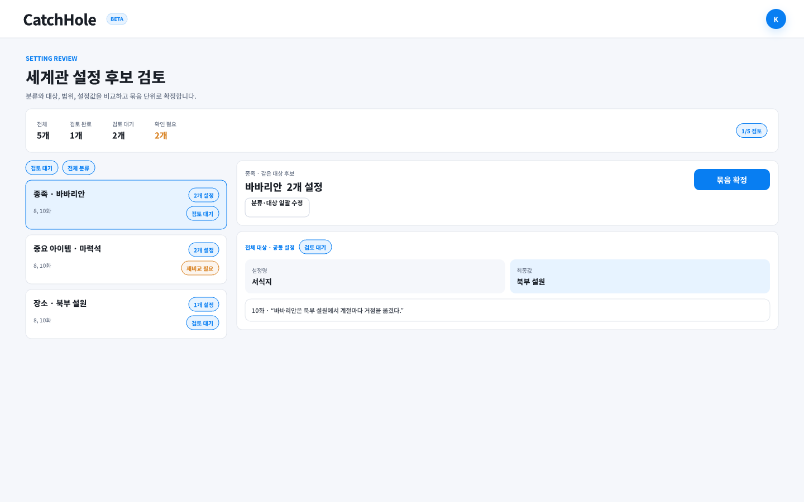
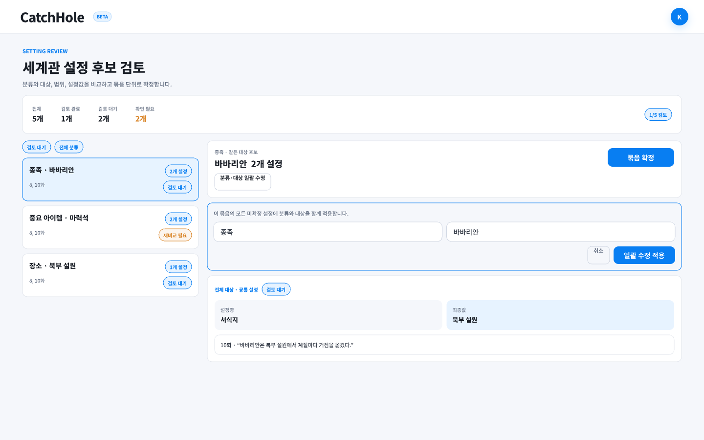
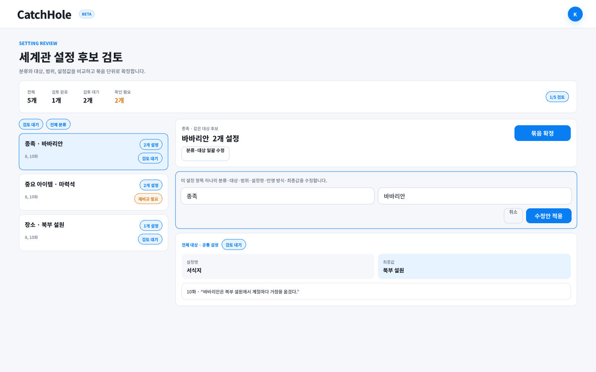
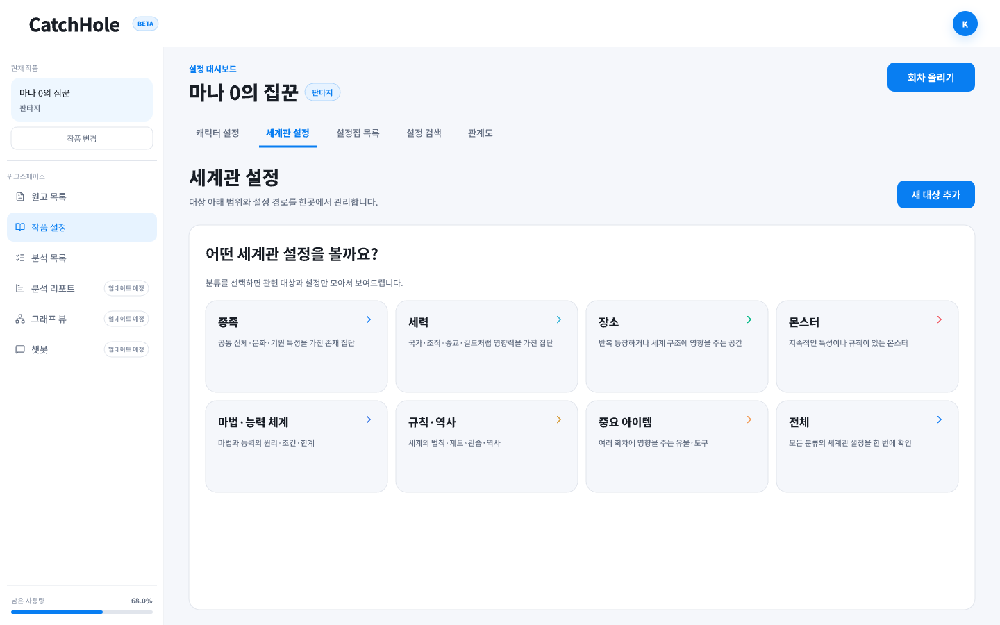
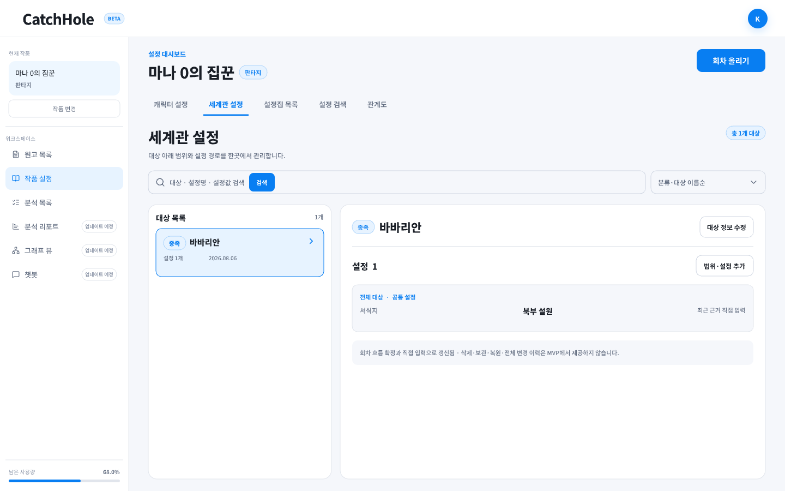
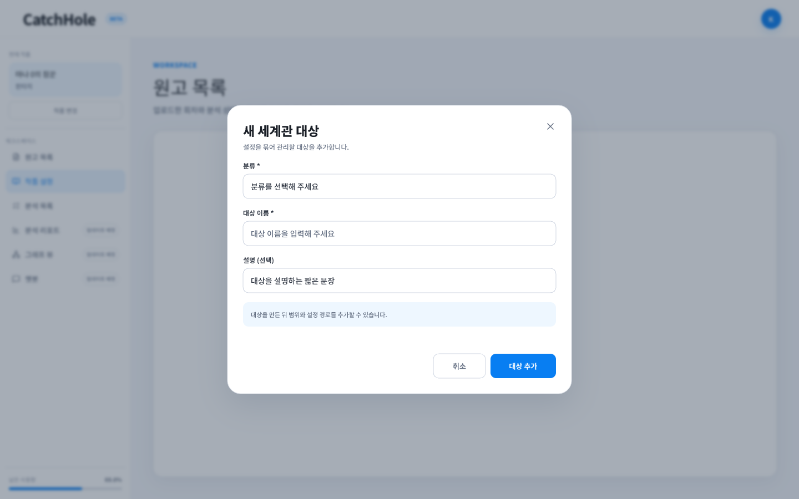
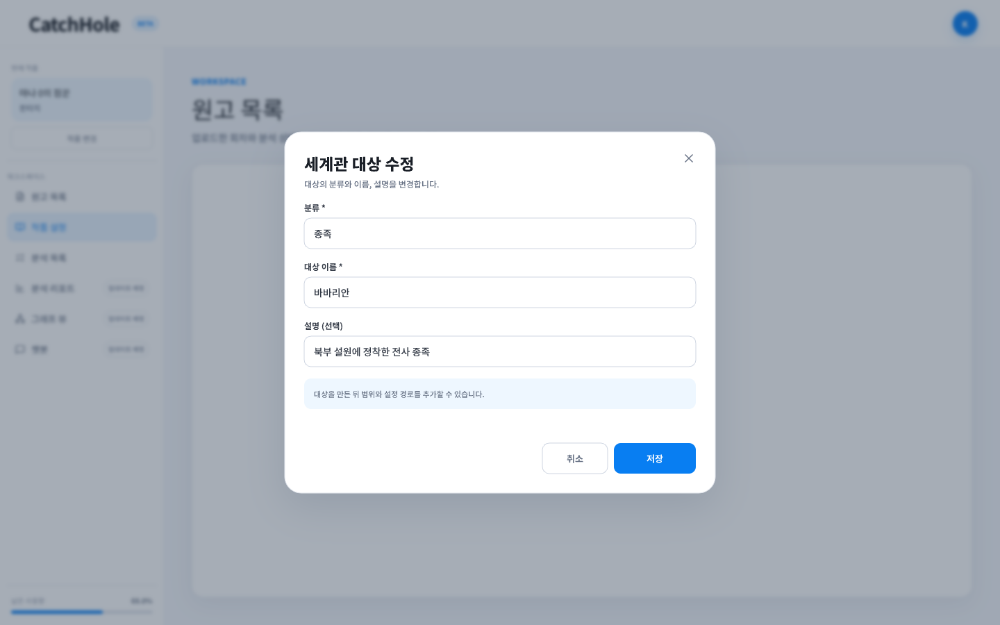

# 데이터 요구사항 — 세계관 설정

[← 전체 인덱스](./README.md)

> 이 문서는 Jira [NVM-260](https://aiswmproject.atlassian.net/browse/NVM-260)의 세계관 MVP와 NVM-268의 선택적 1단계 범위 경로 확장을 포함한 화면 계약을 정리한다. 연결 GitHub 이슈는 Backend [#110](https://github.com/catchhole-soma/catchhole-backend-java/issues/110)과 [#118](https://github.com/catchhole-soma/catchhole-backend-java/issues/118)이다. 프론트는 `candidateType=world`와 `worldsettings` 탭을 생성 SDK로 지원한다. 구체적인 API 경로·HTTP 메서드·전체 DTO의 단일 출처는 Backend Swagger/OpenAPI다.

## 목차

- [세계관 설정의 정의와 추출 기준](#세계관-설정의-정의와-추출-기준)
- [프론트가 사용하는 도메인 단위](#프론트가-사용하는-도메인-단위)
- [설정 후보 검토 — 세계관 후보 탭](#설정-후보-검토--세계관-후보-탭)
- [작품 설정 세계관 탭](#작품-설정-세계관-탭)
- [MVP 제외 범위](#mvp-제외-범위)

---

## 세계관 설정의 정의와 추출 기준

세계관 설정은 **작품의 세계를 구성하며 여러 회차에서 지속적으로 활용되는 배경 정보와 규칙**이다. 회차 안에서 잠시 발생한 사건이나 특정 캐릭터의 현재 상태보다, 이후 회차에서도 다시 참조될 가능성이 높은 불변·지속 설정을 먼저 추출한다.

### 분류

분류 enum은 아래 7개로 고정한다. 화면과 문서에는 한국어 표시명과 설명을 사용하고, 세부 속성은 분류 enum을 늘리지 않고 설정명·설정값으로 자유롭게 추가한다.

| 내부 값 | 화면 표시명 | 설명 | 예시 대상 |
| --- | --- | --- | --- |
| `RACE` | 종족 | 공통된 신체·문화·기원 특성을 가진 존재 집단 | 바바리안, 엘프, 드워프 |
| `FACTION` | 세력 | 국가·조직·종교·길드처럼 공동 목적과 영향력을 가진 집단 | 왕국, 마탑, 기사단 |
| `LOCATION` | 장소 | 반복해서 등장하거나 세계 구조에 영향을 주는 지역·도시·건물·던전·차원 | 북부 설원, 황도, 마탑 |
| `MONSTER` | 몬스터 | 지속적인 특성이나 규칙이 있는 몬스터 종족·개체 | 고블린, 서리 용 |
| `POWER_SYSTEM` | 마법 및 능력 체계 | 마법·능력의 작동 원리, 조건, 한계, 공통 규칙 | 마력 적성, 마법 등급 |
| `WORLD_RULE_HISTORY` | 작품 내 규칙과 역사 | 세계의 법칙·제도·관습·전쟁·신화·과거 사건 | 적성 검사 의무, 제국 건국 전쟁 |
| `IMPORTANT_ITEM` | 중요한 아이템 | 여러 회차에서 지속적으로 영향을 주는 명명된 유물·도구 | 화염검, 왕의 인장 |

### 포함·제외 예시

포함:

- 마법 사용자는 반드시 마력 적성 검사를 받아야 한다.
- 바바리안은 혹한 지역에서 살아가는 전투 종족이다.
- 화염검은 용의 심장으로 제작된 유물이다.

제외:

- 수아가 현재 화염검을 들고 있다. — 특정 캐릭터의 현재 상태
- 오늘 왕궁에 비가 내렸다. — 일시적인 날씨·사건
- 몬스터 한 마리가 골목에서 나타났다. — 지속 설정이 아닌 단발 사건

### MVP 추출 출처

- MVP에서는 **회차 원문 분석 결과만** 세계관 후보를 생성한다.
- 별도로 업로드한 설정집은 기존 설정집 목록에서 원문 조회·수정·삭제만 지원한다.
- 설정집 원문에서 세계관 후보를 추출하거나 회차 후보와 자동 병합하는 기능은 후속 범위다.

---

## 프론트가 사용하는 도메인 단위

Backend의 실제 테이블·컬럼 이름은 Backend 문서가 단일 출처다. FE는 아래 의미 단위를 기준으로 화면을 구성한다.

### 세계관 후보

세계관 후보 한 건은 사용자가 독립적으로 검토할 수 있는 설정 하나다.

```text
분류 + 대상 + 선택적 범위 + 설정명 + 추출값 + 추출 회차 + 원문 근거
```

예:

```text
장소 / 미궁 / 1층 / 출몰 규칙 / 동쪽에서 고블린 출몰 / 3화 / 원문 quote
```

1차 LLM이 후보를 추출하고, 2차 LLM은 관련된 기존 세계관 설정만 비교해 아래 반영 방식을 제안한다. 2차 LLM은 확정 세계관을 직접 수정하지 않는다. 기존 root 설정과 새 `ADD`를 공통 범위로 정리할 때는 새 후보 응답의 `existingRootPropertyNamesToMove`에 이동할 기존 설정명만 포함하며, 기존 설정을 새 후보 row로 복제하거나 새 설정과 의미 병합하지 않는다.

| 내부 값 | 화면 표시명 | 의미 |
| --- | --- | --- |
| `ADD` | 추가 | 새로운 대상이거나 기존 대상에 없는 설정명 |
| `UPDATE` | 수정 | 기존 설정값을 새로운 값으로 교체 |
| `MERGE` | 병합 | 기존값과 추출값이 모두 유효해 하나의 최종값으로 결합 |
| `EXCLUDE` | 제외 | 중복·일시적 사건·캐릭터 현재 상태·근거 부족 등으로 반영하지 않음 |

#### 대상 검토 그룹

세계관 후보의 저장·상태 단위는 계속 설정 key 하나이지만, 검토 화면과 확정 액션은 같은 분석 묶음의 `분류 + 정규화한 대상명`을 한 그룹으로 구성한다.

```text
장소 / 미궁
├─ 1층 › 출몰 규칙 후보
├─ 1층 › 함정 작동 조건 후보
└─ 2층 › 출몰 규칙 후보
```

- 왼쪽 목록 한 카드는 후보 한 건이 아니라 세계관 대상 한 그룹이다.
- 오른쪽 상세는 후보별 `scopeName › settingName`을 key row로 표시하며 범위가 없으면 설정명만 표시한다. 각 row의 후보 ID와 비교·검토 상태는 유지한다.
- 같은 대상명이 여러 key마다 반복되지 않도록 목록 카드와 상세 header에서만 대표로 표시한다.
- 1차 LLM의 `추출값 + evidence_spans + 회차`는 후보의 원본 근거이며 2차 비교·재비교가 새 문장으로 대체하거나 요약해 덮어쓰지 않는다.
- 같은 분류·대상·범위·설정명으로 여러 값이 추출되면 후보를 여러 row로 반복하지 않는다. AI가 보완값을 최종 제안값 하나로 합치고 각 1차 후보의 원문 quote·offset은 한 row 아래에 모두 보존한다. 같은 설정명이라도 범위가 다르면 서로 다른 row다.
- 2차 LLM은 현재 확정본과 비교한 반영 방식·제안값·비교 이유만 갱신한다. 원고가 변경되어 1차 결과가 무효가 된 경우에만 새 1차 분석 후보와 근거를 생성한다.
- raw 범위와 다른 새 범위는 기존 scoped child, 이번 batch의 독립 `ADD`, 함께 이동할 root 설정을 합친 최종 child가 둘 이상일 때만 제안할 수 있다. 따라서 형제가 없는 `기능 › 기능` 같은 합성 범위는 화면에 정상 후보로 도달하지 않아야 한다.
- 기존 root 이동은 새 `ADD`와 같은 비교 결정의 부수 효과다. `comparisonDecisionId`로 연결된 source 중 하나라도 사용자가 AI안과 다르게 수정하거나 제외하면 Backend가 이동 계획 전체를 비활성화하고 모든 연결 후보의 `existingRootPropertyNamesToMove`를 빈 배열로 반환한다.

### 확정 세계관

확정 세계관 한 건은 한 작품 안의 `분류 + 대상`을 나타내며, 설정은 키·문자열 값 객체로 묶는다.

```json
{
  "category": "LOCATION",
  "subjectName": "미궁",
  "properties": [
    { "scopeName": "1층", "settingName": "출몰 규칙", "value": "동쪽에서 고블린이 출몰한다." },
    { "scopeName": "2층", "settingName": "출몰 규칙", "value": "중앙부에서 언데드가 출몰한다." }
  ]
}
```

- 목록 한 항목은 설정 속성 하나가 아니라 세계관 대상 하나다.
- API의 `properties`는 `{scopeName, settingName, value}` 평면 목록이며 설정값은 문자열로 표시·편집한다. 화면은 루트 property를 `공통 설정`, 범위 property를 범위명 섹션으로 묶어 보여 준다.
- 단일 확정은 property 경로 하나만, 대상 그룹 확정은 남은 검토 대기 property 경로를 원자적으로 추가·수정하며 JSON 전체를 교체하지 않는다.
- `scopeName`은 세계관에만 적용하는 선택적 1단계 범위다. 캐릭터 설정 후보·테이블·UI의 key 계약은 변경하지 않는다.
- 대상 그룹 확정에서 여러 설정을 바꾸면 한 트랜잭션을 하나의 확정본 revision으로 보고 버전을 한 번 증가시키며, 함께 확정된 후보는 같은 최종 적용 버전을 사용한다.
- 활성 root 이동 계획이 있으면 Backend는 기존 root 이동과 새 `ADD`를 같은 JSON deep copy에 반영하고 버전을 한 번만 증가시킨다. 확정 직전에 root의 존재·값과 이동 목적지를 snapshot과 다시 비교하며 달라졌으면 아무 property도 적용하지 않고 영향 후보를 `RECOMPARISON_REQUIRED`로 돌린다.
- 같은 그룹 확정 안에서 먼저 적용한 `ADD`로 대상이나 property 경로가 생긴 것은 내부 변경으로 취급해 나머지 요청 후보를 재비교하지 않는다.
- 같은 설정명이 외부 요청으로 먼저 다른 값으로 변경된 경우에만 해당 row 또는 그룹을 재비교한다.
- 행 전체 버전이 달라도 다른 설정명만 변경된 경우에는 현재 설정명을 확인한 뒤 안전하게 반영할 수 있다.

### 상태

**비교 상태**

| 내부 값 | 화면 표시명 | 화면 동작 |
| --- | --- | --- |
| `PENDING` | 비교 대기 | 확정 비활성 |
| `PROCESSING` | 비교 중 | 진행 상태 표시, 확정 비활성 |
| `COMPLETED` | 비교 완료 | 검토 액션 활성 |
| `FAILED` | 비교 실패 | 실패 이유와 다시 비교 제공 |
| `RECOMPARISON_REQUIRED` | 재비교 필요 | 영향 범위를 row 또는 그룹으로 표시하고 자동 재비교 후 진행 상태 표시 |

**검토 상태**

| 내부 값 | 화면 표시명 | 의미 |
| --- | --- | --- |
| `PENDING_REVIEW` | 검토 대기 | 사용자가 아직 결정하지 않음 |
| `CONFIRMED` | 확정 | 세계관 DB 반영 완료 |
| `DISMISSED` | 제외 | 사용자가 반영하지 않기로 결정 |

`RECOMPARISON_REQUIRED`는 2차 비교 뒤 외부 변경으로 비교 문맥이 더 이상 유효하지 않을 때 사용한다. 같은 key의 값·존재 상태가 바뀌면 해당 row, 대상의 생성·삭제·분류·대상 identity가 바뀌면 그룹 전체가 대상이다. 같은 그룹 확정 트랜잭션 안에서 발생한 대상 생성과 다른 key 변경은 재비교 사유가 아니다.

FE는 그룹 안에 `PENDING`·`PROCESSING` 후보가 하나라도 있으면 2초 간격으로 다시 조회하고, 모든 row가 완료·실패 같은 terminal 상태에 도달하면 polling을 중단한다. `RECOMPARISON_REQUIRED`의 자동 재비교는 영향받은 후보마다 한 번의 상태 전환에서 한 요청만 보내되, 후보가 해당 상태를 벗어나면 guard를 해제하여 이후 충돌도 다시 자동 처리한다. 한 row라도 비교 대기·처리·실패·재비교 필요이면 해당 그룹의 확정 액션을 잠근다.

`FAILED + comparisonFailureCode=AI_TOKEN_QUOTA_EXHAUSTED`는 영구 비교 실패가 아니라 추가 사용량 뒤 재개 가능한 중단이다. row와 그룹에는 `사용량 부족으로 중단`을 표시하고 단건 `다시 비교`는 숨긴다. 단, 한 그룹의 실패 row에 다른 failure code가 함께 있으면 그룹을 사용량 중단만으로 표시하지 않고 `비교 중단·실패 혼합`으로 구분하며, 상단의 배치 재개와 하단의 일반 `다시 비교`를 모두 안내한다. 목록 응답의 `tokenInterruptedComparisonCount`와 `canResumeTokenInterruptedComparisons`로 상단에 `51개 세계관 설정 비교가 사용량 부족으로 중단됐습니다.` 형태의 정확한 건수와 `남은 비교 재개`를 표시한다. 내부 예외 원문 대신 failure code별 사용자 메시지만 사용한다.

---

## 설정 후보 검토 — 세계관 후보 탭

**URL**: `/setting-review?candidateType=world`

기존 `/setting-review` 라우트와 공통 검토 레이아웃을 유지한다. 캐릭터 후보와 세계관 후보를 한 목록에 섞지 않고 `캐릭터 후보 / 세계관 후보` 탭으로 구분한다. 캐릭터 후보 계약은 [character.md의 설정 검토](./character.md#설정-검토-ssettingreview)를 따른다.

> **Theme V2 화면 계약**: 세계관 후보 탭도 캐릭터 후보 탭과 같은 밝은 헤더·요약·필터·그룹 카드·상세 surface를 사용한다. 필터의 높이·간격·활성 색과 결과 없음 안내는 캐릭터 후보의 공통 검토 컴포넌트 규격을 따르고, 보라색 primary·AI 강조는 파란색 primary로 통일한다. 기존값/제안값 diff의 danger·success 의미색과 개별·일괄 수정 모달은 공통 검토 토큰을 재사용하되, 세계관 전용 분류·대상·반영 방식과 mutation 계약은 캐릭터 후보와 합치지 않는다.

**Pencil 시안**

대상 그룹 key diff 검토와 상태 프레임:

- `la0t2` — `Active / Setting Review / World / Review`
- `cimsU` — `Active / Setting Review / World / Bulk Edit`
- `fUQx8` — `Active / Setting Review / World / Individual Edit`
- `Glo9r` — `Active / Setting Review / World / Conflict`
- `OqOrE` — `Active / Setting Review / World / Recomparison Needed`
- `ziGva` — `Active / Setting Review / World / Recomparison In Progress`
- `W8TBkt` — `Active / Setting Review / World / Recomparison Success`
- `Q7O3QH` — `Active / Setting Review / World / Recomparison Failure`
- `S3QmB` — `Active / Setting Review / World / Token Interrupted`
- `LKJu9` — `Active / Setting Review / World / Complete`







상태 화면: [내용 충돌](../screens/Glo9r.png) · [재비교 필요](../screens/OqOrE.png) · [재비교 중](../screens/ziGva.png) · [재비교 성공](../screens/W8TBkt.png) · [재비교 실패](../screens/Q7O3QH.png) · [토큰 중단](../screens/S3QmB.png) · [완료](../screens/LKJu9.png)

모바일 상태: [후보 목록](../screens/LMSXA.png) · [후보 상세](../screens/xKtUj.png) · [일괄 수정](../screens/VUTJ3.png) · [개별 수정](../screens/j7UEH.png) · [충돌](../screens/vJsUs.png) · [재비교 필요](../screens/u6MXAG.png) · [재비교 중](../screens/rrY0O.png) · [재비교 성공](../screens/uQ9Vq.png) · [재비교 실패](../screens/pPzy7.png) · [토큰 중단](../screens/H89KXg.png) · [완료](../screens/J5c9yj.png)

> **디자인 원본**: `design/catchhole.pen`의 `Active / Setting Review / World / ...` 데스크톱·모바일 프레임을 그룹 검토 UX의 기준으로 사용한다.

> **MVP 범위 메모**
> - 현재 `batchId`의 회차 원문 분석에서 생성된 세계관 후보만 조회한다.
> - 캐릭터와 세계관 후보의 검토 완료 수를 합산해 전체 완료 여부를 결정한다.
> - 캐릭터 후보 저장·확정 로직은 변경하지 않으며, 세계관 후보는 별도 데이터 계약을 사용한다.
> - 같은 세계관 대상 그룹에서 row별 즉시 제외와 남은 검토 대기 row 전체의 `모두 확정`만 지원한다. 선택 체크박스·하단 일괄 제외, 서로 다른 대상 그룹 동시 처리, 근거 직접 수정, 설정집 추출 후보는 지원하지 않는다.
> - `모두 확정`은 남은 row 전체를 한 번에 보내므로, 예전 체크박스 부분 확정 뒤 남은 row를 다시 비교하는 UI 흐름은 두지 않는다. 비교 이후 확정본이 외부에서 변경된 실제 stale 문맥은 기존 재비교 흐름으로 복구한다.

### 표시 정책

- 탭에는 `검토 완료 수 / 전체 후보 수`를 표시한다.
- 왼쪽 목록은 `분류 + 대상` 카드이며 설정 항목 개수, 반영 방식 요약, 근거 회차, 그룹 집계 상태를 표시한다.
- 오른쪽 상세 header는 `분류 · 대상명`과 설정 항목 개수를 표시하고, 같은 대상의 후보를 설정 항목별 Git diff row로 묶는다.
- 세계관 후보 row는 비교 당시 기존값과 최종 제안값을 같은 폭의 `−`/`+` diff로 표시한다. 1차 추출값은 후보 원본으로 유지하고 제안값과 다를 때 수정 화면에서 함께 확인한다.
- `LLM 제안 작업` 대신 사용자용 문구 `제안된 반영 방식`을 사용한다.
- `EXCLUDE` 제안은 `반영하지 않음`, 사용자의 최종 `DISMISSED` 상태는 `제외됨`으로 표시해 제안과 처리 완료를 구분한다.
- 각 row에는 2차 LLM의 비교 이유를 `AI 비교 판단`으로 표시한다. 제안값이 존재하지만 `EXCLUDE`인 경우 기존 확정 내용과 중복되어 반영하지 않는 이유를 사용자가 함께 확인할 수 있어야 한다.
- 기존 속성과 의미가 같아 `EXCLUDE`된 row는 비교 당시 매칭된 기존 속성의 실제 값을 중립색 `비교한 기존값`으로 표시한다. 기존 설정은 삭제·변경되지 않으므로 danger 색상과 `−` 기호를 사용하지 않는다. 일시적 사건·현재 상태처럼 특정 기존 속성과 비교하지 않은 제외만 `비교 대상 없음`으로 표시하고, 신규 속성을 뜻하는 `없음`과 구분한다.
- 기존값과 제안값을 같은 폭으로 정렬하고, 실제 반영될 제안값을 가장 강하게 강조한다.
- 각 설정 row 아래에는 1차 LLM이 저장한 모든 원문 quote를 `1차 추출 원문`으로 표시하고 회차는 짧은 pill로 표시한다. 근거가 여러 개라는 요약만 보여주고 실제 문장을 숨기지 않는다.
- `MERGED`는 enum을 노출하지 않고 `여러 내용 정리됨`과 `여러 원문에서 추출된 내용을 하나의 설정으로 정리했습니다.`로 표시한다.
- `CONFLICT`는 `내용 확인 필요`로 표시하고 서로 다른 추출값과 각 1차 원문을 모두 보여준다. 사용자가 `수정`에서 하나의 최종 설정값을 저장하기 전에는 `모두 확정`을 잠그되 해당 row의 `제외`는 허용한다.
- 재비교 중에는 이전 diff를 지우지 않고 muted 처리하며 1차 추출 원문은 그대로 유지한다.
- 중단 후보 일괄 재개는 `POST /api/v1/works/{workId}/world-setting-candidates/batches/{batchId}/resume-token-interrupted`를 한 번 호출한다. 성공 응답의 재개·활성·잔여 중단 수를 안내하고 목록과 분석 배치 집계를 다시 조회한다. 반복 클릭과 진행 중에는 버튼을 잠그며, 목록의 `activeComparisonJobCount > 0`인 동안은 화면 재진입 후에도 `PENDING` 후보를 단건 재시도하거나 최종 중단 모달을 먼저 표시하지 않는다. 해당 값이 0이면서 `PENDING`인 후보만 활성 Job이 사라진 복구 대상으로 처리한다. 재개 Job이 모두 끝나도 `failedComparisonCount` 또는 `recomparisonRequiredCount`가 남으면 완료가 아니라 확인 필요로 안내한다.

### 1. 화면에 표시할 데이터

**공통 상단**

- 분석 대상 회차 범위와 회차 수
- 캐릭터·세계관을 합친 전체 후보 수, 검토 완료 수, 검토 대기 수
- 캐릭터 후보 탭 완료 수/전체 수
- 세계관 후보 탭 완료 수/전체 수
- 처리 실패·재비교처럼 사용자의 확인이 필요한 후보 수

**왼쪽 필터·목록**

- 검토 상태: 전체·검토 대기·확정·제외됨을 캐릭터 검토와 같은 버튼 선택 그룹으로 표시
- 세계관 분류: 전체와 고정 7개 분류를 버튼 선택 그룹으로 표시
- 제안된 반영 방식: 전체·추가·수정·병합·반영하지 않음을 버튼 선택 그룹으로 표시
- 대상 그룹별 분류, 대상명, 설정 항목 개수
- 그룹 안 반영 방식 개수 요약과 근거 회차 합집합
- 후보별 비교·검토 상태에서 계산한 그룹 상태
- 비교 실패·부분 재비교·그룹 전체 재비교 상태 배지
- 서버 페이지네이션

**오른쪽 상세**

- `분류 · 대상명`, 전체 변경 개수, 그룹 집계 상태
- 설정 row별 비교 상태·제안된 반영 방식·출처 회차·즉시 `제외` 버튼
- 설정 row별 비교 당시 기존 확정값과 최종 제안값
- 설정 row별 이번 회차의 1차 LLM 추출 원문과 회차·offset
- 설정 row별 2차 LLM 비교 판단 이유
- 변경하지 않은 `ADD`에 root 이동 계획이 있으면 `AI 비교 판단` 안에 `기존 설정명 → 제안 범위 › 기존 설정명`을 함께 표시한다. 사용자가 관련 결정을 수정·제외했거나 일부 source를 숨길 수 있는 필터가 적용되면 안내와 일괄 확정을 모두 숨기거나 잠근다.
- 2차 비교가 연결한 정식 대상명을 그룹 header의 대표 대상명으로 표시
- 범위가 있으면 `scopeName › settingName`, 없으면 `settingName`을 row 제목으로 표시하고 설정값을 기존 확정값 → 최종 제안값 diff로 표시
- 이미 검토된 후보의 최종 작업·최종 분류·대상·설정명·설정값
- 그룹 하단은 검토 대기 row 요약과 `모두 확정` 버튼만 표시

### 2. 사용자 액션

- `캐릭터 후보 / 세계관 후보` 탭 전환
- 검토 상태·세계관 분류·제안된 반영 방식 필터와 페이지 이동
- 대상 그룹 선택 → 오른쪽 설정 diff 상세 표시
- 각 설정 row의 `제외` → 해당 후보 하나를 그룹 제외 API로 즉시 `DISMISSED` 처리. root 이동 계획이 연결된 결정이면 Backend가 그 결정의 이동 전체를 비활성화하고 남은 source에도 이동 목록을 노출하지 않는다.
- `모두 확정` → 남은 검토 대기 후보 전체를 대상 그룹 단위 단일 트랜잭션으로 확정
- 확정 대상이 없으면 Backend가 대상을 한 번만 생성하고 모두 확정으로 보낸 property 경로를 함께 반영
- 설정 row의 `수정` → 해당 후보 하나의 최종 분류·대상·범위·설정명·반영 방식·최종값을 수정. 다른 row에는 적용하지 않음
- 상세 header의 `분류·대상 일괄 수정` → 같은 그룹의 모든 미확정 row에 최종 분류·대상명만 같이 적용. row별 범위·설정명·반영 방식·최종값은 유지
- AI가 `EXCLUDE`를 제안한 row도 `모두 확정` 요청의 최종 작업으로 전송해 `DISMISSED` 처리할 수 있다.
- 반영 내용 수정의 반영 방식 선택지는 `ADD`, `UPDATE`, `MERGE`, `EXCLUDE`를 모두 제공하며, 모달은 해당 row의 현재 제안 또는 사용자가 저장한 임시 결정 상태로 시작한다.
- 개별 row의 최종 분류·대상명·범위·설정명·반영값·반영 방식 수정과 그룹의 분류·대상명 일괄 수정 → LLM 재비교 없이 후보의 최종 결정 초안으로 즉시 저장
- 분류·대상이 바뀌면 저장 응답의 새 `groupKey`로 해당 row를 즉시 이동하고 새 그룹을 자동 선택한다. 다른 그룹을 다녀오거나 화면을 다시 조회해도 Backend 후보의 `final*` 초안을 복원한다.
- `모두 확정` 시 Backend가 현재 세계관 기준으로 병합 가능성을 검증한다. 수정한 `ADD`의 동일 전체 경로가 이미 있거나 수정한 `UPDATE`·`MERGE` 경로가 없으면 후보 상태를 되돌리지 않고 구체적인 이유를 표시한다.
- 비교 실패 → `다시 비교`
- 그룹 확정·제외 성공 → 미검토 row가 남으면 같은 그룹을 유지하고, 없으면 현재 필터의 다음 검토 대기 그룹 자동 선택
- 전체 검토 완료 → 분석 목적에 맞는 다음 단계로 이동

### 3. 화면 전환 식별자

- 작품: `workId`
- 분석 묶음: `batchId`
- 활성 후보 종류: `candidateType=character|world`
- 선택 대상 그룹: `group`. 목록 응답의 안정적인 `groupKey`를 사용
- 이전 딥링크 호환 후보: `candidate`. 세계관 후보 ID가 지정되면 해당 후보가 속한 대상 그룹을 찾은 뒤 canonical `group` 식별자로 교체
- 세계관 탭 필터: `reviewStatus`, `worldCategory`, `operation`
- 페이지: 화면 1부터 시작하는 `page`

탭·필터·선택 후보는 딥링크할 수 있어야 한다. 탭을 전환해도 캐릭터·세계관 탭의 마지막 필터와 선택 상태는 각각 유지한다.

### 4. 데이터 없음 / 실패 표시

- 최초 목록·상세 조회: 각 영역 스켈레톤
- 세계관 후보 0건: `이번 분석에서 추출된 세계관 후보가 없습니다`
- 필터 결과 0건: 필터 초기화 제공
- 목록·상세 조회 실패: 이미 표시한 데이터는 유지하고 다시 시도 제공
- 비교 중: 이전 diff와 1차 추출 원문은 표시하되 해당 row를 muted 처리하고 그룹 확정 액션 비활성
- 비교 대기·처리 중: 목록과 선택 그룹 상세를 2초 간격으로 갱신하고 그룹의 모든 row가 terminal 상태일 때 자동 갱신 중단
- 비교 실패: 실패 row와 이유를 표시하고 그룹 확정을 잠근 채 `재비교 다시 시도`와 해당 row의 `제외` 제공
- 부분 재비교 필요: 영향 row만 경고 상태로 표시하고 상태 전환당 한 번 자동 재비교
- 그룹 전체 재비교 필요: 모든 row를 잠그고 대상 생성·삭제·identity 변경 이유와 진행 상태 표시
- 재비교 완료: 변경된 diff에 `재비교됨`을 표시하고 사용자가 다시 읽은 뒤 명시적으로 확정
- 확정·제외 실패: 검토 대기 row와 입력값을 유지하고 재시도 제공
- 그룹 확정 성공: 목록·집계·상세를 최신 상태로 갱신한다. 개별 row의 최종 분류·대상이 달라졌다면 해당 최종 대상별 반영 결과를 표시한다.
- 캐릭터·세계관 후보 모두 대기 0건이고 비교 실패·처리 중 후보가 없을 때만 전체 완료 활성

### 5. 화면 데이터 요구사항

#### 5-1. BE → FE 제공 데이터 요구사항

**배치·탭 집계**

| 데이터 의미 | 형태·필수성 | 값 없음·조건 |
| --- | --- | --- |
| 분석 대상 회차 범위·회차 수 | 배치별 필수 | 회차 번호 일부가 없으면 확인 가능한 범위만 표시 |
| 캐릭터·세계관 전체/완료/대기 개수 | 각 0 이상의 정수·필수 | 후보가 없으면 `0` |
| 확인 필요 개수 | 비교 대기·처리 중·실패·재비교·`CONFLICT`별 0 이상의 정수·필수 | 해당 후보가 없으면 `0`; 비교 완료 `CONFLICT`는 `conflictCandidateCount`로 집계 |

**세계관 후보 목록 항목**

목록 응답은 `분류 + 정규화 대상명`별 그룹을 제공하되 각 row의 후보 식별자와 상태를 잃지 않는다.

| 데이터 의미 | 형태·필수성 | 값 없음·조건 |
| --- | --- | --- |
| 그룹 식별 정보 | `category`, 정식 `subjectName`, 안정적인 `groupKey`·필수 | 없음 불가 |
| 그룹 변경 개수·반영 방식별 개수 | 0 이상의 정수·필수 | 표시할 미검토 후보가 없으면 그룹을 목록에서 제외 가능 |
| 그룹 근거 회차 합집합 | 정수 목록·필수 | 회차를 알 수 없으면 빈 목록 |
| 그룹 비교 상태 집계 | enum·필수 | 준비·부분 재비교·전체 재비교·처리 중·실패 중 하나, 후보별 상태에서 계산 |
| 그룹의 후보 row | 후보 목록·필수 | 없으면 빈 그룹을 만들지 않음 |

| 데이터 의미 | 형태·필수성 | 값 없음·조건 |
| --- | --- | --- |
| 후보·작품·회차·분석 작업 식별자 | 후보별 단일 값·필수 | 없음 불가 |
| 회차 번호 | 후보별 정수·선택 | 없으면 `회차 정보 없음` |
| 분류·대상명·선택적 범위·설정명 | 후보별 단일 값. 범위만 선택 | 범위가 없으면 루트 property |
| 1차 LLM 추출값 | 후보별 문자열·필수 | 빈 문자열 불가 |
| 추출값 정리 상태 | `SINGLE`, `MERGED`, `CONFLICT`·필수 | 기존 후보는 `SINGLE` |
| 비교 상태·검토 상태 | 후보별 enum·필수 | 없음 불가 |
| 제안된 반영 방식 | 후보별 enum·조건부 | 비교 완료 전에는 `null` |
| AI 근거 명확도 | 숫자·선택 | 없거나 범위를 벗어나면 `근거 명확도 정보 없음` |
| 사용자 수정 여부 | boolean·필수 | 수정하지 않았으면 `false` |
| 비교 결정 식별자 | `comparisonDecisionId`·조건부 | legacy 후보처럼 결정 연결이 없으면 `null` |
| 함께 이동할 기존 root 설정명 | `existingRootPropertyNamesToMove[]`·선택 목록 | 누락·이동 없음·결정 비활성화는 모두 빈 배열로 처리 |

**후보 상세**

| 데이터 의미 | 형태·필수성 | 값 없음·조건 |
| --- | --- | --- |
| 소속 그룹 정보 | `groupKey`, 분류, 정식 대상명·필수 | 후보 수정으로 그룹이 바뀌면 최신 값 제공 |
| 재비교 조회 상태 | 그룹의 `scope=ROW|GROUP`, row의 비교 오류 사유·조건부 | 정상 비교 상태면 `null`; 영향 후보는 row 상태로 식별 |
| 연결된 확정 세계관 대상 | 식별자·정식 대상명·조건부 | 새 대상 추가 제안이면 둘 다 `null`; 기존 대상이면 확정 요청에 정식 대상명 사용 |
| 실제 반영할 설정명 | 문자열·조건부 | 비교 완료 전에는 `null` |
| 비교 당시 기존값 | 문자열·조건부 | 새 설정 추가면 `null` |
| 제안값·비교 이유 | 문자열·조건부 | 비교 완료 전에는 `null` |
| 함께 이동할 기존 root 설정명 | 문자열 목록·선택 | 누락 또는 활성 이동 계획이 없으면 빈 배열; 기존 root 값 자체는 FE에 이동 명령으로 받지 않음 |
| 비교 기준 세계관 버전 | 0 이상의 정수·조건부 | 새 대상이면 `null` 가능 |
| 1차 추출 원문 근거 | `quote`, `startOffset`, `endOffset`, 회차 식별자 목록·필수 | 근거가 없으면 빈 목록; 2차 재비교로 변경하지 않음 |
| 최종 사용자 결정 | 작업·분류·대상·설정명·값·검토자·시각·조건부 | 검토 대기면 `null` |

LLM 원본 응답은 디버깅 저장 대상이지만 사용자 화면에는 노출하지 않는다.

#### 5-2. FE → BE 전달 데이터 요구사항

- 목록·상세 조회: 작품, 분석 묶음, 선택한 필터와 페이지, 후보 식별자
- 후보 수정:
  - 개별 row에서 수정한 최종 분류·대상명·선택적 범위·설정명·최종 반영값·최종 반영 방식은 후보 하나를, header에서 일괄 수정한 분류·대상명은 같은 현재 그룹의 모든 미확정 후보를 `PATCH /world-setting-candidates/decisions`로 즉시 저장한다.
  - Backend는 `PENDING_REVIEW + COMPLETED` 상태와 1·2차 원본을 유지한 채 `final*` 초안만 저장하고 새 `groupKey`를 반환한다. FE는 후보 목록을 다시 조회해 row를 새 그룹으로 이동시키고 그 그룹을 선택한다.
  - 수정 저장은 2차 LLM 재비교를 호출하지 않는다.
  - 원문 근거·LLM 원본·비교 기준값은 FE가 재조립하거나 덮어쓰지 않는다.
- 대상 그룹 확정:
  - `batchId`, 같은 그룹의 검토 대기 후보별 식별자·최종 분류·대상명·선택적 범위·설정명·반영 방식·설정값·선택적 검토 메모
  - 요청 후보는 같은 원본 비교 그룹이어야 하지만 row별 최종 분류·대상은 서로 달라도 된다. Front는 최종 대상별로 API를 나누지 않고 그룹 API를 한 번 호출한다.
  - `CONFLICT` 후보를 반영할 때는 수정 모달에서 최종값을 저장한 뒤 `conflictResolved=true`를 함께 보낸다. 수정하지 않은 충돌 후보는 Backend도 거절한다.
  - FE는 그룹 API를 한 번 호출하며 기존 단일 후보 확정 API를 후보 수만큼 반복하지 않는다.
  - `existingRootPropertyNamesToMove`는 확정 요청에 다시 보내지 않는다. Backend가 `candidateId`에 연결해 저장한 활성 snapshot만 적용하므로 FE가 이동 대상을 추가하거나 바꿀 수 없다.
- row 제외:
  - `batchId`, 해당 row 후보 식별자 하나, 사용자의 제외 의도, 선택적 검토 메모
- 비교 재시도:
  - 후보 식별자. 최초 비교 실패 또는 수정하지 않은 제안의 외부 확정본 충돌에만 사용하며, 작가 수정안 저장에는 사용하지 않는다.

### 6. 확정된 연동 경계

- 캐릭터 후보와 세계관 후보는 별도 API·DTO를 사용하고 FE가 같은 `batchId`의 집계를 합산한다.
- Backend는 같은 원본 그룹의 확정 요청 후보를 최종 분류·대상별로 나누어 한 트랜잭션에서 모두 검증한 뒤 반영한다. 각 신규 대상은 한 번만 생성하고 같은 최종 대상 안에서 먼저 적용한 property 경로 변경은 다음 요청 후보의 충돌로 판단하지 않는다.
- 둘 이상의 최종 대상에 반영한 성공 응답은 단일 대상을 뜻하는 `worldSettingId`·`appliedWorldSettingVersion`을 `null`로 두고, 각 후보 응답의 연결 대상·최종 결정을 실제 반영 결과로 사용한다.
- 작가가 수정하지 않은 제안의 비교 문맥이 외부 변경으로 달라졌으면 요청 후보를 하나도 반영하지 않고 영향 후보를 `RECOMPARISON_REQUIRED`로 저장한 뒤 409와 `ROW|GROUP` 영향 범위·사유·후보 ID를 반환한다.
- 작가가 직접 수정한 결정은 재비교하지 않는다. Backend는 현재 확정본에 `ADD` 전체 경로가 없는지, `UPDATE`·`MERGE` 전체 경로가 있는지, 루트 key와 범위명이 충돌하지 않는지를 검증하고 불가능하면 구조적 오류를 표시한다.
- FE는 409 뒤 그룹 상세를 다시 받고 영향 후보마다 재비교를 한 번 요청한다. AI Worker의 실제 2차 비교 처리는 비동기 경계로 유지한다.
- 재비교 뒤 후보가 `PENDING`·`PROCESSING`을 거쳐 회복하면 자동 재비교 guard를 해제한다. 같은 후보의 다음 확정에서 다시 409가 발생하면 새로운 전환으로 보고 자동 재비교를 한 번 더 요청한다.
- 1차 추출 원문 근거는 후보 상세의 단일 출처이며 2차 비교·재비교 요청이나 응답으로 덮어쓰지 않는다.
- 실제 요청·응답 계약은 Backend Swagger/OpenAPI와 생성 SDK를 따른다.

---

## 작품 설정 세계관 탭

**URL**: `/dashboard?nav=settingDB&tab=worldsettings`

> **사용자 용어**: 화면 제목과 탭은 `세계관 설정`, 상위 사이드바는 `작품 설정`으로 표시한다. 내부 URL의 `settingDB`와 API 모델 이름은 변경하지 않는다.

> **진입 분류 선택**: 활성 상태의 탭을 다시 누르는 경우를 포함해 `세계관 설정`을 클릭할 때마다 이전 목록의 `category`·`q`·`page`를 비우고 목록 API를 호출하지 않은 채 종족·세력·장소·몬스터·마법·능력 체계·규칙·역사·중요 아이템·전체 카드를 표시한다. 개별 분류는 기존 `category` query를 사용한다. `category=ALL`은 Front 전용 전체 선택값이며 API 요청에서는 category를 생략한다. 검색·상세 URL 직접 진입은 유지하고, 분류별 건수는 표시하지 않으므로 집계 API를 추가하지 않는다.

회차 후보 검토를 거쳐 확정된 현재 세계관 설정을 분류·대상별로 탐색하고, 새 대상이나 설정을 직접 추가·수정하는 화면이다. 기존 [`설정집 목록`](./character.md#설정db-설정집-목록-탭)은 별도 원문 파일 관리 화면으로 유지한다.

**Pencil 시안**









상태 화면: [버전 충돌](../screens/o1nj68.png) · [미저장 변경사항](../screens/pcXn3.png)

모바일 상태: [분류 선택](../screens/JezJo.png) · [목록](../screens/V0wXQL.png) · [상세](../screens/E9zwO.png) · [대상 추가](../screens/zXlDB.png) · [수정](../screens/IMYnN.png) · [충돌](../screens/XR0BZ.png) · [미저장 변경사항](../screens/plLnj.png)

> **디자인 원본**: `design/catchhole.pen`의 `Active / Dashboard / World / ...` 데스크톱·모바일 프레임을 변경 UX의 기준으로 사용한다.

> **Theme V2 화면 계약**: 검색·정렬·분류 필터는 하나의 밝은 filter surface로 묶고 모든 분류 버튼의 높이·padding·활성 색을 동일하게 유지한다. 왼쪽 대상 목록과 오른쪽 상세·설정 행·펼친 원문 근거는 흰색 또는 연한 회색 surface를 사용하며 선택 항목만 연한 파란색으로 강조한다. 최초 로딩, 전체 빈 상태, 검색 결과 없음, 목록/상세 오류는 캐릭터 DB와 같은 `database-state` 시각 규격을 쓰되 문구와 후속 액션은 각 데이터 계약을 유지한다.

> **MVP 범위 메모**
> - 왼쪽 대상 목록과 오른쪽 상세의 2단 구조를 사용한다.
> - 카드 그리드나 설정 속성별 평면 표로 펼치지 않는다.
> - 새 대상·설정 추가와 수정은 지원하고, 설정·대상 삭제와 보관·복원은 후속 범위다.
> - 직접 입력·수정은 LLM이나 후보 검토를 다시 거치지 않고 현재 세계관에 반영한다.
> - 전체 변경 로그는 지원하지 않으며, 후보 확정으로 만들어진 원문 근거와 후보 이력만 확인한다.

### 표시·정렬 정책

- 목록 한 항목은 `분류 + 대상명 + 설정 개수 + 최근 수정 정보`다.
- 기본 정렬은 분류 enum 순서 후 대상명 가나다순이다.
- 선택 정렬은 `분류·가나다순`, `최근 수정순` 두 개만 제공한다.
- 검색은 대상명·설정명·설정값의 부분 일치이며 영문은 대소문자를 구분하지 않는다.
- 검색된 설정명·설정값이 있으면 목록에 일치한 설정을 한 줄로 보여준다.
- 분류 필터와 검색어는 AND 조건으로 적용한다.
- 한 페이지에 대상 20개를 표시하고 검색·필터 변경 시 첫 페이지로 이동한다.
- 데스크톱은 첫 번째 결과를 자동 선택하고, 작은 화면은 목록 선택 후 상세로 전환한다.

### 1. 화면에 표시할 데이터

**상단 탐색**

- 세계관 대상 총개수
- 대상명·설정명·설정값 통합 검색
- `전체`와 고정 7개 분류를 한 번에 볼 수 있는 버튼형 필터
- 분류·가나다순 / 최근 수정순 정렬
- `새 대상 추가` 버튼

**왼쪽 대상 목록**

- 분류 배지
- 대상명
- 현재 설정 개수
- 최근 수정 시각 또는 최근 반영 회차
- 검색 시 일치한 설정명·설정값 요약
- 페이지네이션

**오른쪽 대상 상세**

- 분류·대상명·설정 개수·최근 수정 정보
- 대상 정보 수정 버튼
- `properties`를 루트 `공통 설정`과 `scopeName` 섹션으로 묶은 설정명·설정값 행. 각 섹션은 `전체 대상/공통 설정` 또는 `설정 범위/{scopeName}` 제목, 강조선·배경, 설정 개수로 카드보다 먼저 구분하고 행 제목은 필요할 때 `scopeName › settingName`을 사용
- `범위·설정 추가` 버튼과 개별 property 경로 수정 버튼
- 후보 확정으로 연결된 원문 근거와 후보 이력 열기
- 직접 입력·수정으로 현재값과 일치하는 후보 근거가 없으면 `직접 입력된 설정 · 연결된 원문 근거 없음` 표시
- 동시 수정 방어를 위한 `version`은 API 요청과 충돌 재시도에만 사용하고 사용자 화면에는 노출하지 않음

**새 대상 추가 모달**

- 분류
- 대상명
- 첫 번째 선택적 범위·설정명·설정값
- 취소·추가

**대상 정보 수정 모달**

- 현재 분류와 대상명
- 취소·저장

**설정 인라인 편집**

- 설정 추가: 상세 하단에 선택적 범위·설정명·설정값 입력 행
- 설정 수정: 선택한 행을 선택적 범위·설정명·설정값 입력 상태로 전환
- 한 번에 설정 행 하나만 편집
- 자동 저장하지 않고 명시적인 추가·저장 액션 사용

### 2. 사용자 액션

- 검색어·분류·정렬·페이지 변경
- 대상 선택 → 오른쪽 상세 표시, URL의 선택 대상 갱신
- 작은 화면의 `대상 목록으로` → `settingId`를 제거하고 사용자가 다른 대상을 선택할 수 있는 목록 유지
- `새 대상 추가` → 모달에서 분류·대상·첫 설정을 입력하고 생성
- `대상 정보 수정` → 분류·대상명을 수정
- `범위·설정 추가` → 상세 인라인 행에서 선택적 범위·설정명·설정값 추가
- `수정` → 해당 property 경로의 범위·설정명·설정값을 인라인 편집하고 저장
- 원문 근거·후보 이력 열기 → 현재값의 최신 근거를 먼저 표시하고 과거 이력을 이어 표시하되 동일 후보 근거는 한 번만 노출
- 후보 확정 성공 안내의 `세계관 DB에서 보기` → 해당 대상을 바로 선택해 진입

사용자 직접 추가·수정은 LLM 비교를 거치지 않는다. 저장 시 현재 버전을 함께 전달해 다른 변경을 덮어쓰지 않는다.

### 3. 화면 전환 식별자

- 작품: `workId`
- 탭: `nav=settingDB&tab=worldsettings`
- 검색어: `q`
- 분류: `category`
- 정렬: `sort=CATEGORY_SUBJECT_ASC|UPDATED_DESC`
- 화면 1부터 시작하는 페이지: `page`
- 선택 대상: `settingId`
- 새 대상 추가 모달: `modal=world-setting-create`
- 대상 정보 수정 모달: `modal=world-setting-edit&settingId={id}`

설정 인라인 편집 여부와 미저장 입력값은 클라이언트 전용 상태로 두고 URL에 저장하지 않는다.

새 대상 추가·대상 정보 수정 모달의 미저장 draft도 클라이언트 전용 상태로 둔다. 브라우저 Back으로 URL의 `modal`이 사라져도 같은 화면이 유지되는 동안 draft를 보존하여 Forward 또는 같은 모달 재진입 시 복원하고, 사용자가 취소를 확인하거나 저장에 성공했을 때만 초기화한다.

세계관 DB와 설정 검색은 활성 탭에서만 공통 `q`·`page`를 사용한다. 탭을 떠날 때 세계관 값은 `worldSettingQ`·`worldSettingPage`, 설정 검색 값은 `factSearchQ`·`factSearchPage`에 보관하고, 돌아올 때 공통 키로 복원하여 서로의 API 요청에 섞이지 않게 한다.

### 4. 데이터 없음 / 실패 표시

- 최초 조회: 목록·상세 스켈레톤
- 확정 세계관 0건:
  - `등록된 세계관 설정이 없습니다`
  - `회차를 분석해 세계관 설정을 추출하거나 직접 추가해 보세요.`
  - `회차 분석하기`, `새 대상 추가` 제공
- 검색·필터 결과 0건: `검색 조건에 맞는 세계관 설정이 없습니다`와 초기화 제공
- 목록 조회 실패: 오류 안내와 다시 시도
- 상세 조회 실패: 목록은 유지하고 상세 영역에서 다시 시도
- 추가·수정 실패: 모달 또는 인라인 입력값을 유지하고 필드·공통 오류 표시
- 저장 중: 해당 폼의 중복 제출을 막고 진행 상태 표시
- 버전 충돌: 409의 오류 코드가 `WORLD_SETTING_VERSION_CONFLICT`일 때만 사용자의 입력을 유지한 채 최신값 다시 불러오기 안내
- 대상명·설정명 중복: 409의 중복 오류 메시지와 입력을 유지하되 최신값 다시 불러오기는 표시하지 않음
- 저장 성공: 목록 개수·상세·선택 대상·버전을 최신 상태로 갱신하고 성공 안내
- 편집 중 다른 대상 선택·모달 닫기: 브라우저 기본 confirm 대신 서비스 디자인의 확인 다이얼로그로 작성 취소 여부 확인
- 900px 이하: 검색·분류·정렬 컨트롤을 한 열로 쌓아 가로 스크롤 없이 표시
- 후보 상세와 확정 설정 상세의 원문 근거는 검정 배경 대신 밝은 `#F8FBFF` 근거 surface를 사용하고, 인용문은 본문색·회차와 위치 정보는 보조색·강조 지점은 primary blue로 표시
- 후보 수정, 분류·대상 일괄 수정, 새 대상 추가, 대상 정보 수정, 작성 취소 확인은 같은 흰색 Theme V2 모달 shell을 사용하며 mutation·draft·409 처리 계약은 그대로 유지

### 5. 화면 데이터 요구사항

#### 5-1. BE → FE 제공 데이터 요구사항

**대상 목록**

| 데이터 의미 | 형태·필수성 | 값 없음·조건 |
| --- | --- | --- |
| 검색·필터 조건에 맞는 전체 대상 수 | 0 이상의 정수·필수 | 없으면 `0` |
| 대상 목록 | 페이지 목록·필수 | 없으면 빈 목록 |
| 대상 식별자·분류·대상명 | 항목별 단일 값·필수 | 없음 불가 |
| 설정 개수·버전 | 0 이상의 정수·필수 | 설정 개수는 생성된 대상에서 1 이상 |
| 최근 수정 정보 | 시각·필수, 회차 번호·선택 | 직접 수정이면 회차 번호가 없을 수 있음 |
| 검색 일치 설정 요약 | 설정명·설정값·조건부 | 검색 결과가 설정 속성에서 일치할 때 제공 |
| 페이지 메타데이터 | 필수 | 서버 페이지는 0부터 시작, 화면은 1부터 표시 |

**선택 대상 상세**

| 데이터 의미 | 형태·필수성 | 값 없음·조건 |
| --- | --- | --- |
| 대상 식별자·분류·대상명·버전 | 단일 값·필수 | 없음 불가 |
| 현재 설정 객체 | 문자열 key·문자열 value 객체·필수 | 빈 객체인 대상은 생성하지 않음 |
| 설정별 현재값과 일치하는 최신 후보 근거 | 조건부 | 직접 입력·수정이거나 근거가 없으면 `null`; 있으면 이력보다 먼저 표시 |
| 후보 확정 이력 | 설정별 목록·필수 | 이력이 없으면 빈 목록; 최신 근거와 같은 후보는 중복 표시하지 않음 |

#### 5-2. FE → BE 전달 데이터 요구사항

- 목록·상세 조회: 작품, 검색어, 분류, 정렬, 페이지, 대상 식별자
- 새 대상 추가:
  - 분류, 앞뒤 공백만 제거하고 내부 공백은 보존한 대상명
  - 선택적 1단계 범위, 앞뒤 공백만 제거하고 내부 공백은 보존한 첫 설정명, 빈 값이 아닌 첫 설정값
- 대상 정보 수정:
  - 대상 식별자, 수정할 분류·대상명, 현재 버전
- 설정 추가:
  - 대상 식별자, 새 선택적 범위·설정명·설정값, 현재 버전
- 설정 수정:
  - 대상 식별자, 기존 범위·설정명, 새 선택적 범위·설정명·설정값, 현재 버전

입력 형식 FE 검증:

- 대상명·입력한 범위명·설정명·설정값은 공백만 입력할 수 없다.
- 대상명·범위명·설정명은 앞뒤 공백만 제거하며 `북부 설원`, `사회 구조`와 같은 내부 공백은 보존한다.
- 설정명과 설정값은 화면에 표시하는 문자열을 전달하고 JSON 전체를 FE가 다시 조립해 덮어쓰지 않는다.

중복 판단·검증 책임:

- 회차 후보와 기존 세계관 설정의 의미적 중복은 2차 LLM이 비교하고 `EXCLUDE` 등의 반영 방식을 제안한다. FE는 제안과 비교 이유를 표시하며 자체 규칙으로 다시 판정하지 않는다.
- 세계관 DB에서 직접 추가·수정할 때 같은 `분류 + 대상명` 또는 같은 대상 안의 같은 설정명이 존재하는지는 BE가 전체 데이터와 동시 요청을 기준으로 최종 검증한다.
- FE는 현재 불러온 데이터로 빠른 사전 안내를 제공할 수 있지만, 페이지네이션·검색·필터 결과만으로 중복 여부를 확정하지 않는다. 생성·수정 완료 여부는 BE 응답을 따르고 중복 응답을 필드 또는 공통 오류로 표시한다.

### 6. 확정된 연동 경계

- 목록 API는 대상명·설정명·설정값 부분 일치 검색과 `CATEGORY_SUBJECT_ASC`, `UPDATED_DESC` 정렬을 제공한다.
- 상세 API는 현재 설정 객체와 설정명별 최신 확정 후보 근거·후보 이력을 제공한다. FE는 최신 근거와 이력을 합쳐 최신 근거부터 표시하고 동일 후보를 중복 제거하며, 연결 근거가 없으면 직접 입력 설정으로 표시한다.
- Backend가 작품 전체와 동시 요청을 기준으로 `분류 + 대상명`, 대상 내 설정명 중복을 검증한다.
- 대상·설정 추가와 수정은 상세의 현재 `version`을 보낸다. FE는 `WORLD_SETTING_VERSION_CONFLICT`에만 최신 상세 재조회와 재시도를 제공하고, 같은 HTTP 409의 대상명·설정명 중복은 입력과 서버 오류만 유지한다.
- 실제 경로·HTTP 메서드·DTO는 Backend Swagger/OpenAPI와 생성 SDK를 따른다.

---

## MVP 제외 범위

- 설정집 원문에서 세계관 후보 추출
- 설정집 후보와 회차 후보의 우선순위·자동 병합
- `world_setting_facts` 또는 별도 전체 변경 로그
- 대상·설정 삭제, 보관, 복원
- 설정값의 중첩 객체·배열 편집
- 서로 다른 세계관 대상 그룹을 가로지르는 일괄 확정·일괄 제외
- 원문 근거 직접 수정
- 캐릭터 설정 후보 저장·확정 로직 변경
