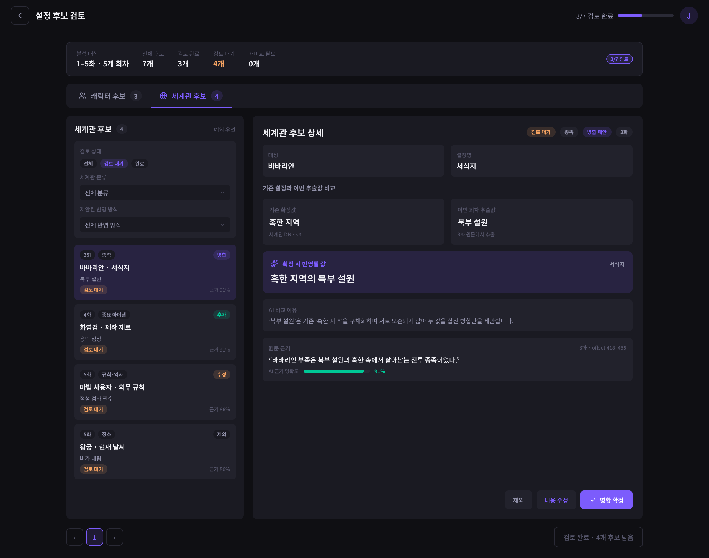
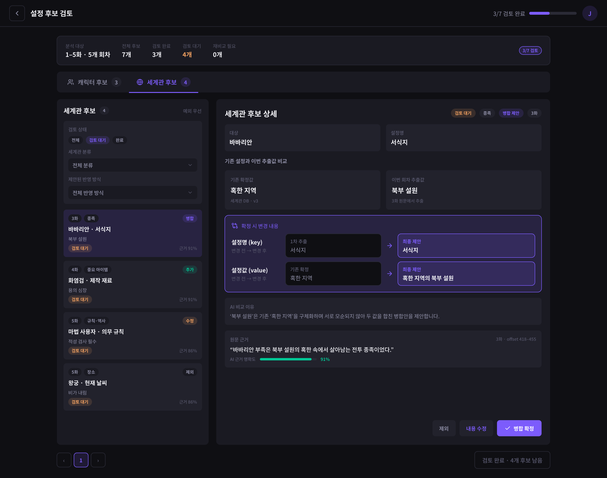
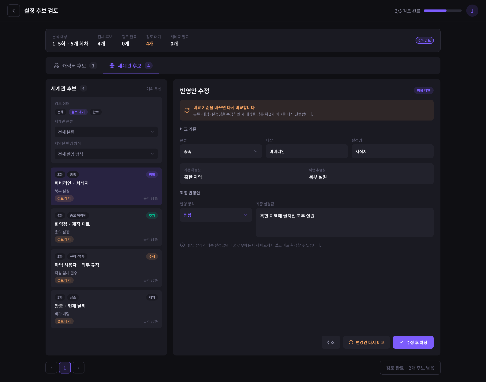
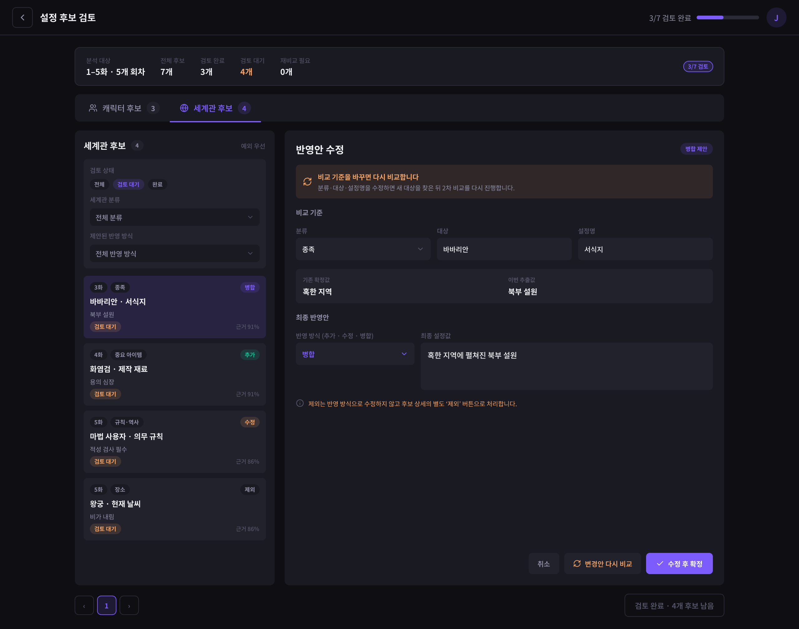
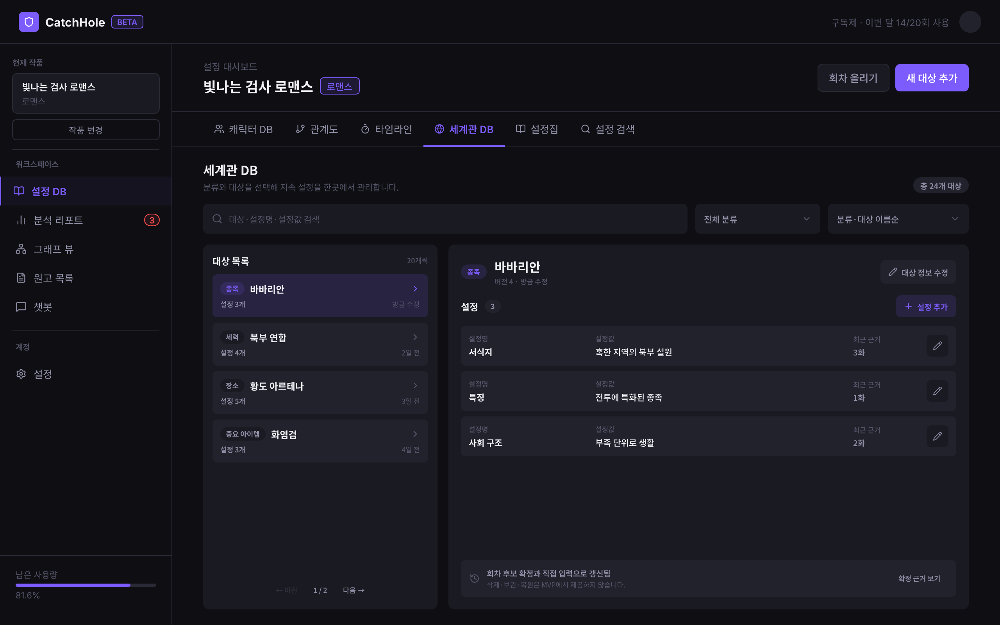
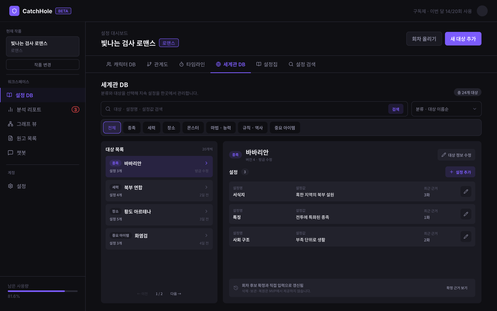
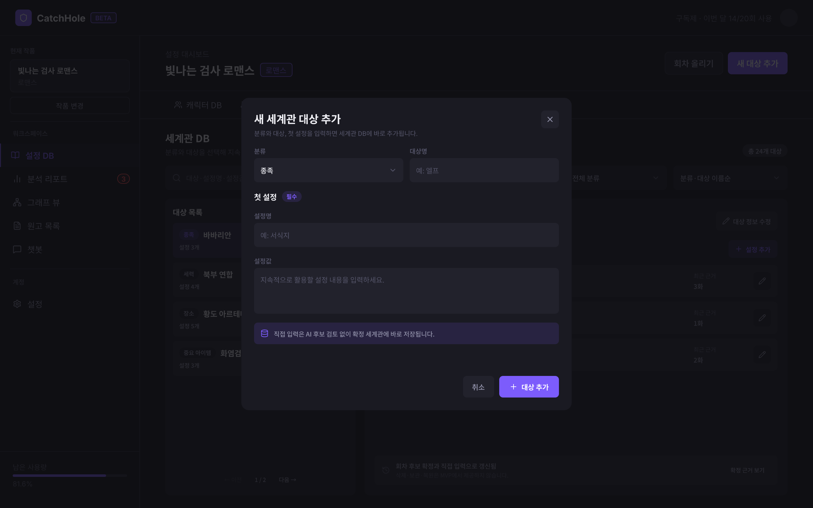
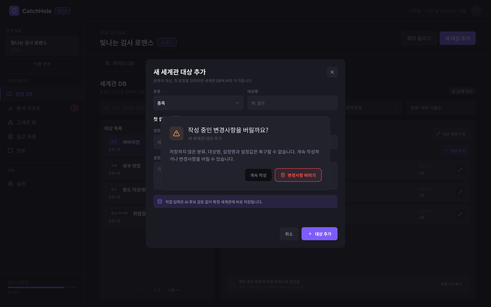
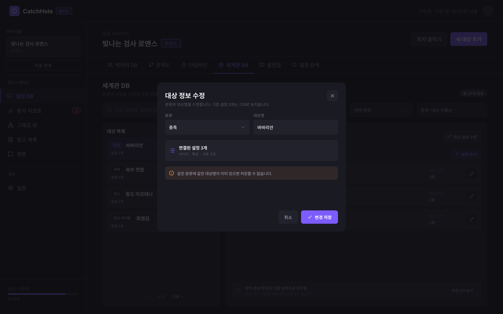
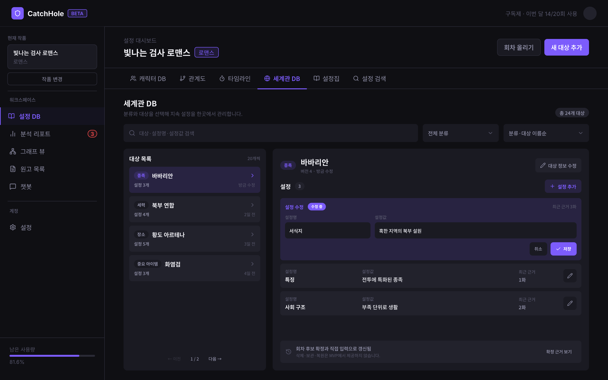

# 데이터 요구사항 — 세계관 설정

[← 전체 인덱스](./README.md)

> 이 문서는 Jira [NVM-260](https://aiswmproject.atlassian.net/browse/NVM-260)과 GitHub [#110](https://github.com/catchhole-soma/catchhole-backend-java/issues/110)에서 구현한 세계관 후보 검토와 세계관 DB 화면의 MVP 계약을 정리한다. 프론트는 `candidateType=world`와 `worldsettings` 탭을 생성 SDK로 지원한다. 구체적인 API 경로·HTTP 메서드·전체 DTO의 단일 출처는 Backend Swagger/OpenAPI다.

## 목차

- [세계관 설정의 정의와 추출 기준](#세계관-설정의-정의와-추출-기준)
- [프론트가 사용하는 도메인 단위](#프론트가-사용하는-도메인-단위)
- [설정 후보 검토 — 세계관 후보 탭](#설정-후보-검토--세계관-후보-탭)
- [설정DB 세계관 DB 탭](#설정db-세계관-db-탭)
- [MVP 제외 범위](#mvp-제외-범위)

---

## 세계관 설정의 정의와 추출 기준

세계관 설정은 **작품의 세계를 구성하며 여러 회차에서 지속적으로 활용되는 배경 정보와 규칙**이다. 회차 안에서 잠시 발생한 사건이나 특정 캐릭터의 현재 상태보다, 이후 회차에서도 다시 참조될 가능성이 높은 불변·지속 설정을 먼저 추출한다.

### 분류

분류 enum은 아래 7개로 고정한다. 화면과 문서에는 한국어 표시명과 설명을 사용하고, 세부 속성은 분류 enum을 늘리지 않고 설정명·설정값으로 자유롭게 추가한다.

| 내부 값 | 화면 표시명 | 설명 | 예시 대상 |
| --- | --- | --- | --- |
| `RACE` | 종족 | 공통된 신체·문화·기원 특성을 가진 존재 집단 | 바바리안, 엘프, 드워프 |
| `FACTION` | 세력 | 국가·조직·종교·길드처럼 공동 목적과 영향력을 가진 집단 | 왕국, 마탑, 기사단 |
| `LOCATION` | 장소 | 반복해서 등장하거나 세계 구조에 영향을 주는 지역·도시·건물·던전·차원 | 북부 설원, 황도, 마탑 |
| `MONSTER` | 몬스터 | 지속적인 특성이나 규칙이 있는 몬스터 종족·개체 | 고블린, 서리 용 |
| `POWER_SYSTEM` | 마법 및 능력 체계 | 마법·능력의 작동 원리, 조건, 한계, 공통 규칙 | 마력 적성, 마법 등급 |
| `WORLD_RULE_HISTORY` | 작품 내 규칙과 역사 | 세계의 법칙·제도·관습·전쟁·신화·과거 사건 | 적성 검사 의무, 제국 건국 전쟁 |
| `IMPORTANT_ITEM` | 중요한 아이템 | 여러 회차에서 지속적으로 영향을 주는 명명된 유물·도구 | 화염검, 왕의 인장 |

### 포함·제외 예시

포함:

- 마법 사용자는 반드시 마력 적성 검사를 받아야 한다.
- 바바리안은 혹한 지역에서 살아가는 전투 종족이다.
- 화염검은 용의 심장으로 제작된 유물이다.

제외:

- 수아가 현재 화염검을 들고 있다. — 특정 캐릭터의 현재 상태
- 오늘 왕궁에 비가 내렸다. — 일시적인 날씨·사건
- 몬스터 한 마리가 골목에서 나타났다. — 지속 설정이 아닌 단발 사건

### MVP 추출 출처

- MVP에서는 **회차 원문 분석 결과만** 세계관 후보를 생성한다.
- 별도로 업로드한 설정집은 기존 설정집 목록에서 원문 조회·수정·삭제만 지원한다.
- 설정집 원문에서 세계관 후보를 추출하거나 회차 후보와 자동 병합하는 기능은 후속 범위다.

---

## 프론트가 사용하는 도메인 단위

Backend의 실제 테이블·컬럼 이름은 Backend 문서가 단일 출처다. FE는 아래 의미 단위를 기준으로 화면을 구성한다.

### 세계관 후보

세계관 후보 한 건은 사용자가 독립적으로 검토할 수 있는 설정 하나다.

```text
분류 + 대상 + 설정명 + 추출값 + 추출 회차 + 원문 근거
```

예:

```text
종족 / 바바리안 / 서식지 / 혹한 지역 / 3화 / 원문 quote
```

1차 LLM이 후보를 추출하고, 2차 LLM은 관련된 기존 세계관 설정만 비교해 아래 반영 방식을 제안한다. 2차 LLM은 확정 세계관을 직접 수정하지 않는다.

| 내부 값 | 화면 표시명 | 의미 |
| --- | --- | --- |
| `ADD` | 추가 | 새로운 대상이거나 기존 대상에 없는 설정명 |
| `UPDATE` | 수정 | 기존 설정값을 새로운 값으로 교체 |
| `MERGE` | 병합 | 기존값과 추출값이 모두 유효해 하나의 최종값으로 결합 |
| `EXCLUDE` | 제외 | 중복·일시적 사건·캐릭터 현재 상태·근거 부족 등으로 반영하지 않음 |

### 확정 세계관

확정 세계관 한 건은 한 작품 안의 `분류 + 대상`을 나타내며, 설정은 키·문자열 값 객체로 묶는다.

```json
{
  "category": "RACE",
  "subjectName": "바바리안",
  "properties": {
    "서식지": "혹한 지역",
    "특징": "전투에 특화된 종족",
    "사회 구조": "부족 단위로 생활"
  }
}
```

- 목록 한 항목은 설정 속성 하나가 아니라 세계관 대상 하나다.
- `properties`는 객체이며 MVP 설정값은 문자열로 표시·편집한다.
- 확정 시 JSON 전체를 교체하지 않고 설정 하나만 추가·수정한다.
- 변경마다 버전을 증가시키고, 같은 설정명이 먼저 다른 값으로 변경된 경우에만 재비교가 필요하다.
- 행 전체 버전이 달라도 다른 설정명만 변경된 경우에는 현재 설정명을 확인한 뒤 안전하게 반영할 수 있다.

### 상태

**비교 상태**

| 내부 값 | 화면 표시명 | 화면 동작 |
| --- | --- | --- |
| `PENDING` | 비교 대기 | 확정 비활성 |
| `PROCESSING` | 비교 중 | 진행 상태 표시, 확정 비활성 |
| `COMPLETED` | 비교 완료 | 검토 액션 활성 |
| `FAILED` | 비교 실패 | 실패 이유와 다시 비교 제공 |
| `RECOMPARISON_REQUIRED` | 재비교 필요 | 자동 재비교 후 진행 상태 표시 |

**검토 상태**

| 내부 값 | 화면 표시명 | 의미 |
| --- | --- | --- |
| `PENDING_REVIEW` | 검토 대기 | 사용자가 아직 결정하지 않음 |
| `CONFIRMED` | 확정 | 세계관 DB 반영 완료 |
| `DISMISSED` | 제외 | 사용자가 반영하지 않기로 결정 |

`RECOMPARISON_REQUIRED`는 동일한 대상의 동일 설정명이 비교 이후 다른 값으로 먼저 바뀐 예외 상황에만 사용한다.

FE는 목록에 `PENDING`·`PROCESSING` 후보가 있거나 선택 상세가 두 상태 중 하나인 동안 2초 간격으로 다시 조회하고, 완료·실패 같은 terminal 상태에 도달하면 polling을 중단한다. `RECOMPARISON_REQUIRED`의 자동 재비교는 한 번의 상태 전환에서 한 요청만 보내되, 후보가 해당 상태를 벗어나면 guard를 해제하여 같은 후보의 이후 충돌도 다시 자동 처리한다.

---

## 설정 후보 검토 — 세계관 후보 탭

**URL**: `/setting-review?candidateType=world`

기존 `/setting-review` 라우트와 공통 검토 레이아웃을 유지한다. 캐릭터 후보와 세계관 후보를 한 목록에 섞지 않고 `캐릭터 후보 / 세계관 후보` 탭으로 구분한다. 캐릭터 후보 계약은 [character.md의 설정 검토](./character.md#설정-검토-ssettingreview)를 따른다.

**Pencil 시안**









> **디자인 원본**: `design/catchhole.pen`의 `SSettingReview / 세계관 후보 key-value 변경 비교`, `SSettingReview / 세계관 후보 반영 방식 제한` 프레임을 변경 UX의 기준으로 사용한다.

> **MVP 범위 메모**
> - 현재 `batchId`의 회차 원문 분석에서 생성된 세계관 후보만 조회한다.
> - 캐릭터와 세계관 후보의 검토 완료 수를 합산해 전체 완료 여부를 결정한다.
> - 캐릭터 후보 저장·확정 로직은 변경하지 않으며, 세계관 후보는 별도 데이터 계약을 사용한다.
> - 일괄 확정·일괄 제외, 근거 직접 수정, 설정집 추출 후보는 지원하지 않는다.

### 표시 정책

- 탭에는 `검토 완료 수 / 전체 후보 수`를 표시한다.
- 세계관 후보 목록의 `설정값`은 1차 LLM 추출값이며, 상세에서 기존값·추출값·제안값을 구분한다.
- `LLM 제안 작업` 대신 사용자용 문구 `제안된 반영 방식`을 사용한다.
- `EXCLUDE` 제안과 사용자의 최종 `DISMISSED` 상태를 혼동하지 않도록 각각 `제외 제안`, `제외`로 표시한다.
- 기존값과 추출값을 같은 크기로 비교하고, 실제 반영될 제안값을 가장 강하게 강조한다.
- `confidence`는 정확도가 아니라 `AI 근거 명확도`로 표시한다.

### 1. 화면에 표시할 데이터

**공통 상단**

- 분석 대상 회차 범위와 회차 수
- 캐릭터·세계관을 합친 전체 후보 수, 검토 완료 수, 검토 대기 수
- 캐릭터 후보 탭 완료 수/전체 수
- 세계관 후보 탭 완료 수/전체 수
- 처리 실패·재비교처럼 사용자의 확인이 필요한 후보 수

**왼쪽 필터·목록**

- 검토 상태: 전체·검토 대기·확정·제외
- 세계관 분류: 전체와 고정 7개 분류
- 제안된 반영 방식: 전체·추가·수정·병합·제외
- 후보별 출처 회차, 분류, 대상명, 설정명, 추출값
- 제안된 반영 방식, 검토 상태, 사용자 수정 여부
- 비교 실패·재비교 필요 상태의 오류 배지
- 서버 페이지네이션

**오른쪽 상세**

- 검토 상태·분류·제안된 반영 방식·출처 회차
- 대상명·설정명
- 비교 당시 기존 확정값
- 이번 회차의 1차 LLM 추출값
- 2차 비교가 추출 대상과 다른 기존 확정 대상을 연결하면 대상명을 `1차 추출 → 기존 확정 대상`으로 표시
- 설정명(key)은 1차 추출값 → 최종 제안값, 설정값(value)은 기존 확정값 → 최종 제안값으로 분리한 변경 전후 표시
- 2차 LLM 비교 이유
- 원문 quote와 회차 전체 기준 offset
- AI 근거 명확도
- 이미 검토된 후보의 최종 작업·최종 분류·대상·설정명·설정값

### 2. 사용자 액션

- `캐릭터 후보 / 세계관 후보` 탭 전환
- 검토 상태·세계관 분류·제안된 반영 방식 필터와 페이지 이동
- 후보 선택 → 오른쪽 상세 표시
- `ADD`, `UPDATE`, `MERGE` 제안
  - `제외`
  - `내용 수정`
  - `추가 확정`, `수정 확정`, `병합 확정`
- `EXCLUDE` 제안
  - `반영안 수정`
  - 별도 `제외` 버튼으로만 처리
- 반영안 수정의 반영 방식 선택지는 `ADD`, `UPDATE`, `MERGE`만 제공하고 `EXCLUDE`는 포함하지 않음
- 최종 반영값 또는 반영 방식만 수정 → 같은 상세에서 바로 확정
- 분류·대상명·설정명 수정 → 비교 대상을 다시 찾고 2차 LLM 재비교 후 재검토
- 비교 실패 → `다시 비교`
- 후보 확정·제외 성공 → 현재 필터의 다음 검토 대기 후보 자동 선택
- 전체 검토 완료 → 분석 목적에 맞는 다음 단계로 이동

### 3. 화면 전환 식별자

- 작품: `workId`
- 분석 묶음: `batchId`
- 활성 후보 종류: `candidateType=character|world`
- 선택 후보: `candidate`
- 세계관 탭 필터: `reviewStatus`, `worldCategory`, `operation`
- 페이지: 화면 1부터 시작하는 `page`

탭·필터·선택 후보는 딥링크할 수 있어야 한다. 탭을 전환해도 캐릭터·세계관 탭의 마지막 필터와 선택 상태는 각각 유지한다.

### 4. 데이터 없음 / 실패 표시

- 최초 목록·상세 조회: 각 영역 스켈레톤
- 세계관 후보 0건: `이번 분석에서 추출된 세계관 후보가 없습니다`
- 필터 결과 0건: 필터 초기화 제공
- 목록·상세 조회 실패: 이미 표시한 데이터는 유지하고 다시 시도 제공
- 비교 중: 상세는 표시하되 확정 액션 비활성
- 비교 대기·처리 중: 목록과 선택 상세를 2초 간격으로 갱신하고 terminal 상태에서 자동 갱신 중단
- 비교 실패: 실패 이유와 다시 비교 제공
- 재비교 필요: 자동 재비교 요청 후 진행 상태 표시
- 확정·제외 실패: 선택 후보와 입력값을 유지하고 재시도 제공
- 확정 성공: 목록·집계·상세를 최신 상태로 갱신하고 다음 대기 후보 선택
- 캐릭터·세계관 후보 모두 대기 0건이고 비교 실패·처리 중 후보가 없을 때만 전체 완료 활성

### 5. 화면 데이터 요구사항

#### 5-1. BE → FE 제공 데이터 요구사항

**배치·탭 집계**

| 데이터 의미 | 형태·필수성 | 값 없음·조건 |
| --- | --- | --- |
| 분석 대상 회차 범위·회차 수 | 배치별 필수 | 회차 번호 일부가 없으면 확인 가능한 범위만 표시 |
| 캐릭터·세계관 전체/완료/대기 개수 | 각 0 이상의 정수·필수 | 후보가 없으면 `0` |
| 비교 처리 필요 개수 | 0 이상의 정수·필수 | 실패·재비교 대상이 없으면 `0` |

**세계관 후보 목록 항목**

| 데이터 의미 | 형태·필수성 | 값 없음·조건 |
| --- | --- | --- |
| 후보·작품·회차·분석 작업 식별자 | 후보별 단일 값·필수 | 없음 불가 |
| 회차 번호 | 후보별 정수·선택 | 없으면 `회차 정보 없음` |
| 분류·대상명·설정명 | 후보별 단일 값·필수 | 없음 불가 |
| 1차 LLM 추출값 | 후보별 문자열·필수 | 빈 문자열 불가 |
| 비교 상태·검토 상태 | 후보별 enum·필수 | 없음 불가 |
| 제안된 반영 방식 | 후보별 enum·조건부 | 비교 완료 전에는 `null` |
| AI 근거 명확도 | 숫자·선택 | 없거나 범위를 벗어나면 `근거 명확도 정보 없음` |
| 사용자 수정 여부 | boolean·필수 | 수정하지 않았으면 `false` |

**선택 후보 상세**

| 데이터 의미 | 형태·필수성 | 값 없음·조건 |
| --- | --- | --- |
| 연결된 확정 세계관 대상 | 식별자·정식 대상명·조건부 | 새 대상 추가 제안이면 둘 다 `null`; 기존 대상이면 확정 요청에 정식 대상명 사용 |
| 실제 반영할 설정명 | 문자열·조건부 | 비교 완료 전에는 `null` |
| 비교 당시 기존값 | 문자열·조건부 | 새 설정 추가면 `null` |
| 제안값·비교 이유 | 문자열·조건부 | 비교 완료 전에는 `null` |
| 비교 기준 세계관 버전 | 0 이상의 정수·조건부 | 새 대상이면 `null` 가능 |
| 원문 근거 | `quote`, `startOffset`, `endOffset` 목록·필수 | 근거가 없으면 빈 목록 |
| 최종 사용자 결정 | 작업·분류·대상·설정명·값·검토자·시각·조건부 | 검토 대기면 `null` |

LLM 원본 응답은 디버깅 저장 대상이지만 사용자 화면에는 노출하지 않는다.

#### 5-2. FE → BE 전달 데이터 요구사항

- 목록·상세 조회: 작품, 분석 묶음, 선택한 필터와 페이지, 후보 식별자
- 후보 수정:
  - 비교 기준을 바꾸는 경우 분류, 대상명, 설정명을 보내고 재비교 대기로 전환
  - 최종 반영값과 최종 반영 방식만 바꾸는 경우 별도 후보 수정으로 저장하지 않고 최종 확정 요청에 포함
  - 원문 근거·LLM 원본·비교 기준값은 FE가 재조립하지 않는다.
- 후보 확정:
  - 후보 식별자, 최종 분류·대상명·설정명·반영 방식·설정값, 선택적 검토 메모
- 후보 제외:
  - 후보 식별자, 사용자의 제외 의도, 선택적 검토 메모
- 비교 재시도:
  - 후보 식별자. 분류·대상·설정명 수정이 필요하면 후보 수정 요청을 먼저 보낸다.

### 6. 확정된 연동 경계

- 캐릭터 후보와 세계관 후보는 별도 API·DTO를 사용하고 FE가 같은 `batchId`의 집계를 합산한다.
- Backend는 확정 시 동일 대상의 동일 설정명 현재값을 원자적으로 비교한다. 비교 후 값이 먼저 바뀌었으면 후보를 `RECOMPARISON_REQUIRED`로 저장한 뒤 409를 반환한다.
- FE는 409 뒤 후보 상세를 다시 받고 재비교를 한 번 요청한다. AI Worker의 실제 2차 비교 처리는 이 프론트·백엔드 구현 범위 밖이다.
- 재비교 뒤 후보가 `PENDING`·`PROCESSING`을 거쳐 회복하면 자동 재비교 guard를 해제한다. 같은 후보의 다음 확정에서 다시 409가 발생하면 새로운 전환으로 보고 자동 재비교를 한 번 더 요청한다.
- 실제 요청·응답 계약은 Backend Swagger/OpenAPI와 생성 SDK를 따른다.

---

## 설정DB 세계관 DB 탭

**URL**: `/dashboard?nav=settingDB&tab=worldsettings`

회차 후보 검토를 거쳐 확정된 현재 세계관 설정을 분류·대상별로 탐색하고, 새 대상이나 설정을 직접 추가·수정하는 화면이다. 기존 [`설정집 목록`](./character.md#설정db-설정집-목록-탭)은 별도 원문 파일 관리 화면으로 유지한다.

**Pencil 시안**













> **디자인 원본**: `design/catchhole.pen`의 `S1Dashboard / 세계관 DB 버튼형 분류 필터`, `S1Dashboard / 세계관 DB 미저장 변경 확인` 프레임을 변경 UX의 기준으로 사용한다.

> **MVP 범위 메모**
> - 왼쪽 대상 목록과 오른쪽 상세의 2단 구조를 사용한다.
> - 카드 그리드나 설정 속성별 평면 표로 펼치지 않는다.
> - 새 대상·설정 추가와 수정은 지원하고, 설정·대상 삭제와 보관·복원은 후속 범위다.
> - 직접 입력·수정은 LLM이나 후보 검토를 다시 거치지 않고 현재 세계관에 반영한다.
> - 전체 변경 로그는 지원하지 않으며, 후보 확정으로 만들어진 원문 근거와 후보 이력만 확인한다.

### 표시·정렬 정책

- 목록 한 항목은 `분류 + 대상명 + 설정 개수 + 최근 수정 정보`다.
- 기본 정렬은 분류 enum 순서 후 대상명 가나다순이다.
- 선택 정렬은 `분류·가나다순`, `최근 수정순` 두 개만 제공한다.
- 검색은 대상명·설정명·설정값의 부분 일치이며 영문은 대소문자를 구분하지 않는다.
- 검색된 설정명·설정값이 있으면 목록에 일치한 설정을 한 줄로 보여준다.
- 분류 필터와 검색어는 AND 조건으로 적용한다.
- 한 페이지에 대상 20개를 표시하고 검색·필터 변경 시 첫 페이지로 이동한다.
- 데스크톱은 첫 번째 결과를 자동 선택하고, 작은 화면은 목록 선택 후 상세로 전환한다.

### 1. 화면에 표시할 데이터

**상단 탐색**

- 세계관 대상 총개수
- 대상명·설정명·설정값 통합 검색
- `전체`와 고정 7개 분류를 한 번에 볼 수 있는 버튼형 필터
- 분류·가나다순 / 최근 수정순 정렬
- `새 대상 추가` 버튼

**왼쪽 대상 목록**

- 분류 배지
- 대상명
- 현재 설정 개수
- 최근 수정 시각 또는 최근 반영 회차
- 검색 시 일치한 설정명·설정값 요약
- 페이지네이션

**오른쪽 대상 상세**

- 분류·대상명·설정 개수·버전
- 대상 정보 수정 버튼
- `properties`의 설정명·설정값 행
- 설정 추가 버튼과 개별 설정 수정 버튼
- 후보 확정으로 연결된 원문 근거와 후보 이력 열기
- 직접 입력·수정으로 현재값과 일치하는 후보 근거가 없으면 `직접 입력된 설정 · 연결된 원문 근거 없음` 표시

**새 대상 추가 모달**

- 분류
- 대상명
- 첫 번째 설정명·설정값
- 취소·추가

**대상 정보 수정 모달**

- 현재 분류와 대상명
- 취소·저장

**설정 인라인 편집**

- 설정 추가: 상세 하단에 새 설정명·설정값 입력 행
- 설정 수정: 선택한 행을 설정명·설정값 입력 상태로 전환
- 한 번에 설정 행 하나만 편집
- 자동 저장하지 않고 명시적인 추가·저장 액션 사용

### 2. 사용자 액션

- 검색어·분류·정렬·페이지 변경
- 대상 선택 → 오른쪽 상세 표시, URL의 선택 대상 갱신
- 작은 화면의 `대상 목록으로` → `settingId`를 제거하고 사용자가 다른 대상을 선택할 수 있는 목록 유지
- `새 대상 추가` → 모달에서 분류·대상·첫 설정을 입력하고 생성
- `대상 정보 수정` → 분류·대상명을 수정
- `설정 추가` → 상세 인라인 행에서 설정명·설정값 추가
- `수정` → 해당 설정 행을 인라인 편집하고 저장
- 원문 근거·후보 이력 열기 → 현재값의 최신 근거를 먼저 표시하고 과거 이력을 이어 표시하되 동일 후보 근거는 한 번만 노출
- 후보 확정 성공 안내의 `세계관 DB에서 보기` → 해당 대상을 바로 선택해 진입

사용자 직접 추가·수정은 LLM 비교를 거치지 않는다. 저장 시 현재 버전을 함께 전달해 다른 변경을 덮어쓰지 않는다.

### 3. 화면 전환 식별자

- 작품: `workId`
- 탭: `nav=settingDB&tab=worldsettings`
- 검색어: `q`
- 분류: `category`
- 정렬: `sort=CATEGORY_SUBJECT_ASC|UPDATED_DESC`
- 화면 1부터 시작하는 페이지: `page`
- 선택 대상: `settingId`
- 새 대상 추가 모달: `modal=world-setting-create`
- 대상 정보 수정 모달: `modal=world-setting-edit&settingId={id}`

설정 인라인 편집 여부와 미저장 입력값은 클라이언트 전용 상태로 두고 URL에 저장하지 않는다.

새 대상 추가·대상 정보 수정 모달의 미저장 draft도 클라이언트 전용 상태로 둔다. 브라우저 Back으로 URL의 `modal`이 사라져도 같은 화면이 유지되는 동안 draft를 보존하여 Forward 또는 같은 모달 재진입 시 복원하고, 사용자가 취소를 확인하거나 저장에 성공했을 때만 초기화한다.

세계관 DB와 설정 검색은 활성 탭에서만 공통 `q`·`page`를 사용한다. 탭을 떠날 때 세계관 값은 `worldSettingQ`·`worldSettingPage`, 설정 검색 값은 `factSearchQ`·`factSearchPage`에 보관하고, 돌아올 때 공통 키로 복원하여 서로의 API 요청에 섞이지 않게 한다.

### 4. 데이터 없음 / 실패 표시

- 최초 조회: 목록·상세 스켈레톤
- 확정 세계관 0건:
  - `등록된 세계관 설정이 없습니다`
  - `회차를 분석해 세계관 설정을 추출하거나 직접 추가해 보세요.`
  - `회차 분석하기`, `새 대상 추가` 제공
- 검색·필터 결과 0건: `검색 조건에 맞는 세계관 설정이 없습니다`와 초기화 제공
- 목록 조회 실패: 오류 안내와 다시 시도
- 상세 조회 실패: 목록은 유지하고 상세 영역에서 다시 시도
- 추가·수정 실패: 모달 또는 인라인 입력값을 유지하고 필드·공통 오류 표시
- 저장 중: 해당 폼의 중복 제출을 막고 진행 상태 표시
- 버전 충돌: 409의 오류 코드가 `WORLD_SETTING_VERSION_CONFLICT`일 때만 사용자의 입력을 유지한 채 최신값 다시 불러오기 안내
- 대상명·설정명 중복: 409의 중복 오류 메시지와 입력을 유지하되 최신값 다시 불러오기는 표시하지 않음
- 저장 성공: 목록 개수·상세·선택 대상·버전을 최신 상태로 갱신하고 성공 안내
- 편집 중 다른 대상 선택·모달 닫기: 브라우저 기본 confirm 대신 서비스 디자인의 확인 다이얼로그로 작성 취소 여부 확인
- 900px 이하: 검색·분류·정렬 컨트롤을 한 열로 쌓아 가로 스크롤 없이 표시

### 5. 화면 데이터 요구사항

#### 5-1. BE → FE 제공 데이터 요구사항

**대상 목록**

| 데이터 의미 | 형태·필수성 | 값 없음·조건 |
| --- | --- | --- |
| 검색·필터 조건에 맞는 전체 대상 수 | 0 이상의 정수·필수 | 없으면 `0` |
| 대상 목록 | 페이지 목록·필수 | 없으면 빈 목록 |
| 대상 식별자·분류·대상명 | 항목별 단일 값·필수 | 없음 불가 |
| 설정 개수·버전 | 0 이상의 정수·필수 | 설정 개수는 생성된 대상에서 1 이상 |
| 최근 수정 정보 | 시각·필수, 회차 번호·선택 | 직접 수정이면 회차 번호가 없을 수 있음 |
| 검색 일치 설정 요약 | 설정명·설정값·조건부 | 검색 결과가 설정 속성에서 일치할 때 제공 |
| 페이지 메타데이터 | 필수 | 서버 페이지는 0부터 시작, 화면은 1부터 표시 |

**선택 대상 상세**

| 데이터 의미 | 형태·필수성 | 값 없음·조건 |
| --- | --- | --- |
| 대상 식별자·분류·대상명·버전 | 단일 값·필수 | 없음 불가 |
| 현재 설정 객체 | 문자열 key·문자열 value 객체·필수 | 빈 객체인 대상은 생성하지 않음 |
| 설정별 현재값과 일치하는 최신 후보 근거 | 조건부 | 직접 입력·수정이거나 근거가 없으면 `null`; 있으면 이력보다 먼저 표시 |
| 후보 확정 이력 | 설정별 목록·필수 | 이력이 없으면 빈 목록; 최신 근거와 같은 후보는 중복 표시하지 않음 |

#### 5-2. FE → BE 전달 데이터 요구사항

- 목록·상세 조회: 작품, 검색어, 분류, 정렬, 페이지, 대상 식별자
- 새 대상 추가:
  - 분류, 앞뒤 공백만 제거하고 내부 공백은 보존한 대상명
  - 앞뒤 공백만 제거하고 내부 공백은 보존한 첫 설정명과 빈 값이 아닌 첫 설정값
- 대상 정보 수정:
  - 대상 식별자, 수정할 분류·대상명, 현재 버전
- 설정 추가:
  - 대상 식별자, 새 설정명·설정값, 현재 버전
- 설정 수정:
  - 대상 식별자, 기존 설정명, 새 설정명·설정값, 현재 버전

입력 형식 FE 검증:

- 대상명·설정명·설정값은 공백만 입력할 수 없다.
- 대상명·설정명은 앞뒤 공백만 제거하며 `북부 설원`, `사회 구조`와 같은 내부 공백은 보존한다.
- 설정명과 설정값은 화면에 표시하는 문자열을 전달하고 JSON 전체를 FE가 다시 조립해 덮어쓰지 않는다.

중복 판단·검증 책임:

- 회차 후보와 기존 세계관 설정의 의미적 중복은 2차 LLM이 비교하고 `EXCLUDE` 등의 반영 방식을 제안한다. FE는 제안과 비교 이유를 표시하며 자체 규칙으로 다시 판정하지 않는다.
- 세계관 DB에서 직접 추가·수정할 때 같은 `분류 + 대상명` 또는 같은 대상 안의 같은 설정명이 존재하는지는 BE가 전체 데이터와 동시 요청을 기준으로 최종 검증한다.
- FE는 현재 불러온 데이터로 빠른 사전 안내를 제공할 수 있지만, 페이지네이션·검색·필터 결과만으로 중복 여부를 확정하지 않는다. 생성·수정 완료 여부는 BE 응답을 따르고 중복 응답을 필드 또는 공통 오류로 표시한다.

### 6. 확정된 연동 경계

- 목록 API는 대상명·설정명·설정값 부분 일치 검색과 `CATEGORY_SUBJECT_ASC`, `UPDATED_DESC` 정렬을 제공한다.
- 상세 API는 현재 설정 객체와 설정명별 최신 확정 후보 근거·후보 이력을 제공한다. FE는 최신 근거와 이력을 합쳐 최신 근거부터 표시하고 동일 후보를 중복 제거하며, 연결 근거가 없으면 직접 입력 설정으로 표시한다.
- Backend가 작품 전체와 동시 요청을 기준으로 `분류 + 대상명`, 대상 내 설정명 중복을 검증한다.
- 대상·설정 추가와 수정은 상세의 현재 `version`을 보낸다. FE는 `WORLD_SETTING_VERSION_CONFLICT`에만 최신 상세 재조회와 재시도를 제공하고, 같은 HTTP 409의 대상명·설정명 중복은 입력과 서버 오류만 유지한다.
- 실제 경로·HTTP 메서드·DTO는 Backend Swagger/OpenAPI와 생성 SDK를 따른다.

---

## MVP 제외 범위

- 설정집 원문에서 세계관 후보 추출
- 설정집 후보와 회차 후보의 우선순위·자동 병합
- `world_setting_facts` 또는 별도 전체 변경 로그
- 대상·설정 삭제, 보관, 복원
- 설정값의 중첩 객체·배열 편집
- 일괄 확정·일괄 제외
- 원문 근거 직접 수정
- 캐릭터 설정 후보 저장·확정 로직 변경
