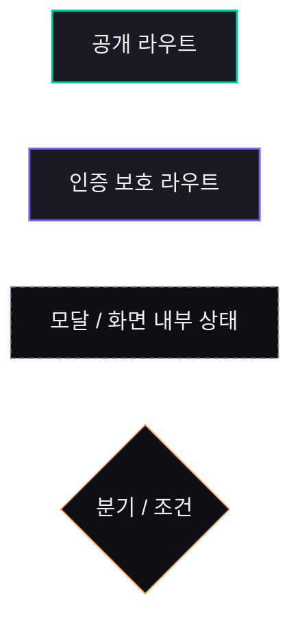
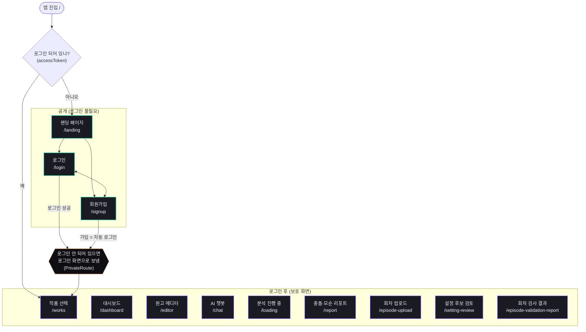
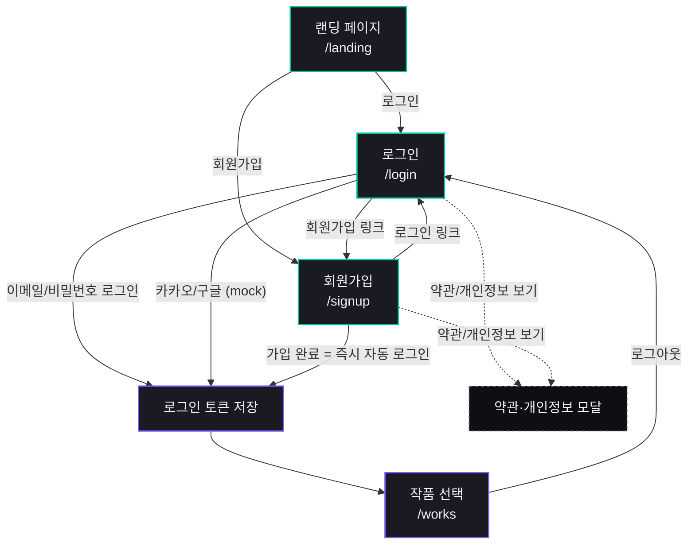
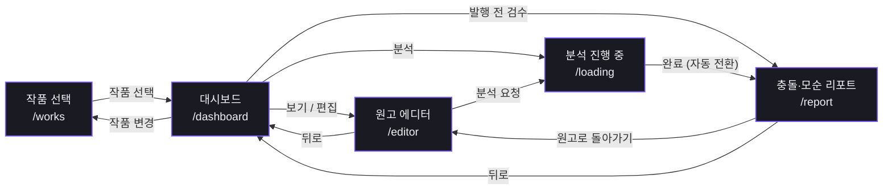
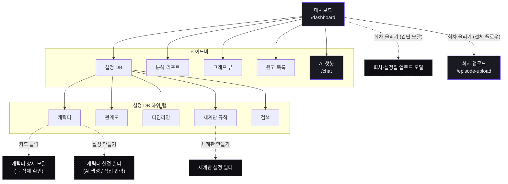
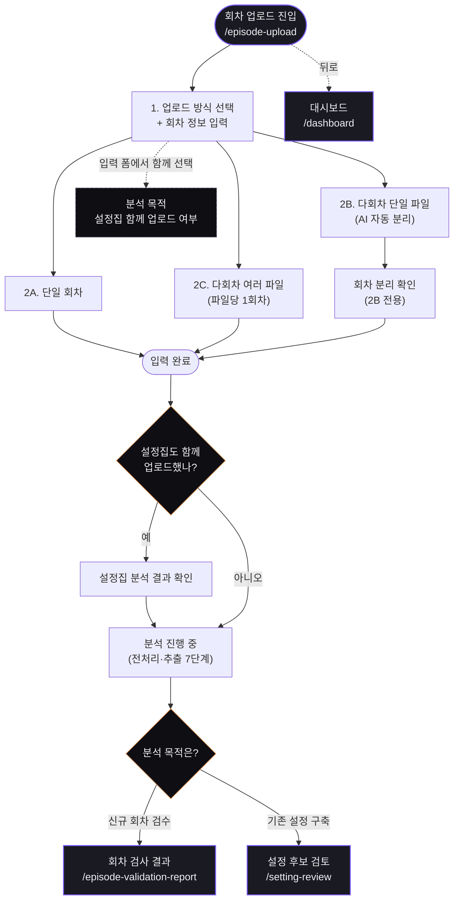
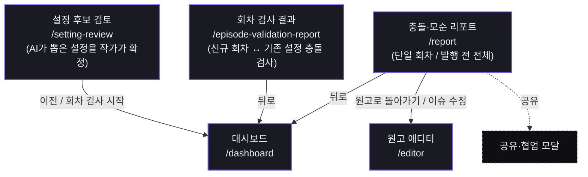

# CatchHole 프론트엔드 화면 흐름 (Screen Flow)

CatchHole 프론트엔드의 화면(라우트) 간 이동 흐름을 Mermaid로 정리한 문서입니다.
스크린샷 대신 이 문서 하나로 "어느 화면에서 어디로 가는지"를 파악하는 것이 목적입니다.

각 노드는 **한글 화면 이름 + 경로**로 표기합니다. 경로(`/works` 등)로 코드의 라우트(`src/app/App.tsx`)와 1:1 매칭됩니다.

아래 표의 경로와 각 다이어그램 밑의 딥링크는 배포 사이트 <https://catch-hole.vercel.app> 로 연결되는 **실제 클릭 가능한 링크**입니다. 단,
- **로그인 보호 화면**은 토큰이 없으면 `/login`으로 리다이렉트됩니다(먼저 로그인 필요).
- 배포본은 백엔드 미연동이라 첫 접속 시 **데모 모드 전환이 한 번 필요**합니다([NVM-48](https://aiswmproject.atlassian.net/browse/NVM-48)).
- `<id>`가 들어간 딥링크는 실제 ID를 채워야 동작하므로 링크 대신 형식만 표기했습니다.

근거(코드가 바뀌면 함께 갱신):
- 라우트 정의 / 인증 게이트 — `src/app/App.tsx`
- 화면 간 전환 — 각 컴포넌트의 `navigate(...)` 호출
- 사이드바 네비게이션 — `src/app/components/catchhole/AppSidebar.tsx`
- 회차 업로드 분기 — `SEpisodeUpload.tsx`의 `goToReview`
- 딥링크 쿼리 파라미터 — `CLAUDE.md` 라우팅 표
- 화면별 상태/모달 카탈로그 — `design/PENCIL_MIGRATION.md`

## 화면 한눈에 보기

| 화면 이름 | 경로 (클릭 시 이동) | 무슨 화면인가 |
| --- | --- | --- |
| 랜딩 | [`/landing`](https://catch-hole.vercel.app/landing) | 로그인 전 서비스 소개 페이지 |
| 로그인 / 회원가입 | [`/login`](https://catch-hole.vercel.app/login) · [`/signup`](https://catch-hole.vercel.app/signup) | 인증 |
| 작품 선택 | [`/works`](https://catch-hole.vercel.app/works) | 작업할 작품을 고르는 진입점 |
| 대시보드 | [`/dashboard`](https://catch-hole.vercel.app/dashboard) | 작품의 설정DB·리포트·그래프·원고 허브 |
| 원고 에디터 | [`/editor`](https://catch-hole.vercel.app/editor) | 회차 원고 편집/보기 |
| AI 챗봇 | [`/chat`](https://catch-hole.vercel.app/chat) | 설정 관련 질의응답 챗봇 |
| 분석 진행 중 | [`/loading`](https://catch-hole.vercel.app/loading) | 분석 진행률 표시(완료 시 리포트로 자동 이동) |
| 충돌·모순 리포트 | [`/report`](https://catch-hole.vercel.app/report) | 분석 결과(충돌/모순) 리포트 |
| 회차 업로드 | [`/episode-upload`](https://catch-hole.vercel.app/episode-upload) | 회차 원고 업로드 플로우 |
| **설정 후보 검토** | [`/setting-review`](https://catch-hole.vercel.app/setting-review) | AI가 원고·설정집에서 **뽑아낸 설정 후보**를 작가가 확인·확정 |
| **회차 검사 결과** | [`/episode-validation-report`](https://catch-hole.vercel.app/episode-validation-report) | 새로 올린 회차가 **기존 설정과 충돌·모순**되는지 검사한 결과 |

## 범례 (Legend)

---

## 1. 전체 라우트 맵

진입점에서 인증 토큰 유무로 갈라지고, 보호 라우트는 모두 `PrivateRoute` 게이트를 통과해야 합니다.

---

## 2. 인증 흐름 (Auth)

> 소셜 로그인(카카오/구글)은 아직 mock 구현 — 실제 OAuth 연동 전까지 mock token만 저장됩니다.
> 딥링크: 약관·개인정보 모달을 바로 열기 — [`/login?terms=terms`](https://catch-hole.vercel.app/login?terms=terms) · [`/login?terms=privacy`](https://catch-hole.vercel.app/login?terms=privacy) (회원가입은 [`/signup?terms=terms`](https://catch-hole.vercel.app/signup?terms=terms) · [`/signup?terms=privacy`](https://catch-hole.vercel.app/signup?terms=privacy)).

---

## 3. 메인 작업 흐름 (Main Workflow)

작품 선택 → 대시보드 → 원고 에디터 → 분석 진행 → 리포트의 핵심 동선입니다.

> 원고 에디터는 같은 화면에서 **편집 모드 / 보기 모드**를 전환합니다(보기 모드는 "분석 요청" 버튼 없음).
> 리포트는 **단일 회차 검수**([`/report`](https://catch-hole.vercel.app/report)) / **발행 전 전체 검수**([`/report?mode=prePublish`](https://catch-hole.vercel.app/report?mode=prePublish)) 두 모드가 있습니다.

---

## 4. 대시보드 내부 네비게이션 (사이드바 · 탭 · 모달)

대시보드 내부 상태는 모두 쿼리 파라미터로 딥링크됩니다. 사이드바는 다른 화면에서 눌러도 먼저 대시보드로 돌아간 뒤 해당 섹션으로 이동합니다.

> 딥링크 (클릭 시 이동):
> - 사이드바 — [설정 DB](https://catch-hole.vercel.app/dashboard?nav=settingDB) · [분석 리포트](https://catch-hole.vercel.app/dashboard?nav=reports) · [그래프 뷰](https://catch-hole.vercel.app/dashboard?nav=graph) · [원고 목록](https://catch-hole.vercel.app/dashboard?nav=manuscripts)
> - 설정DB 탭 — [캐릭터](https://catch-hole.vercel.app/dashboard?nav=settingDB&tab=characters) · [관계도](https://catch-hole.vercel.app/dashboard?nav=settingDB&tab=relations) · [타임라인](https://catch-hole.vercel.app/dashboard?nav=settingDB&tab=timeline) · [세계관 규칙](https://catch-hole.vercel.app/dashboard?nav=settingDB&tab=worldrules) · [검색](https://catch-hole.vercel.app/dashboard?nav=settingDB&tab=search)
> - 관계도 샘플 — [triangle](https://catch-hole.vercel.app/dashboard?nav=settingDB&tab=relations&relGraph=triangle) · [prosecution](https://catch-hole.vercel.app/dashboard?nav=settingDB&tab=relations&relGraph=prosecution) · [court](https://catch-hole.vercel.app/dashboard?nav=settingDB&tab=relations&relGraph=court)
> - ID 필요(형식만) — 캐릭터 상세 `?modal=char-detail&charId=<id>`, 그래프 노드 `?nav=graph&node=<id>`

---

## 5. 회차 업로드 플로우

회차 업로드 화면은 한 화면 안에서 단계를 진행합니다. 분기점이 3개 있습니다.

1. **업로드 방식** — `2B 다회차 단일 파일`일 때만 "회차 분리 확인" 단계가 추가됩니다. 2A·2C는 건너뜁니다.
2. **설정집 유무** — "설정집도 함께 업로드"를 체크하면, 분석 진행 **전에** "설정집 분석 결과 확인" 단계가 삽입됩니다.
3. **분석 목적** — 입력 폼에서 고른 목적에 따라 끝나는 화면이 갈립니다.

> "분석 진행 중" 7단계: 원문 저장 → 원문 청킹 → 청크 저장 → LLM 전처리 → 전처리 완료 → AI 설정 추출 → 설정 후보 생성 완료.

---

## 6. 검토 · 리포트 흐름

업로드·분석이 끝난 뒤 도달하는 화면들입니다.

> 딥링크 (클릭 시 이동): 리포트 [발행 전 검수](https://catch-hole.vercel.app/report?mode=prePublish).
> ID 필요(형식만): 설정 후보 검토 `?candidate=<id>` ([/setting-review](https://catch-hole.vercel.app/setting-review)), 회차 검사 결과 `?issue=<id>` ([/episode-validation-report](https://catch-hole.vercel.app/episode-validation-report)).
