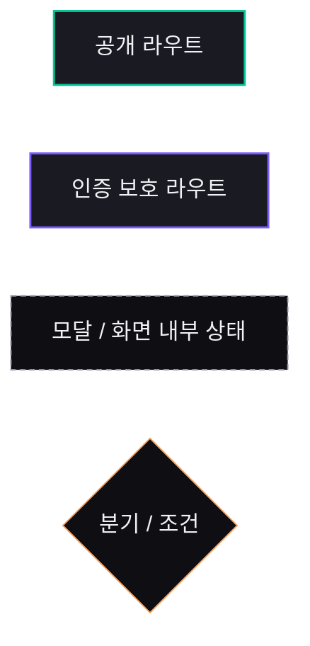
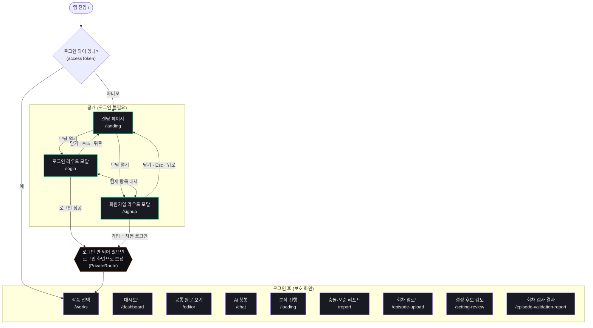
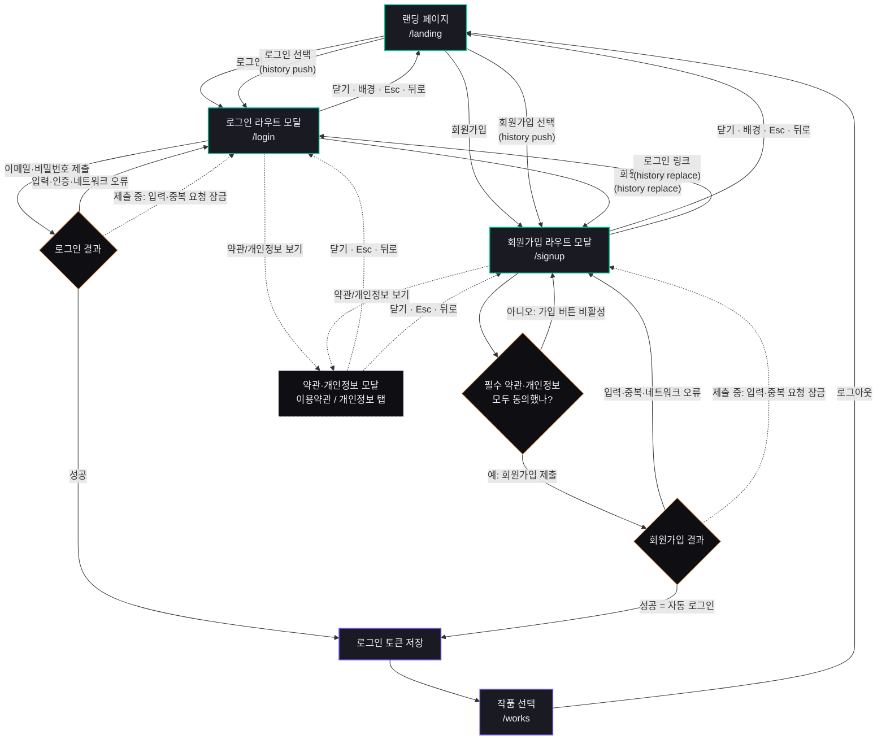
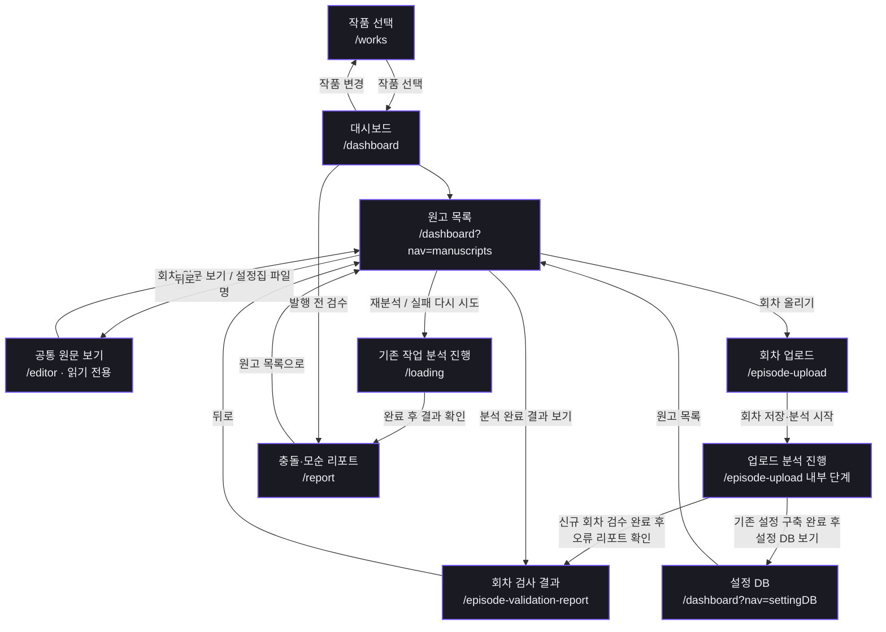
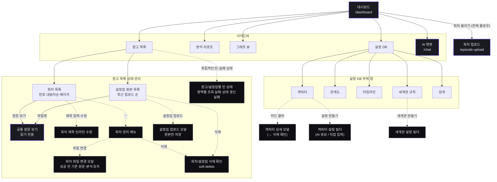
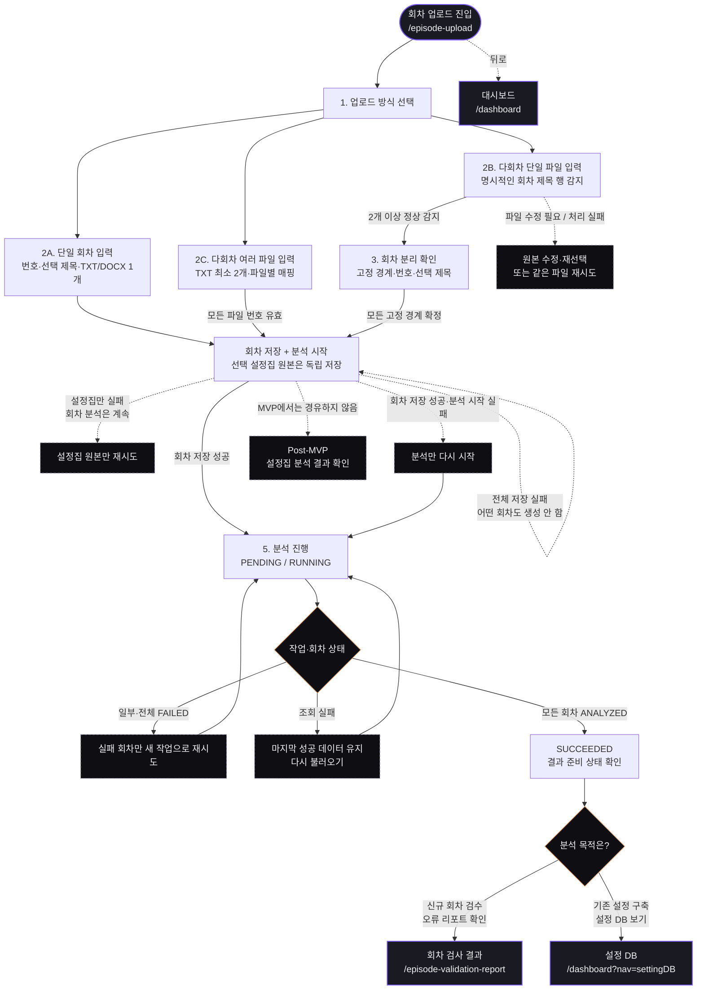
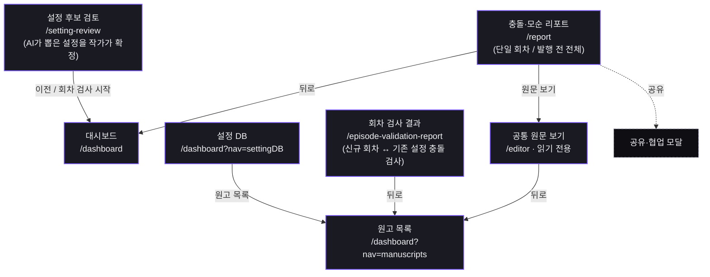

# CatchHole 프론트엔드 화면 흐름 (Screen Flow)

CatchHole 프론트엔드의 화면(라우트)과 주요 화면 상태 사이의 이동 흐름을 Mermaid로 정리한 문서입니다.
인증·원고 관리·회차 업로드의 MVP 기준은 `docs/data-requirements` 문서와 Pencil 화면을 함께 따릅니다.

각 노드는 **한글 화면 이름 + 경로**로 표기합니다. 경로(`/works` 등)로 코드의 라우트(`src/app/App.tsx`)와 1:1 매칭됩니다.

아래 표의 경로와 각 다이어그램 밑의 딥링크는 배포 사이트 <https://catch-hole.vercel.app> 로 연결되는 **실제 클릭 가능한 링크**입니다. 단,
- **로그인 보호 화면**은 토큰이 없으면 `/login`으로 리다이렉트됩니다(먼저 로그인 필요).
- `<id>`가 들어간 딥링크는 실제 ID를 채워야 동작하므로 링크 대신 형식만 표기했습니다.
- 배포 구현이 본 문서보다 늦게 반영될 수 있으며, 그 경우 이 문서와 데이터 요구사항의 MVP 흐름을 목표 동작으로 봅니다.

근거(화면 계약이나 구현이 바뀌면 함께 갱신):
- 인증 화면 계약 — [`data-requirements/auth.md`](data-requirements/auth.md)
- 원고 조회·관리 계약 — [`data-requirements/episode.md`](data-requirements/episode.md)
- 회차 업로드 계약 — [`data-requirements/upload.md`](data-requirements/upload.md)
- 라우트 정의 / 인증 게이트 — `src/app/App.tsx`
- 화면 간 전환 — 각 컴포넌트의 `navigate(...)` 호출
- 사이드바 네비게이션 — `src/app/components/catchhole/AppSidebar.tsx`

## Pencil Workflow Boards

Pencil은 아래 보드에서 실제 화면과 전환 설명을 함께 보여줍니다. 흐름이 달라질 때는 이 문서의 Mermaid를 먼저 갱신하고, 보드와 PNG를 동기화합니다.

| Workflow | Pencil Board ID | PNG |
| --- | --- | --- |
| WF-01 / 인증·작품 진입 | `q7BIt` | [WF-01.png](workflows/WF-01.png) |
| WF-02 / 작품·대시보드 | `xuHzb` | [WF-02.png](workflows/WF-02.png) |
| WF-03 / 원고 관리·원문·분석 | `XqFyi` | [WF-03.png](workflows/WF-03.png) |
| WF-04 / 회차 업로드 | `RLw7i` | [WF-04.png](workflows/WF-04.png) |
| WF-05 / 검토·리포트 | `i7MrrQ` | [WF-05.png](workflows/WF-05.png) |

## 화면 한눈에 보기

| 화면 이름 | 경로 (클릭 시 이동) | 무슨 화면인가 |
| --- | --- | --- |
| 랜딩 | [`/landing`](https://catch-hole.vercel.app/landing) | 로그인 전 서비스 소개 페이지 |
| 로그인 / 회원가입 | [`/login`](https://catch-hole.vercel.app/login) · [`/signup`](https://catch-hole.vercel.app/signup) | 랜딩 위 라우트 모달로 제공하는 이메일·비밀번호 인증과 약관 동의 |
| 작품 선택 | [`/works`](https://catch-hole.vercel.app/works) | 작업할 작품을 고르는 진입점 |
| 대시보드 | [`/dashboard`](https://catch-hole.vercel.app/dashboard) | 작품의 설정DB·리포트·그래프·원고 허브 |
| 공통 원문 보기 | [`/editor`](https://catch-hole.vercel.app/editor) | 회차·설정집 원본을 읽기 전용으로 확인 |
| AI 챗봇 | [`/chat`](https://catch-hole.vercel.app/chat) | 설정 관련 질의응답 챗봇 |
| 분석 진행 | [`/loading`](https://catch-hole.vercel.app/loading) | 작업·회차 상태 추적(완료 후 사용자가 결과로 이동) |
| 충돌·모순 리포트 | [`/report`](https://catch-hole.vercel.app/report) | 분석 결과(충돌/모순) 리포트 |
| 회차 업로드 | [`/episode-upload`](https://catch-hole.vercel.app/episode-upload) | 방식 선택·입력·선택적 분리 확인·분석 추적 플로우 |
| **설정 후보 검토** | [`/setting-review`](https://catch-hole.vercel.app/setting-review) | AI가 원고·설정집에서 **뽑아낸 설정 후보**를 작가가 확인·확정 |
| **회차 검사 결과** | [`/episode-validation-report`](https://catch-hole.vercel.app/episode-validation-report) | 새로 올린 회차가 **기존 설정과 충돌·모순**되는지 검사한 결과 |

## 범례 (Legend)

```mermaid
flowchart LR
  pub["공개 라우트"]:::public
  priv["인증 보호 라우트"]:::private
  modal["모달 / 화면 내부 상태"]:::modal
  decision{"분기 / 조건"}:::decision

  classDef public fill:#1A1A22,stroke:#00C896,stroke-width:1.5px,color:#F0F0F5;
  classDef private fill:#1A1A22,stroke:#7C5CFC,stroke-width:1.5px,color:#F0F0F5;
  classDef modal fill:#0F0F13,stroke:#9090A8,stroke-dasharray:4 3,color:#F0F0F5;
  classDef decision fill:#0F0F13,stroke:#F4A261,color:#F0F0F5;
```

---

## 1. 전체 라우트 맵

진입점에서 인증 토큰 유무로 갈라지고, 보호 라우트는 모두 `PrivateRoute` 게이트를 통과해야 합니다.

```mermaid
flowchart TD
  entry(["앱 진입 /"]) --> root{"로그인 되어 있나?<br/>(accessToken)"}
  root -- "아니오" --> landing
  root -- "예" --> works

  subgraph PUBLIC["공개 (로그인 불필요)"]
    direction TB
    landing["랜딩 페이지<br/>/landing"]
    login["로그인 라우트 모달<br/>/login"]
    signup["회원가입 라우트 모달<br/>/signup"]
  end

  landing -- "모달 열기" --> login
  landing -- "모달 열기" --> signup
  login <-->|"현재 항목 대체"| signup
  login -- "닫기 · Esc · 뒤로" --> landing
  signup -- "닫기 · Esc · 뒤로" --> landing

  login -- "로그인 성공" --> gate
  signup -- "가입 = 자동 로그인" --> gate

  gate{{"로그인 안 되어 있으면<br/>로그인 화면으로 보냄<br/>(PrivateRoute)"}}:::decision

  subgraph PRIVATE["로그인 후 (보호 화면)"]
    direction TB
    works["작품 선택<br/>/works"]
    dashboard["대시보드<br/>/dashboard"]
    editor["공통 원문 보기<br/>/editor"]
    chat["AI 챗봇<br/>/chat"]
    loading["분석 진행<br/>/loading"]
    report["충돌·모순 리포트<br/>/report"]
    upload["회차 업로드<br/>/episode-upload"]
    review["설정 후보 검토<br/>/setting-review"]
    valreport["회차 검사 결과<br/>/episode-validation-report"]
  end

  gate --> works

  classDef public fill:#1A1A22,stroke:#00C896,stroke-width:1.5px,color:#F0F0F5;
  classDef private fill:#1A1A22,stroke:#7C5CFC,stroke-width:1.5px,color:#F0F0F5;
  classDef decision fill:#0F0F13,stroke:#F4A261,color:#F0F0F5;

  class landing,login,signup public;
  class works,dashboard,editor,chat,loading,report,upload,review,valreport private;
```

---

## 2. 인증 흐름 (Auth)

```mermaid
flowchart TD
  landing["랜딩 페이지<br/>/landing"]:::public
  landing -- "로그인" --> login
  landing -- "회원가입" --> signup

  login["로그인 라우트 모달<br/>/login"]:::public
  signup["회원가입 라우트 모달<br/>/signup"]:::public

  landing -- "로그인 선택<br/>(history push)" --> login
  landing -- "회원가입 선택<br/>(history push)" --> signup
  login -- "닫기 · 배경 · Esc · 뒤로" --> landing
  signup -- "닫기 · 배경 · Esc · 뒤로" --> landing

  login -- "회원가입 링크<br/>(history replace)" --> signup
  signup -- "로그인 링크<br/>(history replace)" --> login

  login -- "이메일·비밀번호 제출" --> loginReq{"로그인 결과"}:::decision
  loginReq -- "성공" --> ok["로그인 토큰 저장"]:::private
  loginReq -- "입력·인증·네트워크 오류" --> login
  loginReq -. "제출 중: 입력·중복 요청 잠금" .-> login

  signup --> agree{"필수 약관·개인정보<br/>모두 동의했나?"}:::decision
  agree -- "아니오: 가입 버튼 비활성" --> signup
  agree -- "예: 회원가입 제출" --> signupReq{"회원가입 결과"}:::decision
  signupReq -- "성공 = 자동 로그인" --> ok
  signupReq -- "입력·중복·네트워크 오류" --> signup
  signupReq -. "제출 중: 입력·중복 요청 잠금" .-> signup

  login -. "약관/개인정보 보기" .-> terms["약관·개인정보 모달<br/>이용약관 / 개인정보 탭"]:::modal
  signup -. "약관/개인정보 보기" .-> terms
  terms -. "닫기 · Esc · 뒤로" .-> login
  terms -. "닫기 · Esc · 뒤로" .-> signup

  ok --> works["작품 선택<br/>/works"]:::private
  works -- "로그아웃" --> landing

  classDef public fill:#1A1A22,stroke:#00C896,stroke-width:1.5px,color:#F0F0F5;
  classDef private fill:#1A1A22,stroke:#7C5CFC,stroke-width:1.5px,color:#F0F0F5;
  classDef modal fill:#0F0F13,stroke:#9090A8,stroke-dasharray:4 3,color:#F0F0F5;
  classDef decision fill:#0F0F13,stroke:#F4A261,color:#F0F0F5;
```

> `/login`과 `/signup`은 독립된 전체 화면 대신 랜딩을 배경으로 유지하는 라우트 모달입니다. 데스크톱은 중앙 모달, 모바일은 전체 화면으로 표시합니다. 랜딩에서 연 모달은 브라우저 뒤로가기로 닫고, 직접 진입·보호 라우트 리다이렉트로 열린 모달은 닫을 때 `/landing`으로 대체 이동합니다. 인증 성공은 `/works`, 로그아웃은 `/landing`으로 현재 히스토리 항목을 대체합니다.
>
> MVP에서는 카카오·Google 로그인 버튼을 보이되 비활성으로 표시하며, 인증 요청이나 mock token 저장을 실행하지 않습니다.
> 딥링크: 약관·개인정보 모달을 바로 열기 — [`/login?terms=terms`](https://catch-hole.vercel.app/login?terms=terms) · [`/login?terms=privacy`](https://catch-hole.vercel.app/login?terms=privacy) (회원가입은 [`/signup?terms=terms`](https://catch-hole.vercel.app/signup?terms=terms) · [`/signup?terms=privacy`](https://catch-hole.vercel.app/signup?terms=privacy)).

---

## 3. 메인 작업 흐름 (Main Workflow)

작품 선택 → 대시보드 원고 목록 → 읽기 전용 원문 확인 또는 회차 업로드 → 분석 결과의 핵심 동선입니다.

```mermaid
flowchart TD
  works["작품 선택<br/>/works"]:::private
  dashboard["대시보드<br/>/dashboard"]:::private
  manuscripts["원고 목록<br/>/dashboard?nav=manuscripts"]:::private
  source["공통 원문 보기<br/>/editor · 읽기 전용"]:::private
  upload["회차 업로드<br/>/episode-upload"]:::private
  uploadProgress["업로드 분석 진행<br/>/episode-upload 내부 단계"]:::private
  loading["기존 작업 분석 진행<br/>/loading"]:::private
  report["충돌·모순 리포트<br/>/report"]:::private
  valreport["회차 검사 결과<br/>/episode-validation-report"]:::private
  settingDB["설정 DB<br/>/dashboard?nav=settingDB"]:::private

  works -- "작품 선택" --> dashboard
  dashboard -- "작품 변경" --> works
  dashboard --> manuscripts

  manuscripts -- "회차 원문 보기 / 설정집 파일명" --> source
  source -- "뒤로" --> manuscripts
  manuscripts -- "회차 올리기" --> upload
  upload -- "회차 저장·분석 시작" --> uploadProgress
  uploadProgress -- "신규 회차 검수 완료 후<br/>오류 리포트 확인" --> valreport
  uploadProgress -- "기존 설정 구축 완료 후<br/>설정 DB 보기" --> settingDB

  manuscripts -- "재분석 / 실패 다시 시도" --> loading
  loading -- "완료 후 결과 확인" --> report
  manuscripts -- "분석 완료 결과 보기" --> valreport
  dashboard -- "발행 전 검수" --> report

  report -- "원고 목록으로" --> manuscripts
  valreport -- "뒤로" --> manuscripts
  settingDB -- "원고 목록" --> manuscripts

  classDef private fill:#1A1A22,stroke:#7C5CFC,stroke-width:1.5px,color:#F0F0F5;
```

> 공통 원문 보기는 회차·설정집 원본을 그대로 보여주는 **읽기 전용** 화면입니다. 원문 편집, 분석 요청, 설정 DB 편집, 공유·다운로드는 제공하지 않습니다.
> 리포트는 **단일 회차 검수**([`/report`](https://catch-hole.vercel.app/report)) / **발행 전 전체 검수**([`/report?mode=prePublish`](https://catch-hole.vercel.app/report?mode=prePublish)) 두 모드가 있습니다.

---

## 4. 대시보드 내부 네비게이션 (사이드바 · 탭 · 모달)

대시보드 내부 상태는 모두 쿼리 파라미터로 딥링크됩니다. 사이드바는 다른 화면에서 눌러도 먼저 대시보드로 돌아간 뒤 해당 섹션으로 이동합니다.

```mermaid
flowchart TD
  dashboard["대시보드<br/>/dashboard"]:::private

  subgraph SIDEBAR["사이드바"]
    direction TB
    nav_settingDB["설정 DB"]
    nav_reports["분석 리포트"]
    nav_graph["그래프 뷰"]
    nav_manuscripts["원고 목록"]
    nav_chat["AI 챗봇<br/>/chat"]:::private
  end

  dashboard --> nav_settingDB
  dashboard --> nav_reports
  dashboard --> nav_graph
  dashboard --> nav_manuscripts
  dashboard --> nav_chat

  subgraph TABS["설정 DB 하위 탭"]
    direction LR
    t_char["캐릭터"]
    t_rel["관계도"]
    t_time["타임라인"]
    t_world["세계관 규칙"]
    t_search["검색"]
  end
  nav_settingDB --> t_char & t_rel & t_time & t_world & t_search

  t_char -. "카드 클릭" .-> m_chardetail["캐릭터 상세 모달<br/>(→ 삭제 확인)"]:::modal
  t_char -. "설정 만들기" .-> m_settings["캐릭터 설정 빌더<br/>(AI 생성 / 직접 입력)"]:::modal
  t_world -. "세계관 만들기" .-> m_world["세계관 설정 빌더"]:::modal

  subgraph MANUSCRIPTS["원고 목록 상태·관리"]
    direction TB
    setting_source["설정집 원본 목록<br/>최근 업로드 순"]
    episode_list["회차 목록<br/>번호 내림차순·페이지"]
    list_state["원고/설정집별 빈 상태<br/>영역별 조회 실패·상태 갱신 실패"]:::modal
    source_viewer["공통 원문 보기<br/>읽기 전용"]:::private
    title_edit["회차 제목 인라인 수정"]:::modal
    episode_menu["회차 관리 메뉴"]:::modal
    setting_upload["설정집 업로드 모달<br/>원본만 저장"]:::modal
    file_replace["회차 파일 변경 모달<br/>성공 전 기존 원문·분석 유지"]:::modal
    delete_confirm["회차/설정집 삭제 확인<br/>soft delete"]:::modal
  end

  nav_manuscripts --> setting_source & episode_list
  nav_manuscripts -. "독립적인 빈·실패 상태" .-> list_state
  setting_source -- "파일명" --> source_viewer
  setting_source -. "설정집 업로드" .-> setting_upload
  setting_source -. "삭제" .-> delete_confirm
  episode_list -- "원문 보기" --> source_viewer
  episode_list -. "제목 입력·수정" .-> title_edit
  episode_list -. "⋯" .-> episode_menu
  episode_menu -. "파일 변경" .-> file_replace
  episode_menu -. "삭제" .-> delete_confirm

  dashboard -- "회차 올리기 (전체 플로우)" --> upload["회차 업로드<br/>/episode-upload"]:::private

  classDef private fill:#1A1A22,stroke:#7C5CFC,stroke-width:1.5px,color:#F0F0F5;
  classDef modal fill:#0F0F13,stroke:#9090A8,stroke-dasharray:4 3,color:#F0F0F5;
```

대시보드의 `회차 올리기`는 `/episode-upload` 전체 플로우로 이동합니다. 설정집 영역의 `설정집 업로드`는 목록 안의 별도 모달을 열며, MVP에서는 TXT·DOCX 원본만 저장하고 분석·추출하지 않습니다.

> 분석 중인 회차는 원문 보기만 허용하고 파일 변경·삭제·중복 분석 요청을 비활성화합니다. 회차 파일 변경은 새 파일 저장과 분석 시작이 모두 성공하기 전까지 기존 원문과 유효 분석 결과를 유지합니다.

> 딥링크 (클릭 시 이동):
> - 사이드바 — [설정 DB](https://catch-hole.vercel.app/dashboard?nav=settingDB) · [분석 리포트](https://catch-hole.vercel.app/dashboard?nav=reports) · [그래프 뷰](https://catch-hole.vercel.app/dashboard?nav=graph) · [원고 목록](https://catch-hole.vercel.app/dashboard?nav=manuscripts)
> - 설정DB 탭 — [캐릭터](https://catch-hole.vercel.app/dashboard?nav=settingDB&tab=characters) · [관계도](https://catch-hole.vercel.app/dashboard?nav=settingDB&tab=relations) · [타임라인](https://catch-hole.vercel.app/dashboard?nav=settingDB&tab=timeline) · [세계관 규칙](https://catch-hole.vercel.app/dashboard?nav=settingDB&tab=worldrules) · [검색](https://catch-hole.vercel.app/dashboard?nav=settingDB&tab=search)
> - 관계도 샘플 — [triangle](https://catch-hole.vercel.app/dashboard?nav=settingDB&tab=relations&relGraph=triangle) · [prosecution](https://catch-hole.vercel.app/dashboard?nav=settingDB&tab=relations&relGraph=prosecution) · [court](https://catch-hole.vercel.app/dashboard?nav=settingDB&tab=relations&relGraph=court)
> - ID 필요(형식만) — 캐릭터 상세 `?modal=char-detail&charId=<id>`, 그래프 노드 `?nav=graph&node=<id>`

---

## 5. 회차 업로드 플로우

회차 업로드 화면은 한 라우트 안에서 단계를 진행합니다. MVP 분기점은 2개입니다.

1. **업로드 방식** — `2B 다회차 단일 파일`일 때만 "회차 분리 확인" 단계가 추가됩니다. 2A·2C는 건너뜁니다.
2. **분석 목적** — 입력 폼에서 고른 `신규 회차 검수` / `기존 설정 구축`에 따라 완료 후 주 액션이 갈립니다.

`설정집도 함께 업로드`는 단계 분기가 아닙니다. 설정집 원본 저장 결과를 회차 저장·분석과 독립적으로 처리하며, MVP에서는 설정집 분석·추출이나 결과 확인 화면을 거치지 않습니다.

```mermaid
flowchart TD
  start(["회차 업로드 진입<br/>/episode-upload"]):::private --> mode["1. 업로드 방식 선택"]

  mode --> mA["2A. 단일 회차 입력<br/>번호·선택 제목·TXT/DOCX 1개"]
  mode --> mB["2B. 다회차 단일 파일 입력<br/>명시적인 회차 제목 행 감지"]
  mode --> mC["2C. 다회차 여러 파일 입력<br/>TXT 최소 2개·파일별 매핑"]

  mB -- "2개 이상 정상 감지" --> bp["3. 회차 분리 확인<br/>고정 경계·번호·선택 제목"]
  mB -. "파일 수정 필요 / 처리 실패" .-> mBState["원본 수정·재선택<br/>또는 같은 파일 재시도"]:::modal

  mA --> persist["회차 저장 + 분석 시작<br/>선택 설정집 원본은 독립 저장"]
  mC -- "모든 파일 번호 유효" --> persist
  bp -- "모든 고정 경계 확정" --> persist

  persist -- "회차 저장 성공" --> proc["5. 분석 진행<br/>PENDING / RUNNING"]
  persist -. "전체 저장 실패<br/>어떤 회차도 생성 안 함" .-> persist
  persist -. "설정집만 실패<br/>회차 분석은 계속" .-> retrySetting["설정집 원본만 재시도"]:::modal
  persist -. "회차 저장 성공·분석 시작 실패" .-> retryAnalysis["분석만 다시 시작"]:::modal
  retryAnalysis --> proc

  proc --> state{"작업·회차 상태"}:::decision
  state -- "일부·전체 FAILED" --> retry["실패 회차만 새 작업으로 재시도"]:::modal --> proc
  state -- "조회 실패" --> reload["마지막 성공 데이터 유지<br/>다시 불러오기"]:::modal --> proc
  state -- "모든 회차 ANALYZED" --> success["SUCCEEDED<br/>결과 준비 상태 확인"]

  success --> qPur{"분석 목적은?"}:::decision
  qPur -- "신규 회차 검수<br/>오류 리포트 확인" --> valreport["회차 검사 결과<br/>/episode-validation-report"]:::private
  qPur -- "기존 설정 구축<br/>설정 DB 보기" --> settingDB["설정 DB<br/>/dashboard?nav=settingDB"]:::private

  postMvp["Post-MVP<br/>설정집 분석 결과 확인"]:::modal
  persist -. "MVP에서는 경유하지 않음" .-> postMvp

  start -. "뒤로" .-> dashboard["대시보드<br/>/dashboard"]:::private

  classDef private fill:#1A1A22,stroke:#7C5CFC,stroke-width:1.5px,color:#F0F0F5;
  classDef modal fill:#0F0F13,stroke:#9090A8,stroke-dasharray:4 3,color:#F0F0F5;
  classDef decision fill:#0F0F13,stroke:#F4A261,color:#F0F0F5;
```

> 회차 처리 상태: `UPLOADED` → `CHUNKING` → `CHUNKED` → `PREPROCESSING` → `PREPROCESSED` → `ANALYZING` → `ANALYZED`. 실제 진행률을 계산할 수 없으므로 숫자 퍼센트를 표시하지 않습니다.

> 분석 화면을 벗어나도 서버 작업은 취소되지 않습니다. 완료 후 자동 이동하지 않으며, 모든 대상 회차가 성공하고 목적별 결과가 준비됐을 때만 `오류 리포트 확인` 또는 `설정 DB 보기`가 활성화됩니다.

---

## 6. 검토 · 리포트 흐름

분석이 끝난 뒤 사용자가 명시적으로 이동하는 결과 화면들입니다. 업로드의 `기존 설정 구축`은 설정 후보 검토를 강제하지 않고 설정 DB로 이동합니다.

```mermaid
flowchart TD
  review["설정 후보 검토<br/>/setting-review<br/>(AI가 뽑은 설정을 작가가 확정)"]:::private
  review -- "이전 / 회차 검사 시작" --> dashboard["대시보드<br/>/dashboard"]:::private

  settingDB["설정 DB<br/>/dashboard?nav=settingDB"]:::private
  settingDB -- "원고 목록" --> manuscripts["원고 목록<br/>/dashboard?nav=manuscripts"]:::private

  valreport["회차 검사 결과<br/>/episode-validation-report<br/>(신규 회차 ↔ 기존 설정 충돌 검사)"]:::private
  valreport -- "뒤로" --> manuscripts

  report["충돌·모순 리포트<br/>/report<br/>(단일 회차 / 발행 전 전체)"]:::private
  report -- "원문 보기" --> source["공통 원문 보기<br/>/editor · 읽기 전용"]:::private
  source -- "뒤로" --> manuscripts
  report -- "뒤로" --> dashboard
  report -. "공유" .-> share["공유·협업 모달"]:::modal

  classDef private fill:#1A1A22,stroke:#7C5CFC,stroke-width:1.5px,color:#F0F0F5;
  classDef modal fill:#0F0F13,stroke:#9090A8,stroke-dasharray:4 3,color:#F0F0F5;
```

> 딥링크 (클릭 시 이동): 리포트 [발행 전 검수](https://catch-hole.vercel.app/report?mode=prePublish).
> ID 필요(형식만): 설정 후보 검토 `?candidate=<id>` ([/setting-review](https://catch-hole.vercel.app/setting-review)), 회차 검사 결과 `?issue=<id>` ([/episode-validation-report](https://catch-hole.vercel.app/episode-validation-report)).
