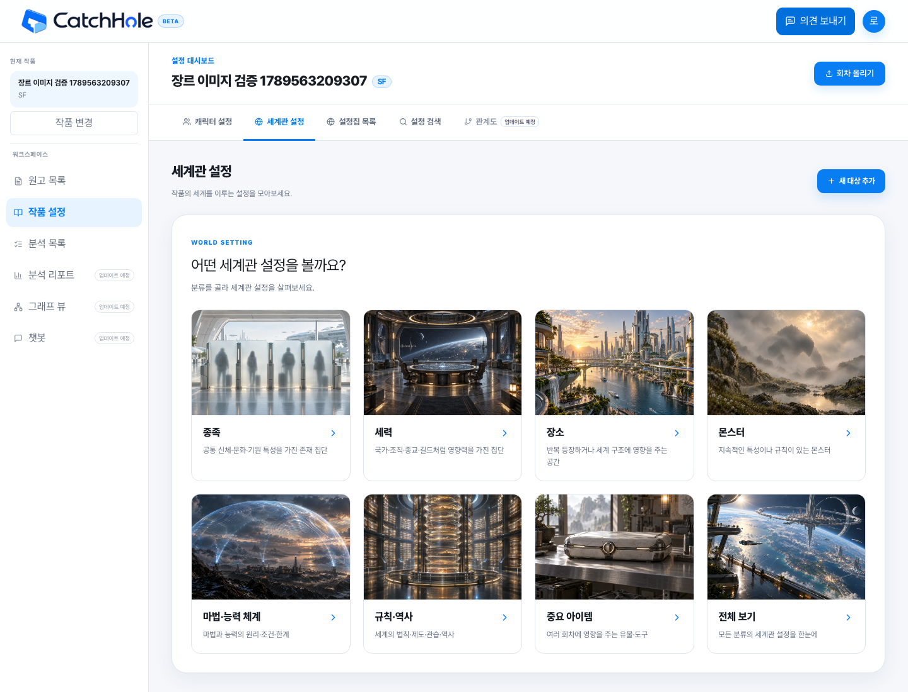
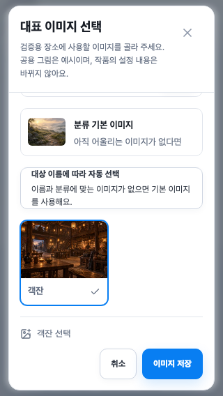

# 장르별 세계관 이미지 연결 — GH194

번호 안내: 2026-09-16 main 통합으로 미배포 GH194 migration을 V55~V60에서 **V57~V62**로 이동했다. 아래 계약은 최종 번호로 표기하며, 이전 검증 실행 당시에는 각 번호가 2씩 작았다. SQL 내용과 기존 사용자 선택은 보존했다.

2026-09-16 · 서비스 구현·로컬 검증·개발 S3 업로드 완료. 운영 DB/서비스 배포는 별도다.

## 화면에서 달라지는 것

작품 장르에 맞춰 분류 선택 화면 8장, 미선택 대상의 기본 그림 7장, 이미지 변경 창의 추천 도감을 가져온다. `종족·세력·장소·몬스터·마법·능력·규칙·역사·중요 아이템` 분류와 저장 enum은 유지한다.

| 작품 장르 | 테마 | 추천 도감 수 |
| --- | --- | ---: |
| 판타지 | fantasy | 333 |
| 로맨스·코미디·일상·기타 | modern-common | 50 |
| 무협 | wuxia | 70 |
| SF | sf | 70 |
| 추리 | mystery | 61 |
| 호러 | horror | 80 |
| 스포츠 | sports | 56 |

추천 수는 7개 분류 합계이며 공용 그림이 여러 테마에 포함되어 중복 합산된다. 현대 공통 50종은 최초 추천 35종과 문맥 확인 후보 15종을 함께 포함한다. 분위기 설명은 참고 사항이며 별도의 노출 제한 조건으로 해석하지 않는다.

이미지 변경은 `공용 도감 → 장르 추천`으로 시작한다. 같은 분류의 `전체 도감`으로 범위를 넓힐 수 있고 이름·별칭 검색과 18개 페이지 단위를 유지한다. 범위 전환은 검색·선택 초안을 유지하고 페이지를 처음으로 돌린다. 다른 장르의 사진도 직접 저장할 수 있다. 추천은 사전에 승인한 목록이다. V63부터 세계관 확정/수정 시 현재 장르·분류 안에서 이름·별칭을 규칙으로 매칭해 저장한다. LLM 호출은 추가하지 않는다.

## 기존 데이터와 사용자 선택

- 저장된 자동 결과가 없거나 미일치면 현재 장르 기본 그림을 사용한다. 기존 미처리 대상은 배포 후 운영자 보정 배치로 연결하며 설정 내용·version은 유지한다.
- 직접 고른 공용·개인·기본 이미지는 장르 변경에도 유지한다. 자동 상태의 세계관만 장르 변경 때 다시 매칭해 저장하고 결과 변경 시 이미지 version을 갱신한다. 잠긴 개인 이미지는 잠금 상태를 유지한다.
- `분류 기본 이미지`로 복귀하면 현재 장르의 해당 분류 기본 그림을 표시한다.
- 종족 캐릭터 도감과 이름으로 추정하지 않는 자동 연결 정책은 유지한다. 캐릭터 기본 그림은 기존 공통 이미지를 사용한다.
- 공용 파일 실패 시 현재 테마 기본 그림 → 번들 중립 기본 그림 순서로 복귀한다. 공개 `/demo`는 테마 API를 호출하지 않는다.

## 데이터와 API

`GET /works/{workId}/world-image-theme`는 인증된 작품 소유자에게 `{theme, overview, defaults}`를 반환한다. 키는 기존 분류 enum이고 `overview`만 `ALL`이 있다. 실제 경로 앞에는 `/api/v1`이 붙는다.

`GET /world-image-catalogs`에 `workId`와 `recommended=true`를 보내면 작품 장르의 추천을 조회한다. `recommended=false` 또는 생략은 같은 분류 전체 도감이며 기존 캐릭터 호출과 호환된다. 추천 조회는 작품 ID가 필요하고, 전달한 작품 ID는 전체 조회에서도 소유권을 검증한다.

`WorldImageThemeProvider`가 작품별 응답을 공유한다. 작품 정보 수정 성공 시 테마·세계관 목록/상세·해당 작품 추천 목록을 무효화한다. OpenAPI에서 생성한 SDK를 사용하며 경로는 공개 SHA 자산 API만 허용한다.

Backend의 `world_image_recommendations`는 `(catalog_id, theme)` PK다. 숲·동굴·책 등은 같은 ID와 파일을 여러 테마가 참조하며 복제 등록하지 않는다. `world_image_theme_assets`는 `(theme, purpose, slot)` 고유 슬롯 105행이다. 도감은 기존 333종 + 신규 130종 + 기본 7종 = 470행, 추천 연결은 720행이다.

V61은 테이블을 추가하고 V62는 승인된 테마 구성표를 등록한다. 초기 카드 사진과 혼용되던 기존 기본 7종의 SHA를 별도 제작한 중립 기본 그림으로 바로잡았다. V57~V60은 수정하지 않는다. 원본 PNG·제작 보고서는 `design-assets/world-themes`에 보존하고 서비스 manifest는 Backend의 `world-images/themes-v1.json`이다.

## 검증·배포

- 최신 main 통합 후 Java 전체 1,183개: 1,117 통과, 조건부 66 건너뜀, 실패 0. 개인 이미지 장르 변경 보존을 포함한다.
- 별도 빈 PostgreSQL에서 V1~V62 migration·Hibernate validate·health UP. 기존 로컬 DB의 백업 복제본에서 번호 전환을 검증한 뒤 실제 로컬에도 반영했다. 기존 데이터 해시와 테스트 작품 9개·설정 63개를 보존했다.
- Front 타입·린트·빌드·Knip 통과. 전체 Playwright 330 통과·1 실패·조건부 7 건너뜀 이후, 신규 피드백 API 응답이 빠진 smoke fixture를 수정하고 관련 9개를 재실행해 모두 통과했다. 합계 331개 회귀 시나리오를 확인했다. 실제 Java/PostgreSQL의 테마·캐릭터/개인 이미지 E2E도 각각 통과했다.
- 실제 연동은 10개 장르/7개 테마, 초기 8장·기본 7장, 공용 숲의 동일 ID/파일, 별칭·페이지, 전체 도감의 타 장르 저장, 선택 보존·기본 복귀, 320×568 표시를 확인하고 임시 작품을 삭제했다.
- React Doctor 비차단 진단은 기존 updater 진단 2개와 경고 172개다. `docs/react-doctor-cleanup.md`에 남은 범위를 기록한다.
- 개발 S3 신규 330개, 기존 포함 1,010개 WebP의 실제 다운로드 SHA 검증 완료(70,140,720 bytes). 버킷 정책/ACL은 유지했다.
- 배포 순서: 대상 버킷에 전체 manifest 자산 확보 → Backend V61/V62·API → Front. 다른 환경의 버킷은 별도로 동일 자산을 업로드해야 한다.

2026-09-16 Front main #79와 Java main #197의 피드백 기능을 함께 통합했다. SDK는 통합 서버의 OpenAPI로 다시 생성했고 Pencil에는 피드백 안내와 이미지 화면을 모두 보존했다. main의 확정 V55/V56은 유지하며 GH194 SQL만 내용 변경 없이 V57~V62로 옮겼다. 자세한 개발 DB 이력 전환은 Java `docs/database-migration.md`를 따른다.

## V63 확정 시 자동 연결 (2026-09-17)

세계관 선택창에서도 `대상 이름에 따라 자동 선택`과 `분류 기본 이미지` 고정을 구분한다. 자동 복귀는 `useAutomatic=true`, 기본 고정은 기존 catalog/private=null 요청이다. 캐릭터 자동 복귀 계약은 유지한다. 서버는 확정·수정 시 결과를 저장하며 목록/상세에서 재매칭하지 않는다. Backend `docs/automatic-subject-images.md`의 경로·운영자 보정 절차를 따른다.
